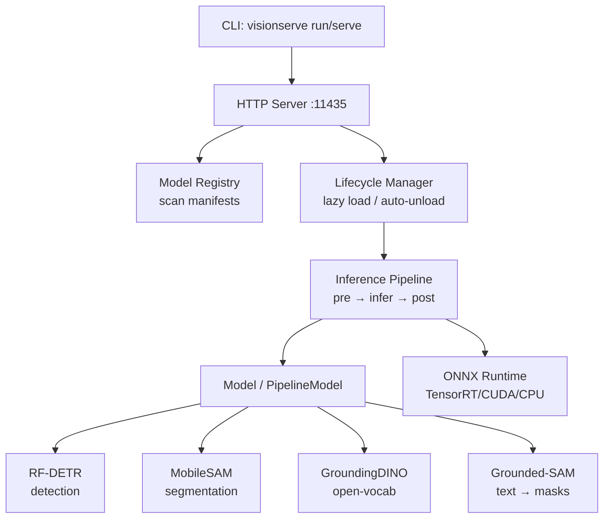

# BOOTSTRAP PROMPT — Building "VisionServe" (Ollama for Computer Vision)

> This is the historical bootstrap prompt used to scaffold the project. It now doubles as a
> project overview. Goal: a clear project skeleton, a CLAUDE.md to avoid vibe-coding the wrong
> thing, and a README that explains the system with flows + diagrams.

---

## 0. Project context & philosophy (READ CAREFULLY BEFORE CODING)

**VisionServe** is "Ollama for Computer Vision" — a **fully free, open-source community
project** under **Apache-2.0 (permissive)**. There is **no paid tier and no closed-source
component**; every feature lives in this repo and is free for anyone, including commercial,
edge, and closed-source products. Core philosophy, learned from Ollama:

- **Local-first, always**: no account, no API key, no cloud, no telemetry. The default
  behavior collects and sends nothing.
- **One lean binary**: server + CLI is a single Go program — easy to install, easy to embed
  on edge devices.
- **One command to run**: `visionserve run rf-detr image.jpg` → results immediately.
- **Many models, one unified interface**: switching models does not change client code.
- **Self-managed model lifecycle**: lazy load, auto-unload after idle, multiple models in
  parallel.

**Positioning** (vs. Roboflow Inference — a heavy, cloud-tied Python competitor): VisionServe
is lightweight, a Go binary, edge-GPU first (Jetson), with a clean permissive license stance
(Apache-2.0 / MIT / BSD models only).

**Free & community model:** everything ships as open source under Apache-2.0 — serving,
detection, segmentation, open-vocabulary detection, grounded segmentation, CLI, local
registry, manifests. There are **extension points for community contributions / optional
integrations** (e.g. a data-collection hook), kept as clean interfaces with no-op defaults so
people can plug in their own integrations without modifying core.

---

## 1. Technical constraints (STRICTLY ENFORCED)

### Language & engine
- **Go** (>= 1.22): HTTP server, CLI, orchestration, registry, model lifecycle, pre/postprocess.
- **C/C++**: ONLY when strictly necessary — via the **ONNX Runtime C API** (through cgo). Do
  NOT write your own inference engine.
- **Inference engine**: **ONNX Runtime** (via the `github.com/yalue/onnxruntime_go` binding or
  the C API directly). Why ORT: the same ONNX file runs on GPU (CUDA/TensorRT EP) and CPU,
  matching the edge↔server goal.
- **Image processing**: prefer pure-Go libraries (`github.com/disintegration/imaging`, the
  standard `image` package) to keep the binary lean. Use OpenCV via cgo ONLY if performance
  truly demands it, and document why.

### Models — permissive licenses ONLY, AGPL strictly forbidden

| Task | Model | License | Role |
|------|-------|---------|------|
| Detection | **RF-DETR** | Apache-2.0 | Core detector, edge-GPU first (Jetson) |
| Segmentation | **MobileSAM** | Apache-2.0 | Lightweight box/point-prompted segmentation |
| Open-vocab detection | **GroundingDINO** | Apache-2.0 | Text-prompted zero-shot detection — a free feature |
| Grounded segmentation | **Grounded-SAM** | Apache-2.0 | GroundingDINO boxes → MobileSAM masks (text → masks) |

**License discipline is the reason the project stays free and reusable, not a limitation of
it.** The project is Apache-2.0 *permissive* precisely so the whole community — including
commercial, edge, and closed products — can build on it. Therefore:

- **NEVER** include AGPL models: **YOLO (Ultralytics), FastSAM, YOLO-World** are all AGPL-3.0.
  AGPL is strong copyleft: one AGPL model would virally relicense the entire project AND every
  downstream deployer under AGPL, destroying that permissive freedom.
- "It's on HuggingFace" tells you **nothing** about the license. Check each model's actual
  license; it must be **Apache-2.0 / MIT / BSD**.
- Every model declares a `license` field in its manifest, and the registry **rejects**
  non-allowlisted licenses.

### Format & transport
- Models in **ONNX** format.
- API: **HTTP REST**, JSON. Default port `11435` (avoids Ollama's 11434).
- Per-model configuration via a **YAML manifest** (the "Modelfile for CV").

---

## 2. Overall architecture

```
                    ┌─────────────────────────────────────────┐
                    │              CLI (Go)                    │
                    │  visionserve run/serve/pull/list/...     │
                    └──────────────────┬──────────────────────┘
                                       │
                    ┌──────────────────▼──────────────────────┐
                    │           HTTP Server (Go)               │
                    │   REST API · JSON · port 11435           │
                    └──────────────────┬──────────────────────┘
                                       │
        ┌──────────────────────────────┼──────────────────────────────┐
        │                              │                              │
┌───────▼────────┐         ┌───────────▼───────────┐      ┌───────────▼──────────┐
│ Model Registry │         │  Lifecycle Manager     │      │  Inference Pipeline  │
│ scan manifests │         │  lazy load / unload    │      │  pre → infer → post  │
│ list models    │         │  multi-model · idle    │      │                      │
└────────────────┘         └────────────┬───────────┘      └───────────┬──────────┘
                                         │                              │
                                         │                  ┌───────────▼──────────┐
                                         │                  │   Model interfaces   │
                                         │                  │ Model / PipelineModel│
                                         │                  └───────────┬──────────┘
                                         │                              │
                                         └──────────────┬───────────────┘
                                                        │
                                          ┌─────────────▼─────────────┐
                                          │   ONNX Runtime (C API)     │
                                          │   EP: TensorRT/CUDA/CPU    │
                                          │   fallback chain           │
                                          └────────────────────────────┘
```

---

## 3. Directory structure

Standard Go project layout:

```
visionserve/
├── CLAUDE.md                    # rules for AI coding — see section 8
├── README.md                    # flows + diagrams — see section 9
├── LICENSE                      # Apache-2.0
├── go.mod
├── go.sum
├── Makefile                     # build, test, lint, multi-arch build
│
├── cmd/
│   └── visionserve/
│       └── main.go              # entrypoint, parse CLI, dispatch
│
├── internal/
│   ├── cli/                     # commands: run, serve, pull, list, rm, ps
│   │   ├── root.go
│   │   ├── serve.go
│   │   ├── run.go
│   │   └── list.go
│   │
│   ├── server/                  # HTTP server + handlers
│   │   ├── server.go
│   │   ├── handlers.go          # /api/predict, /api/models, /api/load, /api/unload
│   │   └── response.go          # unified JSON schema
│   │
│   ├── registry/                # scan models dir, read manifests
│   │   ├── registry.go
│   │   └── manifest.go          # struct + parser for the YAML manifest
│   │
│   ├── lifecycle/               # in-memory model lifecycle
│   │   ├── manager.go           # load/unload, idle auto-unload, memory limits
│   │   └── session.go           # wraps a live ONNX session
│   │
│   ├── engine/                  # ONNX Runtime wrapper
│   │   ├── ort.go               # init ORT, create sessions, pick execution provider
│   │   ├── tensor.go            # Tensor struct + conversions
│   │   └── provider.go          # fallback logic TensorRT → CUDA → CPU
│   │
│   ├── models/                  # IMPLEMENTATIONS of the model interfaces
│   │   ├── model.go             # Model + PipelineModel interfaces (see section 4)
│   │   ├── prompt.go            # Prompt parsing (text / box / point)
│   │   ├── rfdetr/              # detection (plain Model)
│   │   │   ├── rfdetr.go
│   │   │   ├── preprocess.go    # resize, normalize, letterbox
│   │   │   └── postprocess.go   # decode RF-DETR output (NMS-free!)
│   │   ├── mobilesam/           # segmentation (PipelineModel: encoder+decoder)
│   │   │   ├── mobilesam.go
│   │   │   ├── preprocess.go
│   │   │   └── postprocess.go   # decode mask
│   │   └── groundingdino/       # open-vocab detection (PipelineModel: text prompt)
│   │       └── groundingdino.go
│   │
│   ├── imageproc/               # shared pure-Go image utilities
│   │   ├── resize.go
│   │   ├── letterbox.go
│   │   └── nms.go
│   │
│   └── extension/               # extension points for community contributions
│       └── hooks.go             # data-collection hook interface (no-op default)
│
├── pkg/
│   └── api/                     # public API structs (importable by clients)
│       └── types.go
│
├── models/                      # ONNX models + manifests (runtime)
│   ├── rf-detr/
│   │   ├── manifest.yaml
│   │   └── README.md            # how to fetch ONNX weights (do NOT commit large files)
│   ├── mobile-sam/
│   │   └── manifest.yaml
│   └── grounding-dino/
│       └── README.md
│
├── docs/
│   ├── architecture.md          # detailed diagrams
│   ├── manifest-spec.md         # manifest format spec
│   └── contributing-models.md   # GUIDE for the community to add new models (IMPORTANT)
│
├── deploy/
│   ├── Dockerfile               # multi-stage, GPU base (nvidia/cuda)
│   ├── Dockerfile.edge          # lean base for Jetson/arm64
│   └── docker-compose.yml
│
└── test/
    └── testdata/                # small sample images for pipeline tests
```

---

## 4. Model interfaces — THE MOST IMPORTANT COMPONENT

These abstractions (a) unify many tasks behind one schema and (b) let the community contribute
new models without touching core. Designed in `internal/models/model.go`.

There are **two** interfaces:

- **`Model`** — a plain single-session model with no prompt (e.g. RF-DETR). The engine +
  lifecycle drive a single `pre → infer → post`. The model only implements pre/postprocess.
- **`PipelineModel`** — a prompted and/or multi-session model (MobileSAM, GroundingDINO,
  Grounded-SAM). It takes a `Prompt` (box / point / text), may load several ONNX sessions via
  the manifest `files:` map, and drives the chaining itself through a `Runner`. Heavy sessions
  are still **owned and kept alive by `lifecycle.Manager`** (VRAM-safe) — the model only calls
  them by role.

```go
package models

import (
    "image"
    "visionserve/internal/engine"
)

// Task classifies the CV problem type.
type Task string

const (
    TaskDetection    Task = "detection"
    TaskSegmentation Task = "segmentation"
    TaskOpenVocab    Task = "open_vocab" // GroundingDINO / Grounded-SAM
)

// Base is the minimal interface every model satisfies. Lifecycle type-asserts to the
// concrete interface (Model vs PipelineModel) to pick the inference path.
type Base interface {
    Name() string
    Task() Task
}

// Model: plain single-session, no prompt. Infer is owned by engine + lifecycle, so the
// model only implements pre/postprocess (the part that differs between architectures).
type Model interface {
    Base
    InputName() string
    OutputNames() []string
    Preprocess(img image.Image) (engine.Tensor, PreprocessMeta, error)
    Postprocess(outs []engine.Tensor, meta PreprocessMeta) (Result, error)
}

// Prompt carries optional prompt data:
//   - SAM: Boxes ([x,y,w,h] in ORIGINAL coords) and/or Points.
//   - GroundingDINO / Grounded-SAM: Text, e.g. "cat. remote.".
type Point struct {
    X, Y  float64
    Label int // 1 = foreground, 0 = background
}
type Prompt struct {
    Text   string
    Boxes  [][4]float64
    Points []Point
}

// Runner is the gateway a PipelineModel uses to run its ONNX sessions by role. The heavy
// sessions are owned/kept alive by lifecycle.Manager (VRAM-safe); the model only orchestrates.
type Runner interface {
    Run(role string, inputs map[string]engine.Tensor) ([]engine.Tensor, error)
    InputNames(role string) []string
    OutputNames(role string) []string
}

// PipelineModel: prompted and/or multi-session. Drives its own chained inference via Runner.
type PipelineModel interface {
    Base
    Roles() []string // session keys, each must exist in Config.Files
    Infer(img image.Image, prompt Prompt, r Runner) (Result, error)
}

// PreprocessMeta maps results back to ORIGINAL image coordinates.
type PreprocessMeta struct {
    OrigWidth, OrigHeight int
    ScaleX, ScaleY        float64 // input_x = orig_x * ScaleX + PadX
    PadX, PadY            int
}

// Result is the unified output schema — ONE schema across all tasks.
type Result struct {
    Task       Task        `json:"task"`
    Model      string      `json:"model"`
    Detections []Detection `json:"detections,omitempty"`
    Masks      []Mask      `json:"masks,omitempty"`
    DurationMs float64     `json:"duration_ms"`
}

type Detection struct {
    BBox  [4]float64 `json:"bbox"` // [x, y, w, h] in ORIGINAL image coords
    Class string     `json:"class"`
    Conf  float64    `json:"conf"`
}

type Mask struct {
    RLE  string     `json:"rle,omitempty"`  // column-major RLE
    BBox [4]float64 `json:"bbox,omitempty"`
    Conf float64    `json:"conf"`
}
```

**Design requirements:**
- `Infer` (calling an ONNX session) is NOT part of the plain `Model` interface — `engine` +
  `lifecycle` own it, so a plain model focuses on pre/postprocess. A `PipelineModel` drives
  inference itself, but still only through the `Runner` gateway (lifecycle owns the sessions).
- A **registration mechanism** (registry pattern): each model package calls
  `models.Register(name, factory)` in `init()`, so adding a model needs no core change. This
  is the community contribution path.

---

## 5. YAML manifest — "Modelfile for CV"

Spec in `docs/manifest-spec.md`, parser in `internal/registry/manifest.go`. Example
`models/rf-detr/manifest.yaml`:

```yaml
name: rf-detr
task: detection
license: Apache-2.0                   # MUST be in the permissive allowlist
model_file: rf-detr-base.onnx        # relative path to the ONNX file
input:
  width: 560
  height: 560
  layout: NCHW
  normalize:
    mean: [0.485, 0.456, 0.406]
    std:  [0.229, 0.224, 0.225]
  letterbox: true
postprocess:
  type: detr                          # RF-DETR is NMS-free, decode differs from YOLO
  conf_threshold: 0.5
  max_detections: 300
labels: coco.txt                      # labels file, one class per line
runtime:
  prefer: [tensorrt, cuda, cpu]       # fallback chain — important for edge↔server
  idle_unload_seconds: 300            # auto-release after 5 min idle
```

A multi-session `PipelineModel` (e.g. MobileSAM) declares a `files:` map of role → ONNX path
instead of a single `model_file`:

```yaml
name: mobile-sam
task: segmentation
license: Apache-2.0
files:
  encoder: mobile_sam_encoder.onnx
  decoder: mobile_sam_decoder_single.onnx
runtime:
  prefer: [tensorrt, cuda, cpu]
  idle_unload_seconds: 300
```

The parser must validate: the ONNX file(s) exist, the task is valid, the license is in the
allowlist, and the fallback chain is valid.

---

## 6. CLI

```
visionserve serve                          # start the HTTP server (port 11435)
visionserve run <model> <image>            # load model + predict + print JSON to stdout
visionserve list                           # list models in the registry + state
visionserve ps                             # which models are loaded in memory
visionserve pull <model>                   # (later) fetch a model from a registry
visionserve rm <model>                     # unload a model from memory
visionserve version
```

Prompted models accept a prompt on the command line, e.g.
`visionserve run mobile-sam image.jpg --box "x,y,w,h"` or
`visionserve run grounding-dino image.jpg --text "cat. remote."`.

---

## 7. HTTP API

```
GET  /api/models
     → list models + state (not_downloaded / available / loaded)

POST /api/load        { "model": "rf-detr" }
     → load a model into memory (lazy load)

POST /api/unload      { "model": "rf-detr" }
     → release it

POST /api/predict     (multipart: model=<name>, image=<file>[, prompt/box/point])
     or JSON: { "model": "rf-detr", "image_base64": "...",
                "prompt": "cat. remote.", "box": "x,y,w,h", "point": "x,y[,label]" }
     → returns Result (schema from section 4)

GET  /api/health
```

Response JSON always follows the unified `Result` schema. Errors return JSON
`{ "error": "..." }` with the correct HTTP status.

---

## 8. CLAUDE.md (so AI does NOT vibe-code the wrong thing)

The repo root holds `CLAUDE.md` with the full rules. Summary:

- **License discipline**: accept ONLY Apache-2.0 / MIT / BSD models; STRICTLY forbid AGPL
  (YOLO/Ultralytics, FastSAM, YOLO-World). This keeps the project permissively free for the
  whole community — being free *requires* this rule, it does not relax it. Every model
  declares `license` in its manifest; the registry rejects non-allowlisted licenses.
- All inference via ONNX Runtime; no hand-written engine.
- No Python in the runtime; lean Go binary for edge.
- Avoid cgo/OpenCV unless necessary (mark `// CGO`, prefer pure-Go imaging).
- Plain model = `Model` + `Register()` in `init()`; prompted/multi-session = `PipelineModel`.
  Never touch core to add a model.
- `Detection.BBox` always in ORIGINAL coords; unified `Result` schema across tasks.
- Never fabricate output formats — verify real tensor shapes first (RF-DETR is NMS-free;
  don't apply YOLO NMS). Stub + `TODO` when unsure.

See [CLAUDE.md](CLAUDE.md) for the authoritative version.

---

## 9. README.md

The README should contain:

1. **One-line description** + positioning ("Ollama for CV, local-first, edge-GPU, clean
   permissive license").
2. **Architecture diagram** in **Mermaid** (renders on GitHub). For example:

````markdown

````

3. **Sequence diagram** for the predict flow (Mermaid `sequenceDiagram`): client → server →
   lifecycle (load if needed) → preprocess → ORT infer → postprocess → JSON.
4. **Quickstart**: install, fetch ONNX models, `visionserve serve`, call `/api/predict` via curl.
5. **Supported models table** + license (all permissive: Apache-2.0).
6. **How to add a new model** (link to `docs/contributing-models.md`) — important for the
   community.
7. **Extension points**: short note that `internal/extension/` offers clean hooks (no-op by
   default, local-first) for community contributions / optional integrations.
8. **Roadmap**: detection → segmentation → open-vocab → grounded-sam → broader community
   model coverage.

---

## 10. Suggested build order

1. Directory structure + go.mod + LICENSE (Apache-2.0) + CLAUDE.md + README skeleton.
2. Define the `Model` / `PipelineModel` interfaces + `Result`/`Tensor`/`PreprocessMeta` +
   `Prompt` + the `Register` mechanism.
3. Write `engine` (ONNX Runtime wrapper, execution provider + fallback).
4. Write `registry` + YAML manifest parser + validation (incl. license allowlist).
5. Write the `lifecycle` Manager (lazy load, thread-safe, idle auto-unload; owns sessions).
6. Implement **RF-DETR** fully (preprocess + NMS-free postprocess + tests). The core detector.
7. Write `server` + handlers + the `run` CLI → end-to-end on a single image.
8. Implement **MobileSAM** as a `PipelineModel` (encoder + decoder, box/point prompt, mask decode).
9. Implement **GroundingDINO** (text-prompted open-vocab detection) and **Grounded-SAM**
   (GroundingDINO boxes → MobileSAM masks).
10. Dockerfiles (GPU + edge/arm64) + Makefile + docs + Mermaid diagrams.
11. Tests for pre/postprocess of every model.

---

## 11. Final notes

- Do NOT commit ONNX weights (large files). Instead, a per-model README explains how to fetch them.
- If something is uncertain (e.g. the real RF-DETR tensor shapes), STOP and verify, or write a
  clearly-marked stub with a `TODO` — do NOT fabricate postprocess logic.
- License first: before adding any model, confirm its license is Apache-2.0 / MIT / BSD.
  "It's on HuggingFace" is not a license check.
