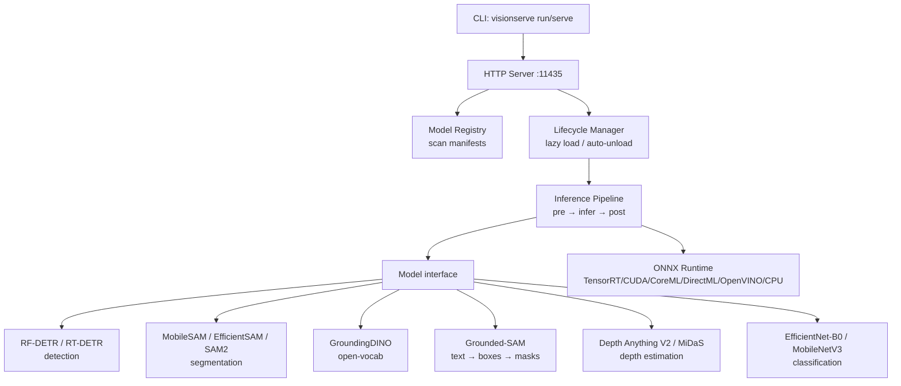
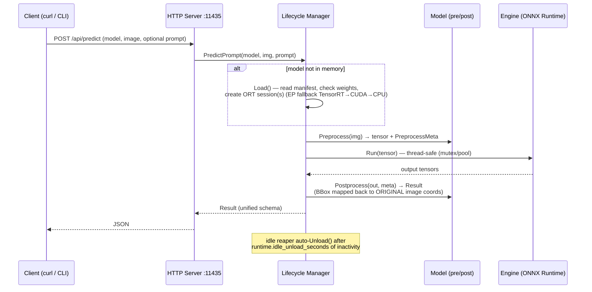

# VisionServe

[](https://arxiv.org/abs/XXXX.XXXXX)

> **"Ollama for Computer Vision"** — local-first, a single lean Go binary, edge-GPU first (Jetson), clean licensing (permissive models only).

VisionServe serves computer-vision models (detection, segmentation, open-vocabulary)
behind one unified interface: lazy model loading, automatic unload when idle, and
multiple models running concurrently — all through a REST API or a single CLI command.

```bash
make run MODEL=rf-detr IMAGE=image.jpg     # → detection JSON, instantly
```

VisionServe is **fully free and open-source**, built for the community under
**Apache-2.0**. Every feature here is in scope and free to use, including for
commercial, edge, and closed deployments.

> **Status:** detection (RF-DETR, RT-DETR), segmentation (MobileSAM, EfficientSAM,
> SAM2-Tiny), open-vocabulary detection (GroundingDINO), Grounded-SAM (text → boxes
> → masks), depth estimation (Depth Anything V2, MiDaS), classification
> (EfficientNet-B0, MobileNetV3), image embeddings (CLIP), face detection (SCRFD), and
> OCR (PaddleOCR) all run end-to-end, GPU-accelerated. NanoSAM requires manual ONNX
> download (no HuggingFace source). **Python** and **JavaScript/TypeScript** clients, a
> Docker server image, and Ollama-style `pull` from HuggingFace are included.

## Contents

- [Architecture](#architecture)
- [Quickstart](#quickstart)
  - [1 · Build](#1-build)
  - [2 · ONNX Runtime + GPU](#2-onnx-runtime--gpu)
  - [3 · Run a command (in-process)](#3-run-a-single-command-in-process-no-server)
  - [4 · Run the server](#4-run-the-server)
  - [5 · curl API](#5-call-the-api-with-curl)
  - [6 · Python client](#6-infer-from-python)
  - [6b · JS / TS client](#6b-infer-from-javascript--typescript)
  - [7 · Docker](#7-run-with-docker)
  - [JSON output schema](#sample-json-output-detection)
- [Supported models](#supported-models)
- [Model selection guide](#model-selection-guide)
- [Hardware support](#hardware-support)
- [Performance](#performance)
- [Licensing discipline](#licensing-discipline)
- [Adding a new model](#adding-a-new-model)
- [Roadmap](#roadmap)
- [Citation](#citation)
- [License](#license)

---

## Architecture



### Predict flow (detailed)



> `visionserve run` goes through **exactly this pipeline** but **in-process** (calling
> `lifecycle.Manager` directly, no server needed). See [docs/architecture.md](docs/architecture.md).

---

## Quickstart

Everything is driven through `make` (which builds the binary, wires ONNX Runtime, and
uses the **GPU by default** — add `GPU=0` to force CPU). Run `make help` to list targets.

### 1. Build

Requires **Go >= 1.22**.

```bash
make build        # → bin/visionserve
```

### 2. ONNX Runtime + GPU

The [`yalue/onnxruntime_go`](https://github.com/yalue/onnxruntime_go) binding loads
`libonnxruntime.so` at runtime. The `make` targets handle this for you:

- **CPU:** `make` auto-detects a CPU ONNX Runtime library on your machine.
- **GPU (default):** `make run/serve/demo` source [`scripts/gpu-env.sh`](scripts/gpu-env.sh),
  which finds a CUDA-enabled ORT lib + the matching cuDNN/CUDA libraries, and falls back
  to CPU if none is found. Force CPU with `GPU=0`. Set `VISIONSERVE_TRACE=1` to see which
  execution provider actually loaded (TensorRT → CUDA → CPU).

On edge devices (Jetson) use an ORT build with the **TensorRT/CUDA EP**.

> **Weights:** `.onnx` files are NOT committed (see `.gitignore`). Get them with:
> ```bash
> make pull MODEL=rf-detr        # download real weights from HuggingFace (Ollama-style)
> ```
> or generate a ~2KB **dummy** to just exercise the pipeline:
> `python models/rf-detr/gen_dummy_onnx.py`. See [models/rf-detr/README.md](models/rf-detr/README.md).

### 3. Run a single command (in-process, no server)

```bash
# Detection
make run MODEL=rf-detr IMAGE=image.jpg                        # → detection JSON
make run MODEL=rf-detr IMAGE=image.jpg OUT=out.png           # + draw bboxes, save out.png
make run MODEL=rt-detr IMAGE=image.jpg                        # RT-DETR (640×640, NMS-free)

# Segmentation — box or point prompt (original-image coords)
make run MODEL=mobile-sam IMAGE=img.jpg BOX=34,58,120,240 OUT=mask.png
make run MODEL=mobile-sam IMAGE=img.jpg POINT=95,180,1 OUT=mask.png   # label 1=fg 0=bg
make run MODEL=mobile-sam IMAGE=img.jpg OUT=masks.png                 # no prompt → segment everything (AMG)
make run MODEL=efficient-sam IMAGE=img.jpg BOX=34,58,120,240 OUT=mask.png
make run MODEL=sam2 IMAGE=img.jpg BOX=34,58,120,240 OUT=mask.png

# Background — support-surface (table/floor) mask; method=auto|depth|sam|cv|automask
make run MODEL=background IMAGE=img.jpg OUT=bg.png
make run MODEL=background IMAGE=img.jpg METHOD=cv ROI=300,380,700,330 OUT=bg.png   # ROI: run on a crop, map back

# ROI — restrict ANY model to a region (x,y,w,h in original pixels); results in original coords
make run MODEL=rf-detr IMAGE=img.jpg ROI=300,380,700,330 OUT=out.png

# Open-vocabulary detection — text prompt (lowercased, dot-separated)
make run MODEL=grounding-dino IMAGE=img.jpg PROMPT="cat. remote." OUT=boxes.png

# Grounded-SAM — text → boxes → masks
make run MODEL=grounded-sam IMAGE=img.jpg PROMPT="cat. remote." OUT=masks.png

# Depth estimation
make run MODEL=depth-anything-v2 IMAGE=img.jpg                # → depth JSON
make run MODEL=midas IMAGE=img.jpg                            # lightweight depth (256×256)

# Classification
make run MODEL=efficientnet-b0 IMAGE=img.jpg                  # → top-5 ImageNet classes
make run MODEL=mobilenet-v3 IMAGE=img.jpg                     # lightweight classifier

# Face detection + OCR + image embeddings
make run MODEL=scrfd IMAGE=photo.jpg OUT=faces.png            # face boxes with keypoints
make run MODEL=paddle-ocr IMAGE=doc.jpg                       # text detection + recognition
make run MODEL=clip IMAGE=img.jpg                             # 512-d embedding vector

# Size filtering — drop objects outside a range (% of image area, 0 = no limit)
make run MODEL=rf-detr IMAGE=img.jpg MIN_SIZE=0.5             # ignore objects < 0.5% of image
make run MODEL=rf-detr IMAGE=img.jpg MAX_SIZE=80              # ignore objects > 80% of image
make run MODEL=mobile-sam IMAGE=img.jpg MIN_SIZE=0.1 MAX_SIZE=50
```

**`make run` variables:**

| Variable | For | Example |
|----------|-----|---------|
| `MODEL` | which model | `rf-detr`, `rt-detr`, `mobile-sam`, `efficient-sam`, `sam2`, `nano-sam`, `background`, `grounding-dino`, `grounded-sam`, `depth-anything-v2`, `midas`, `efficientnet-b0`, `mobilenet-v3`, `clip`, `scrfd`, `paddle-ocr` |
| `IMAGE` | input image path | `IMAGE=cats.jpg` |
| `OUT` | save annotated image (all tasks: boxes, masks, top-K text, depth colormap) | `OUT=out.png` |
| `PROMPT` | open-vocab text | `PROMPT="cat. remote."` |
| `BOX` | SAM box prompt | `BOX=34,58,120,240` (multiple via `;`) |
| `POINT` | SAM point prompt | `POINT=95,180,1` (label 1=fg 0=bg) |
| `MIN_SIZE` | min bbox area as % of image — filter out small objects | `MIN_SIZE=0.5` |
| `MAX_SIZE` | max bbox area as % of image — filter out large objects | `MAX_SIZE=80` |
| `ROI` | restrict any model to a region — crop, run, map results back to original coords | `ROI=300,380,700,330` |
| `METHOD` | background model algorithm (`auto`/`depth`/`sam`/`cv`/`automask`) | `METHOD=cv` |
| `GPU` | `1` (default) or `0` to force CPU | `GPU=0` |
| `MODELS` | registry directory | `MODELS=./models` |

> **Demo:** `make demo` downloads a few real COCO images, runs detection, and writes
> annotated images into `demo/out/` (boxes/masks drawn in pure Go, no cgo).

### 4. Run the server

```bash
make serve                       # listen on :11435 (GPU by default; GPU=0 for CPU)
make serve ADDR=:8080            # custom address
make serve IDLE=0                # keep models resident (never idle-unload)
```

> **Idle auto-unload.** By default each model unloads after its manifest
> `idle_unload_seconds` (300 s) of inactivity, which means the first request after a
> pause pays a slow reload. The `--idle-unload-seconds` flag on `visionserve serve`
> overrides this for every model: `0` keeps models resident (never unload — no slow
> first inference after an idle pause), `-1` uses each manifest's default, and `N` sets
> a custom timeout. Via make: `make serve IDLE=0`.

Manage models in a running server:

```bash
make pull MODEL=rf-detr          # download a model from HuggingFace into ./models
make ps                          # which models are loaded
make rm MODEL=rf-detr            # unload a model (free VRAM)
make list                        # list local + pullable models
```

### 5. Call the API with curl

```bash
# Health check
curl -s http://localhost:11435/api/health
# → {"status":"ok"}

# List models + state (not_downloaded | available | loaded)
curl -s http://localhost:11435/api/models

# Predict — multipart (upload image file)
curl -s -F model=rf-detr -F image=@image.jpg \
  http://localhost:11435/api/predict

# MobileSAM with a box prompt (or omit box/point to segment everything — AMG mode)
curl -s -F model=mobile-sam -F image=@image.jpg -F box=34,58,120,240 \
  http://localhost:11435/api/predict
curl -s -F model=mobile-sam -F image=@image.jpg \
  http://localhost:11435/api/predict

# Grounded-SAM with a text prompt (text → boxes → masks)
curl -s -F model=grounded-sam -F image=@image.jpg -F prompt="cat. remote." \
  http://localhost:11435/api/predict

# Predict — JSON with base64 image + prompt fields
curl -s -H 'Content-Type: application/json' \
  -d '{"model":"grounding-dino","image_base64":"<base64>","prompt":"cat. remote."}' \
  http://localhost:11435/api/predict
```

| Field | For | Format |
|-------|-----|--------|
| `prompt` | open-vocab text | `"cat. remote."` |
| `box` | SAM box | `"x,y,w,h"` (multiple separated by `;`) |
| `point` | SAM point | `"x,y[,label]"` (multiple separated by `;`) |
| `box_threshold` | GroundingDINO box confidence (default 0.3; 0 = manifest default) | `"0.3"` |
| `text_threshold` | GroundingDINO token threshold (default 0.25; lower keeps more prompt tokens per label, e.g. `"canned coffee"` not just `"coffee"`) | `"0.25"` |
| `min_size` | filter small objects (bbox area as % of image, 0 = no limit) | `"0.5"` |
| `max_size` | filter large objects (bbox area as % of image, 0 = no limit) | `"80"` |
| `roi` | process only this crop, map results back (any model) | `"x,y,w,h"` (original pixels) |
| `method` | background model algorithm (`auto`/`depth`/`sam`/`cv`/`automask`) | `"cv"` |

> `box_threshold` / `text_threshold` apply to `grounding-dino`, `grounded-sam`, and
> `grasp-gd` (multipart form fields, JSON body, or Python client kwargs).

> **`roi` restricts any model to a region.** The server crops to the ROI, runs the
> model on that crop only, and maps results back to original image coordinates —
> `box`/`point` prompts are given in original coords and shifted automatically.

### 6. Infer from Python

> **Full docs:** [clients/python/README.md](clients/python/README.md)

A small client library lives in [`clients/python/`](clients/python/). It accepts a file
path, a `PIL.Image`, a `numpy.ndarray`, or raw `bytes`, and parses the unified `Result`.

```bash
pip install visionserve               # from PyPI
# or from source:
pip install -e clients/python         # optional extras: 'clients/python[images]'
make serve                            # start the server (another terminal)
```

> Maintainers: `make pypi` builds + validates the package; pushing a `v*` tag publishes
> it to PyPI via GitHub Actions Trusted Publishing (see `.github/workflows/pypi.yml`).

```python
from visionserve import Client

client = Client("http://localhost:11435")

# Detection
res = client.predict("rf-detr", "image.jpg")
for d in res.detections:
    print(d.cls, round(d.conf, 3), d.bbox)   # bbox = [x, y, w, h] in original pixels

# RT-DETR (640×640, COCO-80)
res = client.predict("rt-detr", "image.jpg")
for d in res.detections:
    print(d.cls, round(d.conf, 3), d.bbox)

# Segmentation — pass a box; works with a numpy ndarray input too
import numpy as np
res = client.predict("mobile-sam", "image.jpg", box=[34, 58, 120, 240])
mask = res.masks[0].to_ndarray(width=640, height=480)   # bool (H, W) numpy array

# EfficientSAM or SAM2 — same prompt interface as MobileSAM
res = client.predict("efficient-sam", "image.jpg", box=[34, 58, 120, 240])
res = client.predict("sam2", "image.jpg", box=[34, 58, 120, 240])

# Open-vocab segmentation — text prompt → boxes + masks
res = client.predict("grounded-sam", "image.jpg", prompt="cat. remote.")
print([d.cls for d in res.detections], "→", len(res.masks), "masks")

# Depth estimation
res = client.predict("depth-anything-v2", "image.jpg")
import numpy as np
depth = np.array(res.depth_map).reshape(res.depth_height, res.depth_width)

# Classification — returns top-K ImageNet predictions
res = client.predict("efficientnet-b0", "image.jpg")
for c in res.classifications:
    print(c.cls, round(c.conf, 3))

# Size filtering — keep only objects in [min_size, max_size] px² (relative or absolute)
res = client.predict("rf-detr", "image.jpg")
small_only = res.filter_by_size(max_size=2000)          # absolute px²
big_only   = res.filter_by_size(min_size=0.02,          # relative: > 2% of image area
                                 image_width=1280, image_height=720)

# Visualization — annotate + save image (requires Pillow)
from visionserve import draw
annotated = draw(res, "image.jpg")   # PIL.Image: boxes/masks/labels/colormap per task
annotated.save("out.jpg")
# or via the result directly:
res.visualize("image.jpg").save("out.jpg")
```

### 6b. Infer from JavaScript / TypeScript

> **Full docs:** [clients/js/README.md](clients/js/README.md)

A sibling client lives in [`clients/js/`](clients/js/) with the same API as the Python
one. It has **zero runtime dependencies** (uses built-in `fetch`/`FormData`/`Blob`) and
runs on **Node >= 18** and in the browser. Image input accepts a file path (Node), raw
bytes (`Uint8Array`/`ArrayBuffer`), or a `Blob`.

```bash
npm install visionserve               # from npm
# or from source:
cd clients/js && npm install && npm run build
make serve                            # start the server (another terminal)
```

```ts
import { Client } from "visionserve";

const client = new Client("http://localhost:11435");

// Detection
const det = await client.predict("rf-detr", "image.jpg");
for (const d of det.detections) console.log(d.cls, d.conf.toFixed(3), d.bbox);

// RT-DETR (640×640, COCO-80)
const det2 = await client.predict("rt-detr", "image.jpg");
for (const d of det2.detections) console.log(d.cls, d.conf.toFixed(3), d.bbox);

// Segmentation — box prompt; decode the column-major RLE mask
const seg = await client.predict("mobile-sam", "image.jpg", { box: [34, 58, 120, 240] });
const mask = seg.masks[0]?.toMask(640, 480); // row-major Uint8Array, 1 = inside mask

// EfficientSAM or SAM2 — same prompt interface
const seg2 = await client.predict("efficient-sam", "image.jpg", { box: [34, 58, 120, 240] });

// Open-vocab segmentation — text prompt → boxes + masks
const gs = await client.predict("grounded-sam", "image.jpg", { prompt: "cat. remote." });
console.log(gs.detections.map((d) => d.cls), "→", gs.masks.length, "masks");

// Depth estimation
const dep = await client.predict("depth-anything-v2", "image.jpg");
// dep.depthMap is a Float32Array of length dep.depthWidth * dep.depthHeight

// Classification
const cls = await client.predict("efficientnet-b0", "image.jpg");
for (const c of cls.classifications) console.log(c.cls, c.conf.toFixed(3));

// Size filtering — keep only objects in [minSize, maxSize] px² (absolute or relative)
import { filterBySize, toSVG } from "visionserve";

const det = await client.predict("rf-detr", "image.jpg");
const filtered = filterBySize(det, { minSize: 0.01, maxSize: 0.5,
                                      imageWidth: 1280, imageHeight: 720 }); // relative
const filtered2 = filterBySize(det, { minSize: 500 }); // absolute px²

// Visualization — SVG annotation overlay (zero deps, works in browser + Node)
const svgString = toSVG(det, 1280, 720); // boxes + labels as <svg> string
// In HTML: <svg style="position:absolute" innerHTML={svgString}>
```

Both clients also include **post-processing helpers** on `Result` — confidence
filtering, NMS, top-k, sort, group-by-class, and `get_depth_at_detection` /
`getDepthAtDetection` for fusing a depth result with detections. See
[`clients/python/README.md`](clients/python/README.md#post-processing) and
[`clients/js/README.md`](clients/js/README.md#post-processing).

> **Client CLIs.** Both clients also ship a command-line `predict` verb that mirrors
> the Go binary's, but over HTTP against a running server:
> - **Python:** `pip install visionserve` → `visionserve predict <model> <image>`
>   (see [`clients/python/README.md`](clients/python/README.md))
> - **JS:** `npx visionserve predict <model> <image>`
>   (see [`clients/js/README.md`](clients/js/README.md))

### 7. Run with Docker

Pre-built images on Docker Hub: [`mtbui2010/visionserve`](https://hub.docker.com/r/mtbui2010/visionserve)

| Tag | Platform | Contents | Size |
|-----|----------|----------|------|
| **`latest`**, `v0.1.2-gpu` | x86-64 NVIDIA | CUDA 12.4 + cuDNN 9 (no TensorRT) | ~4 GB |
| `v0.1.2`, `v0.1.2-cpu` | x86-64 | CPU only — no GPU required | ~141 MB |
| `v0.1.2-arm` | Jetson arm64 | CUDA + TensorRT EP (JetPack 6) | ~4 GB |

> **`latest` = GPU image.** Use `v0.1.2-cpu` explicitly on machines without an NVIDIA GPU.

#### Step 1 — Start the server

```bash
# GPU — default (needs nvidia-container-toolkit)
docker run -d \
  --gpus all \
  -p 11435:11435 \
  -v ~/.visionserve_models:/root/.models \
  --name visionserve \
  mtbui2010/visionserve:latest

# CPU only
docker run -d \
  -p 11435:11435 \
  -v ~/.visionserve_models:/root/.models \
  --name visionserve \
  mtbui2010/visionserve:v0.1.2-cpu
```

> **Keep models resident.** The image's `ENTRYPOINT` is `visionserve` (CMD
> `serve --addr :11435`), so you can pass serve flags after the image — e.g. append
> `serve --addr :11435 --idle-unload-seconds 0` to disable idle auto-unload and avoid a
> slow first inference after an idle pause.

The registry lives at `/root/.models` inside the container (set via
`VISIONSERVE_MODELS`). Bind-mounting your host folder `~/.visionserve_models` onto it
gives you the nicest workflow:

- **Models persist on the host**, visible in plain `~/.visionserve_models/` (catalog
  `pull` downloads land there too).
- **Drop in your own model and it just appears** — put a folder with a
  `manifest.yaml` + `.onnx` at `~/.visionserve_models/<name>/` and `visionserve list`
  shows it immediately, **no `pull` or `docker cp` needed** (the container reads the
  same files through the mount).

> Prefer zero mounts? Omit `-v` entirely — the image declares `/root/.models` as a
> `VOLUME`, so pulled models still persist across restarts via an anonymous volume
> (but then your local model folders aren't visible to the container — use `pull` with
> a path or the [`vspull` helper](deploy/vspull.sh) to copy them in).

#### Step 2 — Pull a model (no restart needed)

```bash
docker exec -it visionserve visionserve pull rf-detr
```

The server detects newly pulled models automatically — no restart required.

All available models (all free, Apache-2.0 / MIT):

```bash
docker exec -it visionserve visionserve pull rf-detr          # detection, COCO
docker exec -it visionserve visionserve pull rf-detr-nano     # detection, faster
docker exec -it visionserve visionserve pull rt-detr          # detection, COCO-80
docker exec -it visionserve visionserve pull mobile-sam       # segmentation
docker exec -it visionserve visionserve pull efficient-sam    # segmentation, lighter
docker exec -it visionserve visionserve pull sam2             # segmentation, SAM2-Tiny
docker exec -it visionserve visionserve pull grounding-dino   # open-vocab detection
docker exec -it visionserve visionserve pull midas            # depth estimation
docker exec -it visionserve visionserve pull depth-anything-v2  # depth estimation
docker exec -it visionserve visionserve pull efficientnet-b0  # classification
docker exec -it visionserve visionserve pull mobilenet-v3     # classification, lightweight
docker exec -it visionserve visionserve pull clip             # image embeddings (512-d)
docker exec -it visionserve visionserve pull scrfd            # face detection
docker exec -it visionserve visionserve pull paddle-ocr       # OCR (Chinese + English)

# Grounded-SAM (text → boxes → masks): pull dependencies first, then grounded-sam
docker exec -it visionserve visionserve pull grounding-dino
docker exec -it visionserve visionserve pull mobile-sam
docker exec -it visionserve visionserve pull grounded-sam
```

**Bring your own / fine-tuned model.** With the bind-mount above, just drop the model
folder on the host and it shows up — no repo, no `pull`, no `docker cp`:

```bash
# a folder with manifest.yaml + <model>.onnx (+ labels.txt)
cp -r ./rf-detr-mycustom ~/.visionserve_models/

docker exec -it visionserve visionserve list          # rf-detr-mycustom is listed
curl -s -F model=rf-detr-mycustom -F image=@img.jpg http://localhost:11435/api/predict
```

To **validate** the folder before trusting it (checks permissive license, a registered
`architecture`, and that the weights exist — the CV equivalent of `ollama create`), run
`pull` against its in-container path:

```bash
docker exec -it visionserve visionserve pull /root/.models/rf-detr-mycustom
```

> No bind-mount? Then the container can't see host folders — copy it in first
> (`docker cp ./rf-detr-mycustom visionserve:/tmp/x && docker exec -it visionserve visionserve pull /tmp/x`),
> or use the [`vspull` helper](deploy/vspull.sh).

A fine-tuned model reuses an existing `architecture` (e.g. `architecture: rf-detr`)
and ships its own `labels:` file. See [docs/manifest-spec.md](docs/manifest-spec.md#installing-a-local-model--pull-folder-the-modelfile-path).

#### Step 3 — That's it

```bash
curl http://localhost:11435/api/health
# → {"status":"ok"}

curl -s -F model=rf-detr -F image=@image.jpg http://localhost:11435/api/predict
```

Use the [curl](#5-call-the-api-with-curl), [Python](#6-infer-from-python), or
[JS](#6b-infer-from-javascript--typescript) clients — all point to `http://localhost:11435`.

#### One-shot inference (no server)

`visionserve run <model> <image>` (alias: `visionserve predict <model> <image>`)
loads + infers in-process and exits, useful for scripting. It prints the unified
result JSON to stdout and a one-line summary to stderr (model/task/device, plus
`client` = wall-clock around the inference call and `server` = inference-only
`duration_ms` — both exclude image draw/save):

```
predict: model=rf-detr task=detection device=gpu:0  client=42.1ms server=12.3ms  (12 detections, 0 masks, 0 grasps)
```

Save an annotated image with `--save` (auto-named `<stem>.go.<model>.<task>.png`,
where the `go` segment distinguishes it from the Python/JS client outputs
`<stem>.python…` / `<stem>.js…`) or `--save-as <file>` (exact path; `.png`/`.jpg`
picks the format). `--out <file>` is kept as a back-compat alias of `--save-as`.
The other flags (`--prompt`, `--box`, `--point`, `--min-size`, `--max-size`,
`--models`) are unchanged.

```bash
# Detection
docker run --rm --gpus all \
  -v visionserve:/root/.models \
  -v "$PWD/image.jpg:/img.jpg:ro" \
  mtbui2010/visionserve:latest \
  run rf-detr /img.jpg

# Detection + save an auto-named annotated image (image.go.rf-detr.detection.png)
docker run --rm --gpus all \
  -v visionserve:/root/.models \
  -v "$PWD/image.jpg:/img.jpg:ro" \
  -v "$PWD:/out" -w /out \
  mtbui2010/visionserve:latest \
  run rf-detr /img.jpg --save

# Segmentation with a box prompt
docker run --rm --gpus all \
  -v visionserve:/root/.models \
  -v "$PWD/image.jpg:/img.jpg:ro" \
  mtbui2010/visionserve:latest \
  run mobile-sam /img.jpg --box 100,80,440,300

# Grounded-SAM — text → boxes → masks
docker run --rm --gpus all \
  -v visionserve:/root/.models \
  -v "$PWD/image.jpg:/img.jpg:ro" \
  mtbui2010/visionserve:latest \
  run grounded-sam /img.jpg --prompt "person. car."

# CPU only (no GPU)
docker run --rm \
  -v visionserve:/root/.models \
  -v "$PWD/image.jpg:/img.jpg:ro" \
  mtbui2010/visionserve:v0.1.2-cpu \
  run rf-detr /img.jpg
```

#### Build and publish locally

```bash
make docker                     # build CPU image  → visionserve:v0.1.2-cpu
make docker ORT_VARIANT=gpu     # build GPU image  → visionserve:v0.1.2-gpu (latest)
make push-docker                # push CPU + GPU to Docker Hub
```

arm64/Jetson images and Docker Compose are covered in [`deploy/README.md`](deploy/README.md).

### Sample JSON output (detection)

Every task shares **one unified `Result` schema**. `bbox` is always in **ORIGINAL
image** coordinates as `[x, y, w, h]` (top-left corner + width/height):

```json
{
  "task": "detection",
  "model": "rf-detr",
  "device": "gpu:0+trt",
  "detections": [
    { "bbox": [34.5, 58.0, 120.2, 240.7], "class": "person", "conf": 0.91 },
    { "bbox": [210.0, 130.4, 88.6, 64.1], "class": "dog", "conf": 0.77 }
  ],
  "duration_ms": 18.4
}
```

The `device` field reports which execution provider ran inference:

| Value | Meaning |
|-------|---------|
| `cpu` | CPU only |
| `gpu:0` | CUDA EP (NVIDIA GPU, no TensorRT) |
| `gpu:0+trt` | TensorRT EP — fastest; requires `libnvinfer.so.10` |
| `openvino:0` | Intel OpenVINO EP |

When `device` is `gpu:0` (CUDA EP without TRT), a `hint` field is included recommending TRT installation for transformer-based models where CUDA EP provides no speedup over CPU:

```json
{
  "task": "segmentation",
  "model": "mobile-sam",
  "device": "gpu:0",
  "hint": "TensorRT not found (libnvinfer.so.10) — install for 10-50× faster inference...",
  ...
}
```

Segmentation results come back under `masks` (each with a column-major RLE-encoded mask):

```json
{
  "task": "segmentation",
  "model": "mobile-sam",
  "device": "gpu:0+trt",
  "masks": [
    { "rle": "...", "bbox": [34.0, 58.0, 120.0, 240.0], "conf": 0.98 }
  ],
  "duration_ms": 24.1
}
```

Classification results come back under `classifications` (top-K ranked predictions):

```json
{
  "task": "classification",
  "model": "efficientnet-b0",
  "classifications": [
    { "class": "tabby cat", "conf": 0.72 },
    { "class": "tiger cat", "conf": 0.14 }
  ],
  "duration_ms": 8.2
}
```

Depth estimation results come back in `depth_map` (flat row-major float32, relative values):

```json
{
  "task": "depth",
  "model": "depth-anything-v2",
  "depth_map": [0.32, 0.41, ...],
  "depth_width": 518,
  "depth_height": 518,
  "duration_ms": 31.5
}
```

---

## Supported models

| Task | Model | License | Source | Architecture key | Input | Status |
|------|-------|---------|--------|-----------------|-------|--------|
| Detection | RF-DETR | Apache-2.0 | [PierreMarieCurie/rf-detr-onnx](https://huggingface.co/PierreMarieCurie/rf-detr-onnx) | `rf-detr` | 560×560 | working |
| Detection | RT-DETR | Apache-2.0 | [onnx-community/RT-DETR-l-hf](https://huggingface.co/onnx-community/RT-DETR-l-hf) | `rt-detr` | 640×640 | working — NMS-free, COCO-80 |
| Segmentation | MobileSAM | Apache-2.0 | [Acly/MobileSAM](https://huggingface.co/Acly/MobileSAM) | `mobile-sam` | 1024×1024 | working — box/point prompt, or no prompt → segment everything (AMG) |
| Segmentation | EfficientSAM | Apache-2.0 | [yunyangx/EfficientSAM](https://huggingface.co/yunyangx/EfficientSAM) | `efficient-sam` | 1024×1024 | working — box/point prompt |
| Segmentation | SAM2-Tiny | Apache-2.0 | [SharpAI/sam2-hiera-tiny-onnx](https://huggingface.co/SharpAI/sam2-hiera-tiny-onnx) | `sam2` | 1024×1024 | working — multi-scale encoder |
| Segmentation | NanoSAM | Apache-2.0 | [NVIDIA-AI-IOT/nanosam](https://github.com/NVIDIA-AI-IOT/nanosam) (manual) | `nano-sam` | 1024×1024 | implemented — manual download |
| Open-vocab detection | GroundingDINO | Apache-2.0 | [onnx-community/grounding-dino-tiny-ONNX](https://huggingface.co/onnx-community/grounding-dino-tiny-ONNX) | `grounding-dino` | 800×… | working — text → boxes |
| Open-vocab segmentation | Grounded-SAM | Apache-2.0 | composite: GroundingDINO + MobileSAM | `grounded-sam` | — | working — text → boxes → masks |
| Depth estimation | Depth Anything V2 | Apache-2.0 | [onnx-community/depth-anything-v2-small-hf](https://huggingface.co/onnx-community/depth-anything-v2-small-hf) | `depth-anything-v2` | 518×518 | working |
| Depth estimation | MiDaS | MIT | [Heliosoph/midas-small-onnx](https://huggingface.co/Heliosoph/midas-small-onnx) | `midas` | 256×256 | working |
| Classification | EfficientNet-B0 | Apache-2.0 | [onnxmodelzoo/efficientnet_b0_Opset17](https://huggingface.co/onnxmodelzoo/efficientnet_b0_Opset17) | `efficientnet` | 224×224 | working — top-K ImageNet |
| Classification | MobileNetV3-Small | Apache-2.0 | [onnxmodelzoo/mobilenet_v3_small_Opset17](https://huggingface.co/onnxmodelzoo/mobilenet_v3_small_Opset17) | `mobilenet-v3` | 224×224 | working — top-K ImageNet |
| Image embedding | CLIP | MIT | [khasinski/clip-ViT-B-32-onnx](https://huggingface.co/khasinski/clip-ViT-B-32-onnx) | `clip` | 224×224 | working — 512-d embeddings |
| Face detection | SCRFD | MIT | [cromsc/scrfd-10g](https://huggingface.co/cromsc/scrfd-10g) | `scrfd` | 640×640 | working |
| OCR | PaddleOCR | Apache-2.0 | [webnn/PP-OCRv4-ONNX](https://huggingface.co/webnn/PP-OCRv4-ONNX) | `paddle-ocr` | variable | working — text det + rec |
| Pose estimation | RTMPose | Apache-2.0 | planned | `rtmpose` | 256×192 | **planned** — 17 COCO keypoints |

**All models are permissive-licensed (Apache-2.0 / MIT).** This is a deliberate,
load-bearing constraint — not a limitation we work around. See [Licensing discipline](#licensing-discipline).

---

## Model selection guide

Quick reference for choosing the right model. All models are free (Apache-2.0 / MIT).

### Object detection

| Scenario | Model | Why |
|----------|-------|-----|
| Max speed — edge / real-time | `rf-detr-nano` | ~23 ms GPU, near YOLO speed, 384×384 |
| Best COCO accuracy | `rf-detr` | 53.4 AP, NMS-free, 560×560 |
| Balanced accuracy + speed | `rt-detr` | 53.0 AP, NMS-free, COCO-80, 640×640 |
| No fixed class list (text query) | `grounding-dino` | zero-shot: `"cat. remote."` → boxes |
| Face detection | `scrfd` | WiderFace-tuned, returns 5 keypoints |

### Segmentation

| Scenario | Model | Why |
|----------|-------|-----|
| Fastest SAM on CPU/GPU | `mobile-sam` | TinyViT encoder; no prompt → segment everything (AMG) |
| Lightweight SAM alternative | `efficient-sam` | ViT-Tiny SAMI, similar quality; box/point prompt |
| Best mask quality | `sam2` | Multi-scale encoder, Meta AI SAM2-Tiny |
| NVIDIA Jetson / TensorRT | `nano-sam` | ResNet-18 encoder, optimized for TRT |
| Text → masks (zero-shot) | `grounded-sam` | GroundingDINO + MobileSAM chained |

### Depth estimation

| Scenario | Model | Why |
|----------|-------|-----|
| Speed-first | `midas` | 256×256, lightweight, MIT |
| Accuracy-first | `depth-anything-v2` | 518×518, state-of-the-art |

### Classification and embeddings

| Scenario | Model | Why |
|----------|-------|-----|
| ImageNet top-K, standard | `efficientnet-b0` | 77.1% top-1, solid baseline |
| Ultra-lightweight (edge) | `mobilenet-v3` | 67.4% top-1, ~8 MB ONNX, very fast |
| Zero-shot / visual search / retrieval | `clip` | 512-d L2 embeddings, cosine similarity |
| OCR — Chinese + English | `paddle-ocr` | PP-OCRv4 DBNet++ det + SVTR-tiny rec |

> **Size filtering tip:** add `--min-size N` / `--max-size N` (% of image area, 0 = no limit)
> to any detection or segmentation run to drop noise or oversized objects. Example:
> `--min-size 0.5` drops anything covering less than 0.5% of the image. Works for every
> model — server-side, no extra overhead.

---

## Hardware support

All inference goes through **ONNX Runtime**, so the same `.onnx` file runs across CPU and
multiple accelerators. The manifest's `runtime.prefer` sets a per-model **execution-provider
(EP) fallback chain**, and the engine **always appends `cpu` last** so a model can always
run. If an EP's libraries aren't present, the engine silently falls back to the next one
(set `VISIONSERVE_TRACE=1` to see which EP actually loaded).

| EP (`runtime.prefer`) | Hardware | Notes |
|-----------------------|----------|-------|
| `tensorrt` | NVIDIA GPU (incl. **Jetson**) | highest perf; edge-first |
| `cuda` | NVIDIA GPU | general CUDA |
| `coreml` | **Apple Silicon** / macOS | Neural Engine / GPU |
| `directml` | **Windows** GPU (AMD / Intel / NVIDIA) | DirectX 12 |
| `openvino` | **Intel** CPU / iGPU / VPU | |
| `cpu` | any CPU | always-present final fallback |

> Example fallback chains: `[tensorrt, cuda, cpu]` (NVIDIA/Jetson), `[coreml, cpu]` (Mac),
> `[directml, cpu]` (Windows), `[openvino, cpu]` (Intel). The EP allowlist is enforced by
> the registry — see [docs/manifest-spec.md](docs/manifest-spec.md). Wiring a new EP is
> bounded by what the `yalue/onnxruntime_go` binding exposes (no ROCm yet, so AMD discrete
> GPUs are reached via DirectML on Windows).

---

## Performance

Measured on a single **NVIDIA RTX A6000 (48 GB VRAM)**, 48-core CPU, 251 GB RAM.
Latency = median of 30 warm requests via the HTTP server (model already loaded).
Cold-start = wall-clock time from server launch to first response (includes model load +
ONNX session creation + first inference). Scripts live in [`benchmarks/`](benchmarks/).

### Latency — all models (VisionServe Go HTTP, GPU)

Measured on **NVIDIA RTX A6000 (48 GB)**, 20 warm requests via the HTTP server (model already loaded). `srv p50` = server-side inference only; the gap to `p50` is Go preprocess + HTTP overhead.

| Model | Task | Size MB | p50 ms | p95 ms | RPS | srv p50 | VRAM MB | Cold |
|---|---|---:|---:|---:|---:|---:|---:|---:|
| **clip** | embed | 335 | **33** | 69 | 27.9 | 12 | 810 | 5.8 s |
| **mobilenet-v3** | classification | 10 | **38** | 56 | 26.1 | 9 | 308 | 2.9 s |
| **efficientnet-b0** | classification | 20 | **40** | 58 | 24.2 | 11 | 356 | 3.0 s |
| **scrfd** | face detection | 16 | **45** | 69 | 22.4 | 23 | 420 | 3.9 s |
| **paddle-ocr** | OCR | 15 | **54** | 78 | 17.3 | 34 | 462 | 4.7 s |
| **rf-detr-nano** | detection | 103 | **57** | 90 | 16.9 | 37 | 548 | 4.6 s |
| **midas** | depth | 63 | **65** | 98 | 14.6 | 13 | 420 | 4.1 s |
| **rf-detr** | detection | 103 | **78** | 105 | 12.6 | 55 | 804 | 4.9 s |
| **mobile-sam** | segmentation | 58 | **161** | 185 | 6.4 | 136 | 966 | 7.3 s |
| **efficient-sam** | segmentation | 39 | **181** | 247 | 5.5 | 158 | 1628 | 5.8 s |
| **sam2** | segmentation | 148 | **242** | 544 | 3.9 | 222 | 2508 | 5.3 s |
| **grounding-dino** | open_vocab | 686 | **570** | 647 | 1.8 | 550 | 4392 | 12.3 s |

> rt-detr, depth-anything-v2, nano-sam, grounded-sam not yet measured — see [Reproducing](#reproducing) to run `bench_all_models.py`.

### Comparison with YOLO

```
YOLOv8n  GPU (PyTorch):       ~18 ms   CNN, 6 MB, AGPL-3.0 ✗
RF-DETR-nano  GPU (VisionServe): 57 ms    transformer, 103 MB, Apache-2.0 ✓  (srv-only: 37 ms)
RF-DETR-base  GPU (VisionServe): 78 ms    transformer, 103 MB, Apache-2.0 ✓  (srv-only: 55 ms)
YOLOv8m  GPU (PyTorch):       ~45 ms   CNN, 52 MB, AGPL-3.0 ✗
GroundingDINO GPU+TRT (VisionServe): ~70 ms   open-vocab (text query), 686 MB, Apache-2.0 ✓
GroundingDINO GPU/CPU (VisionServe): ~6 s    (CUDA EP w/o TRT = CPU speed; TRT required)
```

RF-DETR-nano at 57 ms (srv-only 37 ms) is **competitive with YOLOv8n** at the server level. The gap for RF-DETR-base comes from:
1. **DETR transformer architecture** — global cross-attention on 300 queries is more expensive
   than YOLO's local grid predictions, but NMS-free and more accurate on dense/occluded scenes.
2. **CUDA EP vs TensorRT** — CUDA EP alone provides ~1.5× speedup for RF-DETR (CNN ops).
   TensorRT compiles the full graph and gives 10–50× speedup; requires `libnvinfer.so.10`.
   VisionServe auto-detects TRT at startup (check `visionserve version` or server logs).
3. **Go preprocess + HTTP** — adds ~20 ms overhead on top of inference.

**YOLO (Ultralytics) is forbidden** in VisionServe by design — it is AGPL-3.0 copyleft,
which would virally relicense the entire project and every downstream user. RF-DETR and
GroundingDINO are both Apache-2.0 and can be used freely in commercial and closed products.

To get RF-DETR-nano pull it from the catalog:
```bash
make pull MODEL=rf-detr-nano        # ~103 MB, 384×384 input, 57 ms GPU (srv-only 37 ms)
```

### Key takeaways

- **Fastest models (GPU):** CLIP (33 ms), MobileNetV3 (38 ms), EfficientNet-B0 (40 ms) — lightweight tasks.
- **Face detection:** SCRFD at 45 ms, only 16 MB ONNX, 420 MB VRAM — very efficient.
- **Detection:** RF-DETR-nano at 57 ms (srv 37 ms), RF-DETR at 78 ms (srv 55 ms). Add `--min-size`/`--max-size` to filter noise.
- **Depth:** MiDaS at 65 ms (srv 13 ms) — Go preprocess dominates (52 ms overhead). Depth Anything V2 not yet measured.
- **Segmentation:** MobileSAM box/point prompt: ~160 ms (TRT) / ~1.7 s (CUDA EP or CPU). AMG (no prompt, 256 calls): ~7 s (TRT+pool) / ~27 s (CUDA EP). SAM2 p95 is 544 ms — multi-scale encoder is VRAM-heavy (2.5 GB).
- **OCR:** PaddleOCR at 54 ms total, 34 ms inference.
- **Open-vocab:** GroundingDINO ~70 ms (TRT) / ~6 s (CUDA EP or CPU) — transformer model (686 MB) with deformable attention ops that ORT CUDA EP falls back to CPU.
- **Go HTTP overhead:** typically 10–55 ms on top of pure inference. Bottleneck is always ORT, not the server.
- **Cold-start** ranges from 2.9 s (MobileNetV3) to 12.3 s (GroundingDINO). Use `make serve` for production.
- **TensorRT EP** (needs `libnvinfer.so.10`) gives **10–50× speedup** on transformer models (GroundingDINO, MobileSAM) — CUDA EP alone provides no speedup for these models because their custom attention ops fall back to CPU internally. RF-DETR and CNN-based models benefit more from CUDA EP (~1.5×). All models list `tensorrt` first in `runtime.prefer`; VisionServe auto-detects and uses TRT when `libnvinfer.so.10` is available.

### Accuracy reference (from papers / official repos)

> Numbers from original papers / official repos. Measured on standard public benchmarks —
> **not** by VisionServe. Actual values may vary slightly depending on the ONNX export
> and preprocessing pipeline. All models are permissive-licensed.

| Task | Model | Metric | Score | Benchmark |
|------|-------|--------|------:|-----------|
| Detection | RF-DETR | AP | 53.4 | COCO val2017 |
| Detection | RF-DETR-nano | AP | 48.0 | COCO val2017 |
| Detection | RT-DETR-l | AP | 53.0 | COCO val2017 |
| Face detection | SCRFD-10GF | AP Easy | 95.2 % | WiderFace val |
| Segmentation | MobileSAM | mIoU | 75.7 | SA-23B (zero-shot) |
| Segmentation | EfficientSAM-Ti | mIoU | 74.0 | SA-23B (zero-shot) |
| Segmentation | SAM2-Tiny | J&F | 75.0 | DAVIS 2017 video |
| Open-vocab det | GroundingDINO-T | AP | 48.4 | COCO zero-shot |
| Depth | Depth Anything V2-S | AbsRel | 0.076 | NYUv2 |
| Depth | MiDaS v2.1-small | AbsRel | ≈0.083 | NYUv2 (approx) |
| Classification | EfficientNet-B0 | Top-1 | 77.1 % | ImageNet-1k |
| Classification | MobileNetV3-Small | Top-1 | 67.4 % | ImageNet-1k |
| Image embedding | CLIP ViT-B/32 | Zero-shot Top-1 | 63.4 % | ImageNet |
| OCR | PP-OCRv4 | Rec Acc | 79.0 % | Chinese OCR benchmark |

### Reproducing

```bash
# Run all baselines (rf-detr + grounding-dino, GPU + CPU)
python3 benchmarks/bench.py

# Run all 16 models in parallel background processes
python3 benchmarks/bench_all_models.py --device gpu
python3 benchmarks/bench_all_models.py --device cpu --workers 4

# GPU benchmark only, specific models
source scripts/gpu-env.sh
python3 benchmarks/bench_all_models.py --device gpu --models rf-detr mobile-sam grounding-dino
```

---

## Licensing discipline

VisionServe stays **Apache-2.0 permissive** so the *entire* community — including
commercial, edge, and closed deployments — can use, ship, and embed it freely. To
preserve that, the registry accepts **only permissive models** (Apache-2.0 / MIT /
BSD) and **forbids AGPL** models such as Ultralytics YOLO, FastSAM, and YOLO-World.

AGPL is viral copyleft: pulling one AGPL model in would relicense the whole project —
and every downstream deployer — under AGPL. "It's on HuggingFace" is **not** a license;
each model's actual license must be checked. Being free and community-driven *requires*
this discipline, it does not relax it. Every manifest must declare `license`, and the
registry rejects anything outside the allowlist. See [CLAUDE.md](CLAUDE.md).

---

## Adding a new model

Adding a model = create a package under `internal/models/<name>/`, implement the
`Model` interface (or `PipelineModel` for prompted / multi-session models), and call
`models.Register()` in `init()`. **No core changes required.**
Guide: [docs/contributing-models.md](docs/contributing-models.md).

---

## Roadmap

1. **Core** — serve + run, RF-DETR detection end-to-end, normalized JSON. *(done)*
2. **Prompted models** — MobileSAM segmentation, GroundingDINO open-vocab, and
   Grounded-SAM (text → box → mask) on the unified `PipelineModel` path. *(done)*
3. **Community growth** — more permissive models, a remote model registry (`pull`),
   Python + JS clients, Docker images, contributor guides — all free and in-scope. *(done)*
4. **Expanded model coverage** — RT-DETR, EfficientSAM, SAM2-Tiny, Depth Anything V2,
   MiDaS, EfficientNet-B0, MobileNetV3 added with new `depth` and `classification`
   task types. *(done)*
5. **Complete** — CLIP (512-d image embeddings), SCRFD (face detection + keypoints),
   PaddleOCR (Chinese+English OCR), NanoSAM (Jetson-optimized SAM, manual download — no
   HuggingFace source). All catalog entries verified against real ONNX tensors.
   See [docs/model-roadmap-complex.md](docs/model-roadmap-complex.md).
6. **Planned** — **RTMPose** (2D pose estimation, 17 COCO keypoints): `PipelineModel`
   bundling a person detector (RF-DETR/RT-DETR) + RTMPose crops, Apache-2.0
   (OpenMMLab). Requires a new `Result.Poses` schema field (`TaskPose`, `PersonPose`,
   `Keypoint`). Output tensor format (SimCC vs heatmap) must be verified against real
   ONNX before implementation. See [docs/model-roadmap-medium.md](docs/model-roadmap-medium.md).

---

## Citation

If you use VisionServe in your research, please cite:

```bibtex
@misc{visionserve2026,
  title={VisionServe: A Lean, License-Safe Inference Server for Computer Vision},
  author={Bui, Trung Minh},
  year={2026},
  eprint={XXXX.XXXXX},
  archivePrefix={arXiv},
  primaryClass={cs.CV}
}
```

> ArXiv ID will be updated after submission. See [`paper/`](paper/) for the full LaTeX source.

---

## License

Apache License 2.0 — see [LICENSE](LICENSE).
