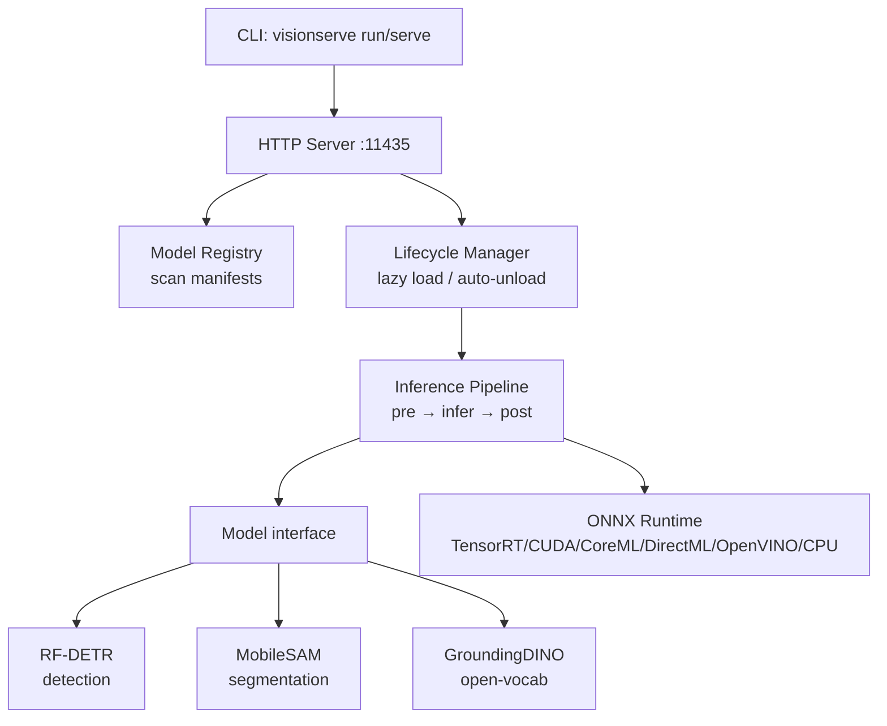
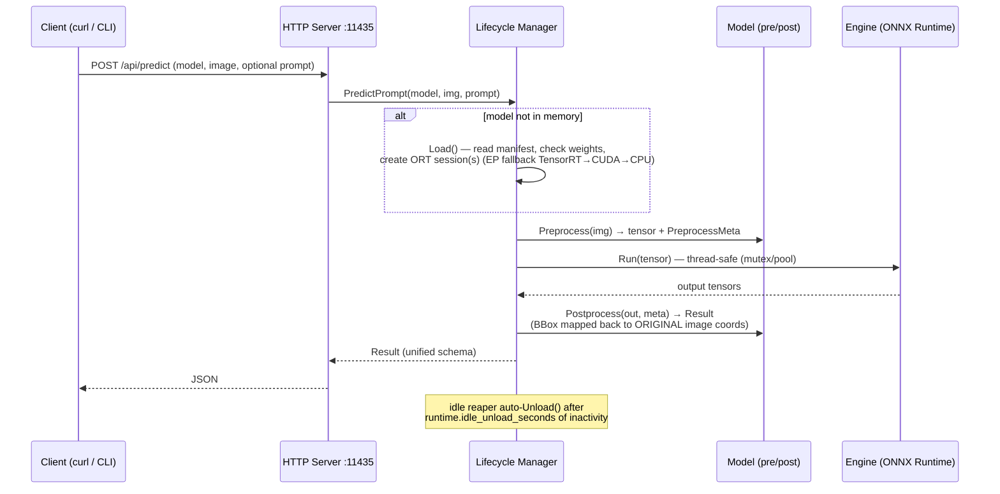

# VisionServe

> **"Ollama for Computer Vision"** — local-first, a single lean Go binary, edge-GPU first (Jetson), clean licensing (permissive models only).

VisionServe serves computer-vision models (detection, segmentation, open-vocabulary)
behind one unified interface: lazy model loading, automatic unload when idle, and
multiple models running concurrently — all through a REST API or a single CLI command.

```bash
make run MODEL=rf-detr IMAGE=image.jpg     # → detection JSON, instantly
```

VisionServe is **fully free and open-source**, built for the community under
**Apache-2.0**. Every feature here is in scope and free to use, including for
commercial, edge, and closed deployments.

> **Status:** detection (RF-DETR), segmentation (MobileSAM), open-vocabulary detection
> (GroundingDINO), and **Grounded-SAM** (text → boxes → masks) all run end-to-end,
> GPU-accelerated. **Python** and **JavaScript/TypeScript** clients, a Docker server
> image, and Ollama-style `pull` from HuggingFace are included.

---

## Architecture



### Predict flow (detailed)



> `visionserve run` goes through **exactly this pipeline** but **in-process** (calling
> `lifecycle.Manager` directly, no server needed). See [docs/architecture.md](docs/architecture.md).

---

## Quickstart

Everything is driven through `make` (which builds the binary, wires ONNX Runtime, and
uses the **GPU by default** — add `GPU=0` to force CPU). Run `make help` to list targets.

### 1. Build

Requires **Go >= 1.22**.

```bash
make build        # → bin/visionserve
```

### 2. ONNX Runtime + GPU

The [`yalue/onnxruntime_go`](https://github.com/yalue/onnxruntime_go) binding loads
`libonnxruntime.so` at runtime. The `make` targets handle this for you:

- **CPU:** `make` auto-detects a CPU ONNX Runtime library on your machine.
- **GPU (default):** `make run/serve/demo` source [`scripts/gpu-env.sh`](scripts/gpu-env.sh),
  which finds a CUDA-enabled ORT lib + the matching cuDNN/CUDA libraries, and falls back
  to CPU if none is found. Force CPU with `GPU=0`. Set `VISIONSERVE_TRACE=1` to see which
  execution provider actually loaded (TensorRT → CUDA → CPU).

On edge devices (Jetson) use an ORT build with the **TensorRT/CUDA EP**.

> **Weights:** `.onnx` files are NOT committed (see `.gitignore`). Get them with:
> ```bash
> make pull MODEL=rf-detr        # download real weights from HuggingFace (Ollama-style)
> ```
> or generate a ~2KB **dummy** to just exercise the pipeline:
> `python models/rf-detr/gen_dummy_onnx.py`. See [models/rf-detr/README.md](models/rf-detr/README.md).

### 3. Run a single command (in-process, no server)

```bash
# Detection
make run MODEL=rf-detr IMAGE=image.jpg                        # → detection JSON
make run MODEL=rf-detr IMAGE=image.jpg OUT=out.png           # + draw bboxes, save out.png

# Segmentation — MobileSAM needs a box or point prompt (original-image coords)
make run MODEL=mobile-sam IMAGE=img.jpg BOX=34,58,120,240 OUT=mask.png
make run MODEL=mobile-sam IMAGE=img.jpg POINT=95,180,1 OUT=mask.png   # label 1=fg 0=bg

# Open-vocabulary detection — text prompt (lowercased, dot-separated)
make run MODEL=grounding-dino IMAGE=img.jpg PROMPT="cat. remote." OUT=boxes.png

# Grounded-SAM — text → boxes → masks
make run MODEL=grounded-sam IMAGE=img.jpg PROMPT="cat. remote." OUT=masks.png
```

**`make run` variables:**

| Variable | For | Example |
|----------|-----|---------|
| `MODEL` | which model | `rf-detr`, `mobile-sam`, `grounding-dino`, `grounded-sam` |
| `IMAGE` | input image path | `IMAGE=cats.jpg` |
| `OUT` | save image with drawn bboxes/masks | `OUT=out.png` |
| `PROMPT` | open-vocab text | `PROMPT="cat. remote."` |
| `BOX` | SAM box prompt | `BOX=34,58,120,240` (multiple via `;`) |
| `POINT` | SAM point prompt | `POINT=95,180,1` (label 1=fg 0=bg) |
| `GPU` | `1` (default) or `0` to force CPU | `GPU=0` |
| `MODELS` | registry directory | `MODELS=./models` |

> **Demo:** `make demo` downloads a few real COCO images, runs detection, and writes
> annotated images into `demo/out/` (boxes/masks drawn in pure Go, no cgo).

### 4. Run the server

```bash
make serve                       # listen on :11435 (GPU by default; GPU=0 for CPU)
make serve ADDR=:8080            # custom address
```

Manage models in a running server:

```bash
make pull MODEL=rf-detr          # download a model from HuggingFace into ./models
make ps                          # which models are loaded
make rm MODEL=rf-detr            # unload a model (free VRAM)
make list                        # list local + pullable models
```

### 5. Call the API with curl

```bash
# Health check
curl -s http://localhost:11435/api/health
# → {"status":"ok"}

# List models + state (not_downloaded | available | loaded)
curl -s http://localhost:11435/api/models

# Predict — multipart (upload image file)
curl -s -F model=rf-detr -F image=@image.jpg \
  http://localhost:11435/api/predict

# MobileSAM with a box prompt
curl -s -F model=mobile-sam -F image=@image.jpg -F box=34,58,120,240 \
  http://localhost:11435/api/predict

# Grounded-SAM with a text prompt (text → boxes → masks)
curl -s -F model=grounded-sam -F image=@image.jpg -F prompt="cat. remote." \
  http://localhost:11435/api/predict

# Predict — JSON with base64 image + prompt fields
curl -s -H 'Content-Type: application/json' \
  -d '{"model":"grounding-dino","image_base64":"<base64>","prompt":"cat. remote."}' \
  http://localhost:11435/api/predict
```

| Field | For | Format |
|-------|-----|--------|
| `prompt` | open-vocab text | `"cat. remote."` |
| `box` | SAM box | `"x,y,w,h"` (multiple separated by `;`) |
| `point` | SAM point | `"x,y[,label]"` (multiple separated by `;`) |

### 6. Infer from Python

A small client library lives in [`clients/python/`](clients/python/). It accepts a file
path, a `PIL.Image`, a `numpy.ndarray`, or raw `bytes`, and parses the unified `Result`.

```bash
pip install visionserve               # once published to PyPI
# or from source:
pip install -e clients/python         # optional extras: 'clients/python[images]'
make serve                            # start the server (another terminal)
```

> Maintainers: `make pypi` builds + validates the package; pushing a `v*` tag publishes
> it to PyPI via GitHub Actions Trusted Publishing (see `.github/workflows/pypi.yml`).

```python
from visionserve import Client

client = Client("http://localhost:11435")

# Detection
res = client.predict("rf-detr", "image.jpg")
for d in res.detections:
    print(d.cls, round(d.conf, 3), d.bbox)   # bbox = [x, y, w, h] in original pixels

# Segmentation — pass a box; works with a numpy ndarray input too
import numpy as np
res = client.predict("mobile-sam", "image.jpg", box=[34, 58, 120, 240])
mask = res.masks[0].to_ndarray(width=640, height=480)   # bool (H, W) numpy array

# Open-vocab segmentation — text prompt → boxes + masks
res = client.predict("grounded-sam", "image.jpg", prompt="cat. remote.")
print([d.cls for d in res.detections], "→", len(res.masks), "masks")
```

### 6b. Infer from JavaScript / TypeScript

A sibling client lives in [`clients/js/`](clients/js/) with the same API as the Python
one. It has **zero runtime dependencies** (uses built-in `fetch`/`FormData`/`Blob`) and
runs on **Node >= 18** and in the browser. Image input accepts a file path (Node), raw
bytes (`Uint8Array`/`ArrayBuffer`), or a `Blob`.

```bash
npm install visionserve               # once published to npm
# or from source:
cd clients/js && npm install && npm run build
make serve                            # start the server (another terminal)
```

```ts
import { Client } from "visionserve";

const client = new Client("http://localhost:11435");

// Detection
const det = await client.predict("rf-detr", "image.jpg");
for (const d of det.detections) console.log(d.cls, d.conf.toFixed(3), d.bbox);

// Segmentation — box prompt; decode the column-major RLE mask
const seg = await client.predict("mobile-sam", "image.jpg", { box: [34, 58, 120, 240] });
const mask = seg.masks[0]?.toMask(640, 480); // row-major Uint8Array, 1 = inside mask

// Open-vocab segmentation — text prompt → boxes + masks
const gs = await client.predict("grounded-sam", "image.jpg", { prompt: "cat. remote." });
console.log(gs.detections.map((d) => d.cls), "→", gs.masks.length, "masks");
```

### 7. Run with Docker (self-contained, no host setup)

A multi-stage image bundles the Go binary **and** ONNX Runtime (~141 MB).

```bash
make docker                          # build visionserve:latest (CPU)
# or a GPU image (CUDA/TensorRT EP): make docker ORT_VARIANT=gpu

# Run the server; mount your models directory as the /models volume
docker run --rm -p 11435:11435 -v "$PWD/models:/models" visionserve:latest

# GPU (needs nvidia-container-toolkit):
# docker run --rm --gpus all -p 11435:11435 -v "$PWD/models:/models" visionserve:latest serve
```

Then hit it with the same curl / Python calls above. arm64/Jetson images, GHCR
publishing, and compose are covered in [`deploy/README.md`](deploy/README.md).

### Sample JSON output (detection)

Every task shares **one unified `Result` schema**. `bbox` is always in **ORIGINAL
image** coordinates as `[x, y, w, h]` (top-left corner + width/height):

```json
{
  "task": "detection",
  "model": "rf-detr",
  "detections": [
    { "bbox": [34.5, 58.0, 120.2, 240.7], "class": "person", "conf": 0.91 },
    { "bbox": [210.0, 130.4, 88.6, 64.1], "class": "dog", "conf": 0.77 }
  ],
  "duration_ms": 18.4
}
```

Segmentation results come back under `masks` (each with a column-major RLE-encoded mask):

```json
{
  "task": "segmentation",
  "model": "mobile-sam",
  "masks": [
    { "rle": "...", "bbox": [34.0, 58.0, 120.0, 240.0], "conf": 0.98 }
  ],
  "duration_ms": 24.1
}
```

---

## Supported models

| Task | Model | License | Status |
|------|-------|---------|--------|
| Detection | RF-DETR | Apache-2.0 | working (end-to-end) |
| Segmentation | MobileSAM | Apache-2.0 | working — needs a box/point prompt |
| Open-vocab | GroundingDINO | Apache-2.0 | text → boxes |
| Open-vocab segmentation | Grounded-SAM | Apache-2.0 | text → boxes → masks (GroundingDINO → MobileSAM) |

**All models are permissive-licensed (Apache-2.0).** This is a deliberate, load-bearing
constraint — not a limitation we work around. See [Licensing discipline](#licensing-discipline).

---

## Hardware support

All inference goes through **ONNX Runtime**, so the same `.onnx` file runs across CPU and
multiple accelerators. The manifest's `runtime.prefer` sets a per-model **execution-provider
(EP) fallback chain**, and the engine **always appends `cpu` last** so a model can always
run. If an EP's libraries aren't present, the engine silently falls back to the next one
(set `VISIONSERVE_TRACE=1` to see which EP actually loaded).

| EP (`runtime.prefer`) | Hardware | Notes |
|-----------------------|----------|-------|
| `tensorrt` | NVIDIA GPU (incl. **Jetson**) | highest perf; edge-first |
| `cuda` | NVIDIA GPU | general CUDA |
| `coreml` | **Apple Silicon** / macOS | Neural Engine / GPU |
| `directml` | **Windows** GPU (AMD / Intel / NVIDIA) | DirectX 12 |
| `openvino` | **Intel** CPU / iGPU / VPU | |
| `cpu` | any CPU | always-present final fallback |

> Example fallback chains: `[tensorrt, cuda, cpu]` (NVIDIA/Jetson), `[coreml, cpu]` (Mac),
> `[directml, cpu]` (Windows), `[openvino, cpu]` (Intel). The EP allowlist is enforced by
> the registry — see [docs/manifest-spec.md](docs/manifest-spec.md). Wiring a new EP is
> bounded by what the `yalue/onnxruntime_go` binding exposes (no ROCm yet, so AMD discrete
> GPUs are reached via DirectML on Windows).

---

## Performance

Measured on a single **NVIDIA RTX A6000 (48 GB VRAM)**, 48-core CPU, 251 GB RAM.
Latency = median of 30 warm requests via the HTTP server (model already loaded).
Cold-start = wall-clock time from server launch to first response (includes model load +
ONNX session creation + first inference). Scripts live in [`benchmarks/`](benchmarks/).

### Latency — VisionServe Go vs Python baselines

| Model | Baseline | Device | p50 ms | p95 ms | RPS | Cold start | RSS MB | VRAM MB |
|---|---|---|---:|---:|---:|---:|---:|---:|
| **RF-DETR** | VisionServe (Go HTTP) | GPU | **70.5** | — | **14.3** | 2 502 | 835 | 804 |
| RF-DETR | VisionServe (Go HTTP) | CPU | 267 | — | 3.8 | 1 562 | 508 | — |
| RF-DETR | Python raw ORT (no HTTP) | CPU¹ | 217 | 260 | 4.5 | — | — | — |
| RF-DETR | Python FastAPI + ORT | CPU¹ | 230 | — | ~4.3 | — | — | — |
| **GroundingDINO** | VisionServe (Go HTTP) | GPU | **340** | — | **2.9** | 8 903 | 1 532 | 4 392 |
| GroundingDINO | VisionServe (Go HTTP) | CPU | 2 549 | — | 0.39 | 9 804 | 3 473 | — |
| GroundingDINO | Python raw ORT (no HTTP) | CPU¹ | 2 478 | — | 0.40 | — | — | — |
| **Grounded-SAM** | VisionServe (Go HTTP) | GPU | **450** | 498 | **2.2** | ~16 000² | — | ~5 000 |

> ¹ The `onnxruntime` Python package is **CPU-only** (no CUDA EP) — `CUDAExecutionProvider`
> is not available without installing `onnxruntime-gpu`. This is the default `pip install
> onnxruntime` experience, which is what most Python users have.
>
> ² Grounded-SAM cold-start includes loading GroundingDINO (719 MB) + two SAM sessions.

### Comparison with YOLO

```
YOLOv8n  GPU (PyTorch):       ~18 ms   CNN, 6 MB, AGPL-3.0 ✗
RF-DETR-nano  GPU (VisionServe): ~23 ms   transformer, 108 MB, Apache-2.0 ✓
RF-DETR-base  GPU (VisionServe): ~41 ms   transformer, 103 MB, Apache-2.0 ✓
YOLOv8m  GPU (PyTorch):       ~45 ms   CNN, 52 MB, AGPL-3.0 ✗
GroundingDINO GPU (VisionServe): ~325 ms  open-vocab (text query), 719 MB, Apache-2.0 ✓
```

RF-DETR-nano at 23 ms is **competitive with YOLOv8n**. The gap for RF-DETR-base comes from:
1. **DETR transformer architecture** — global cross-attention on 300 queries is more expensive
   than YOLO's local grid predictions, but NMS-free and more accurate on dense/occluded scenes.
2. **CUDA EP vs TensorRT** — we're on CUDA EP (ONNX Runtime). TensorRT would add another
   2–4× speedup; it requires `libnvinfer.so.10` which isn't installed on this host.
3. **Go preprocess + HTTP** — adds ~29 ms, not the bottleneck.

**YOLO (Ultralytics) is forbidden** in VisionServe by design — it is AGPL-3.0 copyleft,
which would virally relicense the entire project and every downstream user. RF-DETR and
GroundingDINO are both Apache-2.0 and can be used freely in commercial and closed products.

To get RF-DETR-nano pull it from the catalog:
```bash
make pull MODEL=rf-detr-nano        # ~108 MB, 384×384 input, ~23 ms GPU
```

### Key takeaways

- **Use `rf-detr-nano`** if latency matters — 23 ms GPU, near YOLO-speed, Apache-2.0.
- **GPU is essential for GroundingDINO / Grounded-SAM** — 7.5× faster (340 ms vs 2 549 ms).
  VisionServe auto-selects GPU via `scripts/gpu-env.sh` (default `GPU=1`).
- **Go HTTP overhead is only 14–29 ms** — the bottleneck is always ORT inference, not the server.
- **Python `onnxruntime` is CPU-only by default** — VisionServe properly wires the CUDA EP,
  giving 3–7× speedup over a typical Python onnxruntime setup.
- **Cold-start** (~2–16 s depending on model size) is the main cost for one-shot `run` —
  use `make serve` for production; once warm, latency drops 5–20×.
- **TensorRT EP** (needs `libnvinfer.so.10`) would give another 2–4× speedup.
  Planned but not yet wired.

### Reproducing

```bash
# run all benchmarks (writes benchmarks/results/all_benchmarks.json)
python3 benchmarks/bench.py

# GPU benchmark only
source scripts/gpu-env.sh
python3 benchmarks/bench.py
```

---

## Licensing discipline

VisionServe stays **Apache-2.0 permissive** so the *entire* community — including
commercial, edge, and closed deployments — can use, ship, and embed it freely. To
preserve that, the registry accepts **only permissive models** (Apache-2.0 / MIT /
BSD) and **forbids AGPL** models such as Ultralytics YOLO, FastSAM, and YOLO-World.

AGPL is viral copyleft: pulling one AGPL model in would relicense the whole project —
and every downstream deployer — under AGPL. "It's on HuggingFace" is **not** a license;
each model's actual license must be checked. Being free and community-driven *requires*
this discipline, it does not relax it. Every manifest must declare `license`, and the
registry rejects anything outside the allowlist. See [CLAUDE.md](CLAUDE.md).

---

## Adding a new model

Adding a model = create a package under `internal/models/<name>/`, implement the
`Model` interface (or `PipelineModel` for prompted / multi-session models), and call
`models.Register()` in `init()`. **No core changes required.**
Guide: [docs/contributing-models.md](docs/contributing-models.md).

---

## Roadmap

1. **Core** — serve + run, RF-DETR detection end-to-end, normalized JSON. *(done)*
2. **Prompted models** — MobileSAM segmentation, GroundingDINO open-vocab, and
   Grounded-SAM (text → box → mask) on the unified `PipelineModel` path.
3. **Community growth** — more permissive models, a remote model registry (`pull`),
   and contributor guides — all free and in-scope.

---

## License

Apache License 2.0 — see [LICENSE](LICENSE).
