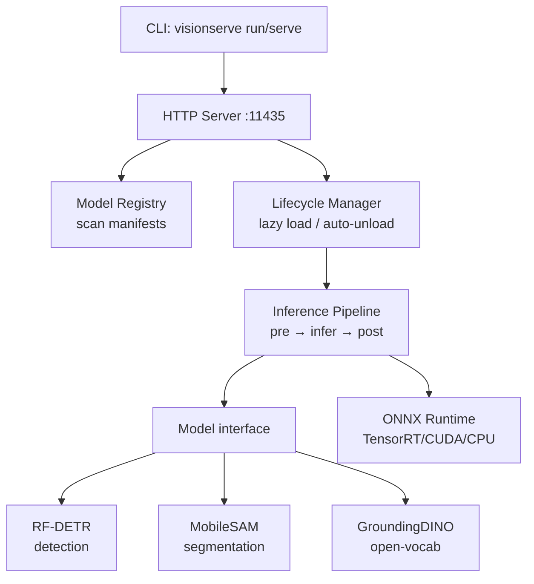
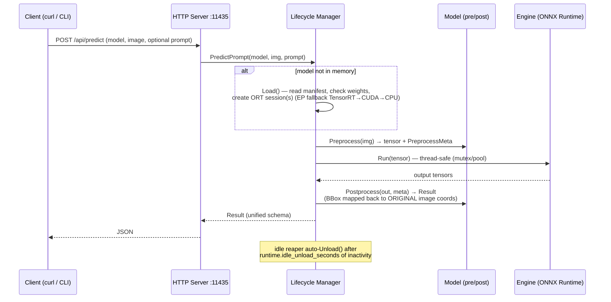

# VisionServe

> **"Ollama for Computer Vision"** — local-first, a single lean Go binary, edge-GPU first (Jetson), clean licensing (permissive models only).

VisionServe serves computer-vision models (detection, segmentation, open-vocabulary)
behind one unified interface: lazy model loading, automatic unload when idle, and
multiple models running concurrently — all through a REST API or a single CLI command.

```bash
visionserve run rf-detr image.jpg     # → detection JSON, instantly
```

VisionServe is **fully free and open-source**, built for the community under
**Apache-2.0**. Every feature here is in scope and free to use, including for
commercial, edge, and closed deployments.

> **Status:** built incrementally (see `PROMPT_CLAUDE_CODE.md`). The project skeleton
> and interfaces are in place; RF-DETR detection runs end-to-end, MobileSAM
> segmentation is wired as a prompted two-session pipeline.

---

## Architecture



### Predict flow (detailed)



> `visionserve run` goes through **exactly this pipeline** but **in-process** (calling
> `lifecycle.Manager` directly, no server needed). See [docs/architecture.md](docs/architecture.md).

---

## Quickstart

### 1. Build

Requires **Go >= 1.22**.

```bash
go build -o bin/visionserve ./cmd/visionserve
```

### 2. ONNX Runtime (required at runtime)

The [`yalue/onnxruntime_go`](https://github.com/yalue/onnxruntime_go) binding loads
`libonnxruntime.so` via an environment variable — point it at the shared library on
your machine:

```bash
export ORT_DYLIB_PATH=/path/to/libonnxruntime.so
```

On edge devices (Jetson) use an ORT build with the **TensorRT/CUDA EP** so the
`tensorrt → cuda → cpu` fallback chain declared in the manifest is usable.

> **Weights:** `.onnx` files are NOT committed (see `.gitignore`). To exercise the
> pipeline quickly, generate a ~2KB **dummy**: `python models/rf-detr/gen_dummy_onnx.py`.
> For the REAL RF-DETR weights (108MB) see [models/rf-detr/README.md](models/rf-detr/README.md).

### 3. Run a single command (in-process, no server)

```bash
bin/visionserve run rf-detr image.jpg              # → print detection JSON to stdout
bin/visionserve run rf-detr image.jpg --out r.png  # + draw bboxes onto the image, save r.png
```

Segmentation needs a **prompt** (a box or a point). MobileSAM takes a box `x,y,w,h`
or a point `x,y[,label]` in original-image coordinates:

```bash
# segment the object inside a box, save the mask overlay
bin/visionserve run mobile-sam img.jpg --box 34,58,120,240 --out mask.png

# or a foreground point (label 1 = foreground, 0 = background)
bin/visionserve run mobile-sam img.jpg --point 95,180,1 --out mask.png
```

Open-vocabulary detection takes a `--prompt` text query (lowercased, dot-separated):

```bash
bin/visionserve run grounding-dino img.jpg --prompt "cat. remote."
```

**Run flags** (see `internal/cli/run.go`):

| Flag | For | Format |
|------|-----|--------|
| `--out FILE` | any | save image with drawn bboxes/masks (`.png`/`.jpg`) |
| `--prompt TEXT` | open-vocab (GroundingDINO / Grounded-SAM) | `"cat. remote."` |
| `--box "x,y,w,h"` | SAM box prompt | multiple separated by `;` |
| `--point "x,y[,label]"` | SAM point prompt | label 1=fg 0=bg; multiple separated by `;` |

> **Demo:** `make demo` downloads a few real COCO images, runs RF-DETR (preferring the
> real weights if present), and writes images with bboxes+labels+confidence into
> `demo/out/`. Boxes are drawn in pure Go (no cgo).

### 4. Run the server

```bash
bin/visionserve serve                   # listen on :11435 (override with --addr)
```

### 5. Call the API with curl

```bash
# Health check
curl -s http://localhost:11435/api/health
# → {"status":"ok"}

# List models + state (not_downloaded | available | loaded)
curl -s http://localhost:11435/api/models

# Predict — multipart (upload image file)
curl -s -F model=rf-detr -F image=@image.jpg \
  http://localhost:11435/api/predict

# Predict — JSON with base64 image
curl -s -H 'Content-Type: application/json' \
  -d '{"model":"rf-detr","image_base64":"<base64>"}' \
  http://localhost:11435/api/predict
```

Prompted models accept the same `prompt` / `box` / `point` fields on `/api/predict`
(both multipart form fields and JSON keys):

```bash
# MobileSAM with a box prompt (JSON)
curl -s -H 'Content-Type: application/json' \
  -d '{"model":"mobile-sam","image_base64":"<base64>","box":"34,58,120,240"}' \
  http://localhost:11435/api/predict

# GroundingDINO with a text prompt (multipart)
curl -s -F model=grounding-dino -F image=@image.jpg -F prompt="cat. remote." \
  http://localhost:11435/api/predict
```

| Field | For | Format |
|-------|-----|--------|
| `prompt` | open-vocab text | `"cat. remote."` |
| `box` | SAM box | `"x,y,w,h"` (multiple separated by `;`) |
| `point` | SAM point | `"x,y[,label]"` (multiple separated by `;`) |

### 6. Manage model lifecycle

```bash
# Preload into memory (warm-up)
curl -s -H 'Content-Type: application/json' \
  -d '{"model":"rf-detr"}' http://localhost:11435/api/load

# See which models are loaded (CLI talks to a running server)
bin/visionserve ps

# Unload a model from memory (free VRAM)
bin/visionserve rm rf-detr
# equivalent to: curl -s -H 'Content-Type: application/json' \
#   -d '{"model":"rf-detr"}' http://localhost:11435/api/unload
```

### Sample JSON output (detection)

Every task shares **one unified `Result` schema**. `bbox` is always in **ORIGINAL
image** coordinates as `[x, y, w, h]` (top-left corner + width/height):

```json
{
  "task": "detection",
  "model": "rf-detr",
  "detections": [
    { "bbox": [34.5, 58.0, 120.2, 240.7], "class": "person", "conf": 0.91 },
    { "bbox": [210.0, 130.4, 88.6, 64.1], "class": "dog", "conf": 0.77 }
  ],
  "duration_ms": 18.4
}
```

Segmentation results come back under `masks` (each with a column-major RLE-encoded mask):

```json
{
  "task": "segmentation",
  "model": "mobile-sam",
  "masks": [
    { "rle": "...", "bbox": [34.0, 58.0, 120.0, 240.0], "conf": 0.98 }
  ],
  "duration_ms": 24.1
}
```

---

## Supported models

| Task | Model | License | Status |
|------|-------|---------|--------|
| Detection | RF-DETR | Apache-2.0 | working (end-to-end) |
| Segmentation | MobileSAM | Apache-2.0 | working — needs a box/point prompt |
| Open-vocab | GroundingDINO | Apache-2.0 | text → boxes |
| Open-vocab segmentation | Grounded-SAM | Apache-2.0 | text → boxes → masks (GroundingDINO → MobileSAM) |

**All models are permissive-licensed (Apache-2.0).** This is a deliberate, load-bearing
constraint — not a limitation we work around. See [Licensing discipline](#licensing-discipline).

---

## Licensing discipline

VisionServe stays **Apache-2.0 permissive** so the *entire* community — including
commercial, edge, and closed deployments — can use, ship, and embed it freely. To
preserve that, the registry accepts **only permissive models** (Apache-2.0 / MIT /
BSD) and **forbids AGPL** models such as Ultralytics YOLO, FastSAM, and YOLO-World.

AGPL is viral copyleft: pulling one AGPL model in would relicense the whole project —
and every downstream deployer — under AGPL. "It's on HuggingFace" is **not** a license;
each model's actual license must be checked. Being free and community-driven *requires*
this discipline, it does not relax it. Every manifest must declare `license`, and the
registry rejects anything outside the allowlist. See [CLAUDE.md](CLAUDE.md).

---

## Adding a new model

Adding a model = create a package under `internal/models/<name>/`, implement the
`Model` interface (or `PipelineModel` for prompted / multi-session models), and call
`models.Register()` in `init()`. **No core changes required.**
Guide: [docs/contributing-models.md](docs/contributing-models.md).

---

## Roadmap

1. **Core** — serve + run, RF-DETR detection end-to-end, normalized JSON. *(done)*
2. **Prompted models** — MobileSAM segmentation, GroundingDINO open-vocab, and
   Grounded-SAM (text → box → mask) on the unified `PipelineModel` path.
3. **Community growth** — more permissive models, a remote model registry (`pull`),
   and contributor guides — all free and in-scope.

---

## License

Apache License 2.0 — see [LICENSE](LICENSE).
