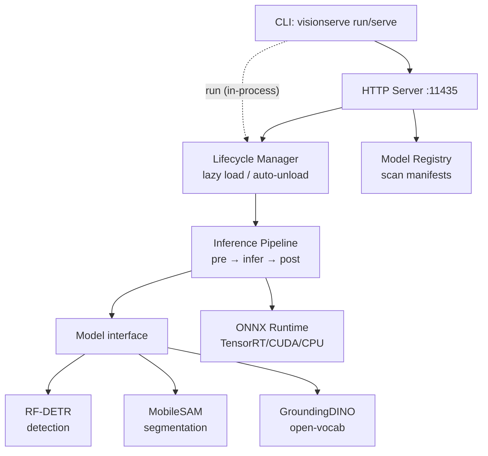
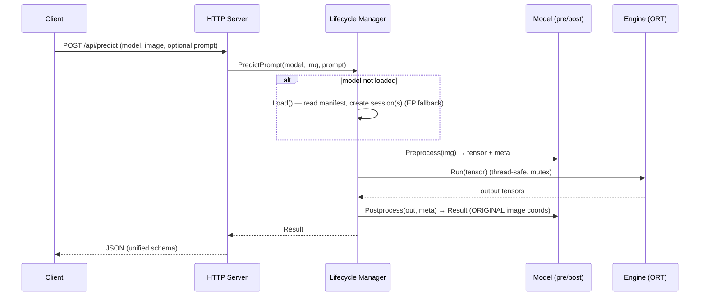

# VisionServe Architecture

## Overview

VisionServe is **a single Go binary** that bundles both the CLI and the HTTP server.
Philosophy (inspired by Ollama): local-first, one command to run, many models behind
one unified interface, automatic model lifecycle management. It is fully free and
open-source under Apache-2.0.

## Predict flow

## Two model paths: `Model` vs `PipelineModel`

VisionServe distinguishes two kinds of model (both satisfy the minimal `Base`
interface; lifecycle type-asserts to pick the path):

- **`Model`** (simple, single-session): the engine + lifecycle drive a single
  `pre → infer → post`. The model only implements `Preprocess` / `Postprocess`; it
  does **not** call the ONNX session itself. Example: **RF-DETR**.
- **`PipelineModel`** (prompted and/or multi-session): the model needs a prompt
  and/or several chained ONNX graphs, so it drives its own inference. It declares
  `Roles()` (session keys) and implements `Infer(img, prompt, Runner)`. Lifecycle
  still **loads and owns** every session (VRAM stays centralized); the model only
  orchestrates calls by role. Examples: **MobileSAM** (encoder + decoder),
  **GroundingDINO** (single graph but prompted by text), **Grounded-SAM**
  (GroundingDINO → MobileSAM).

### Prompt path

A `models.Prompt` carries optional inputs and flows identically through the CLI and
HTTP layers (`models.ParsePrompt` is shared):

- `Text` — open-vocab query, e.g. `"cat. remote."` (GroundingDINO / Grounded-SAM).
- `Boxes` — SAM box prompts, each `[x,y,w,h]` in **original-image** coordinates.
- `Points` — SAM point prompts (`label` 1 = foreground, 0 = background).

Simple `Model`s (RF-DETR) ignore the prompt. The manager always calls
`PredictPrompt(model, img, prompt)`; an empty prompt is valid.

### Multi-session lifecycle

For a `PipelineModel`, lifecycle reads the manifest `files:` map (role → ONNX path),
creates one `engine.Session` per role, and stores them in a `role → engine.Session`
map on the `Session`. It then hands the model a **`Runner`** — the lifecycle-backed
gateway that exposes those sessions by role (`Run(role, inputs)`, `InputNames(role)`,
`OutputNames(role)`) **without** transferring ownership. The model chains stages
(e.g. SAM: encoder → decoder) by calling the Runner per role. Each `engine.Session.Run`
locks a mutex, so concurrent requests are safely serialized, and the idle reaper
unloads *all* of a model's sessions together.

## Unified Result

Every task returns the same `api.Result`. There is **no per-model schema**:

- `Detections` — each `{ bbox [x,y,w,h], class, conf }`, bbox in **original-image** coords.
- `Masks` — each `{ rle, bbox, conf }`, the mask encoded as **column-major RLE**
  (COCO-style). Used by segmentation (MobileSAM) and Grounded-SAM.

Open-vocab detection populates `Detections` (text → boxes); Grounded-SAM populates
`Masks` (text → boxes → masks).

## Responsibility split

| Component | Responsibility | Notes |
|-----------|----------------|-------|
| `cli` | parse commands, dispatch | `run` runs in-process; `ps`/`rm` call HTTP; shares `ParsePrompt` |
| `server` | REST API, JSON | unified `Result` schema; parses `prompt`/`box`/`point` |
| `registry` | scan + validate manifests | **rejects AGPL / non-permissive licenses**, checks ONNX files (incl. multi-file `files:`) |
| `lifecycle` | load/unload, idle reaper, role→`engine.Session`, `Runner` | **every ONNX session goes through here** (simple and pipeline) |
| `engine` | wraps ONNX Runtime | EP fallback TensorRT→CUDA→CPU; `Run` thread-safe |
| `models/*` | per-architecture pre/postprocess (`Model`) or `Infer` orchestration (`PipelineModel`) | implement interface + `Register()` |
| `imageproc` | letterbox/resize/nms/tensor/RLE/draw | pure Go, no cgo |
| `extension` | community extension hooks | no-op by default |

## Invariants

- `Infer` against a session is **not** in the `Model` interface — engine + lifecycle
  own it. Simple models do pre/post only; `PipelineModel`s orchestrate via `Runner`,
  but lifecycle still owns and frees the sessions.
- `Detection.BBox` is **always in ORIGINAL image coords** (mapped back via `PreprocessMeta`).
- Prompts (box/point/text) are in **original-image** coordinates and flow through
  `PredictPrompt`; an empty prompt is valid for models that need none.
- The `Result` schema is shared across all tasks (`Detections` + `Masks`, masks as
  column-major RLE). Never invent a per-model schema.
- Adding a model **does not touch core**: just add a package under
  `internal/models/<name>/` + `Register()` + one blank import line in
  `cmd/visionserve/main.go`.
