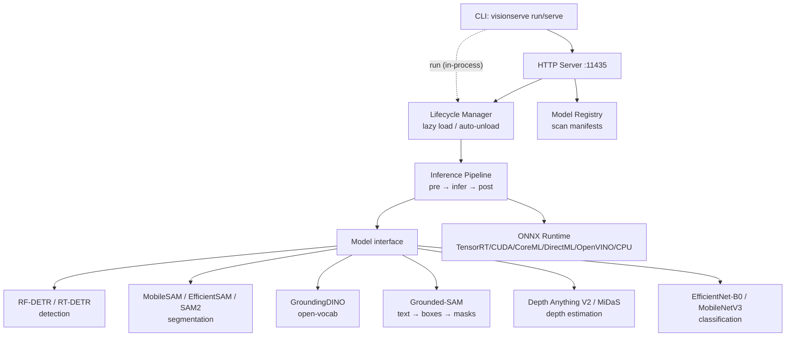
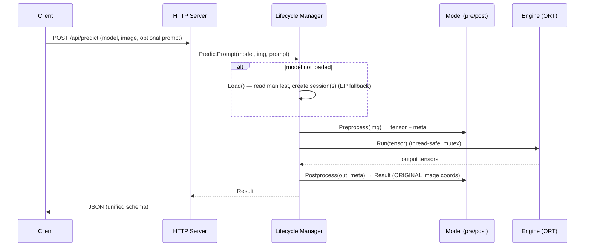

# VisionServe Architecture

## Overview

VisionServe is **a single Go binary** that bundles both the CLI and the HTTP server.
Philosophy (inspired by Ollama): local-first, one command to run, many models behind
one unified interface, automatic model lifecycle management. It is fully free and
open-source under Apache-2.0.

## Predict flow

## Two model paths: `Model` vs `PipelineModel`

VisionServe distinguishes two kinds of model (both satisfy the minimal `Base`
interface; lifecycle type-asserts to pick the path):

- **`Model`** (simple, single-session): the engine + lifecycle drive a single
  `pre → infer → post`. The model only implements `Preprocess` / `Postprocess`; it
  does **not** call the ONNX session itself. Example: **RF-DETR**.
- **`PipelineModel`** (prompted and/or multi-session): the model needs a prompt
  and/or several chained ONNX graphs, so it drives its own inference. It declares
  `Roles()` (session keys) and implements `Infer(img, prompt, Runner)`. Lifecycle
  still **loads and owns** every session (VRAM stays centralized); the model only
  orchestrates calls by role. Examples: **MobileSAM** (encoder + decoder),
  **GroundingDINO** (single graph but prompted by text), **Grounded-SAM**
  (GroundingDINO → MobileSAM), **Grasp** (orchestrates MobileSAM), and
  **Background** (the first model to orchestrate *two different backbones* —
  MobileSAM **and** MiDaS — behind one model, with a per-request **method** selector).
  It returns a single support-surface (background) mask and picks the algorithm per
  request via `Prompt.Method`: `"auto"` (default) runs depth, falling back to cv;
  `"depth"` uses MiDaS depth + an affine-disparity RANSAC plane fit (the near-plane =
  support surface); `"sam"` runs a MobileSAM foreground-point prompt on the lower
  frame; `"cv"` is classical CV with **no ONNX session** (a low-texture region grown
  from the border); and `"automask"` runs the MobileSAM Automatic Mask Generator and
  unions the large / border-touching masks. Background reuses the MobileSAM weights
  (roles `encoder`/`decoder`) and the MiDaS weights (role `depth`) via the manifest
  `files:` map.

### Prompt path

A `models.Prompt` carries optional inputs and flows identically through the CLI and
HTTP layers (`models.ParsePrompt` is shared):

- `Text` — open-vocab query, e.g. `"cat. remote."` (GroundingDINO / Grounded-SAM).
- `Boxes` — SAM box prompts, each `[x,y,w,h]` in **original-image** coordinates.
- `Points` — SAM point prompts (`label` 1 = foreground, 0 = background).

The `Prompt` is also the **single channel for per-request options** (each `0` = use
the model/manifest default, read per-call so it is thread-safe): `MinSize`/`MaxSize`
(output bbox-area filter), `GripperMin`/`GripperMax` (grasp parallel-jaw bounds),
`BoxThresh`/`TextThresh` (GroundingDINO thresholds), `BgMaxArea`/`FgMinArea`
(Background support-surface/noise area cutoffs), `GridSize` (override for the MobileSAM
Automatic Mask Generator grid — e.g. Background threads it through to its `automask`
method), and `Method` (per-request algorithm selector for models that offer several —
the Background model: `"auto"` | `"depth"` | `"sam"` | `"cv"` | `"automask"`).

Simple `Model`s (RF-DETR) ignore the prompt. The manager always calls
`PredictPrompt(model, img, prompt)`; an empty prompt is valid — for MobileSAM it
triggers the **Automatic Mask Generator** (16×16 grid, ~256 decoder calls).

### Region of interest (generic crop wrapper)

A `roi` = `[x,y,w,h]` option (in **original-image** pixels — `Prompt.ROI`, the HTTP
form/JSON `roi` field, and the `run` CLI `--roi` / `make run ROI=`) restricts a request
to a sub-rectangle with **crop semantics**: the image is cropped to the ROI, the model
runs on the crop *only* (it never sees the rest of the frame), and results are mapped
back to original-image coordinates. Like the size filter (`api.FilterBySizePct`), this
is a **generic, model-agnostic pre/post wrapper around inference** — it works for
detection / segmentation / grasp / background alike and lives **outside** the models, in
the new `internal/roi` package, applied identically by the HTTP predict handler and the
`run` CLI (one source of truth). Box/point prompts are given in original coords and
shifted into the crop before inference; on the way out, detection/mask bboxes and grasp
centres are offset by the ROI origin, and each mask is **re-embedded** (decode at crop
size → paste at the ROI offset → re-encode at full size via the `pkg/api` column-major
RLE codec `EncodeMaskRLE` / `DecodeMaskRLE`).

### Multi-session lifecycle

For a `PipelineModel`, lifecycle reads the manifest `files:` map (role → ONNX path),
creates one `engine.Session` per role, and stores them in a `role → engine.Session`
map on the `Session`. It then hands the model a **`Runner`** — the lifecycle-backed
gateway that exposes those sessions by role (`Run(role, inputs)`, `InputNames(role)`,
`OutputNames(role)`) **without** transferring ownership. The model chains stages
(e.g. SAM: encoder → decoder) by calling the Runner per role. Each `engine.Session.Run`
locks a mutex, so concurrent requests are safely serialized, and the idle reaper
unloads *all* of a model's sessions together.

**Idle-unload override.** Each manifest declares an `idle_unload_seconds` (default
300s) after which the reaper auto-unloads a model. The `serve` command can override
this globally with `--idle-unload-seconds` (`Manager.SetIdleUnloadOverride`):
`-1` (default) keeps each manifest's value, `0` means **never unload** (models stay
resident — avoids the slow cold reload after an idle pause), and `N` overrides every
model to `N` seconds. The reaper still skips any model whose effective idle timeout is
`0`.

## Hardware / execution providers

All inference runs through **ONNX Runtime** (VisionServe never implements its own kernels),
so "hardware support" = which ONNX Runtime **execution providers (EPs)** the engine can
append. The manifest's `runtime.prefer` declares a per-model fallback chain; `engine`
normalizes it and **always appends `cpu` last** so every model can run somewhere.

| EP | Hardware | `device` field | Notes |
|----|----------|---------------|-------|
| `tensorrt` | NVIDIA GPU (incl. Jetson) | `gpu:0+trt` | highest perf; 10–50× over CUDA EP for transformer models |
| `cuda` | NVIDIA GPU | `gpu:0` | general CUDA; limited for custom attention ops |
| `coreml` | Apple Silicon / macOS | `gpu:0` | Neural Engine / GPU |
| `directml` | Windows GPU (AMD / Intel / NVIDIA) | `gpu:0` | DirectX 12 |
| `openvino` | Intel CPU / iGPU / VPU | `openvino:0` | |
| `cpu` | any CPU | `cpu` | always-present final fallback |

**TRT auto-detect:** before attempting the TRT EP, VisionServe checks for `libnvinfer.so.10`
in `LD_LIBRARY_PATH` and common system paths (`/usr/lib/x86_64-linux-gnu`, `/usr/local/lib`,
etc.). If the lib is absent the TRT EP is skipped entirely — no hard crash, graceful fallback
to CUDA. This check runs once at startup in a background goroutine and is cached.

**Important for transformer models (GroundingDINO, MobileSAM):** ORT's CUDA EP falls back
to CPU for ops like deformable multi-scale attention and custom ViT attention — there are no
CUDA kernels for them in the standard ORT build. CUDA EP therefore gives no speedup over
CPU for these models. TRT compiles the entire graph and eliminates the fallback, achieving
10–50× speedup. The `device` field and startup logs tell you which EP is active.

Appending an EP whose libraries are missing on the host is **not fatal** — the engine
silently falls back to the next EP in the chain (set `VISIONSERVE_TRACE=1` to see which EP
actually loaded). The EP allowlist lives in `internal/engine/provider.go`; adding a new EP
means extending that allowlist plus the `appendProviders` switch in `ort.go` — but only EPs
the `yalue/onnxruntime_go` binding exposes can be wired (it currently does **not** expose
ROCm, so AMD discrete GPUs are reachable only via DirectML on Windows).

## Unified Result

Every task returns the same `api.Result`. There is **no per-model schema**:

- `Device` — `"cpu"` | `"gpu:0"` (CUDA EP) | `"gpu:0+trt"` (TensorRT EP).
- `Hint` — non-empty when using `gpu:0` without TRT; recommends installing TensorRT.
- `Detections` — each `{ bbox [x,y,w,h], class, conf }`, bbox in **original-image** coords.
  Used by detection (RF-DETR, RT-DETR, SCRFD) and open-vocab detection (GroundingDINO).
- `Masks` — each `{ rle, bbox, conf }`, the mask encoded as **column-major RLE**
  (COCO-style). Used by segmentation (MobileSAM, EfficientSAM, SAM2, Background) and
  Grounded-SAM.
- `Classifications` — each `{ class, conf }`, ranked top-K predictions.
  Used by classification (EfficientNet-B0, MobileNetV3).
- `DepthMap` / `DepthWidth` / `DepthHeight` — flat row-major `[]float32` relative depth
  values. Used by depth estimation (Depth Anything V2, MiDaS).

Open-vocab detection populates `Detections` (text → boxes); Grounded-SAM populates
`Masks` (text → boxes → masks).

## Responsibility split

| Component | Responsibility | Notes |
|-----------|----------------|-------|
| `cli` | parse commands, dispatch | `run` runs in-process; `ps`/`rm` call HTTP; shares `ParsePrompt` |
| `server` | REST API, JSON | unified `Result` schema; parses `prompt`/`box`/`point` |
| `registry` | scan + validate manifests | **rejects AGPL / non-permissive licenses**, checks ONNX files (incl. multi-file `files:`) |
| `lifecycle` | load/unload, idle reaper, role→`engine.Session`, `Runner` | **every ONNX session goes through here** (simple and pipeline) |
| `engine` | wraps ONNX Runtime | EP fallback chain (e.g. TensorRT→CUDA→CPU); supported EPs: tensorrt, cuda, coreml, directml, openvino, cpu; `Run` thread-safe |
| `models/*` | per-architecture pre/postprocess (`Model`) or `Infer` orchestration (`PipelineModel`) | implement interface + `Register()` |
| `imageproc` | letterbox/resize/nms/tensor/RLE/draw | pure Go, no cgo |
| `extension` | community extension hooks | no-op by default |

## Invariants

- `Infer` against a session is **not** in the `Model` interface — engine + lifecycle
  own it. Simple models do pre/post only; `PipelineModel`s orchestrate via `Runner`,
  but lifecycle still owns and frees the sessions.
- `Detection.BBox` is **always in ORIGINAL image coords** (mapped back via `PreprocessMeta`).
- Prompts (box/point/text) are in **original-image** coordinates and flow through
  `PredictPrompt`; an empty prompt is valid for models that need none.
- The `Result` schema is shared across all tasks (`Detections`, `Masks`,
  `Classifications`, `DepthMap`/`DepthWidth`/`DepthHeight`; masks as column-major RLE).
  Never invent a per-model schema.
- Adding a model **does not touch core**: just add a package under
  `internal/models/<name>/` + `Register()` + one blank import line in
  `cmd/visionserve/main.go`.
