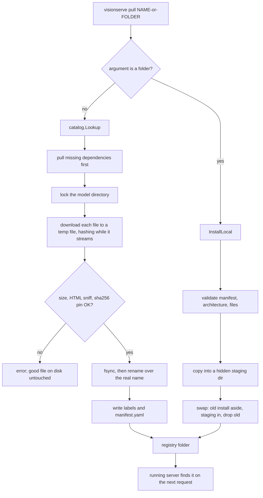

# Catalog and installing models

The server only serves what is in its *model registry*: a plain folder (by default
`~/.visionserve/models`) with one sub-folder per model, each holding a `manifest.yaml` and its
ONNX weights. `internal/catalog` is how folders get there. `visionserve pull rf-detr` looks the
name up in a small list of curated models compiled into the binary, downloads the weights from
the HuggingFace Hub, checks them, and writes a manifest. `visionserve pull ./my-model` validates a
folder you made yourself and copies it in. Both paths are careful about one thing: a download
that failed, was interrupted, or produced the wrong bytes must never replace a working model,
and a running server must never see half-written files. There is no remote registry and no
account: the catalog is Go data, and adding a model to it is a pull request.

## The picture



## Key ideas

### The catalog is a Go slice

Each entry says where the files live on the Hub, what to name them locally, and everything the
generated manifest needs. A *SHA-256 pin* is the expected fingerprint of a file's bytes: if even
one byte differs, the hash differs, so a pinned file is either exactly the audited file or it is
refused.

```go title="internal/catalog/catalog.go"
type File struct {
	// Role is the logical role used by multi-session models (e.g. "encoder",
	// "decoder", "model", "vocab"). For single-file models use "model".
	Role string
	// ...
	HFFilename string
	// LocalFilename is the name written under <modelsdir>/<name>/.
	LocalFilename string
	// ...
	ManifestRole string
	// ...
	DirectURL string
	// SHA256 is the expected hex digest of the downloaded bytes. Optional, but WITHOUT it
	// a pulled model carries no content pin, and the registry's verified mode refuses to
	// load an unpinned model (registry.Manifest.VerifyWeights). Pull checks it after
	// downloading; RenderManifest writes it into the generated manifest.
	SHA256 string
}
```

[View on GitHub](https://github.com/mtbui2010/vision_serve/blob/main/internal/catalog/catalog.go#L37-L63)

A plain entry, RF-DETR, looks like this. Note the license field, the pin, and `RuntimePrefer`:
every shipped entry prefers `[cuda, cpu]` (TensorRT is opt-in, see [Engine](engine.md)).

```go title="internal/catalog/catalog.go"
	{
		Name:         "rf-detr",
		Task:         "detection",
		License:      "Apache-2.0",
		Architecture: "rf-detr",
		Description:  "RF-DETR base (COCO) — NMS-free DETR detector.",
		HFRepo:       "PierreMarieCurie/rf-detr-onnx",
		Files: []File{
			{
				Role:          "model",
				HFFilename:    "rf-detr-base-coco.onnx",
				LocalFilename: "rf-detr-base.onnx",
				SHA256:        "b3321965003f11020701987a2de6e3d88f7c9a1298c1a7d4fec2d32e7f179987",
			},
		},
		// ...
		RuntimePrefer:     []string{"cuda", "cpu"},
		IdleUnloadSeconds: 300,
		Verified:          true,
	},
```

[View on GitHub](https://github.com/mtbui2010/vision_serve/blob/main/internal/catalog/catalog.go#L162-L191)

*Composed* entries such as `grounded-sam`, `rfdetr-gdino-siglip` or `grasp-rfdetr` download
nothing. They list `Dependencies` and `VirtualFiles`, a role-to-path map that points into the
sibling folders (`../grounding-dino/model-fixedmask.onnx`), so the big weights exist once on
disk. *Partly composed* entries set both `Files` and `VirtualFiles`: the four
`rfdetr-textalign-*` models download their own detector, `proj.bin` and `head.onnx` from one
folder each of [`mtbui2010/rfdetr-textalign-ONNX`](https://huggingface.co/mtbui2010/rfdetr-textalign-ONNX)
(`HFSubdir`), and borrow the text tower from `../clip-text/` or `../siglip-text/`. Their manifest
pins only their own files. In verified mode the borrowed tower is admitted through the model that
owns it, as for a composed entry. Some entries also accept `Aliases` (`groundingdino`, `gdino` for `grounding-dino`); the
model is always installed under its main name.

The `internal/catalog/labels` folder holds the two class-name lists that are small enough to
embed in the binary (`coco91.txt`, `imagenet1k.txt`). `pull` writes them next to the weights, so
`rf-detr` or `efficientnet-b0` need no extra download for their labels.

### One pull fetches its dependencies, under a lock

`pull rfdetr-gdino-siglip-etri` is enough on its own: missing dependencies are pulled first. A
dependency that is already installed is left alone, even with `--force`, because other models
point at the same files.

```go title="internal/catalog/pull.go"
	for _, dep := range entry.Dependencies {
		if _, err := os.Stat(filepath.Join(opts.ModelsDir, dep, "manifest.yaml")); err == nil {
			continue
		}
		fmt.Fprintf(out, "%s needs %s — pulling it first\n", entry.Name, dep)
		depOpts := opts
		depOpts.Force = false
		if err := pull(dep, depOpts, visiting); err != nil {
			return fmt.Errorf("pull %s: dependency %s: %w", entry.Name, dep, err)
		}
	}
```

[View on GitHub](https://github.com/mtbui2010/vision_serve/blob/main/internal/catalog/pull.go#L70-L80)

Two `pull` commands for the same model (two terminals, two containers sharing a volume) would
otherwise write over each other. Each model folder has a `.pull.lock` file; on Unix the second
pull waits on an `flock` and then finds the verified files already in place. The kernel drops the
lock if the process dies, so a crash never leaves a stale lock.

```go title="internal/catalog/pull.go"
	// One pull per model directory at a time: a second concurrent pull of the same model waits,
	// then finds the verified files in place instead of downloading over the first.
	unlock, err := lockDir(dstDir, out, entry.Name)
	if err != nil {
		return fmt.Errorf("pull %s: lock %s: %w", entry.Name, dstDir, err)
	}
	defer unlock()
```

[View on GitHub](https://github.com/mtbui2010/vision_serve/blob/main/internal/catalog/pull.go#L90-L96)

A file already on disk is not trusted just because it exists: when the entry has a pin, it is
hashed again before `pull` reports "already present".

### Verified downloads: check first, then rename

Every download streams into a temporary file next to the destination and is hashed while it is
written, so a 700 MB file is read once and never held in RAM. Only when all checks pass does the
temp file replace the real name. The checks catch the usual ways a download goes wrong: a
connection that closed early (the size differs from the server's `Content-Length`), a tiny file,
an HTML error page saved under a `.onnx` name, and bytes that do not match the pin.

```go title="internal/catalog/download.go"
func checkDownload(name string, n, contentLength int64, head []byte, gotSHA string, want expect) error {
	if n == 0 {
		return fmt.Errorf("verify %s: file is empty", name)
	}
	if contentLength >= 0 && n != contentLength {
		return fmt.Errorf("verify %s: size mismatch (received %d bytes, server announced %d)", name, n, contentLength)
	}
	if n < want.Floor {
		return fmt.Errorf("verify %s: file is suspiciously small (%d bytes)", name, n)
	}
	if looksLikeHTMLError(head) {
		return fmt.Errorf("verify %s: looks like an HTML error page, not a model file", name)
	}
	if want.SHA256 != "" && !strings.EqualFold(gotSHA, want.SHA256) {
		// ...
	}
	return nil
}
```

[View on GitHub](https://github.com/mtbui2010/vision_serve/blob/main/internal/catalog/download.go#L425-L443)

After the checks, the file is made durable before it becomes visible: `fsync` the data, then
`rename` (atomic on the same filesystem), then `fsync` the directory. A server rescanning the
registry at that moment sees either the old file or the complete new one.

```go title="internal/catalog/download.go"
	// Durable before visible: the rename must never expose bytes that are not on disk yet.
	if err := tf.f.Chmod(0o644); err != nil {
		return tf.n, err
	}
	if err := tf.f.Sync(); err != nil {
		return tf.n, fmt.Errorf("download %s: %w", url, err)
	}
	// ...
	if err := os.Rename(tf.path, destPath); err != nil {
		return tf.n, err
	}
	done = true
	syncDir(dir)
	return tf.n, nil
```

[View on GitHub](https://github.com/mtbui2010/vision_serve/blob/main/internal/catalog/download.go#L301-L316)

There is no total timeout (a multi-GB file on a slow link can take hours). What is bounded is
*waiting*: 60 s for response headers and 2 minutes without a single body byte, after which a
stalled connection fails instead of hanging.

### Resuming an interrupted download

Pinned files are downloaded *resumably*. The temp file has a fixed name, `.<file>.partial`, and
is kept when the connection drops. The next `pull` hashes what is already there, asks the server
for the rest with an HTTP `Range` header, and continues. The pin is what makes this safe: the
whole file, old prefix included, must still match. If a resumed file fails verification, it is
thrown away and fetched once more from zero. Servers that ignore `Range` (reply 200) or refuse
it (416) simply get a fresh download.

```go title="internal/catalog/pull.go"
		fetch := downloadURL
		if file.SHA256 != "" {
			fetch = downloadResumable
		}
		if _, err := fetch(url, destPath, want, out); err != nil {
			if file.SHA256 != "" {
				if st, serr := os.Stat(partialPath(destPath)); serr == nil && st.Size() > 0 {
					return fmt.Errorf("pull %s: %w\n  %s of %s kept; run the same pull again to resume",
						entry.Name, err, humanBytes(st.Size()), file.LocalFilename)
				}
			}
			return fmt.Errorf("pull %s: %w", entry.Name, err)
		}
```

[View on GitHub](https://github.com/mtbui2010/vision_serve/blob/main/internal/catalog/pull.go#L160-L172)

Unpinned files restart from zero: without a pin, nothing would notice a prefix that came from a
different upstream version than the rest.

### Generated manifests are marshalled, not concatenated

`pull` writes the manifest by filling a struct whose YAML keys mirror `registry.Manifest` and
handing it to `yaml.v3`. An older hand-built string renderer could put a field like
`box_format` under the wrong block, where the loader silently ignored it; marshalling a
schema-shaped value rules that out, and a test fails if a key here is not a registry key at the
same path.

```go title="internal/catalog/manifest.go"
type manifestDoc struct {
	Name    string `yaml:"name"`
	Task    string `yaml:"task"`
	License string `yaml:"license"`
	// ...
	SourceURL    string            `yaml:"source_url,omitempty"`
	SHA256       any               `yaml:"sha256,omitempty"` // string (model_file) or role→digest map (files:)
	SHA256Files  map[string]string `yaml:"sha256_files,omitempty"`
	Architecture string            `yaml:"architecture,omitempty"`
	// ...
	Files        map[string]string `yaml:"files,omitempty"`
	ModelFile    string            `yaml:"model_file,omitempty"`
	Input        inputDoc          `yaml:"input"`
	Preprocess   *preprocessDoc    `yaml:"preprocess,omitempty"`
	Postprocess  postprocessDoc    `yaml:"postprocess,omitempty"`
	// ...
	Runtime      runtimeDoc        `yaml:"runtime,omitempty"`
}
```

[View on GitHub](https://github.com/mtbui2010/vision_serve/blob/main/internal/catalog/manifest.go#L99-L122)

The first line of a generated manifest records a short hash of the body below it. On a re-pull
this tells three cases apart: identical (nothing to do), generated by an older catalog and never
edited (regenerated, so fixes such as "squash, not letterbox" reach existing installs), or
edited by hand (kept; `--force` regenerates).

```go title="internal/catalog/pull.go"
	switch {
	case statErr != nil || opts.Force:
		if err := writeFileAtomic(manifestPath, []byte(want)); err != nil {
			return fmt.Errorf("write manifest: %w", err)
		}
		fmt.Fprintf(out, "  wrote manifest.yaml\n")
	case string(existing) == want:
		fmt.Fprintf(out, "  manifest.yaml up to date\n")
	case isUneditedGenerated(string(existing)):
		// ...
		fmt.Fprintf(out, "  updated manifest.yaml (generated by an older catalog)\n")
	default:
		fmt.Fprintf(out, "  manifest.yaml was edited by hand, keeping it (use --force to regenerate)\n")
	}
```

[View on GitHub](https://github.com/mtbui2010/vision_serve/blob/main/internal/catalog/pull.go#L199-L214)

The pins land in the manifest too (`sha256:` for the ONNX sessions, `sha256_files:` for side
files such as `model.onnx.data` or a tokenizer), so the registry re-checks the bytes every time
the model is loaded, not only at download. See [Models and manifests](models.md).

### Installing your own folder

`pull` decides between the two paths by looking at the argument: anything with a path
separator, a leading `.`, an absolute path, or a bare name that happens to be an existing
directory is treated as a folder.

```go title="internal/cli/client.go"
func isLocalModelArg(arg string) bool {
	if strings.ContainsRune(arg, filepath.Separator) || strings.HasPrefix(arg, ".") || filepath.IsAbs(arg) {
		return true
	}
	info, err := os.Stat(arg)
	return err == nil && info.IsDir()
}
```

[View on GitHub](https://github.com/mtbui2010/vision_serve/blob/main/internal/cli/client.go#L148-L154)

`InstallLocal` (the equivalent of `ollama create`) checks the folder statically, without opening
an ONNX session: the manifest must pass registry validation (permissive license, valid task and
input size), its `architecture` must be a model type compiled into the binary, and every
referenced file must exist *inside* the folder. Then it copies the folder into a hidden
*staging* directory (`.tmp-<name>-<digits>`) in the registry root, on the same filesystem so the
final rename is atomic. While copying, `manifest.yaml` is named `.manifest.yaml.staged`, so a
server rescanning mid-copy does not mistake the staging folder for a model.

The swap at the end is a small transaction: move the old install aside, move the new one in,
publish its manifest, delete the old one. If a step fails, the old install is put back.

```go title="internal/catalog/local.go"
	// Swap: move the old install aside, move the new one in, publish its manifest, drop the old.
	aside := ""
	if dstExists {
		aside = stage + "-old"
		if err := moveAside(dst, aside); err != nil {
			return fmt.Errorf("move previous install aside: %w", err)
		}
	}
	restore := func() {
		// ...
	}
	if err := os.Rename(stage, dst); err != nil {
		restore()
		return fmt.Errorf("install %s: %w", dstDir, err)
	}
	staged = true
	if err := os.Rename(filepath.Join(dst, stagedManifest), filepath.Join(dst, "manifest.yaml")); err != nil {
		_ = os.RemoveAll(dst)
		restore()
		return fmt.Errorf("install %s: %w", dstDir, err)
	}
```

[View on GitHub](https://github.com/mtbui2010/vision_serve/blob/main/internal/catalog/local.go#L171-L195)

Symlinks to files are followed and their *content* copied (a HuggingFace cache snapshot is a
folder of symlinks), symlinks to directories are refused, and a copy opens its target with
`O_EXCL`, so it can never truncate the file it is reading from.

### Cleaning up after a killed install

If `pull <folder>` is killed mid-copy, its staging folder stays behind, holding a full copy of
the weights. Every later install (catalog or local) first removes such leftovers. Only direct
children of the registry whose name matches exactly what `InstallLocal` creates are candidates,
and only once they are older than an hour; a live install keeps its staging folder's timestamp
fresh, so it never looks stale.

```go title="internal/catalog/stale.go"
var stagingDirRE = regexp.MustCompile(`^\.tmp-(.+)-[0-9]+(-old)?$`)
```

[View on GitHub](https://github.com/mtbui2010/vision_serve/blob/main/internal/catalog/stale.go#L23-L23)

A moved-aside `-old` folder is kept, with a warning, when the model has no complete install
next to it: in that case it is the only copy left.

### License discipline at install time

The same allowlist guards every way in. The registry accepts only these SPDX ids
(case-insensitive, stored back in canonical form); anything else, AGPL in any spelling
included, is refused.

```go title="internal/registry/manifest.go"
var licenseAllowlist = map[string]string{
	"apache-2.0":   "Apache-2.0",
	"mit":          "MIT",
	"bsd-3-clause": "BSD-3-Clause",
	"bsd-2-clause": "BSD-2-Clause",
}
```

[View on GitHub](https://github.com/mtbui2010/vision_serve/blob/main/internal/registry/manifest.go#L29-L34)

```go title="internal/registry/manifest.go"
	canonLicense, ok := canonicalLicense(m.License)
	if !ok {
		return fmt.Errorf("license %q is not allowed — only permissive licenses accepted (Apache-2.0/MIT/BSD); AGPL is strictly forbidden", m.License)
	}
	m.License = canonLicense
```

[View on GitHub](https://github.com/mtbui2010/vision_serve/blob/main/internal/registry/manifest.go#L292-L296)

The Python converter keeps its own copy so it can refuse a model *before* a long export (see
[Clients and the converter](clients.md)); `internal/registry/sync_test.go` parses the Python
source and fails the Go test suite if the two lists drift. There is no separate `licenses`
command; the allowlist lives in these two places only.

## Where in the code

!!! code "Where in the code"
    | File | Responsibility |
    |---|---|
    | `internal/catalog/catalog.go` | The curated list (`builtin`), `File` / `Entry` types, `Lookup` with aliases |
    | `internal/catalog/pull.go` | `Pull`: dependencies, per-model lock, skip-or-verify existing files, labels, manifest regeneration rules |
    | `internal/catalog/download.go` | Streaming download, hash while writing, `checkDownload`, resumable `.partial` files, idle timeout, atomic write helpers |
    | `internal/catalog/manifest.go` | `RenderManifest`: marshals `manifestDoc` with yaml.v3, body-hash header, `sha256` / `sha256_files` pins |
    | `internal/catalog/local.go` | `InstallLocal`: static validation, staging copy, transactional swap with restore |
    | `internal/catalog/stale.go` | Removes staging folders left by killed installs |
    | `internal/catalog/lock_unix.go`, `lock_other.go` | Per-model `.pull.lock` (flock on Unix) |
    | `internal/catalog/labels/` | Embedded `coco91.txt` and `imagenet1k.txt` |
    | `internal/cli/client.go` | `pull` flag parsing, catalog listing, folder-vs-name decision; also `ps` / `rm` |
    | `internal/registry/manifest.go`, `verify.go` | License allowlist, manifest validation, load-time sha256 checks |

## Things to know

!!! warning "Only Apache-2.0, MIT and BSD"
    The allowlist rejects AGPL (Ultralytics YOLO, FastSAM, YOLO-World) and any unknown or empty
    license, at scan time, at `pull <folder>`, and in the converter. A model being on
    HuggingFace says nothing about its license; check the real upstream before adding a catalog
    entry. The license string is still something an author *declares*: the opt-in verified mode
    (`VISIONSERVE_VERIFY=strict`) additionally cross-checks it against an audited ledger in the
    binary and requires a `source_url` and sha256 pin for every model.

!!! note "`rm` does not delete files"
    `visionserve rm <model>` asks the running server to *unload* the model from memory
    (`POST /api/unload`). The folder in the registry stays. To uninstall, delete the folder.

!!! tip "No restart after a pull"
    When a request names a model the server does not know, the lifecycle manager rescans the
    registry (at most once per second) before giving up. A freshly pulled model is therefore
    usable on the next request.

!!! note "Unpinned and unverified entries"
    A few entries have no pin (NanoSAM on Google Drive, the PaddleOCR keys file) and one is
    marked `Verified: false`: `rt-detr`, whose upstream repo answers 401 since 2026-08, so it
    cannot currently be pulled. `pull` prints the entry's note as a warning before downloading
    an unverified entry. Do not repoint an entry at a different export without checking its real
    tensor shapes first.

!!! warning "The manifest's sha256 is checked at load, not at `pull <folder>`"
    A local install performs only the static checks above. A pin that does not match the bytes
    is caught the first time the model is loaded, which then fails with a clear error.
