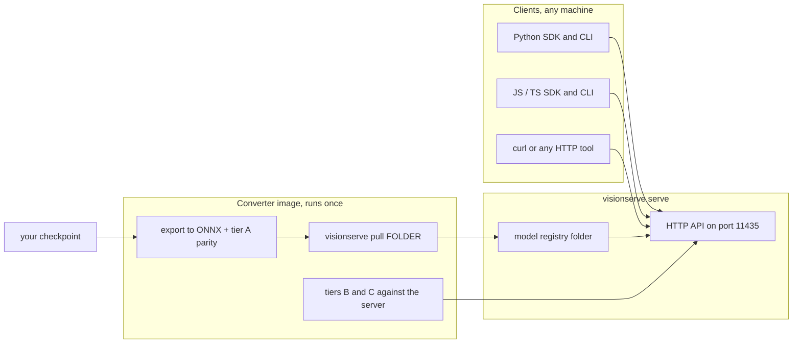

# Clients and the converter

Everything on this page lives *outside* the Go server and talks to it from the side. The
**client SDKs** (software development kits: small libraries for calling the server from your own
code) wrap the HTTP API for Python and for JavaScript/TypeScript; they never run a model
themselves. The **converter** turns a checkpoint you trained in PyTorch, RF-DETR, HuggingFace or
TensorFlow into an ONNX file plus a manifest, checks that the result behaves like the original,
and installs it. The converter needs Python and several GB of deep-learning frameworks, which is
exactly what the server must not depend on, so it ships as a separate Docker image that runs
once and exits. Finally, the **Docker images** in `deploy/` package the server itself for CPU,
NVIDIA GPU and arm64 machines.

## The picture



## Key ideas

### The Python SDK: a thin, dependency-free HTTP client

`pip install visionserve` installs a package whose transport uses only the standard library
(`urllib`, `json`, `base64`). `numpy` and `pillow` are optional extras (`visionserve[images]`)
that unlock array and PIL inputs, mask decoding and drawing.

```python title="clients/python/visionserve/client.py"
    def __init__(
        self,
        host: str = "http://localhost:11435",
        timeout: float = 120,
        *,
        base64_arrays: bool = False,
    ):
        self.host = host.rstrip("/")
        self.timeout = timeout
        # Opt-in: the default keeps Result.depth_map / embeddings plain lists, as they always were.
        self.base64_arrays = bool(base64_arrays)
```

[View on GitHub](https://github.com/mtbui2010/vision_serve/blob/main/clients/python/visionserve/client.py#L57-L67)

`Client.predict(model, image, ...)` accepts a file path, encoded bytes, a `PIL.Image` or a
`numpy` array (PIL and arrays are encoded to lossless PNG, so the server sees exactly your
pixels). Prompts and options become multipart form fields: boxes as `"x,y,w,h"` joined by `;`,
points as `"x,y[,label]"`, numbers without a trailing `.0`.

```bash
pip install visionserve            # SDK + client CLI
```

```python
from visionserve import Client

c = Client()                                   # http://localhost:11435
res = c.predict("rf-detr", "street.jpg")
for d in res.detections:
    print(d.cls, d.conf, d.bbox)               # bbox = [x, y, w, h] in original pixels

res = c.predict("mobile-sam", "dog.jpg", box=[50, 40, 200, 180])
mask = res.masks[0].to_ndarray(width, height)  # bool (H, W), needs numpy
```

The multipart body always carries the text fields *before* the image. That ordering matters on
the server side: it can check whether the model's queue has room before it reads the upload,
and answer 503 without receiving megabytes for nothing (see [HTTP server](server.md)).

```python title="clients/python/visionserve/client.py"
    for name, value in fields.items():
        out.write(b"--" + boundary.encode() + crlf)
        # ...
        out.write(str(value).encode("utf-8") + crlf)
    # ...
    if image_bytes is not None:  # optional for text-only requests (/api/preprocess on a text tower)
        _write_file("image", image_bytes, filename)
```

[View on GitHub](https://github.com/mtbui2010/vision_serve/blob/main/clients/python/visionserve/client.py#L564-L584)

Other calls mirror the HTTP routes: `health()`, `list_models()`, `load()`, `unload()`, `ps()`,
and `preprocess()` / `tokenize()`, which return the exact tensors the server would feed the
model (as numpy arrays) without running inference. They exist to check that the server prepares
inputs the way your model was trained.

### One `Result` type, with helpers

The SDK mirrors the server's unified schema (`pkg/api/types.go`): one `Result` with
`detections`, `masks`, `grasps`, `classifications`, `depth_map`, `embeddings`, plus `device` and
`duration_ms`. Every box is `[x, y, w, h]` in **original image pixels**. Masks arrive as
**column-major RLE**: a list of run lengths, alternating background and foreground, read column
by column. `Mask.to_ndarray` undoes that encoding:

```python title="clients/python/visionserve/types.py"
        # Runs alternate background/foreground starting with background: run k is foreground
        # when k is odd. np.repeat expands them into the flat COLUMN-MAJOR pixel order, so
        # element index i corresponds to (x = i // height, y = i % height).
        flat = np.repeat((np.arange(counts.size) % 2).astype(bool), counts)

        # flat is column-major over (height, width): reshape with order="F".
        return flat.reshape((height, width), order="F")
```

[View on GitHub](https://github.com/mtbui2010/vision_serve/blob/main/clients/python/visionserve/types.py#L220-L226)

`Result` also has client-side helpers that never touch the server: `filter_by_size`,
`filter_by_conf`, `sort_by_conf`, `top_k`, `nms`, `filter_grasps`, `group_by_class`,
`visualize` (and the module-level `draw`), `depth_array()` / `embeddings_array()` for numpy
views, and `to_json()`, the inverse of `from_json`. The `postprocess` module adds robotics
helpers (back-projection with camera intrinsics, distances to objects and grasps).

### Base64 arrays are opt-in

A depth map of a 2-megapixel image is two million floats. As JSON numbers that is slow to
encode and parse; as base64 float32 bytes it is about half the size and several times faster.
The server sends base64 when the request asks for `encoding=base64`. The Python SDK asks only
when you construct `Client(base64_arrays=True)`; `Result.from_json` then decodes the fields so
callers never see base64.

```python title="clients/python/visionserve/types.py"
        depth_w, depth_h = int(d.get("depth_width", 0) or 0), int(d.get("depth_height", 0) or 0)
        if d.get("depth_map_base64"):
            depth_map: Any = _decode_f32(d["depth_map_base64"], (depth_w * depth_h,) if depth_w and depth_h else None)
        else:
            depth_map = [float(v) for v in (d.get("depth_map") or [])]
        if d.get("embeddings_base64"):
            embeddings: Any = _decode_f32(d["embeddings_base64"], d.get("embeddings_shape") or ())
        else:
            embeddings = [[float(v) for v in row] for row in (d.get("embeddings") or [])]
```

[View on GitHub](https://github.com/mtbui2010/vision_serve/blob/main/clients/python/visionserve/types.py#L375-L383)

With numpy installed, the decoded arrays are `FloatArray` objects: read-only, list-like
(`len`, indexing, iteration, `==` with a list) and handed to numpy without a copy. They are not
lists, though: `json.dumps`, `+` and `append` need `.tolist()` first. That difference is why the
option is off by default.

### The command-line clients

Both SDKs install a command named `visionserve` that drives a *running* server over HTTP:
`predict` (alias `run` in JS), `list`, `ps`, `load`, `unload` (alias `rm`) and `health`.
`predict` prints the result JSON to stdout and a one-line summary with client and server
timings to stderr; `--save` writes an annotated image named
`<stem>.python.<model>.<task>.png` (the JS CLI writes an SVG, `<stem>.js.<model>.<task>.svg`), so
outputs from different clients never overwrite each other.

### The JavaScript / TypeScript SDK

`clients/js` has the same shape with zero runtime dependencies: it uses the built-in `fetch`,
`FormData` and `Blob`, so it runs on Node 18+ and in browsers. Images can be a file path (Node
only), bytes, or a `Blob`. Its default host is `127.0.0.1` rather than `localhost`, because Node
18 may resolve `localhost` to the IPv6 address `::1`, where the server (loopback IPv4 by
default) is not listening.

```ts title="clients/js/src/client.ts"
  constructor(host = "http://127.0.0.1:11435", opts: ClientOptions = {}) {
    this.host = host.replace(/\/+$/, "");
    this.timeoutMs = opts.timeoutMs ?? 120_000;
  }
  // ...
  async predict(model: string, image: ImageInput, opts: PredictOptions = {}): Promise<Result> {
    const { blob, filename } = await toBlob(image);

    const form = new FormData();
    form.append("model", model);
    // ...
    form.append("image", blob, filename);
```

[View on GitHub](https://github.com/mtbui2010/vision_serve/blob/main/clients/js/src/client.ts#L54-L109)

The JS `predict` takes `prompt`, `box` and `point`; the many per-model options of the Python
SDK (thresholds, `roi`, grasp bounds, `encoding`) are not exposed there yet.

### The converter: `visionserve convert`

On the host, `visionserve convert <format> <source> --name NAME` is a thin wrapper around
`docker run`. It mounts your checkpoint read-only, mounts the model registry read-write, runs as
your user so installed files are not owned by root, and passes every other flag through.

```go title="internal/cli/convert.go"
// defaultConvertImage is the converter image. It is SEPARATE from the server image on purpose:
// converting needs Python + PyTorch/TensorFlow (several GB), and the server must stay a lean,
// Python-free Go binary (CLAUDE.md rule 3). The converter runs once and exits.
const defaultConvertImage = "mtbui2010/visionserve-convert:latest"
```

[View on GitHub](https://github.com/mtbui2010/vision_serve/blob/main/internal/cli/convert.go#L11-L14)

The container uses `--network host` so the verification steps can reach your running server at
`localhost:11435`. Supported formats: `rfdetr` (a training `.pth`), `hf` (a HuggingFace folder or
hub id), `torchscript`, `pytorch` (state dict plus a build script), `tensorflow`, `keras` and
`tflite`.

```bash
visionserve convert rfdetr ./checkpoint_best_total.pth --name my-detector
visionserve convert hf google/vit-base-patch16-224 --name vit
```

The converter code itself is the `convert` extra of the Python package
(`clients/python/visionserve/convert`), so `pip install "visionserve[convert]"` gives the same
tool as `visionserve-convert` outside Docker. Inside the image, TensorFlow and PyTorch live in
two separate virtual environments because their numpy and protobuf pins conflict; a small
entrypoint picks one by format.

```sh title="convert/vsconvert-entrypoint.sh"
case "${1:-}" in
  tensorflow|keras|tflite) PY=/opt/tfenv/bin/python ;;
  *)                       PY=/opt/torchenv/bin/python ;;
esac
exec "$PY" -m visionserve.convert "$@"
```

[View on GitHub](https://github.com/mtbui2010/vision_serve/blob/main/convert/vsconvert-entrypoint.sh#L5-L9)

### Verification tiers

A converted model that loads and returns *something* is not the same as a model that returns
what the original returned. The converter checks in stages, and any FAIL uninstalls the model
(and restores a version it replaced with `--force`) unless you pass `--keep-on-fail`:

```python title="clients/python/visionserve/convert/cli.py"
    export -> tier A (ONNX vs framework parity, in the family) -> install
           -> tier B1 (server preprocessing vs the reference preprocessing, real images)
           -> tier B2 (server outputs vs the original framework pipeline)
           -> tier C  (--eval: mAP / top-1 on your labelled data, reference vs served)
           -> speed   (--bench: framework / ONNX / server p50, p95)
           -> report: table on stderr, <registry>/<name>/convert-report.json, manifest header comments.
    A FAILED check uninstalls the model (unless --keep-on-fail) and exits 1.
```

[View on GitHub](https://github.com/mtbui2010/vision_serve/blob/main/clients/python/visionserve/convert/cli.py#L11-L17)

- **Tier A** runs the framework model and the ONNX graph on the same input and compares the
  outputs (numerical parity). It also checks the graph's real tensor shapes against what the
  VisionServe architecture decodes. A DETR's queries are the top K of the encoder's proposals,
  and on a noise image many of them score alike: a 1e-6 difference swaps which ones get in. So
  for a DETR every query scoring ≥ 0.05 must match, and at least half of all queries must match
  at their own row; the rest (low-score near-ties) are counted in the report, not failed. The
  official COCO RF-DETR Nano checkpoint has 100 such queries of 300 on one noise image, all scoring
  below 0.02; an export bug (swapped box coordinates, shifted logits) moves every query. RF-DETR
  also runs tier A on the first `--images` photo, where 69 to 107 queries score ≥ 0.05.
- **Tier B1** asks the server for the tensor it would feed the model (`/api/preprocess`) and
  compares it with the reference preprocessing of the same image. This is the check that catches
  the expensive, silent bugs: letterbox instead of squash, wrong normalisation, wrong token
  padding. A `--reference-script` with your own training transform makes it strongest.
- **Tier B2** compares the server's final answer (`/api/predict`) with the original framework
  pipeline on real images (`--images`).
- **Tier C** (`--eval`) measures mAP or top-1 on your labelled data for both the reference and
  the served model; by default more than 1 point lost is a FAIL and more than 0.5 a WARN
  (`--max-map-drop`).

[Inspect and verify a model](../guides/inspect.md) shows each tier on real runs, including B1
naming three deliberate preprocessing mistakes.

Installation is not re-implemented in Python. The converter writes a folder and hands it to the
Go binary, so the registry's own validation has the last word:

```python title="clients/python/visionserve/convert/common.py"
def install(bundles: Sequence[Bundle], staging: Path, models_dir: Path, force: bool, dry_run: bool) -> None:
    # ...
    for d in dirs:
        # The Go binary validates exactly as `visionserve pull <folder>` does (license allowlist,
        # registered architecture, every referenced file present) and copies into the registry.
        cmd = [VISIONSERVE_BIN, "pull", str(d), "--models", str(models_dir)] + (["--force"] if force else [])
        log("$ " + " ".join(cmd))
        r = subprocess.run(cmd)
        if r.returncode != 0:
            raise ConvertError(f"visionserve refused {d.name} (see above); nothing was installed for it")
```

[View on GitHub](https://github.com/mtbui2010/vision_serve/blob/main/clients/python/visionserve/convert/common.py#L576-L592)

Before any of this, the converter applies the license gate twice: the declared `--license` (or
the model card's) must be on the permissive allowlist, and `license_scan` looks inside the
checkpoint itself for Ultralytics / YOLO-World / FastSAM markers (pickled class paths,
TorchScript names, export metadata, a LICENSE file next to the weights), refusing AGPL content
whatever license the user typed.

### Docker images

`deploy/Dockerfile` builds the server image in stages: compile the Go binary, fetch the official
ONNX Runtime release, copy both into a slim runtime. `--build-arg ORT_VARIANT=cpu` (default,
about 141 MB) or `gpu` (CUDA 12.4 + cuDNN 9 and ORT's GPU build, several GB). The GPU image
includes ORT's TensorRT provider but not the TensorRT libraries; TensorRT stays opt-in.
`deploy/Dockerfile.edge` builds an arm64 image (portable CPU by default, or a JetPack-matched ORT
for Jetson), and `deploy/Dockerfile.convert` builds the converter.

```dockerfile title="deploy/Dockerfile"
ENV VISIONSERVE_MODELS=/root/.models
# ...
VOLUME ["/root/.models"]

EXPOSE 11435
ENTRYPOINT ["visionserve"]
# No --models flag needed: VISIONSERVE_MODELS above points the binary at /root/.models.
# --addr :11435 is REQUIRED: serve binds 127.0.0.1:11435 by default (loopback only), which in a
# container is unreachable through -p. Keep it in any command that overrides this CMD.
CMD ["serve", "--addr", ":11435"]
```

[View on GitHub](https://github.com/mtbui2010/vision_serve/blob/main/deploy/Dockerfile#L135-L146)

Weights are never baked into an image. Pull them into the running container
(`docker exec -it visionserve visionserve pull rf-detr`) or bind-mount a host folder onto
`/root/.models`. `deploy/vspull.sh` helps when there is no bind mount: it copies a host folder
into the container and installs it, or falls back to the catalog.

```bash
docker run -d --gpus all -p 11435:11435 \
  -v ~/.visionserve_models:/root/.models --name visionserve mtbui2010/visionserve:latest
```

## Where in the code

!!! code "Where in the code"
    | File | Responsibility |
    |---|---|
    | `clients/python/visionserve/client.py` | `Client`: HTTP transport, image encoding, multipart body, prompt normalisation, `preprocess` / `tokenize` |
    | `clients/python/visionserve/types.py` | `Result`, `Detection`, `Mask` (RLE decode), `Grasp`, `FloatArray`, base64 decode, filters |
    | `clients/python/visionserve/cli.py` | Python `visionserve` client CLI |
    | `clients/python/visionserve/visualize.py`, `postprocess.py` | Drawing; robotics helpers (intrinsics, distances, target selection) |
    | `clients/js/src/client.ts`, `types.ts`, `cli.ts` | JS/TS SDK and CLI |
    | `internal/cli/convert.go` | Host wrapper: builds the `docker run` command, mounts, user mapping |
    | `clients/python/visionserve/convert/` | The converter: families (`rfdetr`, `hf`, `torch_generic`, `tf`), license gate, tiers A/B/C, report |
    | `convert/requirements*.txt`, `convert/vsconvert-entrypoint.sh` | Pinned converter dependencies; venv routing |
    | `deploy/Dockerfile`, `Dockerfile.edge`, `Dockerfile.convert` | Server images (CPU/GPU, arm64) and converter image |
    | `deploy/docker-compose.yml`, `deploy/vspull.sh` | Local compose setup; copy-a-folder-into-the-container helper |
    | `internal/registry/sync_test.go`, `clients/python/tests/test_go_python_sync.py` | Keep the Go and Python license allowlists and name rules identical |

## Things to know

!!! warning "Two commands called `visionserve`"
    The Go binary and the Python/JS client CLIs share the name `visionserve`. The client CLIs
    only talk to a running server (`predict`, `list`, `ps`, `load`, `unload`, `health`); `serve`,
    `pull` and `convert` exist only in the Go binary. If both are on your `PATH`, the first one
    wins, so check `which visionserve`.

!!! note "Coordinates in, coordinates out"
    Box and point prompts are sent in original image pixels, and every returned `bbox` is
    `[x, y, w, h]` in original image pixels too, whatever resizing the model needed. Masks are
    column-major RLE over the original `H x W`; pass the original width and height to
    `Mask.to_ndarray`.

!!! warning "License allowlist in two languages"
    The converter refuses a non-permissive license before a long export; the Go registry checks
    again at install. The two allowlists (Apache-2.0, MIT, BSD-3-Clause, BSD-2-Clause) are kept
    identical by tests on both sides, which also run a shared corpus of license and name cases
    through each implementation.

!!! tip "Docker needs `--addr :11435`"
    `visionserve serve` listens on `127.0.0.1:11435` by default, because the API has no
    authentication. Inside a container that address is unreachable through `-p`, so every
    shipped image and compose service passes `--addr :11435`. Keep it if you override the
    command.

!!! note "The converter needs the Go binary"
    Outside Docker, `visionserve-convert` installs by calling the Go `visionserve pull <folder>`
    (set `VISIONSERVE_BIN` if it is not on `PATH`), and tiers B/C need a server serving the same
    registry; if none is reachable, the converter starts a temporary one.
