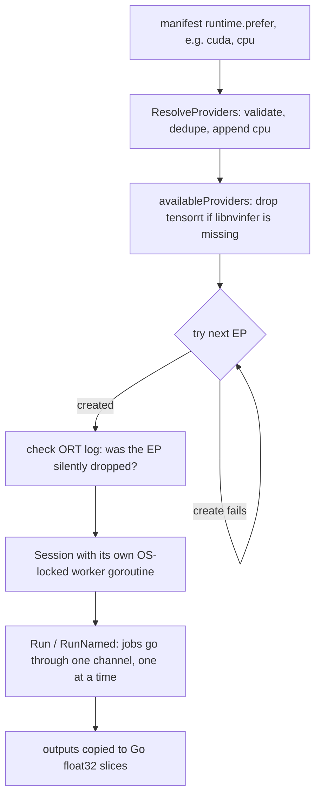

# Engine (ONNX Runtime)

VisionServe does not do the neural-network math itself. Every model is an `.onnx` file, and
[ONNX Runtime](https://onnxruntime.ai) (ORT) runs it: ORT is a C++ library, called from Go through
the `yalue/onnxruntime_go` binding. The engine package (`internal/engine`) is the thin layer around
that binding. It creates **sessions** (one loaded graph, ready to run), passes **tensors** in and
out (a tensor is a multi-dimensional array of numbers plus its shape, e.g. `[1, 3, 560, 560]` for
one RGB image), and picks an **execution provider** for each session. An execution provider (EP)
is ORT's plug-in for a kind of hardware: CUDA for NVIDIA GPUs, CoreML for Apple, CPU everywhere.
The engine knows nothing about models, prompts or HTTP. It only has to be correct, never crash the
process, and be honest about which hardware a session really landed on.

## The picture



## Key ideas

### A session lives on one OS thread

Go schedules goroutines onto operating-system threads and moves them between threads freely. That
clashes with ORT's CUDA execution provider, which creates GPU resources (a cuBLAS and cuDNN handle
and a memory arena) *per OS thread*, lazily, the first time it sees a run on that thread. With a
plain mutex, each inference could land on a different thread and leak a new set of GPU resources,
until CUDA failed with `CUBLAS failure 3: the resource allocation failed` after a few requests.

So each `engine.Session` starts one worker goroutine, locks it to an OS thread for the session's
whole life, and funnels every ORT call (create, run, destroy) onto that thread.

```go title="internal/engine/ort.go"
func (s *Session) worker(modelPath string, providers []Provider, so SessionOptions, ready chan<- error) {
	runtime.LockOSThread()
	defer runtime.UnlockOSThread()

	sess, ep, err := func() (sess *ort.DynamicAdvancedSession, ep Provider, err error) {
		// ...
		return createORTSession(modelPath, s.inputNames, s.outputNames, providers, so)
	}()
	if err != nil {
		ready <- err
		return
	}
	s.sess = sess
	s.activeEP = ep
	ready <- nil // happens-before NewSession's return: s.sess/s.activeEP are safely published

	for fn := range s.jobs {
		fn()
	}
	s.closeErr <- s.sess.Destroy() // jobs closed by Close: destroy on the same locked thread
}
```

[View on GitHub](https://github.com/mtbui2010/vision_serve/blob/main/internal/engine/ort.go#L235-L259)

`Run` and `RunNamed` wrap the work in a closure and send it to the worker over the `jobs` channel.
Because the worker handles one job at a time, this also makes a session safe to call from many
goroutines: concurrent callers simply queue.

```go title="internal/engine/ort.go"
func (s *Session) submit(work func() ([]Tensor, error)) ([]Tensor, error) {
	// ...
	ch := make(chan result, 1)
	s.jobsMu.RLock()
	if s.closed {
		s.jobsMu.RUnlock()
		return nil, ErrClosed
	}
	s.jobs <- func() {
		var r result
		// ...
		defer func() {
			if p := recover(); p != nil {
				r = result{nil, recoverJob(p)}
			}
			ch <- r
		}()
		r.outs, r.err = work()
	}
	s.jobsMu.RUnlock()
	// Work accepted before Close still runs: the worker drains jobs before destroying the session.
	r := <-ch
	return r.outs, r.err
}
```

[View on GitHub](https://github.com/mtbui2010/vision_serve/blob/main/internal/engine/ort.go#L476-L505)

Two safety details are visible here. A call after `Close` gets `ErrClosed` instead of a "send on
closed channel" panic. And a panic inside a job is recovered on the worker: the worker is not a
request goroutine, so Go's HTTP server would never catch it, and one bad call would otherwise take
the whole process down. It comes back as an error wrapping `ErrInferencePanic`.

A related guard sits in `cmd/visionserve`: at startup the binary re-executes itself once with
`GODEBUG=asyncpreemptoff=1`, because ORT and CUDA install signal handlers that crash when Go's
preemption signal arrives during a native call.

### Pools: several copies of one graph

A `SessionPool` holds N identical sessions in a buffered channel. A call borrows a free one, runs,
and puts it back, so up to N inferences run at once. Lifecycle builds pools for roles that ask for
them (MobileSAM's decoder, see [Lifecycle manager](lifecycle.md)). Both `Session` and
`SessionPool` satisfy the same interface, so the rest of the code does not care which it holds:

```go title="internal/engine/pool.go"
type Runnable interface {
	Run(inputs []Tensor) ([]Tensor, error)
	RunNamed(inputs map[string]Tensor) ([]Tensor, error)
	InputNames() []string
	OutputNames() []string
	ActiveEP() Provider
	Close() error
}
```

[View on GitHub](https://github.com/mtbui2010/vision_serve/blob/main/internal/engine/pool.go#L7-L14)

### The tensor type

`engine.Tensor` is a plain Go struct, independent of ORT: a flat slice plus a shape. Inputs are
`float32` (image pixels) or `int64` (token ids and attention masks for text models such as
GroundingDINO). Outputs are always read back as `float32` and copied into Go memory, so the ORT
values can be freed right away.

```go title="internal/engine/tensor.go"
type Tensor struct {
	Data    []float32
	DataI64 []int64 // used when Dtype == "i64"
	Shape   []int64
	Dtype   string // "" or "f32" => float32; "i64" => int64
}
```

[View on GitHub](https://github.com/mtbui2010/vision_serve/blob/main/internal/engine/tensor.go#L8-L13)

`Run` binds inputs by position; `RunNamed` binds them by name, which is what pipeline models use
(the SAM decoder has six inputs whose order is not obvious).

### Execution providers and the fallback chain

Each manifest lists the EPs to try in `runtime.prefer`. Every shipped manifest says
`prefer: [cuda, cpu]`. `ResolveProviders` validates the list against an allowlist (`tensorrt`,
`cuda`, `coreml`, `directml`, `openvino`, `cpu`), removes duplicates, and always appends `cpu`, so
every model can run somewhere. The environment variable `VISIONSERVE_EP` (comma-separated, e.g.
`VISIONSERVE_EP=cpu`) replaces the manifest's list for every model; it is meant for benchmarking.

```go title="internal/engine/provider.go"
func ResolveProviders(prefer []string) ([]Provider, error) {
	// ...
	if ov := strings.TrimSpace(os.Getenv("VISIONSERVE_EP")); ov != "" {
		prefer = strings.Split(ov, ",")
	}

	seen := map[Provider]bool{}
	out := make([]Provider, 0, len(prefer)+1)
	for _, p := range prefer {
		pv := Provider(strings.ToLower(strings.TrimSpace(p)))
		// ...
		if !validProviders[pv] {
			return nil, fmt.Errorf("engine: invalid execution provider %q (valid: tensorrt, cuda, coreml, directml, openvino, cpu)", p)
		}
		// ...
	}
	if !seen[ProviderCPU] {
		out = append(out, ProviderCPU) // final fallback
	}
	return out, nil
}
```

[View on GitHub](https://github.com/mtbui2010/vision_serve/blob/main/internal/engine/provider.go#L103-L132)

At session creation the engine tries one EP at a time, in order. An EP can fail in two ways, and
both move on to the next one:

- **Append fails**: this ORT build does not ship the EP (CUDA on a CPU-only build). The EP is
  skipped. Ignoring the error instead is how a CPU run once reported `gpu:0`.
- **Create fails**: the EP is there but cannot handle this particular graph (TensorRT rejecting
  the MobileSAM decoder's `orig_im_size` input, for example).

Because CPU is always last, a session is always created unless the graph itself is broken. ORT
prints red error lines while it fails over; they are captured and hidden when a later EP succeeds,
and printed if every EP fails.

### Being honest about the device

There is a third, quieter failure: ORT accepts the CUDA EP, creates the session without error, and
then runs it on the CPU anyway, typically because `libcudnn` is missing from `LD_LIBRARY_PATH`. The
only evidence is a line in ORT's own log. The engine therefore captures stderr while a non-CPU
session is created and looks for that evidence:

```go title="internal/engine/ort.go"
func epWasDropped(ortOutput string) bool {
	if ortOutput == "" {
		return false
	}
	s := strings.ToLower(ortOutput)
	for _, marker := range []string{
		"failed to load library", // provider .so missing a dependency (libcudnn, libnvinfer)
		"falling back to cpuexecutionprovider",
		"failed to create cudaexecutionprovider",
		"failed to create tensorrtexecutionprovider",
	} {
		if strings.Contains(s, marker) {
			return true
		}
	}
	return false
}
```

[View on GitHub](https://github.com/mtbui2010/vision_serve/blob/main/internal/engine/ort.go#L589-L605)

If it matches, the engine logs a warning and records the session as CPU. The binding offers no
logging callback, so the capture briefly redirects the process's stderr (file descriptor 2). Only
lines in ORT's log format are held back; everything else passes straight through. Captures are
serialized by a lock, and CPU sessions skip the capture entirely, so CPU-only hosts load models in
parallel.

The EP that won becomes the `device` string in every response:

```go title="internal/engine/provider.go"
func DeviceString(ep Provider) string {
	switch ep {
	case ProviderTensorRT:
		return "gpu:0+trt"
	case ProviderCUDA, ProviderCoreML, ProviderDirectML:
		return "gpu:0"
	case ProviderOpenVINO:
		return "openvino:0"
	default:
		return "cpu"
	}
}
```

[View on GitHub](https://github.com/mtbui2010/vision_serve/blob/main/internal/engine/provider.go#L37-L48)

Each session falls back on its own, so a multi-session model can end up split. If its roles agree,
`device` is that one value; otherwise it names every role, e.g.
`mixed(decoder=cpu,encoder=gpu:0)`. A pool whose copies landed on different EPs (one decoder copy
ran out of GPU memory) reports `mixed(cpu,gpu:0)`. Set `VISIONSERVE_TRACE=1` to see every EP
attempt in the log.

### TensorRT is opt-in

TensorRT is NVIDIA's graph compiler. ORT can use it as an EP, and it is the fastest option on
NVIDIA hardware, but it is not in any shipped manifest's default chain. On GroundingDINO, measured
with the same weights on the held-out-names protocol, it was about 1.5× faster (104 ms vs 153 ms)
but lost 6.83 mAP on the unseen names and dropped 243 boxes. It also compiles a new engine for
every new prompt length, and the first compile of a transformer graph takes minutes
(GroundingDINO about 155 s on an A6000). The accuracy numbers quoted in the manifests were measured
on CUDA, so the default stays on CUDA (BUGS_TO_FIX.md #3). TensorRT is therefore opt-in: a
manifest can list `tensorrt` in `runtime.prefer`, and a process-wide opt-in switch is being added.
Do not make it a default again without re-measuring accuracy under it.

When TensorRT is requested, the engine first checks that `libnvinfer.so.10` exists (loading the
TensorRT provider without it aborts the process in C, which Go cannot recover from), and skips the
EP if it is absent. Compiled engines are cached on disk under `$VISIONSERVE_TRT_CACHE`, or
`~/.visionserve/trt-cache` by default, in one directory per weights file: two fine-tunes of the same
architecture produce colliding cache names in ORT, and sharing a cache once made a 22-class model
silently serve a 17-class model's head.

### Deterministic GPU kernels (opt-in)

Some CUDA kernels add numbers in an order that depends on what else the GPU is doing. In the
MobileSAM encoder, that made about one run in 60 differ in the last bit under concurrent load,
which flipped a few boundary pixels of the mask. `VISIONSERVE_DETERMINISTIC=1` asks ORT for
deterministic kernels on every GPU session:

```go title="internal/engine/deterministic.go"
func applyDeterministic(opts *ort.SessionOptions, ep Provider) {
	if ep == ProviderCPU || !deterministicRequested() {
		return
	}
	err := setDeterministic(opts)
	if err != nil {
		deterministicFailed.Do(func() {
			fmt.Fprintf(os.Stderr, "engine: could not enable deterministic GPU kernels (%v); "+
				"GPU results may differ in the last bits between runs\n", err)
		})
		return
	}
	// ...
}
```

[View on GitHub](https://github.com/mtbui2010/vision_serve/blob/main/internal/engine/deterministic.go#L107-L122)

No latency cost was measurable, but the deterministic kernels round differently, so turning it on
shifts GPU outputs once (GroundingDINO scores by up to about 0.002, held-out mAP by up to 0.22). It
is off by default so served GPU outputs match the numbers quoted in the manifests. CPU sessions
are never touched; ORT's CPU kernels are already repeatable.

The Go binding does not wrap ORT's `SetDeterministicCompute`, so `deterministic_cgo.go` calls it
through ORT's C API table. That file is the only cgo in VisionServe's own code, marked `// CGO`
as the project rules require. It is not wired on Windows yet, and if the call fails the session is
still created, just non-deterministic, with one log line.

### Reading input and output names without ORT

To bind tensors by name the engine needs each graph's input and output names. ORT can report them,
but only by building a full session, which took 9–19 s for the 695 MB GroundingDINO file. An
`.onnx` file is a single protobuf message, so `onnxheader.go` walks its wire format directly: it
reads the keys and length prefixes, skips over every weight without reading it, and collects the
graph's inputs and outputs (names, shapes, element types). That takes milliseconds.

```go title="internal/engine/ort.go"
func Inspect(modelPath string) (inputs, outputs []IOInfo, err error) {
	in, out, herr := readONNXHeader(modelPath)
	if herr == nil {
		return in, out, nil
	}
	if errors.Is(herr, fs.ErrNotExist) || errors.Is(herr, fs.ErrPermission) {
		return nil, nil, fmt.Errorf("engine: failed to read I/O info from %s: %w", modelPath, herr)
	}
	// ...
	return inspectORT(modelPath)
}
```

[View on GitHub](https://github.com/mtbui2010/vision_serve/blob/main/internal/engine/ort.go#L95-L108)

A file the reader cannot parse falls back to ORT's own probe, logged once per file. Output shapes
are the ones declared in the file; a live ORT session may resolve some symbolic dimensions further,
so code that needs real output shapes reads them from `Run`'s results.

## Where in the code

!!! code "Where in the code"
    | File | Responsibility |
    |---|---|
    | `internal/engine/ort.go` | ORT init (`ORT_DYLIB_PATH`), `Session`, worker thread, EP fallback in `createSession`, `Run`/`RunNamed`, `Inspect` |
    | `internal/engine/pool.go` | `Runnable` interface, `SessionPool` |
    | `internal/engine/tensor.go` | `Tensor` (float32 / int64) |
    | `internal/engine/provider.go` | EP allowlist, `ResolveProviders`, `VISIONSERVE_EP`, `DeviceString`, mixed-device reporting |
    | `internal/engine/trt.go` | TensorRT library detection, engine cache directory and keys, the response hint |
    | `internal/engine/deterministic.go` | `VISIONSERVE_DETERMINISTIC` switch |
    | `internal/engine/deterministic_cgo.go` | the C API call (the only cgo in VisionServe's code) |
    | `internal/engine/stderr.go`, `stderr_linux.go` | capturing ORT's log lines during session creation |
    | `internal/engine/onnxheader.go` | pure-Go ONNX header reader for I/O names and shapes |
    | `cmd/visionserve/main.go` | re-exec with `GODEBUG=asyncpreemptoff=1` |

## Things to know

!!! warning "Never call ORT from another goroutine"
    All ORT calls for a session must go through `submit`, so they run on the session's own OS
    thread. Calling the binding directly from a request goroutine brings back the per-thread CUDA
    resource leak.

!!! note "A missing EP is not an error"
    If the host's ORT build lacks CUDA, or `libcudnn` cannot be found, the model still loads, on
    the CPU. Check the `device` field of a response, or run with `VISIONSERVE_TRACE=1`, to see
    where a model really runs. `ORT_DYLIB_PATH` must point at an ORT build that includes the EPs
    you want.

!!! note "Only EPs the binding exposes"
    Adding an EP means extending the allowlist in `provider.go` and the switch in `applyProvider`.
    Only providers the `yalue/onnxruntime_go` binding exposes can be wired; there is no ROCm
    binding, so AMD GPUs are reachable only through DirectML on Windows.

!!! tip "The engine never panics outward"
    Panics during session creation and inference are recovered and returned as
    `ErrInferencePanic`; use after close returns `ErrClosed`. Callers treat both as ordinary
    errors.

!!! note "Outputs are float32 only"
    Every current model outputs float32, and `runOnThread` rejects any other output type with an
    error. A model with an int64 or boolean output would need the engine extended first.
