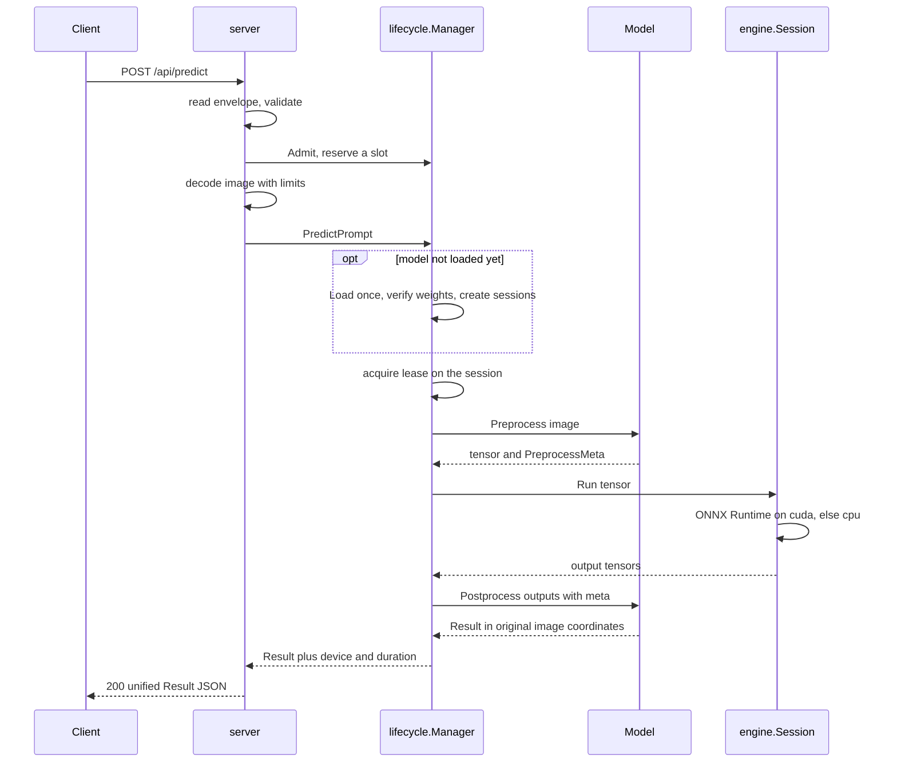
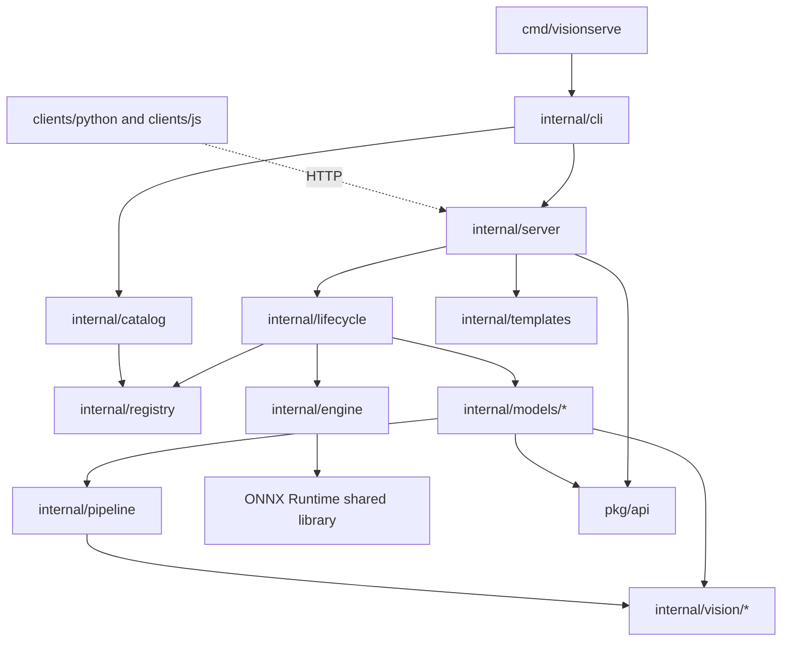

# How it works

VisionServe is one Go program that takes an image over HTTP, runs a computer-vision model on it
and answers with JSON. This section walks through how that happens, layer by layer. The short
version: an HTTP **server** decodes the request, a **lifecycle manager** makes sure the model is
loaded and that the request may run, the **model** package turns pixels into the numbers the
neural network expects (a *tensor*, a multi-dimensional array of floats), the **engine** hands
that tensor to ONNX Runtime (the library that actually runs the network, on GPU or CPU), and the
model package turns the network's raw output back into boxes, masks or labels in one shared
result format. Each layer has one job, so you can read, test or replace it on its own.

## The picture

### One request, end to end

What happens when a client sends `POST /api/predict` with `model=rf-detr` and a photo:



Prompted models (SAM, GroundingDINO, Grounded-SAM, ...) follow the same path up to the lease.
Instead of a single preprocess, run, postprocess, the model's own `Infer` drives one or several
sessions by role (for example `encoder` then `decoder`) through a `Runner` the manager gives it.
See [Models and manifests](models.md) and [Pipelines](pipelines.md).

### The packages



| Package | Role in one line |
|---|---|
| `cmd/visionserve` | `main`: blank-imports every model package so it registers itself, then calls the CLI |
| `internal/cli` | the subcommands: `serve`, `run`, `list`, `ps`, `rm`, `pull`, `convert`, `version` |
| `internal/server` | HTTP routes, request decoding, admission, limits, error-to-status mapping ([page](server.md)) |
| `internal/lifecycle` | loads models lazily, leases sessions to requests, unloads idle ones, bounds queues ([page](lifecycle.md)) |
| `internal/engine` | the only code that talks to ONNX Runtime: sessions, pools, execution providers ([page](engine.md)) |
| `internal/registry` | scans `manifest.yaml` files and rejects anything invalid, including non-permissive licenses ([page](models.md)) |
| `internal/models/*` | one package per model family: preprocess and postprocess, or a prompted `Infer` ([page](models.md)) |
| `internal/pipeline` | reusable stages (detector, rescorer, segmenter, grasp planner) that composed models are built from ([page](pipelines.md)) |
| `internal/vision/*` | the shared library: preprocessing, box geometry, masks and RLE, NMS ([page](vision.md)) |
| `internal/catalog` | `visionserve pull`: verified downloads and atomic installs ([page](catalog.md)) |
| `internal/templates` | in-memory store of example images for template-based detectors |
| `internal/extension` | extension points with no-op defaults (a `DataCollector` interface; not wired into the server yet) |
| `pkg/api` | the public wire types, above all the unified `Result` |
| `clients/` | Python and JavaScript SDKs; the Python package also holds the converter ([page](clients.md)) |

## Key ideas

### A model registers itself; core code does not change

Adding a model means adding a package under `internal/models/<name>/` that calls
`models.Register` in its `init()`, plus one blank import line in `main.go`. The server, the
lifecycle manager and the engine are never edited to add a model.

```go title="cmd/visionserve/main.go"
	// Blank-import the model packages so their init() registers a factory in the registry.
	// Adding a new model = add one import line here (do NOT modify other core code).
	_ "visionserve/internal/models/background"
	_ "visionserve/internal/models/classification"
	_ "visionserve/internal/models/clip"
	_ "visionserve/internal/models/depth"
	_ "visionserve/internal/models/detr" // rf-detr + rt-detr
	// ...
	_ "visionserve/internal/models/textalign"
```

[View on GitHub](https://github.com/mtbui2010/vision_serve/blob/main/cmd/visionserve/main.go#L12-L31)

Which network file to load, how to preprocess for it, which hardware to prefer and under which
license it is distributed is **data**, written in the model's `manifest.yaml`, not code.

### Two kinds of model, one session owner

A loaded model is a `lifecycle.Session`. For a simple model the manager runs the classic three
steps itself; for a prompted or multi-stage model it calls the model's `Infer` and hands it a
`Runner`. Either way, the ONNX sessions belong to the manager, which creates and frees them.

```go title="internal/lifecycle/session.go"
func (s *Session) Predict(img image.Image, prompt models.Prompt, now time.Time) (api.Result, error) {
	start := now
	// ...
	if s.pipeline != nil {
		res, err = s.inferPipeline(img, prompt)
	} else {
		res, err = s.predictSimple(img)
	}
```

[View on GitHub](https://github.com/mtbui2010/vision_serve/blob/main/internal/lifecycle/session.go#L128-L139)

```go title="internal/lifecycle/session.go"
func (s *Session) predictSimple(img image.Image) (api.Result, error) {
	in, meta, err := s.model.Preprocess(img)
	if err != nil {
		return api.Result{}, err
	}
	outs, err := s.engine.Run([]engine.Tensor{in})
	if err != nil {
		return api.Result{}, err
	}
	return s.model.Postprocess(outs, meta)
}
```

[View on GitHub](https://github.com/mtbui2010/vision_serve/blob/main/internal/lifecycle/session.go#L193-L203)

`meta` (a `PreprocessMeta`) records how the image was resized and padded, so `Postprocess` can
map every box back from the network's input frame to the original photo.

### One result format for every task

Detection, segmentation, depth, classification, embeddings and grasps all come back in the same
`api.Result`. A client never needs a per-model parser.

```go title="pkg/api/types.go"
type Result struct {
	Task            Task             `json:"task"`
	Model           string           `json:"model"`
	Device          string           `json:"device,omitempty"` // "cpu" | "gpu:0" | "gpu:0+trt"
	Hint            string           `json:"hint,omitempty"`   // setup recommendation (e.g. install TRT)
	Detections      []Detection      `json:"detections,omitempty"`
	Masks           []Mask           `json:"masks,omitempty"`
	Grasps          []Grasp          `json:"grasps,omitempty"`
	Classifications []Classification `json:"classifications,omitempty"` // top-K class predictions
	Embeddings      [][]float32      `json:"embeddings,omitempty"`      // one embedding vector per image/input
	DepthMap        []float32        `json:"depth_map,omitempty"`       // row-major HxW relative depth
	DepthWidth      int              `json:"depth_width,omitempty"`
	DepthHeight     int              `json:"depth_height,omitempty"`
	DurationMs      float64          `json:"duration_ms"`
	// ...
}
```

[View on GitHub](https://github.com/mtbui2010/vision_serve/blob/main/pkg/api/types.go#L21-L44)

### Hardware: a fallback chain that always ends on CPU

ONNX Runtime runs a network through an *execution provider* (EP): CUDA for NVIDIA GPUs, CoreML
on Apple Silicon, DirectML on Windows, OpenVINO on Intel, or plain CPU. Each manifest lists the
providers it prefers; every shipped manifest says `[cuda, cpu]`. The engine always appends CPU,
so a model runs even on a machine without the GPU libraries. TensorRT is supported but opt-in;
the [engine page](engine.md) explains why it is not the default.

```go title="internal/engine/provider.go"
	if !seen[ProviderCPU] {
		out = append(out, ProviderCPU) // final fallback
	}
	return out, nil
```

[View on GitHub](https://github.com/mtbui2010/vision_serve/blob/main/internal/engine/provider.go#L199-L202)

### Only permissive licenses get in

The registry refuses to load a manifest whose `license` is not on a short allowlist. AGPL models
(Ultralytics YOLO, FastSAM, YOLO-World) are refused on purpose: one AGPL model would pull the
whole project, and everyone who ships it, under AGPL.

```go title="internal/registry/manifest.go"
var licenseAllowlist = map[string]string{
	"apache-2.0":   "Apache-2.0",
	"mit":          "MIT",
	"bsd-3-clause": "BSD-3-Clause",
	"bsd-2-clause": "BSD-2-Clause",
}
```

[View on GitHub](https://github.com/mtbui2010/vision_serve/blob/main/internal/registry/manifest.go#L29-L34)

### Design principles

- **One Go binary.** The same executable is the server and the CLI. `visionserve run` predicts
  in-process through the same code path (`server.Predict`) as the HTTP API.
- **No Python at runtime.** Python appears only offline: in the optional converter that turns
  checkpoints into ONNX files, and in the Python client. The server needs only the binary, the
  ONNX Runtime shared library (`ORT_DYLIB_PATH`) and the model files.
- **ONNX Runtime does the math.** VisionServe never implements its own neural-network kernels.
  The Go code does what is around inference: image decoding, resizing, decoding outputs, masks.
- **Permissive licenses only.** Apache-2.0, MIT, BSD, enforced by the registry, not by
  convention.
- **Local-first.** No account, no API key, no telemetry. The server listens on `127.0.0.1:11435`
  unless told otherwise. The one extension point, a data-collection hook in
  `internal/extension`, defaults to a no-op (and the server does not call it yet).
- **No panics in normal paths.** Every function returns an `error`; the server maps typed errors
  to HTTP status codes in one place.

## Where in the code

!!! code "Where in the code"
    | File | Responsibility |
    |---|---|
    | `cmd/visionserve/main.go` | entry point; blank imports register every model package |
    | `internal/cli/root.go` | subcommand dispatch (`serve`, `run`, `list`, `ps`, `rm`, `pull`, `convert`, `version`) |
    | `internal/server/server.go` | HTTP routes and listen address |
    | `internal/server/predict.go` | `Predict`: the model-agnostic wrapper shared by the API and `visionserve run` |
    | `internal/lifecycle/manager.go` | `Manager.PredictPrompt`: load, lease, predict |
    | `internal/lifecycle/session.go` | one loaded model: simple path vs pipeline path |
    | `internal/engine/ort.go` | ONNX Runtime sessions |
    | `internal/engine/provider.go` | execution provider allowlist and fallback chain |
    | `internal/registry/manifest.go` | manifest schema and validation, license allowlist |
    | `internal/models/model.go` | the `Model`, `PipelineModel` and `Runner` interfaces |
    | `pkg/api/types.go` | the unified `Result` and the request types |

## Things to know

!!! warning "Boxes are always in original image coordinates"
    Every `bbox` in a result is `[x, y, w, h]` (top-left corner, width, height) in the pixels of
    the image the client sent, after EXIF rotation. Never in the resized, padded frame the
    network saw. Mapping back through `PreprocessMeta` is each model's job, and it is the most
    common bug when adding one.

!!! note "Masks are column-major RLE"
    Segmentation masks are run-length encoded the COCO way: counts run down each column first,
    then across columns. The same encoder (`internal/vision/mask`) is used by every model.

!!! warning "Sessions belong to the lifecycle manager"
    An ONNX session holds hundreds of megabytes of GPU memory. Handlers and models never create
    or free one. The manager creates them on load, leases them to requests, and closes them only
    when no request is using them.

!!! tip "Where to go next"
    Follow the request in order: [HTTP server](server.md), [Lifecycle manager](lifecycle.md),
    [Engine](engine.md), [Models and manifests](models.md), then the
    [shared vision library](vision.md) and [pipelines](pipelines.md).
