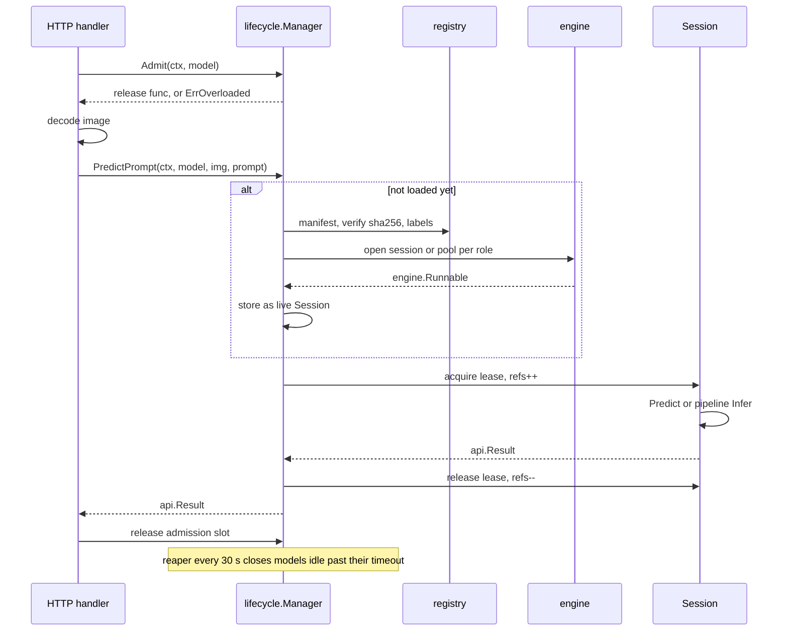

# Lifecycle manager

A model on disk is just files: an `.onnx` graph, a `manifest.yaml`, maybe a label list. Before it
can answer a request it has to be turned into one or more ONNX Runtime **sessions** (a session is
a graph loaded into memory, on the CPU or in GPU memory, ready to run). Sessions are heavy: a
GroundingDINO session holds hundreds of megabytes and can take seconds to build. The lifecycle
manager (`internal/lifecycle`) is the one place that creates, shares and frees them. It loads a
model the first time someone asks for it, lets many requests use it at once, refuses work when a
model is already swamped, and unloads it again after it has sat idle. Everything else in
VisionServe (the HTTP server, the `run` CLI) goes through it, so the rules that keep memory and
GPU usage under control live in exactly one package.

## The picture



## Key ideas

### One Manager, one live Session per model

`Manager` keeps a map from model name to a live `Session`. A `Session` bundles the model's Go code
(pre/postprocessing, see [Models and manifests](models.md)) with the ONNX sessions it needs. A
plain model has one engine session; a pipeline model (MobileSAM, GroundingDINO, Grounded-SAM, ...)
has one per **role**, such as `encoder` and `decoder`.

```go title="internal/lifecycle/manager.go"
type Manager struct {
	reg  *registry.Registry
	tmpl *templates.Store // nil = no template support

	mu   sync.Mutex
	live map[string]*Session
	// loading holds the in-progress load of each model being loaded (see Load).
	loading    map[string]*loadCall
	// ...
	admitted map[string]int
	maxQueue int
	// ...
}
```

[View on GitHub](https://github.com/mtbui2010/visionserve/blob/main/internal/lifecycle/manager.go#L31-L60)

The request entry point is `PredictPrompt`: load if needed, take a lease, run, give the lease back.

```go title="internal/lifecycle/manager.go"
func (m *Manager) PredictPrompt(ctx context.Context, name string, img image.Image, prompt models.Prompt) (api.Result, error) {
	s, release, err := m.loadAndAcquire(ctx, name)
	if err != nil {
		return api.Result{}, err
	}
	defer release()
	if err := m.resolveTemplates(&prompt); err != nil {
		return api.Result{}, err
	}
	return s.Predict(ctx, img, prompt, time.Now())
}
```

[View on GitHub](https://github.com/mtbui2010/visionserve/blob/main/internal/lifecycle/manager.go#L106-L116)

`loadAndAcquire` calls `Load` and then `acquire`, and checks `ctx` in between, so a request whose
client left during the load takes no lease.

### Cancellation

`ctx` is the request's context, which the HTTP server cancels when the client disconnects. Every
*wait* on the way to inference follows it: waiting for the model's load, for an Exclusive model's
lock, for the session's worker, or for a free copy in a pool. A request whose `ctx` ends while it
waits returns an error wrapping `ctx.Err()` and nothing is run for it. An inference already inside
ONNX Runtime is not interrupted (ORT cannot stop a run half way), but a pipeline model does not
start its next stage for a request that is gone, because each `Runner` call waits under the same
`ctx`.

### Lazy loading, one load at a time

Nothing is loaded at startup unless you pass `visionserve serve --preload a,b`. The first request
for a model builds it. If ten requests for a cold model arrive together, only the first one (the
"leader") builds; the other nine wait for it and then reuse its result. This pattern is often
called *singleflight*. Without it, every request would build its own copy, briefly using ten times
the GPU memory, and nine copies would be thrown away.

```go title="internal/lifecycle/load.go"
	for {
		if err := ctx.Err(); err != nil {
			return gaveUp(name, err)
		}
		m.mu.Lock()
		// ...
		if _, ok := m.live[name]; ok {
			m.mu.Unlock()
			return nil
		}
		call, busy := m.loading[name]
		if !busy {
			call = &loadCall{done: make(chan struct{})}
			// ...
			m.loading[name] = call
			m.mu.Unlock()
			go func() { _ = m.lead(name, call) }() // lead publishes its result in call.err
			if err := m.waitLoad(ctx, name, call); err != nil {
				return err
			}
			return call.err // this caller started the load: its result, success or failure
		}
		// ...
		call.waiters++
		m.mu.Unlock()
		if err := m.waitLoad(ctx, name, call); err != nil {
			m.mu.Lock()
			call.waiters--
			m.mu.Unlock()
			return err
		}
		// ...
	}
```

[View on GitHub](https://github.com/mtbui2010/visionserve/blob/main/internal/lifecycle/load.go#L45-L90)

The load runs on its own goroutine, owned by no request. `ctx` bounds only each caller's *wait*:
if one waiter's client leaves, even the one that started the load, that waiter returns and the
load carries on for the others. The model then goes live for the requests still waiting and for
the next one (the idle reaper unloads it if nobody comes). Only `Unload` and `Close` cancel a load.

Building a model (`buildModel`) runs the load-time checks in order: the name is in the registry
(rescanning the models directory at most once per second, so a model pulled while the server runs
is found), the weights exist, their SHA-256 matches the manifest when it pins one, the labels
load, the execution-provider chain is valid, and the `preprocess:` block resolves. A load then
checks that the tensor this preprocessing produces fits the input shape the ONNX file declares
(`checkInputShape`: a `width: 640` manifest for a `[1,3,560,560]` graph fails here, not on the
first prediction). Only then are ONNX sessions opened. If anything fails half way, the sessions already opened are closed again, so
a failed load never leaves GPU memory behind. A panic during the build is turned into an error,
because a stuck "loading" entry would make every later request for that model hang.

### Leases: never close a session under a running request

A model can be unloaded three ways: `POST /api/unload` (or `visionserve rm`), the idle reaper,
and server shutdown. Any of them can happen while a request is still running on the model. To make
that safe, every request holds a **lease**: a reference count on the `Session`.

```go title="internal/lifecycle/lease.go"
func (m *Manager) acquire(name string) (*Session, func(), error) {
	m.mu.Lock()
	s := m.live[name]
	if s == nil {
		m.mu.Unlock()
		return nil, nil, fmt.Errorf("lifecycle: model %q was just unloaded", name)
	}
	s.refs++
	m.mu.Unlock()
	s.touch(time.Now())
	return s, func() { m.release(s) }, nil
}

func (m *Manager) release(s *Session) {
	m.mu.Lock()
	s.refs--
	closeNow := s.retired && s.refs == 0
	m.mu.Unlock()
	if closeNow {
		_ = s.close()
	}
}
```

[View on GitHub](https://github.com/mtbui2010/visionserve/blob/main/internal/lifecycle/lease.go#L32-L53)

Unloading only *retires* a session: it disappears from the live map at once (new requests load a
fresh copy), but the actual close happens when the last lease is released. Before leases existed,
an unload during a request could crash the process with a "send on closed channel" panic.

An unload that arrives while the model is still *loading* marks the load cancelled; the loader
then closes what it built instead of publishing it.

### Idle unload

The reaper wakes every 30 seconds and retires every model that has no running request and has been
idle longer than its timeout.

```go title="internal/lifecycle/reaper.go"
func (m *Manager) expireIdle(now time.Time) []*Session {
	var expired []*Session
	m.mu.Lock()
	defer m.mu.Unlock()
	for name, s := range m.live {
		if s.refs == 0 && s.idleTimeout > 0 && s.idleFor(now) > s.idleTimeout {
			if r := m.retireLocked(name); r != nil {
				expired = append(expired, r)
			}
		}
	}
	return expired
}
```

[View on GitHub](https://github.com/mtbui2010/visionserve/blob/main/internal/lifecycle/reaper.go#L28-L40)

The timeout comes from the manifest (`runtime.idle_unload_seconds`, 300 in almost every shipped manifest;
`0` means never). `visionserve serve --idle-unload-seconds N` overrides it for every model: `-1`
(the default) keeps each manifest's value, `0` keeps all models resident, and `N` sets them all to
N seconds. Sessions are closed outside the manager's lock, because destroying a GPU session takes
time and that lock gates every request.

### Session pools and `PoolSizes`

One engine session runs one inference at a time (see [Engine](engine.md)). For most models that is
fine. MobileSAM's automatic mask generator, however, calls its small decoder a few hundred times
per image, and those calls are independent. A pipeline model can therefore ask for several
identical copies of a role by implementing `models.PoolSizer`; MobileSAM, Grounded-SAM, the hybrid
router with SAM, grasp and background all ask for 4 decoder copies. Lifecycle wraps them in an
`engine.SessionPool`, which hands each call to whichever copy is free.

```go title="internal/lifecycle/load.go"
func newRunnable(path string, inputNames, outputNames []string, n, threads int, providers []engine.Provider) (engine.Runnable, error) {
	if n <= 1 {
		// ...
		s, err := newEngineSession(path, inputNames, outputNames, providers, so)
		if err != nil {
			return nil, err
		}
		return s, nil
	}
	// ...
	sessions := make([]*engine.Session, 0, n)
	for i := 0; i < n; i++ {
		s, err := newEngineSession(path, inputNames, outputNames, providers, so)
		if err != nil {
			for _, c := range sessions {
				_ = c.Close()
			}
			return nil, err
		}
		sessions = append(sessions, s)
	}
	return engine.NewSessionPool(sessions), nil
}
```

[View on GitHub](https://github.com/mtbui2010/visionserve/blob/main/internal/lifecycle/load.go#L257-L292)

`VS_POOL_OVERRIDE=n` forces every role (and plain models too) to a pool of `n`. It exists for
benchmark sweeps, not for normal use.

### The `Runner`: how pipeline models reach their sessions

A pipeline model never holds an ONNX session itself. Lifecycle passes it a `Runner`, a small
gateway that runs a session by role name and reports its input and output names. The model decides
the order (encoder, then decoder; detector, then segmenter), but it cannot create, keep or close a
session.

```go title="internal/lifecycle/session.go"
type runner struct {
	ctx     context.Context
	engines map[string]engine.Runnable
}

func (r runner) Run(role string, inputs map[string]engine.Tensor) ([]engine.Tensor, error) {
	s, ok := r.engines[role]
	if !ok {
		return nil, fmt.Errorf("lifecycle: no ONNX session for role %q", role)
	}
	return s.RunNamed(r.ctx, inputs)
}
```

[View on GitHub](https://github.com/mtbui2010/visionserve/blob/main/internal/lifecycle/session.go#L250-L261)

The runner carries the request's `ctx`, so the model's `Infer` keeps its `(img, prompt, Runner)`
signature while every session call still waits under the request's context. The runner also
implements `RunInto`, which passes caller-owned output buffers through to the engine's
`RunNamedInto` (see [Engine](engine.md)).

### Exclusive models

Some pipelines must not run two requests at once on the same loaded model. GroundingDINO,
Grounded-SAM and the GroundingDINO variant of grasp implement `models.Exclusive`; lifecycle then
holds a per-model lock around the whole `Infer` call. The lock belongs to the loaded model, so two
*different* models still run side by side. (This replaced an older process-wide mutex inside the
GroundingDINO package that made unrelated models wait for each other.) The lock is a channel with
room for one token rather than a mutex, so that waiting for it can also follow the request's `ctx`.

```go title="internal/lifecycle/session.go"
func (s *Session) inferPipeline(ctx context.Context, img image.Image, prompt models.Prompt) (api.Result, error) {
	if s.exclusive {
		if err := ctx.Err(); err != nil { // a free lock must not win over a ctx already done
			return api.Result{}, gaveUp(s.name, err)
		}
		select {
		case s.inferLock <- struct{}{}:
			defer func() { <-s.inferLock }()
		case <-ctx.Done():
			return api.Result{}, gaveUp(s.name, ctx.Err())
		}
	}
	return s.pipeline.Infer(img, prompt, runner{ctx: ctx, engines: s.engines})
}
```

[View on GitHub](https://github.com/mtbui2010/visionserve/blob/main/internal/lifecycle/session.go#L123-L136)

### Admission control

When a busy model has a queue of requests waiting, each waiting request keeps its decoded image in
memory (up to about 160 MB for a 40-megapixel upload). Admission control caps how many requests a
model may hold, running plus waiting. The server calls `Admit` *before* it decodes the image, and a
refused request fails immediately with `ErrOverloaded`, which the server turns into HTTP 503 with a
`Retry-After` header (see [HTTP server](server.md)). A request whose client has already
disconnected is not admitted either.

```go title="internal/lifecycle/admission.go"
func (m *Manager) admitLimitLocked(name string) int {
	switch {
	case m.maxQueue > 0:
		return m.maxQueue
	case m.maxQueue == queueUnbounded:
		return 0
	}
	slots := 1
	if s := m.live[name]; s != nil {
		slots = s.slots()
	}
	return max(defaultMinQueue, 2*slots)
}
```

[View on GitHub](https://github.com/mtbui2010/visionserve/blob/main/internal/lifecycle/admission.go#L119-L131)

The automatic bound is `max(32, 2 × slots)`, where *slots* is the model's largest session pool (1
for a single session, and 1 for an Exclusive model whatever its pools). `VISIONSERVE_MAX_QUEUE=n`
sets a fixed bound of `n` for every model; `VISIONSERVE_MAX_QUEUE=0` turns admission control off.
Anything else is ignored with a warning. The floor of 32 is deliberately generous: an earlier bound
of 4 refused an ordinary client that sent 16 requests in parallel.

### Intra-op threads

ONNX Runtime gives every CPU session its own pool of worker threads, one per physical core by
default, and idle threads in that pool keep spinning for a while. One session per model is fine.
A pool of 4 decoder copies running at once, each with a full set of spinning threads, puts four
times the core count of busy threads on the machine. Measured end to end on CPU, ORT's default was
the slowest choice at every host size from 4 to 48 CPUs, even for a single prompted request: on a
4-core host a MobileSAM box took 1.19 s instead of 0.47 s, and automask 22.1 s instead of 6.6 s.
Outputs are identical whatever the thread count.

The lone sessions next to the pool (the SAM encoder, a detector) keep ORT's default, one thread per
physical core, which is half the logical CPUs on a machine with 2-way SMT. The pool gets the other
half, split over its sessions, and at most 3 threads each: the small SAM decoder gains nothing past
2–3 threads, and the extra ones only spin. For a pool of 4 that is 1 thread per session up to 15
CPUs, 2 at 16 and 3 from 24 on.

```go title="internal/lifecycle/load.go"
func poolIntraOpThreads(n, ncpu int, env string) (threads int, warn string) {
	heuristic := min(maxPoolThreads, max(1, ncpu/(2*max(n, 1))))
	v := strings.TrimSpace(env)
	if v == "" {
		return heuristic, ""
	}
	k, err := strconv.Atoi(v)
	switch {
	case err != nil || k < 0:
		return heuristic, fmt.Sprintf("lifecycle: ignoring VISIONSERVE_POOL_THREADS=%q (want an integer >= 0; "+
			"0 = ONNX Runtime's default) — pooled sessions get NumCPU/(2n) intra-op threads, 1 to %d", env, maxPoolThreads)
	case k > ncpu:
		return ncpu, fmt.Sprintf("lifecycle: VISIONSERVE_POOL_THREADS=%d is more than the %d logical CPUs — "+
			"capped at %d intra-op threads per pooled session", k, ncpu, ncpu)
	}
	return k, ""
}
```

[View on GitHub](https://github.com/mtbui2010/visionserve/blob/main/internal/lifecycle/load.go#L351-L367)

The rules, in order of precedence:

1. The manifest's `runtime.threads` map (role → thread count, e.g. `threads: {head: 1}`) sets the
   count for that role's sessions. It is for pipeline roles only (it needs a `files:` map) and is
   capped at the host's logical CPU count. `0` means ONNX Runtime's default. Use it for a tiny
   session that runs between a big one's calls: a 1 ms score head with its default spinning pool
   slowed a whole CPU request about 3×.
2. Otherwise each session of an n-session pool gets `NumCPU / (2n)` threads, at least 1 and at
   most 3.
   `VISIONSERVE_POOL_THREADS=k` replaces that with `k` (at most `NumCPU`); `0` restores ORT's
   default.
3. A lone session keeps ORT's default.

### Weight verification without re-hashing

When a manifest pins `sha256:` digests, every load hashes the weights and refuses a mismatch,
because the declared license is bound to the audited bytes (see
[Catalog](catalog.md)). Hashing a 695 MB file takes 3–4 s, and a model is reloaded after every idle
unload, so the registry keeps a process-wide digest cache. An entry is reused only while the file's
size, modification time, change time, device and inode are all unchanged; a file modified within
2 seconds of being hashed is not cached, since file timestamps are too coarse to tell two quick
rewrites apart.

```go title="internal/registry/verify.go"
func (c *digestCache) sha256(path string) (string, error) {
	// ...
	before, err := statFileID(abs)
	// ...
	c.mu.Lock()
	e, ok := c.entries[abs]
	c.mu.Unlock()
	if ok && e.id == before {
		return e.digest, nil
	}
	// ...
}
```

[View on GitHub](https://github.com/mtbui2010/visionserve/blob/main/internal/registry/verify.go#L527-L559)

### Preprocess without inference

`Manager.Preprocess` backs `POST /api/preprocess`. It answers "what tensor would this model
receive for this image?" without loading any session, so you can compare it against the
preprocessing a model was trained with. A mismatch there is silent and expensive: letterboxing
instead of stretching cost RF-DETR 7.35 mAP.

It must report what serving really does, not a second implementation that could drift. A plain
model's own `Preprocess` is called. A pipeline model's own `Infer` is run against a *recording*
`Runner` that captures the inputs of the first session call and then stops the pipeline:

```go title="internal/lifecycle/preprocess.go"
func (r *recordingRunner) Run(role string, inputs map[string]engine.Tensor) ([]engine.Tensor, error) {
	if r.inputs == nil {
		r.role, r.inputs = role, inputs
	}
	return nil, errCaptured
}
```

[View on GitHub](https://github.com/mtbui2010/visionserve/blob/main/internal/lifecycle/preprocess.go#L111-L116)

### Explain (heatmaps)

`Manager.Explain` backs `POST /api/explain`. Models whose manifest has an `explain:` block get a
second session of the same ONNX file that also exposes internal feature tensors. It is created
lazily on the first explain call, attached to the leased `Session`, and closed with it. The
detection session itself is opened with those extra outputs filtered out, so ordinary predictions
never pay for them.

The detection to explain is picked from the list a predict of the same image returns
(`detection_idx`, or the first detection of `class`). For attention maps the explain code then
finds the object query behind it. The decoder drops the queries under the threshold and sorts the
rest by confidence, so "detection 0" is usually not query 0. The query is the one whose decoded
box equals the detection's box. Score-CAM instead follows the object by class and box on each
masked re-run.

### Typed errors

Lifecycle does not know about HTTP. It wraps three sentinel errors, and the server maps them to
status codes with `errors.Is`:

```go title="internal/lifecycle/errors.go"
var (
	// ErrModelNotFound: the name is not in the registry, or its weights are missing.
	ErrModelNotFound = errors.New("model not found")
	// ErrInvalidRequest: the request itself is wrong (prompt, template, option values).
	ErrInvalidRequest = errors.New("invalid request")
	// ErrOverloaded: admission control refused the request (too many waiting for this model).
	ErrOverloaded = errors.New("model overloaded")
)
```

[View on GitHub](https://github.com/mtbui2010/visionserve/blob/main/internal/lifecycle/errors.go#L8-L15)

## Where in the code

!!! code "Where in the code"
    | File | Responsibility |
    |---|---|
    | `internal/lifecycle/manager.go` | `Manager`, `NewManager`, request entry points (`PredictPrompt`, `InferTensor`), `Close` |
    | `internal/lifecycle/load.go` | `Load` (singleflight), `buildModel` load-time checks, `newRunnable` (session or pool), thread sizing |
    | `internal/lifecycle/lease.go` | `acquire`/`release` leases, `Unload`, retiring a session |
    | `internal/lifecycle/reaper.go` | idle auto-unload loop (every 30 s) |
    | `internal/lifecycle/admission.go` | `Admit`, per-model bound, `VISIONSERVE_MAX_QUEUE` |
    | `internal/lifecycle/session.go` | one loaded model: simple or pipeline mode, `Runner`, Exclusive lock, device string |
    | `internal/lifecycle/preprocess.go` | `/api/preprocess` path and the recording `Runner` |
    | `internal/lifecycle/explain.go` | Score-CAM / attention heatmaps, lazy explain session |
    | `internal/lifecycle/errors.go` | typed errors the server maps to HTTP status |
    | `internal/registry/verify.go` | `VerifyWeights` and the SHA-256 digest cache |
    | `internal/cli/serve.go` | `--preload` and `--idle-unload-seconds` flags |

## Things to know

!!! warning "Sessions are created only here"
    An ONNX session must never be created in a handler or inside a model package. Lifecycle owns
    every session, so it can account for GPU memory, close everything on unload, and keep a
    request from losing its session mid-flight. A pipeline model only orchestrates calls through
    the `Runner`.

!!! note "The first request after an idle pause is slow"
    After `idle_unload_seconds` the model is closed, and the next request pays the full load again
    (session build, plus a weights hash if the file changed). If that matters, run
    `visionserve serve --idle-unload-seconds 0` or preload the model.

!!! note "Admission happens before decoding, not before loading"
    `Admit` only counts requests. It does not check that the model exists: an unknown name is
    admitted and then fails with 404 when `Load` cannot find it. The bookkeeping for that name is
    dropped with its last release, so made-up names do not accumulate.

!!! tip "Thread counts do not change results"
    `VISIONSERVE_POOL_THREADS` and `runtime.threads` only change speed and CPU usage. If you
    compare timings against older numbers measured before the pool cap existed, set
    `VISIONSERVE_POOL_THREADS=0`. The rule was measured on hosts of 4, 8, 16, 24 and 48 CPUs,
    emulated with `taskset` on one Xeon; the table is in docs/architecture.md. When you emulate a
    small host that way, note that Go's `NumCPU` follows the affinity mask but ONNX Runtime's
    default does not: it still starts one thread per physical core of the whole machine.

!!! note "The manifest is snapshotted at load"
    A loaded `Session` keeps the manifest it was built from. If you edit `manifest.yaml` while the
    model is loaded, explain and other per-session logic keep using the old values until the model
    is unloaded and loaded again.

!!! note "A cancelled request stops waiting, not running"
    `Admit` rejects a request whose client has already left, and an admitted request stops at its
    next wait (load, Exclusive lock, session or pool slot) once its context ends. A run already
    inside ONNX Runtime finishes; its result is dropped.
