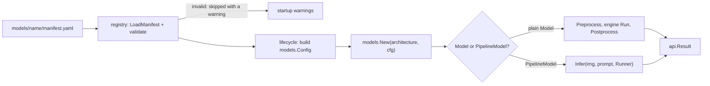

# Models and manifests

A *model* in VisionServe is two things: a folder on disk (`models/<name>/`) holding the ONNX
weights plus a small YAML file called the **manifest**, and a Go package
(`internal/models/<family>/`) that knows how to talk to that kind of network. The manifest says
*what* the model is (its task, its license, which files it needs, how big its input image is);
the Go package says *how* to turn a photo into numbers the network accepts and how to turn the
network's raw output back into boxes, masks or labels. Keeping the two apart is what lets the
community add a model without touching the server: a new network family is one new package, and
a fine-tuned copy of an existing family is just a new folder with a manifest. The
`internal/registry` package reads and checks the manifests; `pkg/api` defines the one result
format every model returns.

## The picture



## Key ideas

### Two kinds of model

Every model satisfies a tiny `Base` interface (`Name()` and `Task()`). On top of that it is one
of two kinds, and the lifecycle manager checks which one at run time to pick the code path.

A **plain `Model`** has exactly one ONNX graph and no prompt. It only does the two parts that
differ between architectures: *preprocess* (photo to input tensor; a tensor is just a
multi-dimensional array of numbers) and *postprocess* (output tensors to a `Result`). It never
runs the network itself.

```go title="internal/models/model.go"
type Model interface {
	// Name identifies the model (matches the directory / manifest name).
	Name() string
	// ...
	Task() Task
	// ...
	InputName() string
	OutputNames() []string
	// ...
	Preprocess(img image.Image) (engine.Tensor, PreprocessMeta, error)
	// ...
	Postprocess(outs []engine.Tensor, meta PreprocessMeta) (Result, error)
}
```

[View on GitHub](https://github.com/mtbui2010/vision_serve/blob/main/internal/models/model.go#L46-L65)

The lifecycle manager glues those two calls around the engine. This is the whole "simple" path:

```go title="internal/lifecycle/session.go"
func (s *Session) predictSimple(img image.Image) (api.Result, error) {
	in, meta, err := s.model.Preprocess(img)
	if err != nil {
		return api.Result{}, err
	}
	outs, err := s.engine.Run([]engine.Tensor{in})
	if err != nil {
		return api.Result{}, err
	}
	return s.model.Postprocess(outs, meta)
}
```

[View on GitHub](https://github.com/mtbui2010/vision_serve/blob/main/internal/lifecycle/session.go#L193-L203)

A **`PipelineModel`** is for anything that needs a *prompt* (a box, a point or a text phrase)
and/or chains several ONNX graphs. MobileSAM, for example, runs an image encoder once and then a
small mask decoder per prompt. Such a model lists the **roles** it needs (`encoder`, `decoder`,
`gdino`, ...) and drives the calls itself through a `Runner`, which looks up the session for a
role. The sessions still belong to the lifecycle manager: the model can call them but never
creates or closes them.

```go title="internal/models/model.go"
type Runner interface {
	// Run executes the session registered under role, binding inputs by name.
	Run(role string, inputs map[string]engine.Tensor) ([]engine.Tensor, error)
	// ...
	InputNames(role string) []string
	// ...
	OutputNames(role string) []string
}

// ...

type PipelineModel interface {
	Base
	// Roles lists the session keys this model needs; each must exist in Config.Files.
	Roles() []string
	// Infer runs the full pipeline and returns the unified Result.
	Infer(img image.Image, prompt Prompt, r Runner) (Result, error)
}
```

[View on GitHub](https://github.com/mtbui2010/vision_serve/blob/main/internal/models/model.go#L227-L277)

Two optional interfaces let a pipeline ask the runtime for a concurrency policy instead of
implementing one itself:

```go title="internal/models/model.go"
type Exclusive interface {
	Exclusive() bool
}
// ...
type PoolSizer interface {
	PoolSizes() map[string]int
}
```

[View on GitHub](https://github.com/mtbui2010/vision_serve/blob/main/internal/models/model.go#L249-L262)

- `Exclusive() == true` makes the lifecycle hold a per-loaded-model lock around `Infer`
  (GroundingDINO and Grounded-SAM use it; grasp only in its GroundingDINO-detector variant).
- `PoolSizes()` asks for several identical copies of a role's session, so that many calls can
  run at once. MobileSAM asks for 4 decoders, which its automatic mask generator drives in
  parallel. See [lifecycle.md](lifecycle.md) for how pools and locks are applied.

### Prompts and per-request options

A `models.Prompt` carries the prompt content plus every per-request option, because `Infer` only
receives `(img, prompt, runner)`. Boxes and points are in **original image** pixels.

```go title="internal/models/model.go"
type Prompt struct {
	Text   string
	Boxes  [][4]float64
	Points []Point
	// ...
	ROI [4]float64
```

[View on GitHub](https://github.com/mtbui2010/vision_serve/blob/main/internal/models/model.go#L146-L198)

Besides `Text`, `Boxes` and `Points` it holds the size filter (`MinSize`/`MaxSize`), grasp
gripper bounds, GroundingDINO thresholds, background-model knobs, the automask `GridSize`, a
`Method` selector, textalign's `ClaimThresh`/`CropTemp`, an external depth map, and a template
set name for one-shot detection. A zero value always means "use the manifest or model default".
Plain models ignore the prompt. `ROI` and `Dilate` are applied by the HTTP layer around the
model; models never see them.

When a caller gets the prompt wrong (no text for an open-vocabulary model, an unknown template),
the model wraps the error with `BadPrompt`. The server then answers HTTP 400 instead of 500:

```go title="internal/models/prompt.go"
var ErrBadPrompt = errors.New("invalid prompt")
// ...
func BadPrompt(err error) error { return badPrompt{err} }
```

[View on GitHub](https://github.com/mtbui2010/vision_serve/blob/main/internal/models/prompt.go#L87-L91)

### Registering a model family

Each family package registers a *factory* (a function that builds the model from its config)
under an **architecture name** in its `init()` function. Go runs `init()` automatically when the
package is imported.

```go title="internal/models/detr/detr.go"
func init() {
	models.Register("rf-detr", NewRFDETR)
	models.Register("rt-detr", NewRTDETR)
}
```

[View on GitHub](https://github.com/mtbui2010/vision_serve/blob/main/internal/models/detr/detr.go#L24-L27)

The only line outside the package that changes is a *blank import* in the binary's entry point,
which pulls the package in so its `init()` runs:

```go title="cmd/visionserve/main.go"
	// Blank-import the model packages so their init() registers a factory in the registry.
	// Adding a new model = add one import line here (do NOT modify other core code).
	_ "visionserve/internal/models/background"
	// ...
	_ "visionserve/internal/models/detr" // rf-detr + rt-detr
	// ...
	_ "visionserve/internal/models/textalign"
```

[View on GitHub](https://github.com/mtbui2010/vision_serve/blob/main/cmd/visionserve/main.go#L12-L31)

`models.Register` panics on a duplicate name. That is the one deliberate panic: it can only
happen at program start, as a programming mistake, never while serving a request.

At load time the manifest's `architecture:` field (or its `name:` when `architecture:` is
absent) selects the factory, so many manifests can share one family: `rf-detr`, `rfdetr-small`
and a fine-tuned detector all use the `rf-detr` factory with different weights and labels.

### Anatomy of a manifest

This is the shipped MobileSAM manifest, a two-session prompted model:

```yaml title="models/mobile-sam/manifest.yaml"
name: mobile-sam
task: segmentation
license: Apache-2.0
architecture: mobile-sam
# ...
source_url: https://huggingface.co/Acly/MobileSAM/
sha256:
  encoder: 580f5fb648ea1062c0aabc26217aed56921985f03f0cbbd852bba81d760cc749
  decoder: 93915fc7c993ab9d59ab8c9ccd3bce37f7509c81ab4150a74abd4d2abbd8570d

files:
  encoder: mobile_sam_encoder.onnx
  decoder: mobile_sam_decoder_single.onnx

input:
  # Reference only — the encoder's resize/normalize/pad happen in the graph + in Go.
  width: 1024
  height: 1024
  layout: NHWC
  letterbox: false

postprocess:
  type: sam        # mask threshold = logit > 0; mask encoded as column-major RLE

runtime:
  prefer: [cuda, cpu]
  idle_unload_seconds: 300
```

[View on GitHub](https://github.com/mtbui2010/vision_serve/blob/main/models/mobile-sam/manifest.yaml#L4-L32)

| Field | What it means |
|---|---|
| `name` | The model's name in the registry and its folder name. |
| `task` | One of `detection`, `segmentation`, `open_vocab`, `depth`, `classification`, `embed`, `grasp`, `instance_detection`. |
| `license` | **Required.** Must be on the permissive allowlist (below). |
| `architecture` | Which registered factory builds it. Defaults to `name`. |
| `model_file` or `files:` | One ONNX file, or a map **role → file** for multi-session models. Each role in `files:` becomes one session. |
| `sha256`, `sha256_files`, `source_url` | Optional pins binding the declared license to exact bytes and an audited origin (see [catalog.md](catalog.md)). |
| `input:` / `preprocess:` | How the photo becomes the input tensor: size, resize mode, mean/std. `input.*` is the older spelling; `preprocess:` is the newer block (see [vision.md](vision.md)). Every shipped manifest still uses `input.*`. |
| `postprocess:` | Decode settings: `box_format`, `conf_threshold`, `text_threshold` (GroundingDINO), `max_detections`. |
| `labels` | A text file, one class name per line, in the network's output order. |
| `runtime.prefer` | The execution-provider chain to try, e.g. `[cuda, cpu]`. CPU is always appended last. Every shipped manifest uses `[cuda, cpu]`; TensorRT is opt-in (see [engine.md](engine.md)). |
| `runtime.idle_unload_seconds` | Unload after this many idle seconds (`0` = never). |
| `runtime.threads` | Optional map role → ONNX Runtime intra-op threads for that role. |
| `explain`, `instance`, `detector`/`segmenter`, `grasp` | Optional blocks for heatmaps, one-shot template detection and the grasp pipeline. |

`runtime.threads` exists for a small session that runs between a big one's calls. The fast-path
router pins its tiny distilled head to one thread:

```yaml title="models/rfdetr-gdino-fastpath/manifest.yaml"
runtime:
  prefer: [cuda, cpu]
  idle_unload_seconds: 0
  # The head is a ~1 ms graph that runs between the detector's calls. With ORT's default thread
  # pool (one spinning thread per core) it slowed CPU requests from ~1.83 s to ~2.30 s (median,
  # 2026-10-04, 8 interleaved rounds); outputs are bit-identical either way.
  threads:
    head: 1
```

[View on GitHub](https://github.com/mtbui2010/vision_serve/blob/main/models/rfdetr-gdino-fastpath/manifest.yaml#L74-L81)

The full field list is in the [manifest reference](../reference/manifest.md).

### What the registry checks

`registry.Scan` walks `models/*/manifest.yaml`. A manifest that fails validation is skipped and
reported as a warning; it never crashes the server. Folders whose name starts with a dot
(install staging, backups) are ignored.

```go title="internal/registry/registry.go"
		m, mErr := LoadManifest(mpath)
		if mErr != nil {
			warns = append(warns, mErr)
			continue
		}
```

[View on GitHub](https://github.com/mtbui2010/vision_serve/blob/main/internal/registry/registry.go#L59-L63)

The license check is the first rule that matters. The allowlist is keyed by the lowercased SPDX
id, so `apache-2.0` copied from a HuggingFace model card is accepted and stored back as
`Apache-2.0`. Anything else, AGPL in any spelling included, is refused:

```go title="internal/registry/manifest.go"
var licenseAllowlist = map[string]string{
	"apache-2.0":   "Apache-2.0",
	"mit":          "MIT",
	"bsd-3-clause": "BSD-3-Clause",
	"bsd-2-clause": "BSD-2-Clause",
}
```

[View on GitHub](https://github.com/mtbui2010/vision_serve/blob/main/internal/registry/manifest.go#L29-L34)

```go title="internal/registry/manifest.go"
	canonLicense, ok := canonicalLicense(m.License)
	if !ok {
		return fmt.Errorf("license %q is not allowed — only permissive licenses accepted (Apache-2.0/MIT/BSD); AGPL is strictly forbidden", m.License)
	}
	m.License = canonLicense
```

[View on GitHub](https://github.com/mtbui2010/vision_serve/blob/main/internal/registry/manifest.go#L275-L279)

The rest of `validate()` rejects:

- a missing `name`, or one that is not a single safe path segment
  (`^[A-Za-z0-9][A-Za-z0-9._-]*$`, at most 128 characters);
- an unknown `task`;
- neither `model_file` nor `files:`;
- `sha256_files` paths that leave the model folder;
- a `preprocess:` block that contradicts its legacy `input.*` alias, or invalid input size,
  layout or resize combination;
- an unknown execution provider in `runtime.prefer`;
- `runtime.threads` keys that are not roles of `files:`, or values that are negative or not
  whole numbers (`1.5` is an error, not a guess);
- a malformed `explain:` block.

Validation is structural only. Whether the weights are on disk is checked later, so a model can
be **listed** before it is downloaded (state `not_downloaded`, then `available`, then
`loaded`). At load time the lifecycle manager additionally verifies `sha256` pins, reads the
labels, resolves the preprocessing, and calls the factory, which can still refuse a config it
cannot serve (for example a resize mode its decoder cannot map back).

### One result format for every task

All models return the same `api.Result`. There is no per-model schema.

```go title="pkg/api/types.go"
type Result struct {
	Task            Task             `json:"task"`
	Model           string           `json:"model"`
	Device          string           `json:"device,omitempty"` // "cpu" | "gpu:0" | "gpu:0+trt"
	Hint            string           `json:"hint,omitempty"`   // setup recommendation (e.g. install TRT)
	Detections      []Detection      `json:"detections,omitempty"`
	Masks           []Mask           `json:"masks,omitempty"`
	Grasps          []Grasp          `json:"grasps,omitempty"`
	Classifications []Classification `json:"classifications,omitempty"` // top-K class predictions
	Embeddings      [][]float32      `json:"embeddings,omitempty"`      // one embedding vector per image/input
	DepthMap        []float32        `json:"depth_map,omitempty"`       // row-major HxW relative depth
	DepthWidth      int              `json:"depth_width,omitempty"`
	DepthHeight     int              `json:"depth_height,omitempty"`
	DurationMs      float64          `json:"duration_ms"`
	// ...
```

[View on GitHub](https://github.com/mtbui2010/vision_serve/blob/main/pkg/api/types.go#L21-L34)

| Field | Filled by | Shape |
|---|---|---|
| `detections` | detectors, open-vocabulary detectors, face detection, OCR (text in `class`) | `{bbox: [x, y, w, h], class, conf}` |
| `masks` | segmenters, Grounded-SAM, background | `{rle, bbox, conf}` |
| `grasps` | the grasp pipeline | `{x, y, theta, width, quality, class?, conf?}` |
| `classifications` | image classifiers | ranked `{class, conf}` |
| `embeddings` | CLIP / SigLIP towers | one vector per input |
| `depth_map` | depth models | row-major `depth_height × depth_width` floats |

```go title="pkg/api/types.go"
type Detection struct {
	BBox  [4]float64 `json:"bbox"`
	Class string     `json:"class"`
	Conf  float64    `json:"conf"`
}
// ...
type Mask struct {
	RLE  string     `json:"rle,omitempty"`
	BBox [4]float64 `json:"bbox,omitempty"`
	Conf float64    `json:"conf"`
}
```

[View on GitHub](https://github.com/mtbui2010/vision_serve/blob/main/pkg/api/types.go#L54-L81)

A mask is stored as **RLE** (run-length encoding): instead of one true/false value per pixel, it
lists how many pixels in a row are background, then foreground, then background again, and so
on. VisionServe walks the image **column by column** (COCO convention), always starts with a
background run, and covers the whole original image, so a client decodes it with the image's own
width and height. Large float arrays (`depth_map`, `embeddings`) can be sent as base64 instead
of JSON numbers on request; see [server.md](server.md).

### Mapping results back to the original image

The network sees a resized (and maybe padded) copy of the photo, but every coordinate a client
receives must be in the **original** image. Preprocessing therefore returns a
`PreprocessMeta` next to the tensor: the original size plus the per-axis scale and padding,
with `input = original * scale + pad`. Postprocess inverts it. The RF-DETR decoder shows the
three steps: normalized box to input pixels, input pixels to original pixels, then clamp to the
image.

<!-- FIGURE: bbox-mapping -->

```go title="internal/models/detr/postprocess.go"
		// normalized box -> pixels on the INPUT image -> ORIGINAL image (orig = (input -
		// pad) / scale), clamped to the original image bounds.
		in := geom.NormToInput(float64(boxes.Data[bo]), float64(boxes.Data[bo+1]),
			float64(boxes.Data[bo+2]), float64(boxes.Data[bo+3]), boxFormat, m.cfg.Width, m.cfg.Height)
		bbox := geom.Clamp(toOrig.BoxToOrig(in), meta.OrigWidth, meta.OrigHeight)
```

[View on GitHub](https://github.com/mtbui2010/vision_serve/blob/main/internal/models/detr/postprocess.go#L84-L88)

`PreprocessMeta` is the same type as `preprocess.Meta`, and the mapping helpers live in the
shared vision library; see [vision.md](vision.md).

### The model families

| Package | Architecture name(s) | Kind | Task | What it is |
|---|---|---|---|---|
| `detr` | `rf-detr`, `rt-detr` | Model | detection | RF-DETR and RT-DETR: a fixed set of object queries, decoded without NMS. One decoder, two registrations. |
| `rfdetr` | (none of its own) | shim | | Forwarding package kept for its import path; blank-importing it registers `detr`. |
| `mobilesam` | `mobile-sam` | Pipeline | segmentation | MobileSAM encoder + decoder; box/point prompts, or the automatic mask generator with no prompt. Decoder pool of 4. |
| `efficientsam` | `efficient-sam` | Pipeline | segmentation | EfficientSAM (ViT-Tiny) encoder + decoder. |
| `sam2` | `sam2` | Pipeline | segmentation | SAM2-Tiny encoder + decoder; needs a box or point. |
| `nanosam` | `nano-sam` | Pipeline | segmentation | NanoSAM: ResNet-18 encoder with the SAM decoder, aimed at Jetson. |
| `groundingdino` | `grounding-dino` | Pipeline | open_vocab | Text-prompted detection, one graph, pure-Go BERT tokenizer. Exclusive. |
| `groundedsam` | `grounded-sam` | Pipeline | open_vocab | GroundingDINO boxes, then one MobileSAM mask per box. See [pipelines.md](pipelines.md). |
| `hybrid` | `rfdetr-gdino`, `gdino-siglip` | Pipeline | open_vocab | Router: RF-DETR for known class names, GroundingDINO for the rest, optional SigLIP rescoring and masks. |
| `textalign` | `rfdetr-textalign` | Pipeline | open_vocab | A small trained head that maps frozen RF-DETR query features into CLIP text space, so the vocabulary can change without re-export. |
| `owlvit` | `owlvit` | Pipeline | instance_detection | OWLv2 image-conditioned one-shot detection against registered template images. Uses NMS. |
| `scrfd` | `scrfd` | Model | detection | SCRFD face detector (InsightFace, MIT). Anchor-based, so it uses NMS. |
| `paddleocr` | `paddle-ocr` | Pipeline | detection | PP-OCRv4: DBNet text detection, then SVTR recognition per region; text goes in `class`. |
| `depth` | `depth-anything-v2`, `midas` | Model | depth | Monocular relative depth maps. |
| `classification` | `efficientnet`, `mobilenet-v3` | Model | classification | ImageNet-style top-K classifiers. |
| `clip` | `clip` (Model), `clip-text` (Pipeline) | both | embed | CLIP image and text towers sharing one embedding space; pure-Go BPE tokenizer. |
| `siglip` | `siglip-image`, `siglip-text` | Pipeline | embed | SigLIP towers, used mainly to rescore open-vocabulary crops. |
| `grasp` | `grasp` | Pipeline | grasp | Detector (optional), then MobileSAM masks, then an analytic parallel-jaw grasp planner. |
| `background` | `background` | Pipeline | segmentation | One support-surface (table/floor) mask, chosen per request: `auto` (default), `depth`, `sam`, `cv`, `automask`. |
| `promptens` | (helper) | | | Prompt-ensemble math shared by textalign and hybrid: template expansion, normalize-average-normalize, cache key. Owns no session. |
| `golden` | (tests only) | | | Golden tests that pin the exact pre/postprocess output of the non-open-vocabulary models, used to prove a refactor changed nothing. |

## Where in the code

!!! code "Where in the code"
    | File | Responsibility |
    |---|---|
    | `internal/models/model.go` | `Base`, `Model`, `PipelineModel`, `Runner`, `Exclusive`, `PoolSizer`, `Prompt`, `Config`, the factory registry (`Register`, `New`). |
    | `internal/models/prompt.go` | `ParsePrompt` (shared by CLI and HTTP), `ErrBadPrompt` / `BadPrompt`. |
    | `internal/models/meta.go` | `PreprocessMeta` (alias of `preprocess.Meta`) and `Config.PreprocessSpec()`. |
    | `internal/models/<family>/` | One package per family: factory, pre/postprocess or `Infer`, tests. |
    | `cmd/visionserve/main.go` | Blank imports that register every family. |
    | `internal/registry/manifest.go` | `Manifest` struct, `LoadManifest`, `validate()`, license allowlist. |
    | `internal/registry/preprocess.go` | The `preprocess:` block and how it merges with legacy `input.*`. |
    | `internal/registry/registry.go` | `Scan`, `Get`, `List` over `models/*/manifest.yaml`. |
    | `internal/registry/verify.go`, `ledger.go` | sha256 pins, hash cache, verified-source mode and the license provenance ledger. |
    | `internal/lifecycle/load.go` | Builds `models.Config` from a manifest and calls the factory. |
    | `pkg/api/types.go`, `pkg/api/rle.go` | The public `Result` schema and the mask RLE codec wrappers. |

## Things to know

!!! warning "Boxes are always in original-image pixels, as [x, y, w, h]"
    `Detection.BBox`, `Mask.BBox`, grasp centres and prompt boxes/points all use the original
    image's pixel grid, with `[x, y]` the top-left corner and `[w, h]` the size. Forgetting to
    map back through `PreprocessMeta` is the most common bug in a new model. Test it with a
    non-square image and a letterboxed input.

!!! warning "Only permissive licenses load"
    Apache-2.0, MIT, BSD-2-Clause and BSD-3-Clause pass; everything else, including AGPL models
    such as Ultralytics YOLO, FastSAM and YOLO-World, is rejected by the registry. A license on
    a model page is not proof: check the upstream LICENSE file before writing the manifest.

!!! warning "RF-DETR does not use NMS"
    DETR-style detectors output one prediction per object query, already de-duplicated by
    training. Applying YOLO-style non-maximum suppression to them removes correct boxes. Only
    anchor/patch detectors (SCRFD, OWLv2) call `internal/vision/nms`.

!!! note "Masks are column-major RLE over the full image"
    There is one encoder (`internal/vision/mask.EncodeRLE`); `pkg/api.EncodeMaskRLE` and every
    model delegate to it. Do not write another one; five slightly different copies existed
    before the 2026-10 refactor.

!!! note "No panics while serving"
    Model code returns errors; it does not panic. The only deliberate panic is
    `models.Register` on a duplicate name, which can only fire at startup.

!!! tip "Verify tensor shapes before writing a decoder"
    Every family's source comment records the I/O names and shapes checked against the real
    export. If you cannot verify a shape, write a stub with a `TODO`; do not guess. The RF-DETR
    decoder, for example, finds the boxes output by its last dimension being 4, not by name,
    because export names differ between releases.

!!! tip "A fine-tune needs no Go code"
    A model that keeps an existing architecture's inputs and outputs only needs a folder with a
    manifest (`architecture: rf-detr`), its ONNX file and its labels. `visionserve pull ./folder`
    installs it; see [catalog.md](catalog.md).
