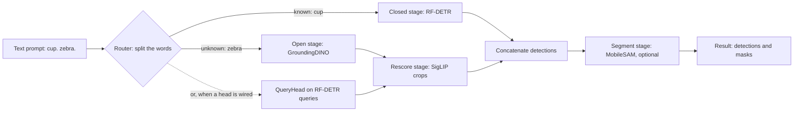

# Pipelines

Some of VisionServe's models are not one neural network but several, chained. Grounded-SAM finds
objects from a text prompt and then cuts out a pixel mask for each one. The hybrid router answers
"cup. zebra." by asking a fast **closed-set** detector (one trained on a fixed list of classes,
such as the 80 COCO classes) about "cup", and a slower **open-vocabulary** detector (one that finds
whatever a text phrase names) about "zebra". The grasp models go from pixels to places a robot
gripper could close on. `internal/pipeline` is the small library these models are built from:
each step is a **stage** with a one-method interface, and each composite model is a
*configuration* of stages rather than a long hand-written `Infer`. Swapping one component
(SigLIP for CLIP, say) means swapping one stage. Stages never own an ONNX session: every session
belongs to the [lifecycle manager](lifecycle.md), and a stage reaches it by role name through the
request's `Runner`.

## The picture

The rfdetr-gdino router is the most complete composition. Each requested word goes to the
detector suited to it, and the two sets of answers are joined:



Grounded-SAM is the short version (Open stage, then Segment stage). The grasp pipeline is
Detector, then segmenter, then grasp planner.

## Key ideas

### Four small stage interfaces

Every stage receives a `Call`: the image, the request's options (`models.Prompt`) and the
`Runner`, which is the only way to reach a session. The interfaces are deliberately narrow:

```go title="internal/pipeline/stage.go"
type Call struct {
	Img    image.Image
	Prompt models.Prompt
	Runner models.Runner
}
// ...
type Detector interface {
	Detect(c Call, words []string) ([]models.Detection, error)
}
// ...
type Rescorer interface {
	Rescore(c Call, dets []models.Detection, words []string) ([]models.Detection, error)
}
// ...
type Segmenter interface {
	Segment(c Call, dets []models.Detection) ([]models.Mask, error)
}
// ...
type GraspPlanner interface {
	Plan(m mask.Bitmap, p models.Prompt) []api.Grasp
}
```

[View on GitHub](https://github.com/mtbui2010/visionserve/blob/main/internal/pipeline/stage.go#L31-L75)

The concrete stages wrap existing model packages instead of copying them:

| Stage | Implements | What it wraps |
|---|---|---|
| `Closed` | Detector | any plain `Model` (RF-DETR, RT-DETR): its own `Preprocess`, the session, its own `Postprocess` |
| `GDINO` | Detector | `groundingdino.Detect` (tokenizer, text-pass regime, thresholds) |
| `CropRescorer` | Rescorer | the shared `CropNamer` (SigLIP crop and text towers) |
| `SAM` | Segmenter | `mobilesam.SegmentDetections`: one box-prompted mask per detection |
| `SAMBitmaps` | BitmapSegmenter | MobileSAM masks plus their raw bitmaps, for the grasp planner |
| `AnalyticGrasp` | GraspPlanner | the pure-Go grasp search in `internal/grasp` |

A fifth, optional interface, `QueryHead`, is used only by the router's distilled fast path
(see below).

### Which model is which configuration

The registered models keep their own packages, architecture names and manifests. Each factory
wires stages into one of three compositions (`Router`, `Grounded`, `Grasp`):

| Architecture | Composition | Stages |
|---|---|---|
| `grounded-sam` | `Grounded` | GDINO, then SAM |
| `rfdetr-gdino` | `Router` | Closed + GDINO, optional CropRescorer, QueryHead, SAM |
| `gdino-siglip` | `Router` with no closed detector | GDINO + CropRescorer (required), optional SAM |
| `grasp` | `Grasp` | optional Closed or GDINO detector, SAMBitmaps, AnalyticGrasp |
| `background` | its own method switch | MobileSAM and/or MiDaS sessions, or none |
| `rfdetr-textalign` | its own `Infer` | reuses `TextEmbedder`, `LRU` and `CropNamer` from this package |

Shipped manifests built on these include `rfdetr-gdino`, `rfdetr-gdino-sam`,
`rfdetr-gdino-siglip`, `rfdetr-gdino-fastpath`, `gdino-siglip`, `gdino-siglip-sam`,
`grounded-sam`, `grasp`, `grasp-rfdetr`, `grasp-gd` and `background` (see `models/*/manifest.yaml`).

### Grounded-SAM: boxes, then masks

Grounded-SAM is detect-then-segment. GroundingDINO turns the text into boxes; MobileSAM turns
each box into a mask. The composition is twelve lines:

```go title="internal/pipeline/grounded.go"
func (g Grounded) Infer(c Call, words []string) (models.Result, error) {
	dets, err := g.Detector.Detect(c, words)
	if err != nil {
		return models.Result{}, err
	}
	if len(dets) == 0 {
		return models.Result{Detections: dets}, nil
	}
	masks, err := g.Segmenter.Segment(c, dets)
	if err != nil {
		return models.Result{}, err
	}
	return models.Result{Detections: dets, Masks: masks}, nil
}
```

[View on GitHub](https://github.com/mtbui2010/visionserve/blob/main/internal/pipeline/grounded.go#L13-L26)

The model package only declares its roles and plugs the stages in. MobileSAM's encoder runs once
per request; the decoder runs once per box, on a pool of four decoder copies so boxes are
segmented in parallel:

```go title="internal/models/groundedsam/groundedsam.go"
	return &groundedSAM{
		cfg: cfg,
		gs:  pipeline.Grounded{Detector: det, Segmenter: pipeline.SAM{Encoder: roleEncoder, Decoder: roleDecoder}},
	}, nil
}
// ...
func (m *groundedSAM) Roles() []string { return []string{roleGDINO, roleEncoder, roleDecoder} }
// ...
func (m *groundedSAM) PoolSizes() map[string]int { return map[string]int{roleDecoder: 4} }
// ...
func (m *groundedSAM) Exclusive() bool { return true }
```

[View on GitHub](https://github.com/mtbui2010/visionserve/blob/main/internal/models/groundedsam/groundedsam.go#L57-L76)

Masks come back index-aligned with the detections, and each mask carries its detection's `bbox`
and `conf`, so a client can pair them without the detections list.

### GroundingDINO: phrases, passes and the 256-token limit

A GroundingDINO prompt is a list of phrases separated by dots: `"cup. water bottle."`. Each
detection is labelled with the caller's own phrase text. Two details shape how the prompt is
run:

- **The text-pass regime.** The community ONNX export of GroundingDINO only builds the text
  attention mask for the *first* phrase, so on those weights the model runs **once per phrase**.
  The re-exported `model-fixedmask.onnx` is correct for any number of phrases, and is scored in a
  single joint pass. Which regime applies is probed from the weights at load
  (`groundingdino.JointTextPassOrSafe`); the safe per-phrase path is the default.
- **Chunking.** The graph accepts at most 256 text tokens (`MaxTextLen`), `[CLS]` and `[SEP]`
  included. In the joint regime, a long prompt is packed greedily into as few passes as fit,
  each reusing the same image tensors:

```go title="internal/models/groundingdino/groundingdino.go"
func packPhrases(pp []promptPhrase) [][]promptPhrase {
	var chunks [][]promptPhrase
	start, used := 0, 2 // [CLS] + [SEP]
	for i, p := range pp {
		cost := p.ntok + 1 // the phrase and its "."
		if i > start && used+cost > MaxTextLen {
			chunks = append(chunks, pp[start:i])
			start, used = i, 2
		}
		used += cost
	}
	return append(chunks, pp[start:])
}
```

[View on GitHub](https://github.com/mtbui2010/visionserve/blob/main/internal/models/groundingdino/groundingdino.go#L277-L289)

A single phrase too long to fit on its own is rejected up front as a bad prompt (HTTP 400),
before any pass runs. Thresholds resolve in one order for every GroundingDINO pipeline: the
request's `box_threshold` / `text_threshold`, else the manifest's, else the built-in 0.3 / 0.25
(`groundingdino.Thresholds`).

### The hybrid router: the right detector for each word

RF-DETR is fast and accurate on the classes it was trained on, but knows nothing else.
GroundingDINO can look for anything, but is slower and noisier. The router splits the prompt
word by word (`Partition`) and asks each detector only about the words it is suited to:

```go title="internal/pipeline/router.go"
	known, unknown := rt.Partition(classes)
	// ...
	pass, dets, err := rt.closedBranch(c, classes, known)
	if err != nil {
		return models.Result{}, err
	}
	if len(unknown) > 0 && rt.Head != nil {
		d, err := rt.headBranch(c, pass, unknown)
		// ...
		dets = append(dets, d...)
		unknown = nil // answered; the open detector is not consulted
	}
	if len(unknown) > 0 {
		if rt.OpenLock != nil {
			rt.OpenLock.Lock()
			defer rt.OpenLock.Unlock()
		}
		d, err := rt.openBranch(c, unknown)
		// ...
		dets = append(dets, d...)
	}
```

[View on GitHub](https://github.com/mtbui2010/visionserve/blob/main/internal/pipeline/router.go#L50-L77)

Some behaviour worth knowing:

- An **empty prompt** returns everything the closed detector knows. On `gdino-siglip`, which has
  no closed detector, an empty prompt is a 400 error.
- Words are compared in one normal form (`NormClass`: lowercase, single spaces) and
  de-duplicated, so `"Dining  Table"` still routes to RF-DETR's "dining table", and `"zebra.
  zebra."` does not halve the rescored confidence.
- RF-DETR runs **at most once** per request, and only when it has something to answer.
- Only the **open answers** are rescored, and only against the words they were asked about.
  RF-DETR's detections are left on their own calibrated scale.
- Splitting the prompt is a modelling choice as well as a speed-up: GroundingDINO attends over
  the whole prompt, so removing the in-vocabulary words can move the remaining scores slightly.

**The distilled fast path.** When the manifest ships a distilled score head (`head.bin`, or the
same head as an ONNX role `files.head`), unknown words are not sent to GroundingDINO at all. The
head scores RF-DETR's own query features against the words' text embeddings, which costs a
matrix multiply instead of a second detector pass. The router requires the SigLIP rescorer
whenever a head is configured, because the head alone ranks poorly (21.53 mAP alone, 46.41 with
rescoring, per the comments in `internal/models/hybrid`).

### Rescoring with SigLIP crops: one crop namer

GroundingDINO's main failure is not wrong names but boxes on nothing. The rescorer fixes that by
looking at each box's pixels. An **embedding** is a vector of numbers that summarises an image or
a piece of text so that matching pairs point in similar directions; SigLIP has an image tower and
a text tower that produce comparable embeddings. For each detection, `CropNamer` crops the box,
embeds all crops in one batched call, compares each crop to each requested word (cosine
similarity), turns the cosines into probabilities with a softmax at temperature `T`, and rejects
crops whose best cosine is below a floor. `CropRescorer` then renames the detection and
multiplies its confidence by that probability:

```go title="internal/pipeline/cropnamer.go"
	var out []models.Detection
	for i, nm := range names {
		if nm.Word < 0 {
			continue
		}
		d := dets[i]
		d.Class = words[nm.Word]
		d.Conf *= float64(nm.P)
		out = append(out, d)
	}
	return out, nil
```

[View on GitHub](https://github.com/mtbui2010/visionserve/blob/main/internal/pipeline/cropnamer.go#L148-L158)

The effect is mostly rejection: on a background crop SigLIP is confident about no word, the
softmax flattens, and the false detection sinks. The same `CropNamer` also backs the crop head
of `rfdetr-textalign`. Each caller keeps its own temperature and floor, measured separately
(router `T = 0.05`, textalign crop head `T = 0.02`, both floor `0.0`); a request can override
the temperature with `crop_temp`. A crop tower that fails fails the request; there is no silent
fallback to unrescored detections.

### The text-embedding cache

Running the text tower costs about 4.3 ms per word. `TextEmbedder` expands each word through a
prompt ensemble ("a photo of a {}.", "a close-up photo of a {}.", ...; `internal/models/promptens`),
embeds all rows in one batched call, normalises and averages them per word, and caches the result
**per word** in a bounded, thread-safe LRU (least-recently-used) cache of 1024 entries. A new
word list only pays for its new words. The cache key is a SHA-256 digest of the templates plus
the word:

```go title="internal/pipeline/textembed.go"
func (e *TextEmbedder) Key(word string) string {
	sum := sha256.Sum256([]byte(e.tkey + "\x00" + word))
	return string(sum[:])
}
```

[View on GitHub](https://github.com/mtbui2010/visionserve/blob/main/internal/pipeline/textembed.go#L113-L116)

The tokenizer is chosen from what the text tower's directory contains (`tokenizer.json` means
SigLIP, `vocab.json` plus `merges.txt` means CLIP), so a manifest cannot claim one tokenizer
while shipping another.

### The grasp pipeline: detector, segmenter, analytic grasp

The `grasp` architecture produces planar parallel-jaw grasps: a centre `(x, y)`, an in-plane
angle `theta`, a jaw opening `width` and a `quality` score. The last stage is not a neural
network. `internal/grasp` is a pure-Go port of an analytic search: it finds the mask's boundary
normals, thins the boundary points on a polar grid, tries pairs of contact points, and keeps
pairs that pass a friction-cone (force-closure) test and fit the gripper's opening range.

```go title="internal/pipeline/grasp.go"
		dets, err := g.Detector.Detect(c, words)
		if err != nil {
			return models.Result{}, err
		}
		dets = filterDetections(dets, c.Prompt, w, h)
		// ...
		masks, bitmaps, err := g.Segmenter.SegmentBitmaps(c, boxes)
		if err != nil {
			return models.Result{}, err
		}
		for i := range bitmaps {
			gs := g.Planner.Plan(bitmaps[i], c.Prompt)
			if i < len(dets) {
				for j := range gs {
					gs[j].Class = dets[i].Class
					gs[j].Conf = dets[i].Conf
				}
				// ...
			}
			res.Grasps = append(res.Grasps, gs...)
		}
```

[View on GitHub](https://github.com/mtbui2010/visionserve/blob/main/internal/pipeline/grasp.go#L76-L105)

The manifest picks the detector with `detector:`:

- `grasp` (no detector): class-agnostic. With `box` prompts it segments exactly those boxes (the
  "pick the target client-side, then grasp just it" flow); otherwise MobileSAM's automatic mask
  generator masks the whole image and every mask is grasped.
- `grasp-rfdetr` (`detector: rf-detr`): class-aware; any registered plain detector works through
  the `Closed` stage.
- `grasp-gd` (`detector: grounding-dino`): class-aware for any named object; needs a text prompt.

Whenever a detector is configured, incoming `box` prompts are ignored: the detector's boxes are
the ones segmented.

The segmenter hands the planner raw bitmaps alongside the RLE-encoded masks, so the planner never
decodes the RLE again. In the class-agnostic automask case the segmenter also streams: through
`SegmentEach` (the optional `EachBitmapSegmenter` interface) each mask is size-filtered and
planned as soon as it is final, and its full-resolution bitmap is dropped. Before, every bitmap
(about 30 of 7.7 MB each at 3200×2400) was held until the last one was decoded. The masks, the
filter, the planner and the order are the same, so the grasps are byte-identical; a segmenter
that cannot stream falls back to `SegmentBitmaps`. Gripper bounds resolve as built-in default (10 to 150 px), then the
manifest, then the request (`gripper_min` / `gripper_max`). Each mask returns at most 20 grasps,
best first; this cap is separate from the detector's `max_detections`.

### Background removal: one mask, five methods

The `background` model returns a single mask of the support surface (the table or floor); the
foreground is its complement. It is not built from `pipeline` stages. It picks one of five
methods per request through the `method` field:

| Method | How | Sessions |
|---|---|---|
| `auto` (default) | `depth`, falling back to `cv` when no clear plane is found | MiDaS if declared |
| `depth` | MiDaS relative depth (or a depth map sent with the request), RANSAC plane fit in disparity, plane inliers = surface | `depth` |
| `sam` | MobileSAM prompted at six seed points in the lower frame, each its own prompt; the encoder runs once | `encoder`, `decoder` |
| `cv` | classical image processing: a large low-texture region grown from the border | none |
| `automask` | MobileSAM automatic masks (8x8 grid by default), union of the large or border-touching ones | `encoder`, `decoder` |

```go title="internal/models/background/background.go"
func (m *backgroundModel) backgroundAuto(img image.Image, prompt models.Prompt, r models.Runner) ([]bool, error) {
	if m.hasDepth {
		data, err := m.backgroundDepth(img, prompt, r)
		if err != nil {
			return nil, err
		}
		if anySet(data) {
			return data, nil
		}
		// depth found no distinct plane → fall back to cv.
	}
	return m.backgroundCV(img, prompt, r)
}
```

[View on GitHub](https://github.com/mtbui2010/visionserve/blob/main/internal/models/background/background.go#L227-L239)

A manifest may declare only the sessions it needs; asking for a method whose sessions are missing
is an error that names the missing `files:` role. `bg_max_area`, `fg_min_area` and `grid_size`
tune the mask classification for `sam` and `automask`. Like grasp, `automask` consumes MobileSAM's
masks as they become final: each one is tested and OR-ed into the union, then its bitmap is
dropped. OR does not depend on order, so the union is exactly the one built from all bitmaps at
once.

## Where in the code

!!! code "Where in the code"
    | File | Responsibility |
    |---|---|
    | `internal/pipeline/stage.go` | `Call` and the stage interfaces (Detector, Rescorer, Segmenter, BitmapSegmenter, EachBitmapSegmenter, GraspPlanner) |
    | `internal/pipeline/closed.go` | `Closed` detector stage over any plain `Model`; `ClosedPass` keeps DETR query features for a head |
    | `internal/pipeline/gdino.go` | `GDINO` detector stage; `TextPhrases` splits a prompt into phrases |
    | `internal/pipeline/sam.go` | `SAM` and `SAMBitmaps` segmenter stages over MobileSAM |
    | `internal/pipeline/grounded.go` | `Grounded` composition (detect, then segment) |
    | `internal/pipeline/router.go` | `Router` composition, word partitioning, `ParseClasses`, `NormClass` |
    | `internal/pipeline/cropnamer.go` | `CropNamer` (crop, embed, cosine, softmax, floor) and `CropRescorer` |
    | `internal/pipeline/textembed.go` | `TextEmbedder` with per-word cache; tokenizer auto-detection |
    | `internal/pipeline/lru.go` | bounded, thread-safe generic LRU |
    | `internal/pipeline/grasp.go` | `Grasp` composition and the `AnalyticGrasp` planner stage |
    | `internal/grasp/grasp.go` | pure-Go antipodal grasp search (`FromMask`) |
    | `internal/models/groundedsam/` | `grounded-sam` architecture: roles, pool size, Exclusive |
    | `internal/models/hybrid/` | `rfdetr-gdino` and `gdino-siglip`: router wiring, rescorer constants, distilled head |
    | `internal/models/grasp/` | `grasp` architecture: detector choice, planner defaults |
    | `internal/models/background/` | `background` architecture and its five methods |
    | `internal/models/groundingdino/` | GroundingDINO tokenizer, text-pass regime, chunking, thresholds |
    | `internal/models/promptens/` | prompt-ensemble templates: expand, average, cache key |
    | `internal/models/textalign/` | `rfdetr-textalign`: open-vocabulary head on frozen RF-DETR features |

## Things to know

!!! warning "Stages never own sessions"
    A pipeline lists its sessions in `Roles()` (and optional `PoolSizes()`), and the
    [lifecycle manager](lifecycle.md) creates, pools and frees them. Stages and models call
    `Runner.Run(role, inputs)` only. Never open an ONNX session inside a stage.

!!! warning "Boxes stay in original image coordinates"
    Every Detector returns `[x, y, w, h]` in **original** image pixels, and every later stage
    (rescoring crops, SAM box prompts, grasp centres) relies on that. `Closed` gets it from the
    plain model's own `Postprocess` and its `PreprocessMeta`; GroundingDINO maps its normalized
    boxes back with `pixelBox`. Masks are column-major RLE in the unified `Result`.

!!! note "Concurrency policy lives in the runtime"
    `grounding-dino`, `grounded-sam` and `grasp-gd` implement `models.Exclusive`: lifecycle runs
    one `Infer` at a time on each of those loaded models, while other models keep running. The
    router is deliberately not Exclusive. It takes a per-instance `OpenLock` only around its
    GroundingDINO section, so requests that RF-DETR or the head answer alone stay concurrent.
    This replaced an old process-wide `PipelineMu` that made unrelated models wait on each other.

!!! note "The rescorer is part of the measured contract"
    The router's temperature (0.05), the floor (0.0) and the ten-template prompt ensemble are the
    values the held-out accuracy in the manifests was measured with. A `templates.txt` next to
    the manifest overrides the ensemble; without one, the router falls back to the measured ten
    templates rather than a single generic one.

!!! tip "Bad prompts are 400s, not 500s"
    Missing text on a text-prompted pipeline, a prompt with no phrase (`" . "`), or a phrase over
    the 256-token limit return `models.BadPrompt`, which the [server](server.md) maps to HTTP 400.

!!! note "The embedding cache is bounded"
    Keys are SHA-256 digests (32 bytes) rather than the words themselves, and each embedder holds
    at most 1024 words. Long or adversarial prompts cannot grow memory without limit.
