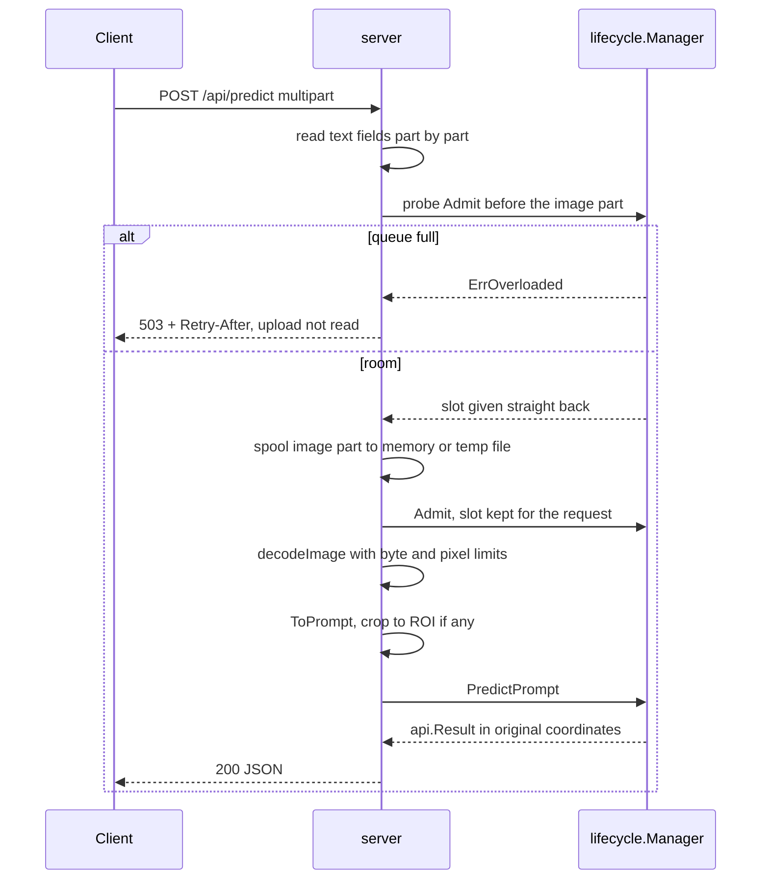

# HTTP server

The HTTP server (`internal/server`) is the front door. It turns an HTTP request into a call on
the [lifecycle manager](lifecycle.md) and turns the answer back into JSON. It does three jobs
that are easy to get wrong in a server that handles large uploads: it reads the request
envelope **without** decoding the image yet, it asks the manager for an **admission slot**
before it spends memory on pixels, and it maps every failure to the right HTTP status in **one**
place. It knows nothing about any particular model: there is no `if model == "sam"` anywhere
in this package.

## The picture

A multipart `POST /api/predict`, from the first byte to the JSON answer:



## Key ideas

### One small router, standard library only

Routes are declared with Go 1.22's method-aware `http.ServeMux`. Every route that takes an
upload is wrapped in `limitBody`, a hard cap on the whole request body.

```go title="internal/server/server.go"
func (s *Server) routes() http.Handler {
	mux := http.NewServeMux()
	mux.HandleFunc("GET /api/health", s.handleHealth)
	mux.HandleFunc("GET /api/models", s.handleModels)
	mux.HandleFunc("POST /api/load", s.handleLoad)
	mux.HandleFunc("POST /api/unload", s.handleUnload)
	// ...
	const formBody = maxImageBytes + maxTensorBytes + 1<<20
	mux.HandleFunc("POST /api/predict", limitBody(formBody, s.handlePredict))
	mux.HandleFunc("POST /api/infer_tensor", limitBody(maxTensorBytes+1<<20, s.handleInferTensor))
	mux.HandleFunc("POST /api/preprocess", limitBody(maxImageBytes+1<<20, s.handlePreprocess))
	mux.HandleFunc("POST /api/explain", limitBody(maxImageBytes+1<<20, s.handleExplain))
	mux.HandleFunc("POST /api/templates", limitBody(8*maxImageBytes, s.handleTemplateRegister))
	mux.HandleFunc("GET /api/templates", s.handleTemplateList)
	mux.HandleFunc("DELETE /api/templates/{name}", s.handleTemplateDelete)
	return logRequests(mux)
}
```

[View on GitHub](https://github.com/mtbui2010/vision_serve/blob/main/internal/server/server.go#L75-L92)

| Route | What it does |
|---|---|
| `GET /api/health` | `{"status":"ok"}` |
| `GET /api/models` | every manifest in the registry with its state: `not_downloaded`, `available` or `loaded` |
| `POST /api/load`, `POST /api/unload` | `{"model": "..."}`: load or unload now instead of waiting for the first request or the idle timer |
| `POST /api/predict` | the main endpoint: image (+ optional prompt and options) in, unified `Result` out |
| `POST /api/infer_tensor` | an already-preprocessed float32 tensor in, `Result` out (simple models only) |
| `POST /api/preprocess` | debugging: returns the exact input tensors the model would receive, without running it |
| `POST /api/explain` | a Score-CAM / attention heatmap for one detection, as a PNG overlay or raw float32 |
| `POST/GET /api/templates`, `DELETE /api/templates/{name}` | named sets of example images for template-based (`instance_detection`) models |

The default listen address is `127.0.0.1:11435`: loopback only, like Ollama, because the API has
no authentication. `--addr :11435` opens it to the network, which is what the Docker images
pass. Port 11435 avoids clashing with Ollama's 11434.

```go title="internal/server/server.go"
// DefaultAddr is the default listen address: loopback only, like Ollama. The API has no
// authentication, so it is not exposed to the network unless asked for: --addr :11435 (or
// 0.0.0.0:11435) listens on every interface, which is what the container images pass.
const DefaultAddr = "127.0.0.1:11435"
```

[View on GitHub](https://github.com/mtbui2010/vision_serve/blob/main/internal/server/server.go#L22-L25)

On a loopback address the startup log says so, so a user who cannot reach the server from another
machine sees why: `VisionServe listening on 127.0.0.1:11435 (this machine only; --addr :11435
accepts other hosts)`.

### One request type for JSON and multipart

`/api/predict` accepts either a JSON body (`image_base64`) or a multipart form (an `image` file
part). Both are decoded into the same struct, `api.PredictJSONRequest`: the multipart decoder
fills it field by field using each field's `json` tag. So a new request option is declared once
and works for JSON, multipart and the `visionserve run` CLI alike.

```go title="internal/server/request.go"
// Its option list is api.PredictJSONRequest. A multipart field and the JSON key of the same name
// are the same option by construction (formInto fills the struct by json tag), and ToPrompt is
// the one place an option becomes a model input — so a new option is one field in
// api.PredictJSONRequest plus one line in ToPrompt, for both content types and the CLI.
// ...
type Request struct {
	api.PredictJSONRequest

	data *formData // nil for a Request built in code (`visionserve run`)
}
```

[View on GitHub](https://github.com/mtbui2010/vision_serve/blob/main/internal/server/request.go#L37-L51)

`ToPrompt` is where options become a `models.Prompt`, the one value every model receives:

```go title="internal/server/request.go"
func (q *Request) ToPrompt(imgW, imgH int) (models.Prompt, error) {
	p, err := models.ParsePrompt(q.Prompt, q.Box, q.Point)
	if err != nil {
		return models.Prompt{}, badRequest(err)
	}
	p.MinSize, p.MaxSize = q.MinSize, q.MaxSize
	p.GripperMin, p.GripperMax = q.GripperMin, q.GripperMax
	p.BoxThresh, p.TextThresh = q.BoxThreshold, q.TextThreshold
	// ...
	p.ROI = roipkg.Parse(q.ROI)
	p.Dilate = q.Dilate
	p.TemplateName = q.TemplateName
```

[View on GitHub](https://github.com/mtbui2010/vision_serve/blob/main/internal/server/request.go#L157-L172)

### Admission before decoding

A compressed JPEG of a few megabytes can decode to 160 MB of pixels. If a busy model has 200
requests waiting and each holds its decoded image, the server runs out of memory. So the order
in every inference handler is: read the envelope, validate it, take an **admission slot** from
the manager, and only then decode the image.

```go title="internal/server/handlers.go"
func (s *Server) predict(w http.ResponseWriter, r *http.Request) (api.Result, string, error) {
	q, err := decodeRequest(w, r, s.admitter(r))
	if err != nil {
		return api.Result{}, "", err
	}
	defer q.Close()
	if err := q.validate(true); err != nil {
		return api.Result{}, "", err
	}
	if err := q.admit(); err != nil {
		return api.Result{}, "", err
	}

	img, err := q.decodeImage()
	// ...
	prompt, err := q.ToPrompt(img.Bounds().Dx(), img.Bounds().Dy())
	// ...
	res, err := Predict(r.Context(), s.mgr, q.Model, img, prompt)
	return res, q.Encoding, err
}
```

[View on GitHub](https://github.com/mtbui2010/vision_serve/blob/main/internal/server/handlers.go#L143-L166)

The bound itself (by default `max(32, 2 × the model's inference slots)`, tunable with
`VISIONSERVE_MAX_QUEUE`) lives in the lifecycle package; see
[Lifecycle manager](lifecycle.md). A refused request fails at once with `503` and a
`Retry-After: 1` header. It never waits in a queue.

### Multipart is read part by part, with an admission probe

A multipart body is read one part at a time instead of with `ParseMultipartForm` (which buffers
the whole form first). When the decoder reaches the first file part it cares about (`image` or
`depth`) and already knows the model name, it **probes** admission: it takes a slot and hands it
straight back. If the model's queue is full, the server answers 503 without reading or storing
the upload.

```go title="internal/server/multipart.go"
		limit, kept := keep[name]
		if !kept || d.files[name] != nil {
			continue // a file part the endpoint does not read, or a second one of a kept name
		}
		if model := value("model"); model != "" {
			if err := d.probe(model); err != nil {
				return nil, err
			}
		}
		u, err := spool(p, limit, &fileMemLeft, &memLeft)
```

[View on GitHub](https://github.com/mtbui2010/vision_serve/blob/main/internal/server/multipart.go#L210-L219)

Why a probe and not the real slot? A slot held during the upload would let a few dozen slow
clients fill a model's bound and lock everyone else out for as long as the server's
two-minute read timeout. The real slot is taken only after the whole body has been read. The
price is a small race: a slot that was free at probe time may be gone when the upload ends, and
that request gets its 503 after the upload instead of before.

!!! tip "Send `model` before `image`"
    The probe only works when the `model` field arrives before the file part. Clients that put
    the image first still work: the part is stored (in memory up to 32 MiB, the rest in a
    temporary file) and admission is checked once the form is complete.

JSON bodies are different: the model name is inside the JSON, so the whole body (capped at
32 MiB) is read before admission. Large uploads belong in multipart.

### Limits on bytes and on pixels

`decodeImage` is the only place an upload becomes pixels, so its limits cannot be forgotten by
a new handler. It caps the compressed size, then reads the declared width and height from the
image header **before** decoding. A tiny, flat PNG can declare 8000×8000 pixels.

```go title="internal/server/limits.go"
func decodeImage(r io.Reader) (image.Image, error) {
	raw, err := io.ReadAll(io.LimitReader(r, maxImageBytes+1))
	// ...
	if len(raw) > maxImageBytes {
		return nil, tooLargeError{fmt.Sprintf("image is larger than %d MiB", maxImageBytes>>20)}
	}
	cfg, _, err := image.DecodeConfig(bytes.NewReader(raw))
	// ...
	if cfg.Width <= 0 || cfg.Height <= 0 || int64(cfg.Width)*int64(cfg.Height) > maxImagePixels {
		return nil, badRequest(fmt.Errorf("image is %dx%d; the limit is %d megapixels", cfg.Width, cfg.Height, maxImagePixels/1_000_000))
	}
	// ...
	img, err := imageproc.Decode(raw)
```

[View on GitHub](https://github.com/mtbui2010/vision_serve/blob/main/internal/server/limits.go#L26-L45)

`imageproc.Decode` applies the EXIF orientation and decodes JPEG, PNG, WebP, BMP, GIF and TIFF.
A lossy WebP is converted to RGB with libwebp's own limited-range transform: the plain
`golang.org/x/image/webp` result uses JPEG's full-range one and washes colours out.

| Limit | Value | Where |
|---|---|---|
| Compressed image | 32 MiB | `maxImageBytes`, `handlers.go` |
| Decoded image | 40 megapixels | `maxImagePixels`, `limits.go` |
| Raw tensor / depth map | 128 MiB | `maxTensorBytes`, `handlers.go` |
| Depth map side | 16384 px | `maxDepthSide`, `limits.go` |
| JSON body | 32 MiB | `maxJSONBody`, `request.go` |
| Multipart parts | 1000 | `maxFormParts`, `multipart.go` |
| Automask grid | 64 × 64 | `maxGridSize`, `request.go` (larger values are clamped) |
| Whole body | per route, via `limitBody` | `server.go` |
| Read / idle timeout | 2 minutes each | `server.go` (no write timeout: a first request may wait for a model to load) |

The decoder also applies the EXIF orientation tag, so a portrait phone photo is processed the
way every image viewer shows it, and the returned boxes are in that frame.

### Typed errors, one status table

Every failure goes through `writeError`, and `statusOf` is the only function that picks a
status code. Errors carry their meaning as Go sentinel values (`lifecycle.ErrModelNotFound`,
`lifecycle.ErrOverloaded`, `lifecycle.ErrInvalidRequest`, `models.ErrBadPrompt`) that are
checked with `errors.Is`, not by matching strings.

```go title="internal/server/errors.go"
// statusOf maps an error to its HTTP status. It is the ONLY place a failure's status is chosen:
//
//	oversized body / upload            413
//	lifecycle.ErrModelNotFound         404
//	lifecycle.ErrOverloaded            503 (+ Retry-After)
//	lifecycle.ErrInvalidRequest, parse 400
//	client disconnected                499
//	anything else                      500
//
// Size comes first: a form that failed to parse BECAUSE it was too big is a 413, not a 400.
func statusOf(err error) int {
	var maxBytes *http.MaxBytesError
	var tooLarge tooLargeError
	switch {
	case errors.As(err, &maxBytes), errors.As(err, &tooLarge):
		return http.StatusRequestEntityTooLarge
	case errors.Is(err, lifecycle.ErrModelNotFound):
		return http.StatusNotFound
	case errors.Is(err, lifecycle.ErrOverloaded):
		return http.StatusServiceUnavailable
	case errors.Is(err, lifecycle.ErrInvalidRequest), errors.Is(err, models.ErrBadPrompt):
		return http.StatusBadRequest
	case errors.Is(err, errClientGone):
		return statusClientClosedRequest
	default:
		return http.StatusInternalServerError
	}
}
```

[View on GitHub](https://github.com/mtbui2010/vision_serve/blob/main/internal/server/errors.go#L60-L87)

The body is always `{"error": "..."}`. A 499 ("client closed request", borrowed from nginx)
means the client disconnected before inference started, so the server did not run the model;
nobody reads that response, it is there for the access log. The context is checked right
before inference in `Predict`, and it is passed down to the lifecycle manager, which follows it
while the request waits for the model to load, for a session or for a model's lock. A request
whose client has gone therefore does not burn GPU time, and `orClientGone` turns the manager's
"gave up waiting" error into the same 499.

### `Predict`: the shared wrapper around the model

`server.Predict` wraps every prediction with the model-agnostic steps: crop to the region of
interest (`roi`), run the model on the crop, map the results back to full-image coordinates,
apply mask dilation or erosion, then the size filter. A mask paired with a detection
(Grounded-SAM, grasp) keeps its detection's box through the dilation, so the size filter makes one
decision per object and the two lists stay index-aligned. The `visionserve run` CLI calls the same
function, so the CLI and the API cannot drift apart.

```go title="internal/server/predict.go"
func Predict(ctx context.Context, p Predictor, model string, img image.Image, prompt models.Prompt) (api.Result, error) {
	fullW, fullH := img.Bounds().Dx(), img.Bounds().Dy()
	img, rect, hasROI := cropROI(img, &prompt)
	if ctx.Err() != nil {
		return api.Result{}, errClientGone
	}
	res, err := p.PredictPrompt(ctx, model, img, prompt)
	if err != nil {
		return api.Result{}, orClientGone(ctx, err)
	}
	if hasROI {
		res = roipkg.MapResult(res, rect, fullW, fullH)
	}
	// Mask morphology (enlarge/shrink) in ORIGINAL-image terms, then size filter. A mask paired
	// with a detection keeps its box, so the filter decides once per object.
	morph.ApplyToResult(&res, fullW, fullH, prompt.Dilate)
	if prompt.MinSize > 0 || prompt.MaxSize > 0 {
		res = api.FilterBySizePct(res, prompt.MinSize, prompt.MaxSize, fullW, fullH)
	}
	return res, nil
}
```

[View on GitHub](https://github.com/mtbui2010/vision_serve/blob/main/internal/server/predict.go#L24-L44)

### Big arrays as base64 (opt-in)

A depth map or a batch of embeddings is a long list of floats. As JSON numbers a 1920×1080 depth
map took 334 ms and 21 MB; as base64 it took 56 ms and 10 MB. A request can ask for base64 with
`encoding=base64` (a field or the query string). The server then moves `depth_map` and
`embeddings` into `depth_map_base64` / `embeddings_base64` (+ `embeddings_shape`): the raw
little-endian float32 bytes, row-major. JSON numbers stay the default for compatibility.

```go title="internal/server/response.go"
func writeResult(w http.ResponseWriter, res api.Result, encoding string) {
	if encoding == api.EncodingBase64 {
		res.EncodeArraysBase64()
	}
	writeJSON(w, http.StatusOK, res)
}
```

[View on GitHub](https://github.com/mtbui2010/vision_serve/blob/main/internal/server/response.go#L33-L38)

`writeJSON` encodes the body **before** writing the status line. If a result contains a NaN
(which JSON cannot represent), the client gets a clean 500 instead of a 200 with a truncated
body.

### The other endpoints

**`/api/preprocess`** takes exactly the same request as `/api/predict` but stops before
inference. It returns the input tensors the model would receive (base64 of the raw float32 or
int64 buffer, with role, ONNX input name and shape) plus the `meta` that maps input coordinates
back to the image (`input_x = orig_x * scale_x + pad_x`). It exists for train/serve parity:
compare it with the tensor your training code builds for the same image. The
[converter](clients.md) uses it for its verification tiers.

```go title="internal/server/preprocess.go"
type preprocessResponse struct {
	Model  string            `json:"model"`
	Inputs []preprocessInput `json:"inputs"`
	// Meta maps model-input coordinates back to the original image:
	// input_x = orig_x * scale_x + pad_x. Null when the model's preprocessing has none.
	Meta *preprocessMeta `json:"meta"`
}
```

[View on GitHub](https://github.com/mtbui2010/vision_serve/blob/main/internal/server/preprocess.go#L14-L20)

**`/api/infer_tensor?model=...&shape=N,C,H,W`** takes a body of raw little-endian float32 that
is already preprocessed, skipping image decoding and preprocessing. It is meant for clients
that already hold a tensor and for benchmarking against tensor-in servers such as Triton. It
works for simple single-session models only, and any boxes it returns are in **model-input**
coordinates, because there is no original image to map back to. Everything admission needs is in
the URL, so admission happens before the body is read.

**`/api/explain`** returns a heatmap for one detection (`detection_idx`, a position in what
`/api/predict` returns for the same image, or the first detection of `class`) of a model whose
manifest has an `explain:` block: a PNG overlay by default, or raw float32 with the shape in the
`X-Heatmap-Shape` header when `format=numpy`. The `X-Explain-Detection` header carries the
explained detection as JSON. The heatmap is for that detection: lifecycle finds the model's
object query whose decoded box matches the detection's box (see
[Lifecycle manager](lifecycle.md#explain-heatmaps)), since detection 0 is usually not query 0.

**`/api/templates`** stores named sets of example images for template-based detectors
(`instance_detection` models such as OWL-ViT); a predict request then refers to a set by
`template_name`. Before decoding anything, the handler checks the pixel count of every uploaded
image against what the store may still hold, using only the image headers.

```go title="internal/server/templates.go"
	// The store's pixel bound is checked from the headers BEFORE anything is decoded: a body of
	// thousands of tiny flat 40 MP PNGs would otherwise decode hundreds of GB first.
	if room := s.tmpl.Room(name); room >= 0 {
		var px int64
		for _, fh := range files {
			w, h, err := uploadedImageSize(fh)
			if err != nil {
				return "", 0, err
			}
			if px += int64(w) * int64(h); px > room {
```

[View on GitHub](https://github.com/mtbui2010/vision_serve/blob/main/internal/server/templates.go#L41-L50)

### Graceful shutdown

On shutdown the server first drains in-flight requests, and only then releases the models. No
request ever runs on a released ONNX session.

```go title="internal/server/server.go"
func (s *Server) Shutdown(ctx context.Context) error {
	err := s.http.Shutdown(ctx)
	s.mgr.Close()
	return err
}
```

[View on GitHub](https://github.com/mtbui2010/vision_serve/blob/main/internal/server/server.go#L117-L121)

## Where in the code

!!! code "Where in the code"
    | File | Responsibility |
    |---|---|
    | `internal/server/server.go` | `Server`, routes, listen address, timeouts, graceful shutdown; the `modelRuntime` interface the handlers need from the manager |
    | `internal/server/handlers.go` | health, models, load/unload, predict, infer_tensor; `admit`; depth-map parsing |
    | `internal/server/request.go` | `Request`: one decoder for JSON and multipart, `validate`, `ToPrompt`, `formInto` |
    | `internal/server/multipart.go` | part-by-part multipart reader, admission probe, spooling to temp files |
    | `internal/server/limits.go` | `decodeImage` (byte, pixel, EXIF), `limitBody` |
    | `internal/server/errors.go` | typed request errors, `statusOf`, `writeError` |
    | `internal/server/predict.go` | `Predict`: ROI crop, map back, mask morphology, size filter (shared with `visionserve run`) |
    | `internal/server/response.go` | `writeJSON` (encode first), `writeResult` (base64 option) |
    | `internal/server/preprocess.go` | `/api/preprocess` |
    | `internal/server/explain.go` | `/api/explain` |
    | `internal/server/templates.go` | `/api/templates` |
    | `pkg/api/types.go`, `pkg/api/encoding.go` | wire types (`Result`, `PredictJSONRequest`) and the base64 array encoding |

## Things to know

!!! warning "The server never touches ONNX Runtime"
    Handlers do not create, hold or close ONNX sessions. Everything goes through
    `lifecycle.Manager` (`Admit`, `PredictPrompt`, `InferTensor`, `Preprocess`, `Explain`). The
    handlers depend on a small `modelRuntime` interface, so the handler tests drive a fake
    manager without any model files.

!!! note "Boxes in, boxes out: original image coordinates"
    Box and point prompts are given in original-image pixels, `[x, y, w, h]` for boxes. Every
    `bbox` in the answer is in the same frame (after EXIF rotation), even with a `roi`: the ROI
    crop is undone before the result leaves `Predict`. Masks are column-major RLE over the full
    image. The one exception is `/api/infer_tensor`, which has no original image.

!!! tip "A malformed number is not an error"
    In a multipart form, an optional number that does not parse (`min_size=abc`) is left at
    zero, which every option reads as "use the default". This matches how these handlers always
    behaved. A malformed prompt, box or depth map, on the other hand, is a 400.

!!! note "Known gaps"
    `PredictPrompt` waits for a free session without watching the request context, so a client
    that disconnects while queued is noticed only before inference starts. Under overload, a
    malformed multipart request can get a 503 instead of a 400, because admission is probed
    before the rest of the form is validated.

!!! warning "No authentication"
    There is no API key and no TLS. Keep the default loopback address, or put the server behind
    a reverse proxy, before exposing it on a network.
