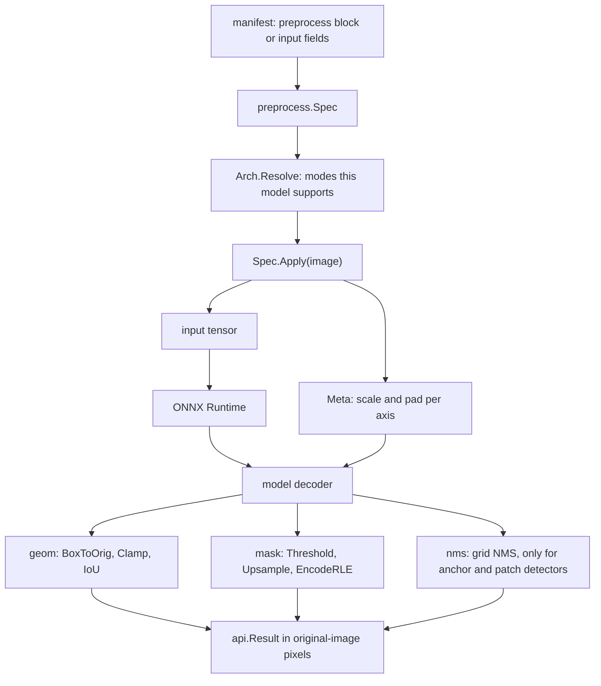

# Shared vision library

`internal/vision` is the small, pure-Go library that every model package uses for the parts
that are *not* specific to one network: turning a photo into an input tensor (`preprocess`),
mapping boxes back to the original photo (`geom`), handling binary masks and their compact text
encoding (`mask`), removing duplicate boxes (`nms`), and a few one-line helpers (`util`). Before
the 2026-10 refactor each model carried its own copy of this code, and the copies drifted: the
mask encoder existed five times, some models resized images differently from how they were
trained, and a few returned masks of the wrong size. Now there is one implementation of each
piece, tested against the reference libraries the models were trained with (PIL, HuggingFace
processors, InsightFace), so a model package only keeps what is truly its own.

## The picture



## Key ideas

### Preprocessing is data: `preprocess.Spec`

A neural network only gives correct answers when its input is prepared exactly the way it was
during training: same size, same way of fitting a non-square photo into a square input, same
color scaling. VisionServe writes that recipe down as data, a `Spec`, instead of code in each
model. The fields say how to resize, the target size, the resampling filter, the per-channel
mean and standard deviation, and the memory layout of the tensor (`NCHW` = channels first,
`NHWC`/`HWC` = channels last).

```go title="internal/vision/preprocess/spec.go"
type Spec struct {
	// Resize: the geometry; "" = the architecture's default (Arch.Resolve fills it in).
	Resize Mode
	// ...
	Width, Height int
	// ...
	MultipleOf int
	// NoUpscale: LongSide/LongSidePad never enlarge (the scale is capped at 1) — PaddleOCR's det.
	NoUpscale bool
	// CropPct: CenterCrop keeps this fraction of the resized short side (timm crop_pct, in
	// (0, 1]); 0 = 1, the whole short side (CLIP). See CenterCropSize.
	CropPct float32
	// Resample: "" = the mode's default (see Mode).
	Resample Resample
	// Mean, Std: per-channel normalisation, RGB order (see the formula above).
	Mean, Std []float32
	// NoRescale: keep pixels in 0..255 instead of dividing by 255 (HuggingFace do_rescale=False).
	NoRescale bool
	// Layout: "" = NCHW.
	Layout Layout
	// ...
	PadValue float32
	// ...
	Legacy bool
}
```

[View on GitHub](https://github.com/mtbui2010/visionserve/blob/main/internal/vision/preprocess/spec.go#L110-L143)

Each pixel value `p` (0 to 255) on color channel `c` becomes `(p/255 - mean[c]) / std[c]`.
With `NoRescale` and no mean/std the raw 0..255 value is kept (the MobileSAM encoder normalizes
inside its own graph), and with `NoRescale` plus mean/std those are in 0..255 units (SCRFD).

```go title="internal/vision/preprocess/apply.go"
func (n normalizer) value(c int, p float32) float32 {
	if n.raw {
		return p
	}
	return (p/255.0 - n.mean[c]) / n.std[c]
}
```

[View on GitHub](https://github.com/mtbui2010/visionserve/blob/main/internal/vision/preprocess/apply.go#L140-L145)

### The resize modes

Only modes that a served architecture actually uses exist, and each reproduces its upstream
recipe exactly (rounding included).

<figure markdown="span">
  { loading=lazy }
  <figcaption>One photo, prepared for five models — real tensors from /api/preprocess<br/><code>rf-detr + rf-detr-nano-letterbox + clip + depth-anything-v2 + mobile-sam</code> · the letterbox panel is an illustration: a scratch copy of rf-detr-nano set to letterbox (rf-detr-nano itself squashes, as RF-DETR is trained) · Photo: COCO val2017 #177015 (<a href="http://farm1.staticflickr.com/131/355302776_1d1215b7c1_z.jpg">Flickr</a>, CC BY 2.0)</figcaption>
</figure>

| Mode | What it does | Tensor size | Default filter | Used by |
|---|---|---|---|---|
| `squash` | Stretch to exactly width x height; the aspect ratio is not kept. | fixed | bilinear | RF-DETR, RT-DETR, MiDaS, SAM2 |
| `letterbox` | Shrink to fit inside width x height keeping the aspect ratio, center it, fill the borders with a gray level (default black). | fixed | bilinear | a manifest option; no shipped model letterboxes (RF-DETR is trained squashed, BUGS_TO_FIX.md #1) |
| `center_crop` | Resize the short side to the target, cut the centered window (HuggingFace CLIP processor). With `crop_pct` (timm) the short side goes to target / `crop_pct` first: 256 for 224 at 0.875. | fixed | bicubic | CLIP; EfficientNet, MobileNetV3 (`crop_pct: 0.875`) |
| `keep_aspect` | HuggingFace DPT "keep aspect ratio" rule, sides rounded to `multiple_of`; no crop, no pad. | varies per image | bicubic | Depth Anything V2 |
| `long_side` | Scale so the long side reaches the target; no pad. | varies per image | bilinear | MobileSAM (its graph pads) |
| `long_side_pad` | `long_side`, then pad the *normalized* tensor at the bottom/right to width x height or to a multiple of `multiple_of`. | fixed or multiples | bilinear | NanoSAM, PaddleOCR detector |
| `top_left_pad` | InsightFace SCRFD: fit by aspect ratio, paste at the top-left of a gray canvas. | fixed | bilinear | SCRFD |
| `none` | Feed the original size; the graph resizes itself. | the image's | none | EfficientSAM |

The code side is one `switch` in `Spec.Apply`. Each case resizes and records how the original
image maps into the input, for example:

```go title="internal/vision/preprocess/apply.go"
	switch s.Resize {
	case Squash:
		r := imaging.Resize(img, W, H, s.Filter())
		meta.ScaleX, meta.ScaleY = float64(W)/float64(ow), float64(H)/float64(oh)
		return s.render(r, 0, 0, W, H, W, H, 0, 0, noPad), meta, nil

	case Letterbox:
		nw, nh, scale, px, py := LetterboxSize(ow, oh, W, H)
		r := imaging.Resize(img, nw, nh, s.Filter())
		meta.ScaleX, meta.ScaleY, meta.PadX, meta.PadY = scale, scale, px, py
		return s.render(r, 0, 0, nw, nh, W, H, px, py, pixelPad), meta, nil
```

[View on GitHub](https://github.com/mtbui2010/visionserve/blob/main/internal/vision/preprocess/apply.go#L37-L47)

Resizing uses `disintegration/imaging` (pure Go, no OpenCV, no cgo), and the tensor is written
by reading the image's pixel buffer row by row rather than calling `At()` per pixel.

### Declaring it in a manifest, and the legacy `input.*` fields

A manifest can declare the spec in a `preprocess:` block. An illustrative block (not taken from
a shipped manifest):

```yaml
preprocess:
  resize: letterbox        # squash | letterbox | center_crop | keep_aspect | long_side |
                           # long_side_pad | top_left_pad | none
  size: 640                # or width: / height:
  mean: [0.485, 0.456, 0.406]
  std:  [0.229, 0.224, 0.225]
  layout: NCHW
  pad: 0                   # letterbox / top_left_pad: pixel gray level
```

Older manifests (and most shipped ones) use the legacy fields `input.width`,
`input.height`, `input.letterbox`, `input.crop`, `input.keep_aspect`, `input.multiple_of`,
`input.normalize` and `input.layout`. They are *aliases* of the block. Without a block they are
mapped like this (none of the geometry flags means `squash`):

```go title="internal/vision/preprocess/spec.go"
func FromLegacy(l LegacyFields) Spec {
	s := Spec{Width: l.Width, Height: l.Height, Mean: l.Mean, Std: l.Std,
		Layout: Layout(strings.ToUpper(strings.TrimSpace(l.Layout))), Legacy: true}
	switch {
	case l.KeepAspect:
		s.Resize, s.MultipleOf = KeepAspect, l.MultipleOf
	case l.Crop == "center":
		s.Resize = CenterCrop
	case l.Letterbox:
		s.Resize = Letterbox
	default:
		s.Resize = Squash
	}
	return s
}
```

[View on GitHub](https://github.com/mtbui2010/visionserve/blob/main/internal/vision/preprocess/spec.go#L161-L175)

When both a block and a legacy field are present, the registry
(`registry.Manifest.PreprocessSpec`) requires them to agree and refuses the manifest with an
error naming both fields otherwise. It then writes the block's values back into the empty
`input.*` fields so older code and `visionserve list` see the same thing. The exact rules are in
the [manifest reference](../reference/manifest.md).

### Each architecture says which modes it accepts: `Arch.Resolve`

A decoder can only map boxes back correctly for some modes. RF-DETR can undo a squash or a
letterbox, but not a crop (the cut-away margins have no coordinates). So each family declares an
`Arch` with its supported modes; the first is its default.

```go title="internal/models/detr/preprocess.go"
func arch(prefix string) preprocess.Arch {
	return preprocess.Arch{Name: prefix, Modes: []preprocess.Mode{preprocess.Squash, preprocess.Letterbox}}
}
```

[View on GitHub](https://github.com/mtbui2010/visionserve/blob/main/internal/models/detr/preprocess.go#L18-L20)

`Resolve` treats a declared block strictly and legacy fields leniently, so a manifest that
loaded before the refactor still loads with the same behavior:

```go title="internal/vision/preprocess/spec.go"
func (a Arch) Resolve(s Spec) (Spec, error) {
	// ...
	if s.Legacy {
		if !a.supports(s.Resize) {
			s.Resize = a.Modes[0]
		}
		s.Layout = NCHW
	} else {
		if s.Resize == "" {
			s.Resize = a.Modes[0]
		}
		if !a.supports(s.Resize) {
			// ...
			return Spec{}, fmt.Errorf("preprocess: %s does not support resize %q (supported: %s)",
				a.Name, s.Resize, strings.Join(names, ", "))
		}
	}
```

[View on GitHub](https://github.com/mtbui2010/visionserve/blob/main/internal/vision/preprocess/spec.go#L288-L309)

For example, RF-DETR has always ignored `input.crop`, and SCRFD's legacy `letterbox: true` has
always meant InsightFace's top-left pad; both readings are preserved. The same unsupported mode
written in a `preprocess:` block is a load error.

Some models have their preprocessing baked into the exported graph (the SAM family and the
PaddleOCR detector). They use a fixed `Spec` literal in code, and `FixedByExport` refuses a
`preprocess:` block in their manifest, because it would be silently ignored:

```go title="internal/models/mobilesam/preprocess.go"
var encoderSpec = preprocess.Spec{
	Resize:    preprocess.LongSide,
	Width:     encoderSize,
	Height:    encoderSize,
	NoRescale: true,
	Layout:    preprocess.HWC,
}
```

[View on GitHub](https://github.com/mtbui2010/visionserve/blob/main/internal/models/mobilesam/preprocess.go#L19-L25)

Models with geometry no mode describes (GroundingDINO, OWLv2, per-detection SigLIP crops,
PaddleOCR text lines) still do their own cropping, then call the shared `Spec.Tensor` for the
pixels-to-tensor step.

### Mapping back: `Meta` and `geom.Affine`

`Apply` returns a `Meta` next to the tensor. For every mode the relation is the same per axis:
`input = original * scale + pad` (for a center crop the "pad" is minus the crop offset).

```go title="internal/vision/preprocess/spec.go"
type Meta struct {
	OrigWidth  int
	OrigHeight int
	ScaleX     float64 // input_x = orig_x * ScaleX + PadX
	ScaleY     float64
	PadX       int
	PadY       int
}
// ...
func (m Meta) Affine() geom.Affine {
	return geom.Affine{ScaleX: m.ScaleX, ScaleY: m.ScaleY, PadX: float64(m.PadX), PadY: float64(m.PadY)}
}
```

[View on GitHub](https://github.com/mtbui2010/visionserve/blob/main/internal/vision/preprocess/spec.go#L338-L351)

A decoder inverts it with `geom.Affine.BoxToOrig` and then clips with `geom.Clamp`. The box
format is `[x, y, w, h]`, top-left corner plus size, everywhere.

<figure markdown="span">
  { loading=lazy }
  <figcaption>The same detection in the model's input space and in the original photo<br/><code>rf-detr-nano</code> (squash: scale_x 0.6, scale_y 0.8, no padding) · 29 ms on gpu:0 · Photo: COCO val2017 #177015 (<a href="http://farm1.staticflickr.com/131/355302776_1d1215b7c1_z.jpg">Flickr</a>, CC BY 2.0)</figcaption>
</figure>

```go title="internal/vision/geom/geom.go"
func (a Affine) BoxToOrig(b [4]float64) [4]float64 {
	return [4]float64{
		(b[0] - a.PadX) / a.ScaleX,
		(b[1] - a.PadY) / a.ScaleY,
		b[2] / a.ScaleX,
		b[3] / a.ScaleY,
	}
}
```

[View on GitHub](https://github.com/mtbui2010/visionserve/blob/main/internal/vision/geom/geom.go#L49-L56)

`geom` also holds `Sigmoid`, `NormToInput` (a box normalized to 0..1 in `cxcywh` or `xyxy`
format, to input pixels) and `IoU` (intersection over union, the overlap measure between two
boxes).

`Meta` keeps a separate scale per axis on purpose. SCRFD's upstream code maps boxes back with a
single scale, but it truncates the new width and height separately, so the x axis drifted by up
to a couple of input pixels on normal photos and by far more on extreme panoramas. VisionServe
records each axis's own scale (`new_w / w`, `new_h / h`).

### Masks: bitmaps, upsampling and RLE

A segmentation network outputs a grid of scores, often at low resolution. `mask` turns it into a
`Bitmap` (a row-major true/false grid with its own width and height), optionally upsampling
first with the same bilinear rule PyTorch uses, and computes its tight bounding box.

```go title="internal/vision/mask/mask.go"
type Bitmap struct {
	Data []bool
	W, H int
}
```

[View on GitHub](https://github.com/mtbui2010/visionserve/blob/main/internal/vision/mask/mask.go#L12-L15)

SAM2, for instance, upsamples its best low-resolution mask straight to the original image size
and thresholds it in one pass, without allocating a full-size float plane:

```go title="internal/models/sam2/postprocess.go"
	// Upsample the chosen low-res logits to (origH, origW) and threshold at 0.
	off := best * h * w
	bm := mask.UpsampleBilinearThreshold(maskTensor.Data[off:off+h*w], w, h, w, origH, origW, 0)

	return models.Mask{
		RLE:  mask.EncodeRLE(bm),
		BBox: bm.BBox(),
		Conf: conf,
	}, nil
```

[View on GitHub](https://github.com/mtbui2010/visionserve/blob/main/internal/models/sam2/postprocess.go#L278-L286)

The bitmap is then sent as **RLE** (run-length encoding): counts of consecutive background and
foreground pixels, walked column by column, always starting with a background run. This is the
only encoder in the code base:

```go title="internal/vision/mask/rle.go"
func EncodeRLE(b Bitmap) string {
	// ...
	w, h, bin := b.W, b.H, b.Data
	buf := make([]byte, 0, 64)
	prev := false // runs start with background
	run := 0
	for x := 0; x < w; x++ {
		for y := 0; y < h; y++ {
			if bin[y*w+x] == prev {
				run++
				continue
			}
			buf = strconv.AppendInt(buf, int64(run), 10)
			buf = append(buf, ' ')
			prev = !prev
			run = 1
		}
	}
	buf = strconv.AppendInt(buf, int64(run), 10)
	return string(buf)
}
```

[View on GitHub](https://github.com/mtbui2010/visionserve/blob/main/internal/vision/mask/rle.go#L15-L37)

All `mask` functions take dimensions rows first, `(h, w)`, like the `[.., H, W]` tensors they
come from; the encoder takes a `Bitmap`, so it cannot be called with swapped dimensions.
`PixelIoU` and the cheap `IoUMayExceed` bound are used by MobileSAM's automatic mask generator to
drop duplicate masks.

### Grid NMS

Non-maximum suppression (NMS) removes duplicate boxes: keep the highest-scoring box, drop every
box that overlaps it too much, repeat. It is needed by detectors that propose many overlapping
candidates (SCRFD's anchors, OWLv2's image patches), and must **not** be used on DETR-style
models.

```go title="internal/vision/nms/nms.go"
type Options struct {
	// ...
	IoU float64
	// ...
	ClassAgnostic bool
	// ...
	Containment bool
	// ...
	TopK int
}
```

[View on GitHub](https://github.com/mtbui2010/visionserve/blob/main/internal/vision/nms/nms.go#L16-L30)

The textbook loop compares every pair of boxes, which took about 2 seconds for 16,800 SCRFD
proposals. From 512 boxes upward, `nms.Detections` first puts boxes into a uniform grid (cell
size = the mean box side) and only compares boxes that share a cell, since boxes that overlap
must share one. The result is the same set the all-pairs loop keeps (`TestMatchesNaive`). If any
coordinate is infinite or NaN, the grid is skipped and the plain loop runs.

### `util` and the old `imageproc` helpers

`vision/util` holds three helpers each model used to copy: `FirstName` (pick a session's input
name), `ShapesOf` (shapes for error messages) and `L2Normalize*` (unit-length embeddings,
accumulated in float64 so cosine scores do not drift).

```go title="internal/vision/util/util.go"
func FirstName(names []string, fallback string) string {
	if len(names) > 0 {
		return names[0]
	}
	return fallback
}
```

[View on GitHub](https://github.com/mtbui2010/visionserve/blob/main/internal/vision/util/util.go#L18-L23)

`internal/imageproc` predates the library. It still draws results onto images, and its
resize/letterbox/tensor helpers are now thin wrappers over `vision/preprocess`, kept for drawing
code and the few packages that build their input by hand:

```go title="internal/imageproc/letterbox.go"
func Letterbox(src image.Image, w, h int, padColor color.NRGBA) LetterboxResult {
	b := src.Bounds()
	newW, newH, scale, padX, padY := preprocess.LetterboxSize(b.Dx(), b.Dy(), w, h)
	// ...
	return LetterboxResult{Img: canvas, Scale: scale, PadX: padX, PadY: padY}
}
```

[View on GitHub](https://github.com/mtbui2010/visionserve/blob/main/internal/imageproc/letterbox.go#L32-L39)

### How it is kept correct

- **Frozen copies.** `frozen_test.go` contains verbatim copies of every hand-written
  preprocessing path the library replaced. `equiv_test.go` runs each old path and its new `Spec`
  on many image sizes and types and requires bit-identical tensors and identical `Meta`;
  `models_equiv_test.go` does the same through the migrated model packages.
- **Go/Python sync.** The Python converter (`clients/python/visionserve/convert/spec.py`)
  re-implements the same `Spec` in numpy/PIL, so it can check a served model against the
  declared recipe. Both sides read the shared corpora
  `internal/vision/preprocess/testdata/geometry_sync.json` (tensor shape and `Meta` for every mode
  and many image sizes) and `internal/registry/testdata/preprocess_sync.json` (how a manifest
  resolves); `clients/python/tests/test_go_python_sync.py` is the Python half.
- **Golden outputs.** `internal/models/golden` pins the end-to-end pre/postprocess of the
  non-open-vocabulary models, including a digest of every tensor they feed.

## Where in the code

!!! code "Where in the code"
    | File | Responsibility |
    |---|---|
    | `internal/vision/preprocess/spec.go` | `Mode`, `Spec`, `Validate`, `FromLegacy`, `Arch.Resolve`, `FixedByExport`, `Meta`. |
    | `internal/vision/preprocess/apply.go` | `Spec.Apply` (resize + pad + normalize into a tensor) and `Spec.Tensor`. |
    | `internal/vision/preprocess/geometry.go` | The exact size arithmetic of each mode (`LetterboxSize`, `CoverSize`, `DPTKeepAspectSize`, `TopLeftSize`, `LongSideSize`). |
    | `internal/vision/preprocess/convert.go` | Fast conversion of any Go image type to NRGBA. |
    | `internal/vision/preprocess/*_test.go`, `testdata/` | Frozen-copy equivalence, Go/Python geometry sync. |
    | `internal/registry/preprocess.go` | The manifest `preprocess:` block and its merge with legacy `input.*`. |
    | `internal/vision/geom/geom.go` | Box formats, `Affine.BoxToOrig`, `Clamp`, `IoU`, `Sigmoid`. |
    | `internal/vision/mask/` | `Bitmap`, `Threshold`, bilinear/nearest upsampling, `EncodeRLE`/`DecodeRLE`, pixel IoU. |
    | `internal/vision/nms/nms.go` | Greedy NMS with a grid index, class-aware or agnostic, optional containment and top-k. |
    | `internal/vision/util/util.go` | `FirstName`, `ShapesOf`, L2 normalization. |
    | `internal/imageproc/` | Drawing, plus thin resize/letterbox/tensor wrappers over `vision/preprocess`. |

## Things to know

!!! warning "Squash is not letterbox"
    RF-DETR is trained on stretched square inputs. Serving it letterboxed cost 7.35 mAP on the
    fine-tuned detectors and 1.91 on COCO (BUGS_TO_FIX.md #1). Use the mode the model was trained
    with, even when another looks more "correct".

!!! warning "Boxes leave the decoder in original-image pixels"
    Every decoder must go through `Meta.Affine().BoxToOrig` (and `Clamp`) before filling
    `Detection.BBox` as `[x, y, w, h]`. A tensor-in request (`/api/infer_tensor`) has no original
    image, so its coordinates stay in model-input space.

!!! warning "Never apply NMS to RF-DETR or RT-DETR"
    Their output is a set of object queries that training already made unique. NMS is only for
    anchor and patch detectors.

!!! note "One RLE format: column-major, background first"
    Masks are encoded over the whole original image, column by column, starting with a
    background run (a leading `0` when the first pixel is foreground). Clients decode with the
    image's width and height.

!!! note "Fixed-by-export models refuse a `preprocess:` block"
    For MobileSAM, NanoSAM, SAM2, EfficientSAM and the PaddleOCR detector the `input.*` fields are
    reference only, and a `preprocess:` block is a load error rather than a silent no-op.

!!! tip "Validation rejects NaN and Inf"
    `Spec.Validate` refuses non-finite mean, std or pad values (a NaN would quietly turn the
    whole tensor into NaN), and the NMS grid falls back to the plain loop for non-finite boxes
    instead of panicking.
