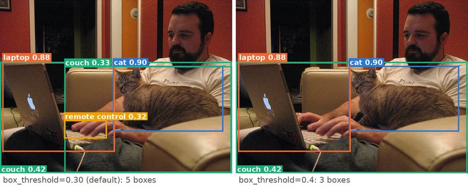
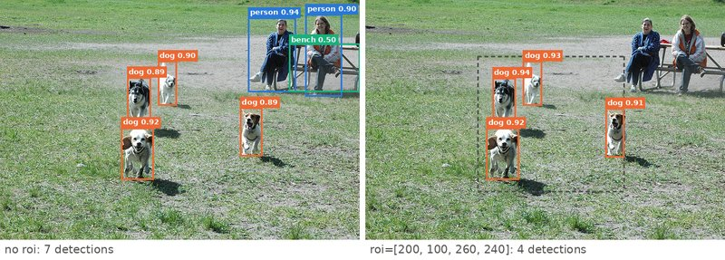
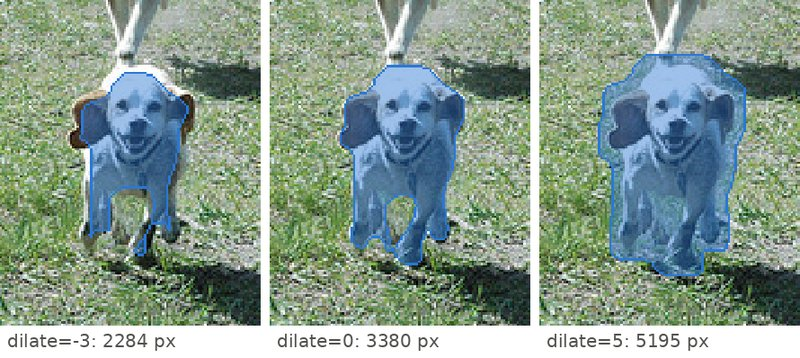

# Python

The Python SDK is a thin HTTP client: it never runs a model, it builds the request, sends it to
a running `visionserve serve`, and turns the JSON answer into Python objects. Its transport uses
only the standard library; `numpy` and `Pillow` (the `images` extra) are needed only for array and
PIL inputs, mask decoding and drawing. Install and connection basics are on the
[Clients overview](index.md).

!!! note "How the examples on this page were run"
    Every example was run for real with the SDK in this repository (version 0.1.5) against a
    server on one NVIDIA RTX A6000 (ONNX Runtime 1.26, CUDA; reported as `device="gpu:0"`),
    started with `--idle-unload-seconds 0` on port 11680 (the runs pointed `Client()`'s default
    host there; the command-line examples passed `--host`). The outputs are copied from those
    runs, trimmed where marked `...`. Timings depend on your hardware. The photos are COCO val2017 images (CC BY 2.0,
    see [credits](#photos-used-on-this-page)) saved under short names: `cat.jpg`, `dogs.jpg`,
    `food.jpg`, `living-room.jpg`, `elephant.jpg`, and a `photos/` folder with eight of them.

## Quick start

```python
from visionserve import Client

c = Client()                                  # http://localhost:11435
print(c.health())
res = c.predict("rf-detr", "dogs.jpg")
print(res.task, res.device, round(res.duration_ms, 1), "ms")
for d in res.detections[:3]:
    print(d.cls, round(d.conf, 3), [round(v, 1) for v in d.bbox])
```

```text
{'status': 'ok'}
detection gpu:0 28.4 ms
person 0.937 [441.7, 31.7, 84.6, 131.9]
dog 0.923 [216.0, 227.2, 57.4, 92.5]
dog 0.902 [281.1, 108.6, 33.3, 79.2]
```

Every box is `[x, y, w, h]`: the top-left corner, then width and height, in the pixels of the
photo you sent, whatever size the model works at internally.

## The client: `Client(...)`

```python
Client(host="http://localhost:11435", timeout=120, *, base64_arrays=False)
```

| Argument | Type | Default | Meaning | When to change it |
|---|---|---|---|---|
| `host` | `str` | `"http://localhost:11435"` | Base URL of the server. A trailing `/` is removed. | The server runs on another machine or port (`"http://10.0.0.5:11435"`). |
| `timeout` | `float`, seconds | `120` | Longest wait for one request: upload, a model load if needed, inference, answer. When it passes, `VisionServeError` is raised with `status=None`. | Lower it to fail fast in a live loop (load the models at startup first); raise it for a slow CPU and a big pipeline. |
| `base64_arrays` | `bool`, keyword only | `False` | Ask for depth maps and embeddings as base64 float32 instead of JSON numbers (the request field `encoding=base64`). They then arrive as read-only `FloatArray` objects. | Large depth maps or many embeddings: smaller and faster to parse. See [Output encoding](#output-encoding-base64_arrays). |

The client keeps no connection or state between calls (each request is one `urllib` call), so
one `Client` can be shared by every thread of your program. Its attributes `host`, `timeout` and
`base64_arrays` can be read and changed after construction.

## `predict(model, image, **options)`

`predict` sends one photo to `POST /api/predict` as a multipart form and returns a
[`Result`](#the-result-object). `model` is a name from `list_models()`; if the model is not in
memory yet, the server loads it first (the first call is slower). Everything after `image` is
keyword-only:

```python title="clients/python/visionserve/client.py"
    def predict(
        self,
        model: str,
        image: ImageInput,
        *,
        prompt: Optional[str] = None,
        box: BoxInput = None,
        point: PointInput = None,
        box_threshold: Optional[float] = None,
        text_threshold: Optional[float] = None,
        bg_max_area: Optional[float] = None,
        fg_min_area: Optional[float] = None,
        grid_size: Optional[int] = None,
        method: Optional[str] = None,
        roi: BoxInput = None,
        dilate: Optional[int] = None,
        depth: "Any" = None,
        min_size: Optional[float] = None,
        max_size: Optional[float] = None,
        gripper_min: Optional[float] = None,
        gripper_max: Optional[float] = None,
        max_grasps_per_object: Optional[int] = 3,
        claim_threshold: Optional[float] = None,
        crop_temp: Optional[float] = None,
        template_name: Optional[str] = None,
    ) -> Result:
```

[View on GitHub](https://github.com/mtbui2010/vision_serve/blob/main/clients/python/visionserve/client.py#L99-L124)

An option left at `None` is not sent at all, and the server then uses the model's own default
(from its `manifest.yaml`, or a built-in value). An option a model does not read is ignored
without an error: check the "Read by" column.

### Every option at a glance

Each keyword is sent as the form field of the **same name** (`api.PredictJSONRequest` in
[`pkg/api/types.go`](https://github.com/mtbui2010/vision_serve/blob/main/pkg/api/types.go)), so
this table also documents the [plain HTTP](http.md) fields. The three exceptions are marked.

| Option | Type | Default (`None`) | Read by | What it does |
|---|---|---|---|---|
| [`prompt`](#prompt-text) | `str` | no prompt; `"object."` for the GroundingDINO family | GroundingDINO family, `rfdetr-textalign*`, `rfdetr-gdino*`, `clip-text`, `siglip-text` | Words to look for: phrases separated by `.` |
| [`box`](#box-boxes) | `[x, y, w, h]` or a list of them | none | SAM family (`mobile-sam`, `efficient-sam`, `sam2`, `nano-sam`), `grasp` | Cut out the object in each box: one mask per box |
| [`point`](#point-points) | `[x, y]`, `[x, y, label]` or a list | none | SAM family | Points on (`label=1`) or off (`0`) one object: one mask |
| [`box_threshold`](#box_threshold) | `float` in (0, 1) | manifest `conf_threshold`, else 0.3 | GroundingDINO family (also its pass in `gdino-siglip*`, `rfdetr-gdino*`) | Minimum score to keep a box |
| [`text_threshold`](#text_threshold) | `float` in (0, 1) | manifest `text_threshold`, else 0.25 | same as `box_threshold` | A second minimum on the same score |
| [`min_size`, `max_size`](#min_size-and-max_size) | `float`, % of the photo's area | no limit | every model that returns boxes or masks | Drop objects whose box is smaller / larger |
| [`roi`](#roi-region-of-interest) | `[x, y, w, h]`, pixels or 0–1 fractions | whole photo | every model | Run the model on this crop only; results come back in photo pixels |
| [`dilate`](#dilate) | `int`, pixels | `0` (off) | every model that returns masks | Grow (`> 0`) or shrink (`< 0`) every mask |
| [`method`](#method) | `str` | `"auto"` / `"exact"` | `background`; `rfdetr-textalign*` | Pick the algorithm |
| [`bg_max_area`, `fg_min_area`](#bg_max_area-and-fg_min_area) | `float`, % of the photo's area | 50 / 0 | `background` with `method="sam"` or `"automask"` | Which masks count as the support surface |
| [`grid_size`](#grid_size) | `int` | 16 (`mobile-sam`, `grasp`), 8 (`background`) | `mobile-sam` without a prompt, `grasp` without a box, `background` `method="automask"` | Points per side of the automatic-mask grid (max 64) |
| [`depth`](#depth-an-aligned-depth-image) ¹ | 2-D numpy array | none | `background` (`method="depth"` or `"auto"`) | Your own depth image instead of the MiDaS estimate |
| [`gripper_min`, `gripper_max`](#gripper_min-and-gripper_max) | `float`, pixels | manifest (10 / 150 on the shipped grasp models) | `grasp`, `grasp-rfdetr`, `grasp-gd` | Allowed jaw opening |
| [`max_grasps_per_object`](#max_grasps_per_object) ² | `int` | **3** | client side only | Keep the best N grasps per object |
| [`claim_threshold`](#claim_threshold) | `float` in (0, 1) | 0.15 | `rfdetr-textalign*` with `method="dual"` | How sure the trained head must be before it names a box |
| [`crop_temp`](#crop_temp) | `float` > 0 | 0.02 (textalign), 0.05 (`gdino-siglip*`) | models that name boxes from a crop with SigLIP | How decisive the crop naming is |
| [`template_name`](#template_name) | `str` | none | `instance_detection` models (`owlv2_base_patch16`) | Which registered example images to look for |
| [`Client(base64_arrays=True)`](#output-encoding-base64_arrays) ³ | `bool` | `False` | depth and embedding models | Large float arrays as base64 |

¹ Sent as a binary file part `depth` plus the fields `depth_dtype`, `depth_width`,
`depth_height` (JSON clients use `depth_base64`). ² Never sent: the SDK filters the answer.
³ A `Client` argument, sent as the field `encoding=base64`.

Numbers, boxes and points may be Python numbers or numpy arrays / scalars. `grid_size` and
`dilate` must be whole numbers (`2.0` is accepted, `2.5` raises `ValueError`), because the server
reads them as integers.

### Images

`image` can be any of these:

| You pass | What is sent | Notes |
|---|---|---|
| `str` or `pathlib.Path` | the file's bytes, unchanged | The simplest and fastest. |
| `bytes` | unchanged | Already-encoded JPEG / PNG. |
| `PIL.Image.Image` | lossless PNG | Modes other than RGB / RGBA / L are converted to RGB first. |
| `numpy.ndarray` | lossless PNG | `(H, W, 3)` is read as **RGB**. `uint8` as is; floats are taken as 0–1 and scaled; other integer types are clipped to 0–255; `(H, W)` and `(H, W, 1)` become grey RGB; `(H, W, 4)` keeps its alpha. |

PIL images and arrays are encoded to PNG so the server sees exactly your pixels. That costs a
little CPU per call; if bandwidth or speed matter more than exactness (a video loop), encode a
JPEG yourself and pass the bytes. The server accepts JPEG, PNG, WebP, BMP, GIF and TIFF, up to
32 MiB and 40 megapixels per image.

```python
import io
import numpy as np
from PIL import Image, ImageOps
from visionserve import Client

c = Client()
pil = Image.open("dogs.jpg")
arr = np.asarray(pil)                                   # (426, 640, 3) uint8, RGB
for name, image in [("path", "dogs.jpg"), ("bytes", open("dogs.jpg", "rb").read()),
                    ("PIL", pil), ("ndarray RGB", arr), ("ndarray BGR", arr[:, :, ::-1])]:
    res = c.predict("rf-detr", image)
    print(f"{name:12s}", [(d.cls, round(d.conf, 3)) for d in res.detections[:3]])

# A phone-style JPEG: pixels stored sideways plus an EXIF "rotate 90" tag.
buf = io.BytesIO()
ex = Image.Exif(); ex[0x0112] = 6
pil.transpose(Image.Transpose.ROTATE_90).save(buf, "JPEG", exif=ex, quality=95)
phone = buf.getvalue()
print("bytes        ", len(c.predict("rf-detr", phone).detections))                 # server rotates
print("PIL as opened", len(c.predict("rf-detr", Image.open(io.BytesIO(phone))).detections))
print("exif_transpose", len(c.predict("rf-detr", ImageOps.exif_transpose(Image.open(io.BytesIO(phone)))).detections))
```

```text
path         [('person', 0.937), ('dog', 0.923), ('dog', 0.902)]
bytes        [('person', 0.937), ('dog', 0.923), ('dog', 0.902)]
PIL          [('person', 0.937), ('dog', 0.923), ('dog', 0.902)]
ndarray RGB  [('person', 0.937), ('dog', 0.923), ('dog', 0.902)]
ndarray BGR  [('dog', 0.925), ('person', 0.915), ('dog', 0.898)]
bytes         7
PIL as opened 3
exif_transpose 7
```

!!! warning "OpenCV images are BGR"
    `cv2.imread` and most camera drivers give BGR arrays. The SDK cannot tell, and a BGR array
    is read as a photo with red and blue swapped: the run above still finds the dogs, but the
    scores change, and colour-sensitive models (open-vocabulary words such as "orange carrot")
    suffer more. Convert first: `cv2.cvtColor(frame, cv2.COLOR_BGR2RGB)` or `frame[:, :, ::-1]`.

!!! warning "EXIF orientation"
    The server applies the EXIF orientation tag of a JPEG you send as a path or bytes, so phone
    photos are processed upright and every box refers to the upright photo. `PIL.Image.open`
    does **not** apply it, and the PNG the SDK makes from a PIL image carries no tag: above, the
    sideways pixels found 3 objects instead of 7. Call `ImageOps.exif_transpose(img)` before
    passing a PIL image, and use the upright size (`exif_transpose(img).size`) when you decode
    masks or draw boxes.

### Prompts

#### `prompt`: text

The words to look for, as phrases separated by `.`: `"cat. laptop. remote control."`. Each
phrase is one label; a box gets the label of the phrase it matches best, so labels are always
whole phrases. Models that need text (`grounding-dino`, `grounded-sam`, `grasp-gd`,
`gdino-siglip`, `gdino-siglip-sam`) answer 400 to an empty prompt, so the SDK sends `"object."`
when you give none. `rfdetr-textalign*` without a prompt uses its own class list, and
`rfdetr-gdino*` without a prompt answers with every class RF-DETR knows. `clip-text` /
`siglip-text` return one embedding per phrase. SAM models refuse text with a 400 that points you
to `grounded-sam`.

The SDK rewrites the prompt a little before sending it, with `normalize_prompt`, so that
`"cat, laptop"` and `"cat | laptop"` work too:

```python
from visionserve import Client
from visionserve.client import normalize_prompt

c = Client()
res = c.predict("grounding-dino", "cat.jpg", prompt="cat. laptop. remote control.")
for d in res.detections:
    print(d.cls, round(d.conf, 3), [round(v) for v in d.bbox])

# what the SDK actually sends
for model, text in [("grounding-dino", "cat, laptop"), ("grounding-dino", "cat"),
                    ("grounding-dino", None), ("clip-text", "a cat, asleep. a dog")]:
    print(model, repr(text), "->", repr(normalize_prompt(model, text)))
```

```text
cat 0.902 [311, 182, 304, 182]
laptop 0.796 [7, 173, 314, 249]
remote control 0.32 [176, 333, 119, 51]
grounding-dino 'cat, laptop' -> 'cat. laptop'
grounding-dino 'cat' -> 'cat.'
grounding-dino None -> 'object.'
clip-text 'a cat, asleep. a dog' -> 'a cat, asleep. a dog'
```

The rule, from the SDK:

```python title="clients/python/visionserve/client.py"
    if prompt is None or not str(prompt).strip():
        return "object." if _is_open_vocab_model(model) else None
    text = str(prompt)
    if _is_embedding_model(model):
        return text
    text = text.replace(",", ".").replace("|", ".")
    if "." not in text:
        text += "."
    return text
```

[View on GitHub](https://github.com/mtbui2010/vision_serve/blob/main/clients/python/visionserve/client.py#L645-L653)

CLIP and SigLIP prompts are sent unchanged, because a comma is part of a sentence there
(`"a photo of a cat, sleeping"`). GroundingDINO reads at most 256 text tokens per pass; a longer
prompt is split into several passes over the same photo, and a single phrase longer than 253
tokens is a 400. Upper and lower case do not matter to GroundingDINO.

#### `box`: boxes

`[x, y, w, h]` in the photo's own pixels (top-left corner, width, height; the same format
every answer uses), or a list of boxes. SAM models return one mask per box, in the same order.
The class-agnostic `grasp` model also accepts boxes: it then plans grasps only for those objects
instead of segmenting the whole photo. Width and height must be ≥ 0; NaN and infinity are
refused.

```python
from visionserve import Client

c = Client()
# one box: [x, y, w, h] in the photo's own pixels
res = c.predict("mobile-sam", "cat.jpg", box=[310, 175, 310, 195])
print(len(res.masks), res.masks[0].bbox, round(res.masks[0].conf, 3))

# several boxes: one mask per box, in the same order
res = c.predict("mobile-sam", "cat.jpg", box=[[310, 175, 310, 195], [5, 170, 300, 245]])
print([m.bbox for m in res.masks])
```

```text
1 [320.0, 186.0, 290.0, 177.0] 0.998
[[320.0, 186.0, 290.0, 177.0], [5.0, 175.0, 217.0, 242.0]]
```

A mask's `bbox` is the tight box around its pixels, not the box you sent. Pass boxes as lists
or arrays, not as a `"x,y,w,h"` string.

#### `point`: points

`[x, y]` or `[x, y, label]`, or a list of them, in the photo's pixels. `label=1` (the default)
means "this pixel is on the object", `label=0` "this pixel is not". All points together describe
**one** object and give one mask; a negative point trims what you do not want.

```python
from visionserve import Client

c = Client()
res = c.predict("mobile-sam", "elephant.jpg", point=[470, 195])          # label 1 by default
print(res.masks[0].bbox)
res = c.predict("mobile-sam", "elephant.jpg", point=[[470, 195, 1], [470, 300, 0]])
print(res.masks[0].bbox)
```

```text
[335.0, 147.0, 218.0, 171.0]
[335.0, 147.0, 218.0, 160.0]
```

The negative point near the ground cut 11 pixel rows off the bottom of the mask. With neither
`box` nor `point`, `mobile-sam` segments everything it finds (see [`grid_size`](#grid_size)).

### Detection score cutoffs

These two apply to GroundingDINO: `grounding-dino`, `grounded-sam`, `grasp-gd`, and the
GroundingDINO pass inside `gdino-siglip*` and `rfdetr-gdino*`. For each of its 900 candidate
boxes GroundingDINO scores every phrase of the prompt; the box takes the best phrase and that
score. Closed-vocabulary detectors (`rf-detr`, `grasp-rfdetr`, …) have no per-request cutoff:
their `conf_threshold` is fixed in the manifest, and `box_threshold` is ignored there. Filter
their answers with [`Result.filter_by_conf`](#helpers) instead.

#### `box_threshold`

Keep a box only when its score is above this value. Default: the manifest's `conf_threshold`
(0.3 on the shipped GroundingDINO models), else 0.3. Lower finds more, including wrong boxes;
higher keeps only confident ones.

#### `text_threshold`

A second minimum on the **same** score: a box must beat both `box_threshold` and
`text_threshold`. Default: the manifest's `text_threshold` (0.25), else 0.25. With the defaults
only `box_threshold` matters; `text_threshold` changes the answer only when you set it above
`box_threshold`. It does not change the labels. (In the original GroundingDINO code it decided
which words of the prompt made up a label; VisionServe always labels a box with a whole phrase.)

```python
from visionserve import Client

c = Client()
prompt = "cat. laptop. couch. remote control."
for bt in (None, 0.35, 0.5):
    res = c.predict("grounding-dino", "cat.jpg", prompt=prompt, box_threshold=bt)
    print(bt, [(d.cls, round(d.conf, 2)) for d in res.detections])
res = c.predict("grounding-dino", "cat.jpg", prompt=prompt, text_threshold=0.4)
print("text_threshold=0.4", [(d.cls, round(d.conf, 2)) for d in res.detections])
```

```text
None [('cat', 0.9), ('laptop', 0.88), ('couch', 0.33), ('couch', 0.42), ('remote control', 0.32)]
0.35 [('cat', 0.9), ('laptop', 0.88), ('couch', 0.42)]
0.5 [('cat', 0.9), ('laptop', 0.88)]
text_threshold=0.4 [('cat', 0.9), ('laptop', 0.88), ('couch', 0.42)]
```

<figure markdown="span">
  { loading=lazy }
  <figcaption><code>grounding-dino</code> · prompt='cat. laptop. couch. remote control.' · box_threshold default (0.30) vs 0.40 · 120 ms on gpu:0 · Photo: COCO val2017 #177015 (<a href="http://farm1.staticflickr.com/131/355302776_1d1215b7c1_z.jpg">Flickr</a>, CC BY 2.0)</figcaption>
</figure>

### Filtering by size

#### `min_size` and `max_size`

Drop every detection and every mask whose box area (`w × h`) is below `min_size` or above
`max_size` **percent of the photo's area**: `min_size=1` keeps objects covering at least 1 % of
the photo, `max_size=90` drops ones covering more than 90 %. `None` (or `0`) means no limit. The
server applies it after the model and after `roi` and `dilate`. Grasp models also apply it to the
objects *before* planning grasps, so no grasps are planned for objects outside the range.
Classifications, depth maps and embeddings are not affected.

```python
from visionserve import Client

c = Client()
for kw in ({}, {"min_size": 1}, {"max_size": 1}):
    res = c.predict("rf-detr", "dogs.jpg", **kw)
    print(kw, [(d.cls, round(100 * d.bbox[2] * d.bbox[3] / (640 * 426), 2)) for d in res.detections])
```

```text
{} [('person', 4.09), ('dog', 1.95), ('dog', 0.97), ('person', 3.45), ('dog', 1.42), ('dog', 1.22), ('bench', 3.94)]
{'min_size': 1} [('person', 4.09), ('dog', 1.95), ('person', 3.45), ('dog', 1.42), ('dog', 1.22), ('bench', 3.94)]
{'max_size': 1} [('dog', 0.97)]
```

(The second number in each pair is the box's share of the photo in percent.)

!!! warning "Not for `background`"
    The `background` mask usually spans most of the photo, so `max_size` (and even `min_size`)
    can drop it. Tune that model with [`bg_max_area` / `fg_min_area`](#bg_max_area-and-fg_min_area).

The client-side [`Result.filter_by_size`](#helpers) does the same after the fact, but takes
**fractions** (0–1) of the area when you give the image size, not percent.

### Region and mask shape

#### `roi`: region of interest

`[x, y, w, h]`: the server crops the photo to this rectangle, runs the model on the crop
**only**, and maps the answer back: boxes and grasp centres are shifted, masks are pasted into a
full-size mask. Your `box` / `point` prompts stay in full-photo pixels; the server shifts them
too. Works with every model.

Give pixels, or fractions of the photo's size: when **both** `w` and `h` are ≤ 1 the four numbers
are read as fractions (`[0.25, 0.25, 0.5, 0.5]` is the centre quarter of any photo), which keeps
the ROI right whatever resolution the camera sends. A rectangle that goes past the edge is cut
to the photo; an empty one is ignored.

```python
from visionserve import Client

c = Client()
res = c.predict("rf-detr", "dogs.jpg", roi=[200, 100, 260, 240])          # pixels
print([(d.cls, [round(v) for v in d.bbox]) for d in res.detections])
res = c.predict("rf-detr", "dogs.jpg", roi=[0.3125, 0.235, 0.406, 0.563])  # fractions of 640x426
print(len(res.detections))
```

```text
[('dog', [226, 139, 42, 90]), ('dog', [281, 109, 34, 79]), ('dog', [216, 228, 58, 92]), ('dog', [428, 193, 32, 87])]
4
```

<figure markdown="span">
  { loading=lazy }
  <figcaption><code>rf-detr</code> · roi=[200, 100, 260, 240] (dashed) · 16 ms on gpu:0 · Photo: COCO val2017 #372819 (<a href="http://farm3.staticflickr.com/2046/2516944023_d00345997d_z.jpg">Flickr</a>, CC BY 2.0)</figcaption>
</figure>

The model really sees a different, smaller picture, so scores change (the dogs score 0.91–0.94
in the crop, 0.89–0.92 in the whole photo), an object cut by the edge is found as its visible
part (the dog on the right), and objects outside are never seen. A depth map or an embedding
computed with `roi` describes the crop.

#### `dilate`

Grow (`dilate > 0`) or shrink (`dilate < 0`) every returned mask by that many pixels, with a
square kernel, after the model and after `roi`. `0` or `None` is off. Detections are not
changed. A mask that belongs to a detection (Grounded-SAM, the grasp models: one mask per
detection, carrying the detection's box) keeps that box, so it stays paired with its detection;
any other mask (SAM box/point prompts, automatic masks, `background`) gets its `bbox` recomputed
to fit the new mask. Use a positive value for a safety margin around an object (to blur it, or to
avoid touching it), a negative one to stay safely inside it (to sample its colour or depth).

```python
from PIL import Image
from visionserve import Client

c = Client()
w, h = Image.open("dogs.jpg").size
for dilate in (None, 5, -3):
    res = c.predict("grounded-sam", "dogs.jpg", prompt="dog.", dilate=dilate)
    m = res.masks[0]
    print(dilate, "mask bbox", [round(v) for v in m.bbox], "pixels", int(m.to_ndarray(w, h).sum()),
          "| detection bbox", [round(v) for v in res.detections[0].bbox])
```

```text
None mask bbox [281, 109, 34, 78] pixels 1307 | detection bbox [281, 109, 34, 78]
5 mask bbox [281, 109, 34, 78] pixels 2477 | detection bbox [281, 109, 34, 78]
-3 mask bbox [281, 109, 34, 78] pixels 714 | detection bbox [281, 109, 34, 78]
```

<figure markdown="span">
  { loading=lazy }
  <figcaption><code>grounded-sam</code> · prompt='dog.' · dilate=-3, 0, 5 (zoomed in) · 194 ms on gpu:0 · Photo: COCO val2017 #372819 (<a href="http://farm3.staticflickr.com/2046/2516944023_d00345997d_z.jpg">Flickr</a>, CC BY 2.0)</figcaption>
</figure>

!!! note "`dilate` keeps detections and masks paired"
    The size filter (`min_size` / `max_size`) runs after `dilate` and judges a detection and its
    mask by the same box, so they are kept or dropped together and `zip(res.detections,
    res.masks)` and `Result.group_by_class` still pair the right objects. Measured on GPU:
    `grounded-sam`, prompt `"dog. bench."`, `dilate=-3, min_size=1` returns 5 detections and 5
    masks (3 dogs, 2 benches). Before this was fixed it returned 6 detections and 3 masks, and
    `dilate` alone put every mask under the label `""`. If you need the tight box of a reshaped
    paired mask, compute it from the mask (`to_ndarray`).

### Background and automatic masks

#### `method`

Chooses the algorithm on models that have several. Two models read it:

`background` (returns one mask: the support surface, such as a table or floor, under the
objects; everything else is foreground):

| `method` | What it does | Run on `living-room.jpg` |
|---|---|---|
| `"auto"` (default) | `depth`, and `cv` when depth finds no clear plane | 1 mask, 13.6 %, 146 ms |
| `"cv"` | Classical image processing, no model: the large plain region grown from the bottom and edges | 1 mask, 13.6 %, 13 ms |
| `"depth"` | Depth (MiDaS, or [your own](#depth-an-aligned-depth-image)) → fit the main plane | 0 masks (no clear plane), 91 ms |
| `"sam"` | MobileSAM prompted at six points in the lower part of the photo | 1 mask, 6.9 %, 205 ms |
| `"automask"` | MobileSAM automatic masks, keep the large / edge-touching ones, join them | 1 mask, 46.6 %, 294 ms |

`rfdetr-textalign*` (open-vocabulary RF-DETR): `"exact"` (default; also `"cosine"`),
`"folded"` (`"linear"`), `"gated"` (`"split"`), `"dual"` (`"twohead"`). `"dual"` lets the
detector's own trained head name the classes it knows and the open head name the rest; it is the
mode [`claim_threshold`](#claim_threshold) and [`crop_temp`](#crop_temp) tune.

An unknown name is an error. (It currently comes back as status 500 rather than 400.)

#### `bg_max_area` and `fg_min_area`

Only for `background` with `method="sam"` or `"automask"`, in percent of the photo's area. A
mask covering at least `bg_max_area` (default 50) is support surface outright; a smaller one
counts only if it touches the photo's edge and covers at least 5 %. A mask below `fg_min_area`
(default 0) is ignored as noise. `depth` and `cv` ignore both.

#### `grid_size`

The automatic mask generator prompts SAM at an `N × N` grid of points (`N²` decoder runs) and
keeps the distinct masks. A finer grid finds smaller objects and takes longer. Read by
`mobile-sam` when it gets no box or point (default 16), by the class-agnostic `grasp` model when
it gets no box (default 16), and by `background` with `method="automask"` (default 8). The server
caps it at 64.

```python
from PIL import Image
from visionserve import Client

c = Client()
w, h = Image.open("living-room.jpg").size
for kw in ({}, {"method": "cv"}, {"method": "depth"}, {"method": "sam"}, {"method": "automask"},
           {"method": "automask", "fg_min_area": 10}, {"method": "automask", "grid_size": 16}):
    res = c.predict("background", "living-room.jpg", **kw)
    share = 100 * res.masks[0].to_ndarray(w, h).mean() if res.masks else 0
    print(kw, len(res.masks), "mask(s), %.1f%% of the photo, %.0f ms" % (share, res.duration_ms))
```

```text
{} 1 mask(s), 13.6% of the photo, 146 ms
{'method': 'cv'} 1 mask(s), 13.6% of the photo, 13 ms
{'method': 'depth'} 0 mask(s), 0.0% of the photo, 91 ms
{'method': 'sam'} 1 mask(s), 6.9% of the photo, 205 ms
{'method': 'automask'} 1 mask(s), 46.6% of the photo, 294 ms
{'method': 'automask', 'fg_min_area': 10} 1 mask(s), 10.4% of the photo, 216 ms
{'method': 'automask', 'grid_size': 16} 1 mask(s), 46.6% of the photo, 498 ms
```

`background` can return **no** mask: always check `if res.masks:`. On `mobile-sam`:

```python
from visionserve import Client

c = Client()
for grid in (None, 8):                          # None = the model's default (16 for mobile-sam)
    res = c.predict("mobile-sam", "cat.jpg", grid_size=grid)
    print(grid, len(res.masks), "masks", round(res.duration_ms), "ms")
```

```text
None 38 masks 560 ms
8 22 masks 223 ms
```

#### `depth`: an aligned depth image

A 2-D numpy array, `(H, W)`, from a depth camera, pixel-aligned with the colour photo (most
RGB-D cameras can register depth to the colour image). Only `background` reads it, in its
`depth` and `auto` methods, instead of estimating depth with MiDaS. The SDK sends it as a raw
binary part:

- integer arrays (`uint16` millimetres from a RealSense or similar) are sent as `uint16`; values
  must be 0–65535 (the SDK refuses others rather than wrap them). `0` means "no reading".
- float arrays are sent as `float32`, unchanged (metres, for example). Values ≤ 0 or NaN mean
  "no reading".
- the units do not matter: the plane fit only needs relative values.
- a different resolution than the photo is resized (nearest neighbour) to the photo's size.

```python
import numpy as np
from PIL import Image
from visionserve import Client

c = Client()
w, h = Image.open("living-room.jpg").size
# A made-up "sensor" frame, only to show the call: a floor plane 3 m away at the top of the
# frame, closer towards the bottom, in uint16 millimetres (0 would mean "no reading").
depth_mm = (3000 - 4 * np.arange(h)[:, None].repeat(w, 1)).astype(np.uint16)
res = c.predict("background", "living-room.jpg", method="depth", depth=depth_mm)
print(len(res.masks), "mask covering %.0f%% of the photo" % (100 * res.masks[0].to_ndarray(w, h).mean()))
```

```text
1 mask covering 100% of the photo
```

Everything in this made-up frame lies on one plane, so all of it is "surface"; a real frame has
objects standing above the plane, and they are left out. The grasp models do **not** read
`depth`: to use a depth camera with grasps, see the [grasp recipe](#grasp-with-a-depth-camera).

### Robotics

#### `gripper_min` and `gripper_max`

For the grasp models (`grasp`, `grasp-rfdetr`, `grasp-gd`): the smallest and largest jaw
opening, in pixels of the photo, that your gripper can use. Grasps outside the range are never
proposed. Defaults come from the manifest (10 and 150 on the shipped models). To turn your
gripper's opening in millimetres into pixels, multiply by `fx / Z` (focal length in pixels over
the distance to the object in millimetres).

#### `max_grasps_per_object`

Not sent to the server. The server returns up to 20 grasps per object; the SDK then keeps the
best `max_grasps_per_object` (default **3**) per object, grouping each grasp with the smallest
detection (or mask) box that contains its centre. Pass `None` to get everything the server sent.

```python
from visionserve import Client

c = Client()
res = c.predict("grasp-rfdetr", "food.jpg")                              # 3 grasps per object
print([d.cls for d in res.detections], len(res.grasps), "grasps")
res = c.predict("grasp-rfdetr", "food.jpg", max_grasps_per_object=None)  # all the server sent
print(len(res.grasps), "grasps")
res = c.predict("grasp-rfdetr", "food.jpg", gripper_min=40, gripper_max=80, max_grasps_per_object=1)
for g in res.grasps:
    print(g.cls, round(g.quality, 3), "centre", (g.x, g.y), "width", round(g.width, 1),
          "theta", round(g.theta, 2))
```

```text
['bowl', 'carrot', 'broccoli'] 9 grasps
60 grasps
bowl 0.969 centre (285.0, 229.5) width 40.3 theta 0.8
bowl 0.967 centre (247.0, 228.5) width 40.3 theta 2.34
broccoli 0.944 centre (423.5, 332.5) width 75.5 theta 3.02
```

With `max_grasps_per_object=1` there are two bowl grasps: the carrot's box lies inside the
bowl's, so a grasp on the carrot whose centre also falls in the bowl is grouped with the
smallest box containing it. Each grasp gives the centre `(x, y)`, the jaw opening `width` (pixels)
and `theta`, the direction (radians) along which the jaws close.

### Open-vocabulary naming

These tune the models that name boxes in two stages. Leave them alone unless you are
measuring.

#### `claim_threshold`

`rfdetr-textalign*` with `method="dual"` only. The detector's own trained head may name a box
with one of the words you asked for when its probability for that class reaches
`claim_threshold` (default 0.15); otherwise the open head names it. Lower lets the trained head
claim more boxes; `≥ 1` means it never claims (the open head names everything).

#### `crop_temp`

For models that name a box by comparing a crop of it with your words in SigLIP
(`rfdetr-textalign*` with a crop head, such as `rfdetr-dualhead-dec1`, in `method="dual"`; and
`gdino-siglip*`, `rfdetr-gdino-siglip*`). It is the softmax temperature that turns the
similarities into a probability over your words, and that probability multiplies the reported
confidence. Lower is more decisive (scores closer to 0 or 1), higher spreads it out. Defaults:
0.02 for textalign, 0.05 for `gdino-siglip`. Labels rarely change; confidences do, so a
`conf` cutoff you picked at one temperature does not carry over to another.

```python
from visionserve import Client

c = Client()
words = "cup. book. remote. lamp."
for kw in ({}, {"claim_threshold": 0.05}, {"crop_temp": 0.005}, {"crop_temp": 0.1}):
    res = c.predict("rfdetr-dualhead-dec1", "living-room.jpg", prompt=words, method="dual", **kw)
    print(kw, [(d.cls, round(d.conf, 3)) for d in res.detections[:3]])
for t in (None, 0.01, 0.2):
    res = c.predict("gdino-siglip", "cat.jpg", prompt="cat. dog. laptop.", crop_temp=t)
    print("gdino-siglip crop_temp=%s" % t, [(d.cls, round(d.conf, 2)) for d in res.detections[:2]])
```

```text
{} [('cup', 0.089), ('lamp', 0.08), ('cup', 0.075)]
{'claim_threshold': 0.05} [('cup', 0.089), ('lamp', 0.08), ('cup', 0.119)]
{'crop_temp': 0.005} [('cup', 0.146), ('lamp', 0.122), ('cup', 0.119)]
{'crop_temp': 0.1} [('cup', 0.048), ('lamp', 0.04), ('cup', 0.038)]
gdino-siglip crop_temp=None [('laptop', 0.66), ('cat', 0.6)]
gdino-siglip crop_temp=0.01 [('laptop', 0.81), ('cat', 0.87)]
gdino-siglip crop_temp=0.2 [('laptop', 0.38), ('cat', 0.37)]
```

With `claim_threshold=0.05` the trained head claimed the third box as "cup" (its own score,
0.119) instead of leaving it to the crop namer (0.075).

### Templates

#### `template_name`

For `instance_detection` models (`owlv2_base_patch16`): find objects that look like example
images you registered under a name with `POST /api/templates`. The SDK has no method for the
template endpoints, so register with any HTTP library; other models ignore `template_name`.

```python
import requests
from PIL import Image
from visionserve import Client

c = Client()
# Register one example crop under a name (the SDK has no method for this endpoint).
Image.open("dogs.jpg").crop((216, 227, 274, 320)).save("dog-crop.png")
with open("dog-crop.png", "rb") as f:
    r = requests.post(c.host + "/api/templates", data={"name": "dog"}, files={"images": f})
print(r.json(), requests.get(c.host + "/api/templates").json())

res = c.predict("owlv2_base_patch16", "dogs.jpg", template_name="dog")
print(res.task, len(res.detections), "detections")
requests.delete(c.host + "/api/templates/dog")
```

```text
{'count': 1, 'name': 'dog'} {'templates': ['dog']}
instance_detection 10 detections
```

An unknown name is a 400 (`template "nope" not found`), and so is calling an
`instance_detection` model without one. Templates live in the server's memory: they are gone
after a restart.

### Output encoding: `base64_arrays`

A depth map is one float per pixel; as JSON numbers that is slow to write and to parse. With
`Client(base64_arrays=True)` the SDK adds `encoding=base64` to every request, the server sends
`depth_map` and `embeddings` as base64 float32 bytes, and the SDK decodes them. You get the same
values (bit-exact float32), as read-only `FloatArray` objects: they support `len`, indexing,
iteration and `==` with a list, and `numpy.asarray(x)` gives the array without a copy. They are
not lists: `json.dumps`, `+` and `append` need `.tolist()` first (`Result.to_json()` does it for
you). Without numpy installed the SDK decodes to plain lists.

```python
import json
import numpy as np
from visionserve import Client

plain = Client().predict("midas", "dogs.jpg")
print(type(plain.depth_map).__name__, len(plain.depth_map), plain.depth_width, plain.depth_height)

fast = Client(base64_arrays=True).predict("midas", "dogs.jpg")
print(fast.depth_map, fast.depth_array().shape, fast.depth_array().dtype)
print(np.abs(fast.depth_array() - plain.depth_array()).max())   # same values
json.dumps(fast.to_json())                                      # fine: to_json() gives plain lists
try:
    json.dumps(fast.depth_map)
except TypeError as e:
    print("TypeError:", e)
```

```text
list 65536 256 256
FloatArray(shape=(65536,)) (256, 256) float32
0.0
TypeError: Object of type FloatArray is not JSON serializable
```

For this 256 × 256 map one call took 78 ms with JSON numbers and 43 ms with base64, measured on
the client; the gap grows with the map. Detections, masks and grasps are not affected.

## The `Result` object

One `Result` type serves every model ([unified schema](../concepts/tasks.md)); a field a model
does not produce is empty.

| Field | Type | Filled by |
|---|---|---|
| `task` | `str` | always: `detection`, `segmentation`, `open_vocab`, `classification`, `depth`, `embed`, `grasp`, `instance_detection` |
| `model`, `device`, `duration_ms` | `str`, `str`, `float` | always. `device` is `cpu`, `gpu:0` or `gpu:0+trt`; `duration_ms` is the server's own time (not the network) |
| `hint` | `str` | a setup suggestion from the server, usually empty |
| `detections` | `list[Detection]` | detectors, open-vocabulary models, Grounded-SAM, grasp models with a detector |
| `masks` | `list[Mask]` | SAM family, Grounded-SAM, `background`, grasp models |
| `grasps` | `list[Grasp]` | grasp models |
| `classifications` | `list[Classification]` | `efficientnet-b0`, `mobilenet-v3` |
| `depth_map`, `depth_width`, `depth_height` | `list[float]` or `FloatArray`, `int`, `int` | `midas`, `depth-anything-v2`: row-major, at the **model's** resolution |
| `embeddings` | `list[list[float]]` or `FloatArray` | `clip`, `siglip-image`, `clip-text`, `siglip-text`: one row per image or phrase |

The items:

- `Detection(bbox, cls, conf)`: `bbox = [x, y, w, h]` in photo pixels; `cls` is the label (the
  JSON field is `class`, a Python keyword); `conf` in 0–1.
- `Mask(rle, bbox, conf)`: the mask as column-major run-length encoding over the photo's
  `H × W`; `bbox` is its tight box (Grounded-SAM and grasp models copy the detection's box
  instead); `conf` is the model's estimate of mask quality, which for SAM masks can slightly
  exceed 1. `Mask.to_ndarray(width, height)` decodes it to a `bool` numpy array of shape
  `(height, width)`; pass the photo's (upright) size.
- `Grasp(x, y, theta, width, quality, cls, conf)`: centre, closing direction in radians, jaw
  opening in pixels, a 0–1 score, and the object's label and score (empty / 0 for the
  class-agnostic `grasp` model). `g.pose` is `[x, y, width, theta]`; `g.contacts()` and
  `g.contacts_flat()` give the two jaw contact points.
- `Classification(cls, conf)`.
- A depth map from `midas` / `depth-anything-v2` is **relative** inverse depth, scaled to 0–1 per
  photo: larger is closer, and it has no units. It cannot give distances in metres; for that use a
  depth camera (see the [grasp recipe](#grasp-with-a-depth-camera)).

### Helpers

All helpers run in your process and return a new `Result`; nothing is sent to the server.

| Helper | What it does |
|---|---|
| `filter_by_conf(min_conf=0.0, max_conf=1.0)` | keep detections, masks and classifications with `conf` in the range |
| `filter_by_size(min_size=, max_size=, image_width=, image_height=)` | keep detections and masks by box area: **fractions** (0–1) of the image when you give its size, else pixels² |
| `sort_by_conf(descending=True)`, `top_k(k)` | order by confidence, keep the first `k` |
| `nms(iou_threshold=0.5)` | remove overlapping detections (greedy non-maximum suppression); masks are kept as they are |
| `filter_grasps(max_per_object)` | what `max_grasps_per_object` does in `predict` |
| `group_by_class()` | `{label: Result}`; a mask joins the detection with the identical box |
| `depth_array()`, `embeddings_array()` | numpy views: `(depth_height, depth_width)` and `(N, D)` float32, or `None` |
| `to_json(encoding="json")` | the wire JSON as a `dict` (`class`, not `cls`); `Result.from_json(r.to_json()) == r` |
| `visualize(image, alpha=0.45, ...)` | draw the result on the photo, returns a `PIL.Image` (needs Pillow); same as `visionserve.draw(result, image)` |

```python
import numpy as np
from PIL import Image
from visionserve import Client

c = Client()
w, h = Image.open("dogs.jpg").size
res = c.predict("grounded-sam", "dogs.jpg", prompt="dog. bench.")
print(res.task, len(res.detections), len(res.masks))
mask = res.masks[0].to_ndarray(w, h)                 # bool (h, w)
print(mask.shape, mask.dtype, mask.sum())
print(res.masks[0].rle[:40], "...")
for label, part in res.group_by_class().items():
    print(label, len(part.detections), len(part.masks))
print([round(d.conf, 2) for d in res.sort_by_conf().top_k(3).detections])
print(len(res.filter_by_conf(0.7).detections), len(res.nms(0.3).detections))
print(len(res.filter_by_size(min_size=0.01, image_width=w, image_height=h).detections))
print(list(res.to_json())[:6])
res.visualize("dogs.jpg").save("dogs-grounded.jpg")
```

```text
open_vocab 6 6
(426, 640) bool 1297
120298 2 399 29 392 35 389 37 387 39 371 ...
dog 4 4
bench 2 2
[0.77, 0.73, 0.72]
4 5
6
['task', 'model', 'device', 'detections', 'masks', 'duration_ms']
```

The `postprocess` module adds robotics helpers that combine results with a depth camera:
`CameraIntrinsics`, `backproject`, `camera_distance`, `get_depth_at_detection`,
`object_distances`, `grasp_distances`, `select_target_object` and `select_target_grasp`, all
importable from `visionserve`. They refuse a `midas` depth result for anything in metres, since it
has no scale. `visionserve.utils` has optional OpenCV drawing helpers (`pip install opencv-python`).

## Other methods

| Method | HTTP | Returns |
|---|---|---|
| `health()` | `GET /api/health` | `{"status": "ok"}` |
| `list_models()` | `GET /api/models` | `list[ModelInfo]`: `name`, `task`, `license`, `state` (`not_downloaded`, `available`, `loaded`) |
| `ps()` | `GET /api/models` | only the loaded ones |
| `load(model)` / `unload(model)` | `POST /api/load` / `/api/unload` | `{"model", "state"}`: load now (so the first `predict` is fast), or free the memory |
| `preprocess(model, image=None, *, prompt=, box=, point=)` | `POST /api/preprocess` | `PreprocessResult`: the exact input tensors the model would get, as numpy arrays, without running it |
| `tokenize(model, text)` | `POST /api/preprocess` | the token ids a text model gets |

```python
from visionserve import Client

c = Client()
print([m for m in c.list_models() if m.name.startswith("rf-detr")])
print(c.unload("midas"), c.load("midas"))
print([m.name for m in c.ps()][:5])
pre = c.preprocess("rf-detr", "dogs.jpg")
print(pre)
x = pre.inputs["input"]
print(x.dtype, x.shape, round(float(x.mean()), 4))
print(c.tokenize("clip-text", "a photo of a dog")[0, :8])
```

```text
[ModelInfo(name='rf-detr', task='detection', license='Apache-2.0', state='loaded'), ModelInfo(name='rf-detr-nano', task='detection', license='Apache-2.0', state='available')]
{'model': 'midas', 'state': 'unloaded'} {'model': 'midas', 'state': 'loaded'}
['background', 'clip', 'clip-text', 'gdino-siglip', 'grasp-gd']
PreprocessResult(model='rf-detr', inputs={'input': (1, 3, 560, 560)}, meta={'orig_width': 640, 'orig_height': 426, 'scale_x': 0.875, 'scale_y': 1.3145539906103287, 'pad_x': 0, 'pad_y': 0})
float32 (1, 3, 560, 560) 0.4752
[49406   320  1125   539   320  1929 49407 49407]
```

`preprocess` is for checking that the server prepares inputs the way your model was trained
(resize, normalisation, token padding); see [From pixels to tensors](../concepts/preprocessing.md).
`meta` maps model-input pixels back to the photo: `input = photo × scale + pad`.

### Endpoints without an SDK method

`/api/explain`, `/api/templates` (shown [above](#template_name)) and `/api/infer_tensor` have no
method yet. Call them with any HTTP library; the fields are in the
[HTTP API reference](../reference/api.md).

```python
import json
import urllib.request
import requests
from visionserve import Client, Result

c = Client()
# /api/explain: a heatmap PNG for one detection (the model needs an explain block in its manifest)
with open("cat.jpg", "rb") as f:
    r = requests.post(c.host + "/api/explain", data={"model": "rfdetr-small", "class": "cat"},
                      files={"image": f})
print(r.status_code, r.headers["Content-Type"], r.headers["X-Explain-Detection"][:60])
open("cat-explain.png", "wb").write(r.content)

# /api/infer_tensor: run on a tensor you prepared (here: the server's own preprocessing)
x = c.preprocess("rf-detr", "dogs.jpg").inputs["input"]
req = urllib.request.Request(
    c.host + "/api/infer_tensor?model=rf-detr&shape=" + ",".join(map(str, x.shape)),
    data=x.astype("<f4").tobytes(), method="POST")
res = Result.from_json(json.load(urllib.request.urlopen(req)))
print([(d.cls, [round(v) for v in d.bbox]) for d in res.detections[:2]])   # model-input pixels
```

```text
200 image/png {"bbox":[316.262845993042,182.2820019721985,298.482456207275
[('person', [386, 42, 74, 173]), ('dog', [189, 299, 50, 122])]
```

`/api/infer_tensor` knows nothing about the original photo, so its boxes are in the pixels of
the **tensor** (560 × 560 here), not of the photo: compare the person box with the one from
`predict` in the [quick start](#quick-start).

## Errors and retries

Everything the server or the network refuses is raised as `visionserve.VisionServeError`:

| `e.status` | Meaning | Retry? |
|---|---|---|
| `400` | Your request is wrong: a missing or unusable prompt, a bad image, a template that does not exist | No: fix the request |
| `404` | Unknown model, or its weights are not downloaded (`visionserve pull <model>`) | No |
| `413` | Image larger than 32 MiB, or a body over the limit | No: send a smaller JPEG |
| `499` | The client left before the work started. You will not see it: it is logged by the server for a request you already gave up on (a timeout) | — |
| `500` | A server-side failure (a broken model file, or today also an unknown `method`) | Rarely helps |
| `503` | The model's queue is full. `e.retry_after` holds the server's `Retry-After` in seconds | **Yes**, after that delay |
| `None` | No answer at all: the server is not running or not reachable, the connection dropped, or the `timeout` passed | Yes, if you expect the server back |

Mistakes the SDK can see before sending are ordinary Python errors: `ValueError` (a box without
4 numbers, a non-integer `grid_size`, a depth array out of range), `TypeError` (an unsupported
image type), `FileNotFoundError` (a path that does not exist), `ImportError` (numpy or Pillow
missing for a feature that needs it).

```python
from visionserve import Client, VisionServeError

c = Client()
for call in (lambda: c.predict("no-such-model", "dogs.jpg"),
             lambda: c.predict("depth-anything-v2", "dogs.jpg"),
             lambda: c.predict("grounding-dino", "cat.jpg", prompt=" . "),
             lambda: c.predict("background", "living-room.jpg", method="bogus"),
             lambda: Client("http://127.0.0.1:9").health(),
             lambda: Client(timeout=0.05).predict("grounding-dino", "cat.jpg", prompt="cat.")):
    try:
        call()
    except VisionServeError as e:
        print(e.status, e.retry_after, str(e)[:90])
try:
    c.predict("mobile-sam", "cat.jpg", box=[1, 2, 3])
except ValueError as e:
    print("ValueError:", e)
```

```text
404 None POST /api/predict -> 404: lifecycle: model not found: "no-such-model" is not in the regist
404 None POST /api/predict -> 404: lifecycle: model not found: no weights for "depth-anything-v2" a
400 None POST /api/predict -> 400: grounding-dino: prompt "." holds no class phrase
500 None POST /api/predict -> 500: background: unknown method "bogus" (use auto, depth, sam, cv, or
None None failed to reach VisionServe at http://127.0.0.1:9/api/health: [Errno 111] Connection refus
None None POST /api/predict: no answer from VisionServe at http://127.0.0.1:11680 within 0.05s (time
ValueError: box must have 4 values [x,y,w,h], got [1, 2, 3]
```

(The timeout message shows the test server's port.) A small retry helper: retry only 503 and "no
answer", wait `retry_after` when the server gives one, and add some randomness so many waiting
threads do not all come back at the same moment.

```python
import random
import time
from visionserve import VisionServeError

def predict_with_retry(client, *args, attempts=8, **kwargs):
    """Retry only what is worth retrying: 503 (queue full) and no answer at all."""
    for i in range(attempts):
        try:
            return client.predict(*args, **kwargs)
        except VisionServeError as e:
            if e.status not in (503, None) or i == attempts - 1:
                raise
            time.sleep((e.retry_after or 0.5 * 2 ** i) * (1 + random.random()))  # jitter
```

To see it work, a second server was started on the CPU with `VISIONSERVE_MAX_QUEUE=1` (one
request per model at a time) and sent 8 requests at once from 8 threads. Without the helper some
failed; with it all 8 succeeded:

```text
503 retry_after=1.0 POST /api/predict -> 503: lifecycle: model overloaded: "rf-detr" already has 1 requests running or waiting (li
ok
with retry: [7, 7, 7, 7, 7, 7, 7, 7]
```

A 503 is rare with the default bound (`max(32, 2 × sessions)` requests per model, set by
`VISIONSERVE_MAX_QUEUE`, see [Configuration](../reference/configuration.md)).

## Speed and concurrency

- **One `Client` for the whole program.** It holds no connection, so sharing it between threads
  is safe and costs nothing.
- **Threads help.** The server runs requests for different models, and several requests for the
  same model, in parallel (up to the model's session pool). Eight photos through `rf-detr`:

    ```python
    import time
    from concurrent.futures import ThreadPoolExecutor
    from pathlib import Path
    from visionserve import Client

    c = Client()                                    # one client, shared by every thread
    paths = sorted(Path("photos").glob("*.jpg"))
    c.load("rf-detr")                               # pay the load once, before timing

    t0 = time.perf_counter()
    serial = [c.predict("rf-detr", p) for p in paths]
    t1 = time.perf_counter()
    with ThreadPoolExecutor(max_workers=4) as pool:
        parallel = list(pool.map(lambda p: c.predict("rf-detr", p), paths))
    t2 = time.perf_counter()
    print(len(paths), "photos: serial %.0f ms, 4 threads %.0f ms" % ((t1 - t0) * 1e3, (t2 - t1) * 1e3))
    print(all(len(a.detections) == len(b.detections) for a, b in zip(serial, parallel)))
    ```

    ```text
    8 photos: serial 437 ms, 4 threads 142 ms
    True
    ```

    GroundingDINO-based models (`grounding-dino`, `grasp-gd`) run one request at a time per
    loaded model, so threads do not speed those up; they only queue.
- **There is no batch endpoint**: one photo per request. Threads are the way to batch.
- **Keep models in memory.** Each model is unloaded after it has been idle for its manifest's
  `idle_unload_seconds` (300 s on the shipped models) and the next request pays the load again
  (seconds for GroundingDINO). Call `load()` at startup, and start the server with
  `--idle-unload-seconds 0` if it serves a live loop.
- **Send less.** A path or JPEG bytes is cheaper than a numpy array (which the SDK encodes to
  PNG). Use `roi` when only part of the frame matters, and `base64_arrays=True` for depth maps and
  embeddings.

## The Python command-line client

`pip install visionserve` also installs a `visionserve` command (and `python -m visionserve`
does the same). It drives a **running** server; it is not the Go binary. If both are installed,
`which -a visionserve` shows which one comes first on your `PATH`.

| Command | Does |
|---|---|
| `predict MODEL IMAGE [options]` | prints the result JSON on stdout and a one-line summary on stderr |
| `list` (aliases `models`, `ls`) / `ps` | the models (`--json` for JSON) / only the loaded ones |
| `load MODEL` / `unload MODEL` (alias `rm`) | load or free a model |
| `health` | checks that the server answers |

Global options, before or after the command: `--host URL` (default `http://localhost:11435`),
`--timeout SEC` (default 120), and `--version`.

`predict` options map one to one to the keyword arguments above: `--prompt`, `--box x,y,w,h`
and `--point x,y[,label]` (several separated by `;`), `--roi`, `--dilate`, `--method`,
`--box-threshold`, `--text-threshold`, `--bg-max-area`, `--fg-min-area`, `--grid-size`,
`--min-size`, `--max-size`, `--gripper-min`, `--gripper-max`, `--max-grasps-per-object`
(default 3). Output: `--save` writes an annotated PNG named `<stem>.python.<model>.<task>.png`,
`--save-as PATH` picks the name, `--alpha` sets the mask opacity, `--compact` prints the JSON on
one line, `--quiet` drops the summary. `claim_threshold`, `crop_temp`, `template_name`, `depth`
and `base64_arrays` are only available from Python. For grasp results the printed JSON holds only
the single best grasp (picked with `select_target_grasp`), while `--save` draws all of them.

```bash
visionserve predict rf-detr dogs.jpg --min-size 1 --compact
visionserve ps
visionserve predict grasp-rfdetr food.jpg --gripper-min 40 --max-grasps-per-object 2 --save-as grasp.png --compact
visionserve predict nope dogs.jpg; echo "exit=$?"
```

```text
predict: model=rf-detr task=detection device=gpu:0  client=82.5ms server=31.9ms  (6 detections)
{"task":"detection","model":"rf-detr","device":"gpu:0","detections":[{"bbox":[441.66123390197754,...
NAME                  TASK                LICENSE     STATE
background            segmentation        Apache-2.0  loaded
clip                  embed               MIT         loaded
...
predict: model=grasp-rfdetr task=grasp device=gpu:0  client=252.9ms server=200.1ms  (3 detections, 3 masks, 1 grasps)
saved: grasp.png
{"task":"grasp","model":"grasp-rfdetr","device":"gpu:0","detections":[{"bbox":[57.88469314575195,...
error: POST /api/predict -> 404: lifecycle: model not found: "nope" is not in the registry
exit=1
```

The `client=` time includes the upload and the network; `server=` is the server's own
`duration_ms`.

## Recipes

### Detect in a folder of photos, write a CSV

```python
import csv
from pathlib import Path
from visionserve import Client

c = Client()
with open("detections.csv", "w", newline="") as f:
    out = csv.writer(f)
    out.writerow(["file", "class", "conf", "x", "y", "w", "h"])
    for path in sorted(Path("photos").glob("*.jpg")):
        res = c.predict("rf-detr", path, min_size=0.5)
        for d in res.detections:
            out.writerow([path.name, d.cls, round(d.conf, 3), *[round(v, 1) for v in d.bbox]])
print(open("detections.csv").read()[:260])
```

```text
file,class,conf,x,y,w,h
177015.jpg,laptop,0.909,7.0,172.4,285.4,241.1
177015.jpg,cat,0.863,309.8,182.0,304.1,178.9
177015.jpg,person,0.563,169.2,4.1,469.5,387.1
177015.jpg,couch,0.547,387.8,316.2,251.8,159.6
263969.jpg,person,0.951,223.4,58.0,415.9,547.5
...
```

For many photos, run the loop body in a `ThreadPoolExecutor` as in
[Speed and concurrency](#speed-and-concurrency).

### Grounded-SAM masks to PNG files

```python
from pathlib import Path
import numpy as np
from PIL import Image
from visionserve import Client

c = Client()
w, h = Image.open("dogs.jpg").size
res = c.predict("grounded-sam", "dogs.jpg", prompt="dog. bench.")
out = Path("masks"); out.mkdir(exist_ok=True)
for i, (det, m) in enumerate(zip(res.detections, res.masks)):
    png = out / f"{i:02d}-{det.cls}.png"
    Image.fromarray(m.to_ndarray(w, h).astype(np.uint8) * 255).save(png)
    print(png, det.cls, round(det.conf, 2))
```

```text
masks/00-dog.png dog 0.73
masks/01-dog.png dog 0.71
masks/02-dog.png dog 0.77
masks/03-dog.png dog 0.72
masks/04-bench.png bench 0.4
masks/05-bench.png bench 0.32
```

Grounded-SAM returns one mask per detection, in the same order, so `zip` pairs them (also with
[`dilate`](#dilate) and the size filter). Each PNG is a black-and-white image the size of the photo.

### A depth map as a numpy array

```python
import numpy as np
from PIL import Image
from visionserve import Client

c = Client(base64_arrays=True)
res = c.predict("midas", "dogs.jpg")
d = res.depth_array()                       # float32 (256, 256), 0..1, larger = closer
print(d.shape, d.dtype, float(d.min()), float(d.max()))
w, h = Image.open("dogs.jpg").size          # back to the photo's size, for overlays
full = np.asarray(Image.fromarray(d).resize((w, h), Image.BILINEAR))
print(full.shape)
np.save("dogs-depth.npy", full)
```

```text
(256, 256) float32 0.0 1.0
(426, 640)
```

Remember that this is relative depth: good for "which object is in front", not for metres.

### Zero-shot ranking with CLIP

`clip` embeds the photo, `clip-text` embeds each phrase of the prompt (it needs an image in the
request, which it ignores). The best caption is the one with the highest cosine similarity:

```python
import numpy as np
from visionserve import Client

c = Client()
labels = ["a photo of dogs on grass", "a photo of a cat on a sofa", "a photo of a bowl of food"]
img = c.predict("clip", "dogs.jpg").embeddings_array()                      # (1, 512)
txt = c.predict("clip-text", "dogs.jpg", prompt=". ".join(labels)).embeddings_array()  # (3, 512)
img /= np.linalg.norm(img, axis=1, keepdims=True)
txt /= np.linalg.norm(txt, axis=1, keepdims=True)
cos = (img @ txt.T)[0]
prob = np.exp(100 * cos) / np.exp(100 * cos).sum()
for i in np.argsort(-cos):
    print("%.3f  %.3f  %s" % (cos[i], prob[i], labels[i]))
```

```text
0.278  1.000  a photo of dogs on grass
0.179  0.000  a photo of a bowl of food
0.116  0.000  a photo of a cat on a sofa
```

Join the captions with `". "` and do not put a `.` inside a caption: the server splits the
prompt on `.`. Commas inside a caption are fine.

### Grasp with a depth camera

The grasp models work on the colour photo; distances in metres come from your depth camera,
combined on the client side with the camera's intrinsics (focal lengths `fx`, `fy` and centre
`cx`, `cy`, in pixels; your camera driver reports them).

```python
import numpy as np
from PIL import Image
from visionserve import CameraIntrinsics, Client, grasp_distances, select_target_grasp

c = Client()
w, h = Image.open("food.jpg").size
# Stand-in for an aligned RGB-D frame (uint16 millimetres): the table 600 mm away, the food
# 40 mm closer. Use your camera's depth image, registered to the colour image, here.
depth_mm = np.full((h, w), 600, np.uint16)
depth_mm[120:420, 60:480] = 560
K = CameraIntrinsics(fx=525.0, fy=525.0, cx=w / 2, cy=h / 2)

res = c.predict("grasp-rfdetr", "food.jpg", gripper_min=20, gripper_max=90)
dist = grasp_distances(depth_mm, res.grasps, K)           # metres, camera to grasp centre
for g, z in list(zip(res.grasps, dist))[:3]:
    print(g.cls, round(g.quality, 3), round(z, 3), "m")
best = select_target_grasp(res.grasps, cls="broccoli", depth_result=depth_mm, intrinsics=K,
                           target_distance=0.56)
print("pick:", best.cls, [round(v, 2) for v in best.pose], [round(v) for v in best.contacts_flat()])
```

```text
bowl 0.982 0.564 m
bowl 0.982 0.564 m
bowl 0.981 0.564 m
pick: broccoli [423.0, 330.5, 76.16, 3.08] [461, 328, 385, 333]
```

Integer depth arrays are read as millimetres and float arrays as metres (override with
`depth_scale=`). The depth image must have the photo's resolution and be aligned with it. `pose`
is `[x, y, width, theta]` in pixels; turn the centre into a 3-D point with
`visionserve.backproject(x, y, z, K)`.

## Photos used on this page

COCO val2017, CC BY 2.0: `cat.jpg` is #177015
([Flickr](http://farm1.staticflickr.com/131/355302776_1d1215b7c1_z.jpg)), `dogs.jpg` #372819
([Flickr](http://farm3.staticflickr.com/2046/2516944023_d00345997d_z.jpg)), `food.jpg` #389381
([Flickr](http://farm3.staticflickr.com/2544/4007091102_031486bd66_z.jpg)), `living-room.jpg`
#29596 ([Flickr](http://farm2.staticflickr.com/1174/4724268948_f93c2cb404_z.jpg)),
`elephant.jpg` #564133 ([Flickr](http://farm9.staticflickr.com/8348/8197453784_a3be1b210e_z.jpg));
`photos/` holds #177015, #263969, #29596, #363840, #372819, #389381, #564133 and #8021 (all
credited in [CREDITS.md](https://github.com/mtbui2010/vision_serve/blob/main/website/docs/assets/img/CREDITS.md)).
