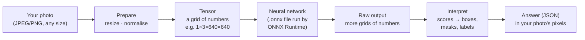

# Concepts

New to computer vision or to serving models? These three short pages explain the words the rest
of the documentation uses. No maths beyond "multiply and add".

## The whole idea in one picture

1. **A model is a big, fixed mathematical function.** It was *trained* once, by someone else,
   on millions of labelled pictures. VisionServe only *runs* it (this is called **inference**);
   it never trains.
2. **A model reads numbers, not pictures.** Each model expects images of one exact size, with
   pixel values scaled in one exact way. Getting this step exactly right matters as much as the
   model itself — see [From pixels to tensors](preprocessing.md).
3. **A model writes numbers, not answers.** A detector, for example, outputs hundreds of
   candidate boxes with a score for every class. Turning those into "a cat at x=210, y=54" is
   the job of *postprocessing*, which differs for every model family.
4. **The answer must point at your photo**, not at the resized copy the model saw. VisionServe
   maps every box and mask back to the original pixels.

## Pages in this section

- [What the models do](tasks.md) — detection, segmentation, open-vocabulary detection,
  depth, faces, text, classification, embeddings, grasping — each with a real example.
- [From pixels to tensors](preprocessing.md) — resizing, letterboxing, normalising, and how
  results are mapped back.
- [Model files and ONNX Runtime](onnx.md) — what an `.onnx` file is, what runs it, and how the
  GPU or CPU is chosen.

## A few words you will meet

| Word | Meaning |
|---|---|
| **Inference** | Running a trained model on new input. Everything VisionServe does. |
| **Tensor** | A multi-dimensional array of numbers (like a numpy array). An RGB image as a tensor is `1 × 3 × H × W`: one image, three colour channels, H rows, W columns. |
| **Bounding box (bbox)** | A rectangle around an object, here always `[x, y, width, height]` in the original photo's pixels, `(x, y)` being the top-left corner. |
| **Mask** | For every pixel, "is this part of the object?" — a black-and-white image. |
| **Confidence (`conf`)** | The model's score for a result, between 0 and 1. Results below a threshold are dropped. |
| **Prompt** | Extra input that tells a model *what* to look for: words (`"cat. laptop."`), a box, or a point. |
| **Execution provider (EP)** | The hardware back-end ONNX Runtime uses: CPU, CUDA (NVIDIA GPU), TensorRT, CoreML… |
| **Manifest** | The `manifest.yaml` next to a model's weights: what to load, how to prepare images, which licence. |
