# Model files and ONNX Runtime

## What is in an `.onnx` file?

A trained network is a long list of operations — "multiply by this matrix, add this vector,
apply this function" — plus the millions of numbers (the **weights**) those operations use.
[ONNX](https://onnx.ai) is an open file format for exactly that: a graph of operations with the
weights inside. Models trained in PyTorch, TensorFlow or JAX can be **exported** to ONNX once,
and then run anywhere without the framework.

```mermaid
flowchart LR
    T["Training<br/>(PyTorch, once,<br/>by the model authors)"] --> E["Export<br/>torch.onnx.export"]
    E --> F["model.onnx<br/>graph + weights"]
    F --> R["ONNX Runtime<br/>(inside VisionServe)"]
    R --> C["CPU"]
    R --> G["NVIDIA GPU<br/>(CUDA)"]
    R --> X["TensorRT / CoreML /<br/>DirectML / OpenVINO"]
```



VisionServe downloads `.onnx` files ready-made (`visionserve pull`) or converts a checkpoint you
have (`visionserve convert`, see [Clients and the converter](../architecture/clients.md)).

## What runs it?

[ONNX Runtime](https://onnxruntime.ai) (ORT), Microsoft's open-source inference engine, does all
the heavy maths. VisionServe loads ORT's shared library (`libonnxruntime.so`) when it starts and
talks to it through the Go binding
[`yalue/onnxruntime_go`](https://github.com/yalue/onnxruntime_go). This is a deliberate rule of
the project: **no hand-written neural-network kernels**, so every model benefits from ORT's
optimised CPU and GPU code.

An open model file gives you an ORT **session**: the graph loaded onto a device, ready to run.
Sessions are expensive (seconds to create, hundreds of MB of GPU memory), so VisionServe keeps
them alive between requests and frees them when a model has been idle — see
[Lifecycle manager](../architecture/lifecycle.md).

## CPU or GPU? Execution providers

ORT runs the same file on different hardware through **execution providers** (EPs). Each model's
manifest lists the EPs to try, in order; the first one that works is used, and the CPU is always
the last resort:

```yaml
runtime:
  prefer: [cuda, cpu]       # every shipped model
```

| EP | Hardware | Note |
|---|---|---|
| `cuda` | NVIDIA GPU | The default for every shipped model. |
| `tensorrt` | NVIDIA GPU / Jetson | Opt-in: `visionserve serve --tensorrt` or `VISIONSERVE_TENSORRT=1`. Faster, but measured 6.8 mAP worse on GroundingDINO for unseen words, and it rebuilds its engine for every new prompt length. |
| `coreml` | Apple Silicon | |
| `directml` | Windows GPUs | |
| `openvino` | Intel | |
| `cpu` | any | Always appended last. |

If an EP is missing (for example no GPU), ORT falls back silently to the next one. Set
`VISIONSERVE_TRACE=1` to log which EP each model really loaded on; every answer also carries a
`device` field (`cpu`, `gpu:0`, `gpu:0+trt`).

!!! code "Where in the code"
    - [`internal/engine/ort.go`](https://github.com/mtbui2010/vision_serve/blob/main/internal/engine/ort.go) — creating sessions with an EP chain and running them.
    - [`internal/engine/provider.go`](https://github.com/mtbui2010/vision_serve/blob/main/internal/engine/provider.go) — the EP allowlist and how the chain is resolved (`VISIONSERVE_EP`, `--tensorrt`).
    - [`internal/engine/onnxheader.go`](https://github.com/mtbui2010/vision_serve/blob/main/internal/engine/onnxheader.go) — reads a model's input and output names straight from the file.

## Same input, same answer?

On the CPU, ORT is deterministic: the same request always gives bit-identical output. On a GPU,
some kernels add numbers in an order that depends on what else the GPU is doing, so results can
differ in the last bits between runs — enough to flip a few pixels at the edge of a mask. If you
need bit-identical GPU results (for example to compare two builds), start the server with
`VISIONSERVE_DETERMINISTIC=1`. It is off by default because the accuracy numbers quoted in the
manifests were measured without it.
