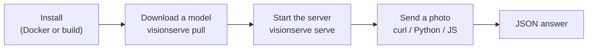

# Getting started

This page takes you from nothing to your first answer. Pick **Docker** if you just want to use
VisionServe, or **from source** if you want to read and change the code.



## 1. Install

=== "Docker (easiest)"

    ```bash
    # NVIDIA GPU (needs the nvidia-container-toolkit)
    docker run -d --gpus all -p 11435:11435 \
      -v ~/.visionserve_models:/root/.models \
      --name visionserve mtbui2010/visionserve:latest

    # CPU only
    docker run -d -p 11435:11435 \
      -v ~/.visionserve_models:/root/.models \
      --name visionserve mtbui2010/visionserve:latest-cpu
    ```

    Models are stored in `~/.visionserve_models` on your machine, so they survive restarts.
    Run commands inside the container with `docker exec visionserve visionserve <command>`.

=== "From source"

    You need **Go 1.22 or newer** and the **ONNX Runtime** shared library
    (`libonnxruntime.so`). New to Go? See [Go for this project](go/index.md).

    ```bash
    git clone https://github.com/mtbui2010/vision_serve.git
    cd vision_serve
    make build                       # -> bin/visionserve
    export ORT_DYLIB_PATH=/path/to/libonnxruntime.so
    ```

    `make serve` / `make run` find a CUDA-enabled ONNX Runtime for you through
    [`scripts/gpu-env.sh`](https://github.com/mtbui2010/vision_serve/blob/main/scripts/gpu-env.sh)
    and fall back to the CPU if there is none (`GPU=0` forces the CPU). The script only picks
    a library whose CUDA EP can load on your driver: an ORT built for CUDA 13 on a driver that
    supports CUDA 12.8 is skipped, and it prints which library it chose and why it skipped the
    others. `VISIONSERVE_TRACE=1` then shows `session for … active on EP cuda` per model.

## 2. Download a model

Model weights are not stored in git. The built-in catalog downloads them (from Hugging Face),
checks their size and SHA-256, and installs them atomically:

```bash
visionserve list                 # what is installed and what can be pulled
visionserve pull rf-detr         # object detector, ~100 MB
visionserve pull grounded-sam    # pulls its parts (GroundingDINO + MobileSAM) too
```

Each model lives in its own folder with a `manifest.yaml` that says which files to load, how to
prepare images and which licence applies. See [Models and manifests](architecture/models.md).

## 3. Start the server

```bash
visionserve serve                              # http://127.0.0.1:11435
visionserve serve --addr :11435                # reachable from other machines
visionserve serve --idle-unload-seconds 0      # keep models in memory
```

Models load the first time they are used and unload after a period without requests (300 s by
default), which frees GPU memory. Want to try one image without a server?

```bash
visionserve run rf-detr photo.jpg              # prints the JSON answer
```

## 4. Make a request

=== "curl"

    ```bash
    # objects
    curl -F model=rf-detr -F image=@photo.jpg http://127.0.0.1:11435/api/predict

    # anything you can name: words separated by " . "
    curl -F model=grounding-dino -F image=@photo.jpg -F "prompt=cat. laptop." \
         http://127.0.0.1:11435/api/predict

    # cut out the object inside a box: x,y,w,h in the photo's pixels
    curl -F model=mobile-sam -F image=@photo.jpg -F box=200,150,250,250 \
         http://127.0.0.1:11435/api/predict
    ```

=== "Python"

    ```bash
    pip install visionserve
    ```

    ```python
    from visionserve import Client

    client = Client("http://127.0.0.1:11435")
    res = client.predict("rf-detr", "photo.jpg")
    for d in res.detections:
        print(d.cls, round(d.conf, 2), d.bbox)      # bbox = [x, y, w, h]

    res = client.predict("grounded-sam", "photo.jpg", prompt="cat. laptop.")
    print(len(res.masks), "masks")
    ```

=== "JavaScript"

    ```bash
    npm install visionserve
    ```

    ```ts
    import { Client } from "visionserve";

    const client = new Client();                     // http://127.0.0.1:11435
    const res = await client.predict("rf-detr", "photo.jpg");
    console.log(res.detections);
    ```

Every option of `predict` (prompts, thresholds, size filters, `roi`, grasp bounds, …), what it
means and which models read it is in [Clients](clients/index.md).

## 5. Read the answer

```json
{
  "task": "detection",
  "model": "rf-detr",
  "device": "gpu:0",
  "detections": [
    { "class": "cat", "conf": 0.94, "bbox": [210, 54, 288, 301] }
  ],
  "duration_ms": 23.4
}
```

- `bbox` is always `[x, y, width, height]` in the pixels of **your** photo.
- Masks are compressed as run-length encoding (`rle`); the Python and JS clients decode them
  for you. See [Shared vision library](architecture/vision.md) for the format.
- `device` tells you where it ran: `cpu`, `gpu:0`, or `gpu:0+trt` with TensorRT.

!!! tip "Something went wrong?"
    Errors come back as `{"error": "..."}` with a meaningful HTTP status: `400` for a bad
    request (for example a missing prompt), `404` for an unknown model, `413` for an image that
    is too large, `503` when a model is overloaded (retry after the `Retry-After` header).
    Set `VISIONSERVE_TRACE=1` to see which hardware each model actually loaded on.

Next: [what the models do](concepts/tasks.md), or [how it works](architecture/index.md).
