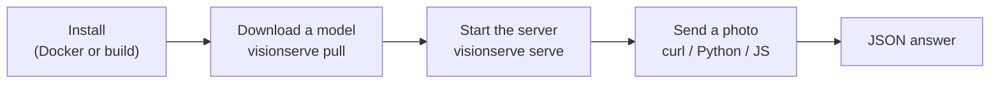

# Getting started

This page takes you from nothing to your first answer. Pick **Docker** if you just want to use
VisionServe, or **from source** if you want to read and change the code. Want to serve a model
you trained yourself? Do steps 1 to 3, then [section 6](#6-use-a-model-you-trained).



## 1. Install

=== "Docker (easiest)"

    ```bash
    # NVIDIA GPU (needs the nvidia-container-toolkit)
    docker run -d --gpus all -p 11435:11435 \
      -v ~/.visionserve_models:/root/.models \
      --name visionserve mtbui2010/visionserve:latest

    # CPU only
    docker run -d -p 11435:11435 \
      -v ~/.visionserve_models:/root/.models \
      --name visionserve mtbui2010/visionserve:latest-cpu
    ```

    Models are stored in `~/.visionserve_models` on your machine, so they survive restarts.
    Run commands inside the container with `docker exec visionserve visionserve <command>`.

=== "From source"

    You need **Go 1.22 or newer** and the **ONNX Runtime** shared library
    (`libonnxruntime.so`). New to Go? See [Go for this project](go/index.md).

    ```bash
    git clone https://github.com/mtbui2010/visionserve.git
    cd visionserve
    make build                       # -> bin/visionserve
    export ORT_DYLIB_PATH=/path/to/libonnxruntime.so
    ```

    `make serve` / `make run` find a CUDA-enabled ONNX Runtime for you through
    [`scripts/gpu-env.sh`](https://github.com/mtbui2010/visionserve/blob/main/scripts/gpu-env.sh)
    and fall back to the CPU if there is none (`GPU=0` forces the CPU). The script only picks
    a library whose CUDA EP can load on your driver: an ORT built for CUDA 13 on a driver that
    supports CUDA 12.8 is skipped, and it prints which library it chose and why it skipped the
    others. `VISIONSERVE_TRACE=1` then shows `session for … active on EP cuda` per model.

## 2. Download a model

Model weights are not stored in git. The built-in catalog downloads them (from Hugging Face),
checks their size and SHA-256, and installs them atomically:

```bash
visionserve list                 # what is installed and what can be pulled
visionserve pull rf-detr         # object detector, ~100 MB
visionserve pull grounded-sam    # pulls its parts (GroundingDINO + MobileSAM) too
```

Each model lives in its own folder with a `manifest.yaml` that says which files to load, how to
prepare images and which licence applies. See [Models and manifests](architecture/models.md).

## 3. Start the server

```bash
visionserve serve                              # http://127.0.0.1:11435
visionserve serve --addr :11435                # reachable from other machines
visionserve serve --idle-unload-seconds 0      # keep models in memory
```

Models load the first time they are used and unload after a period without requests (300 s by
default), which frees GPU memory. Want to try one image without a server?

```bash
visionserve run rf-detr photo.jpg              # prints the JSON answer
```

## 4. Make a request

=== "curl"

    ```bash
    # objects
    curl -F model=rf-detr -F image=@photo.jpg http://127.0.0.1:11435/api/predict

    # anything you can name: words separated by " . "
    curl -F model=grounding-dino -F image=@photo.jpg -F "prompt=cat. laptop." \
         http://127.0.0.1:11435/api/predict

    # cut out the object inside a box: x,y,w,h in the photo's pixels
    curl -F model=mobile-sam -F image=@photo.jpg -F box=200,150,250,250 \
         http://127.0.0.1:11435/api/predict
    ```

=== "Python"

    ```bash
    pip install visionserve
    ```

    ```python
    from visionserve import Client

    client = Client("http://127.0.0.1:11435")
    res = client.predict("rf-detr", "photo.jpg")
    for d in res.detections:
        print(d.cls, round(d.conf, 2), d.bbox)      # bbox = [x, y, w, h]

    res = client.predict("grounded-sam", "photo.jpg", prompt="cat. laptop.")
    print(len(res.masks), "masks")
    ```

=== "JavaScript"

    ```bash
    npm install visionserve
    ```

    ```ts
    import { Client } from "visionserve";

    const client = new Client();                     // http://127.0.0.1:11435
    const res = await client.predict("rf-detr", "photo.jpg");
    console.log(res.detections);
    ```

Every option of `predict` (prompts, thresholds, size filters, `roi`, grasp bounds, …), what it
means and which models read it is in [Clients](clients/index.md).

## 5. Read the answer

```json
{
  "task": "detection",
  "model": "rf-detr",
  "device": "gpu:0",
  "detections": [
    { "class": "cat", "conf": 0.94, "bbox": [210, 54, 288, 301] }
  ],
  "duration_ms": 23.4
}
```

- `bbox` is always `[x, y, width, height]` in the pixels of **your** photo.
- Masks are compressed as run-length encoding (`rle`); the Python and JS clients decode them
  for you. See [Shared vision library](architecture/vision.md) for the format.
- `device` tells you where it ran: `cpu`, `gpu:0`, or `gpu:0+trt` with TensorRT.

!!! tip "Something went wrong?"
    Errors come back as `{"error": "..."}` with a meaningful HTTP status: `400` for a bad
    request (for example a missing prompt), `404` for an unknown model, `413` for an image that
    is too large, `503` when a model is overloaded (retry after the `Retry-After` header).
    Set `VISIONSERVE_TRACE=1` to see which hardware each model actually loaded on.

## 6. Use a model you trained

Three steps, one command each. The example is an RF-DETR detector checkpoint, `best.pth`.

### Step 1: convert it

```console
$ visionserve convert rfdetr best.pth --name my-detector
```

This makes an ONNX file (the format VisionServe runs) and a `manifest.yaml` (how to use it),
checks that they give the same answers as your checkpoint, and installs the model as
`my-detector`. It runs the converter's Docker image, so you need Docker. Which command for my
file?

| Your file | Command |
|---|---|
| RF-DETR checkpoint (`.pth`) | `visionserve convert rfdetr best.pth --name NAME` |
| Hugging Face model (folder or hub id) | `visionserve convert hf google/vit-base-patch16-224 --name NAME` |
| TorchScript, PyTorch `state_dict`, Keras, TFLite | `visionserve convert torchscript model.pt --name NAME --task classification --input 224x224 --license MIT` (or `pytorch`, `keras`, `tflite`) |
| An `.onnx` file you already have | `visionserve import model.onnx --name NAME --task detection --license Apache-2.0` |

The end of a real run (this checkpoint has no class names inside, so it also passed
`--labels classes.txt`; `--images` gave the check real photos):

```console
$ visionserve convert rfdetr best.pth --name my-detector --labels classes.txt --images ./photos
...
installed my-detector (detection, Apache-2.0) -> …/models/my-detector  [3 files]
...
VisionServe convert report: my-detector (detection, rf-detr)
overall: PASS
  tier  check                                           status  result
  A     ONNX vs framework parity (synthetic + photo)    PASS    max|Δ|/scale 9.89e-04 over 3 run(s), tolerance 0.001; ...
  B1    preprocessing vs rfdetr predict() preprocessi~  PASS    mean|Δ| 0.38 gray levels (tensor 0.00666), max 3.1 levels, p99 1.5; 8 image(s)
  B2    outputs vs rfdetr RFDETR.predict                PASS    42/43 matched (97.7%), |Δconf| mean 0.00293 max 0.0447, box err mean 0.086 px max 4.14 px (ref 42 / served 44 dets)
```

`overall: PASS`: the ONNX file computes what PyTorch computes (A), the server prepares photos like
training (B1) and finds the same objects (B2).

### Step 2: run it

```console
$ visionserve run my-detector photo.jpg
...
predict: model=my-detector task=detection device=gpu:0  client=7032.2ms server=997.6ms  (4 detections, 0 masks, 0 grasps)
```

Or through the API of a running server, exactly as for the built-in models (`visionserve serve`
picks the new model up without a restart):

```python
from visionserve import Client

client = Client("http://127.0.0.1:11435")
res = client.predict("my-detector", "photo.jpg")
for d in res.detections:
    print(d.cls, round(d.conf, 2), [round(v) for v in d.bbox])
```

```console
laptop 0.92 [11, 173, 281, 249]
cat 0.89 [318, 182, 299, 183]
chair 0.78 [178, 186, 160, 132]
person 0.54 [3, 4, 635, 472]
```

### Step 3 (optional): check it on your labelled photos

With a server running, `check` compares what the server does with what training did, and
measures accuracy if you give it labels (here 200 COCO photos and their annotations):

```console
$ visionserve check my-detector --images ./val200/images --labels ./val200/instances.json
PASS: my-detector behaves like its training pipeline on 8 photos (preprocessing within 0.4 gray levels); outputs were not compared (no reference model).
...
  Accuracy on your labels (C)  INFO    On your 200 labelled photos the served model scores mAP 43.8
                                       (mAP50 55.7) at its confidence threshold 0.5. There is no
                                       reference model to compare with, so keep this number for your
                                       records (--checkpoint adds the original model's score).
```

More on each step, and what to do when a line says `WARN` or `FAIL`:
[Use a model you trained](guides/use-your-model.md) and
[Check it behaves like training](guides/check-training.md).

<small>The runs above: 5 October 2026, RTX A6000, ONNX Runtime 1.26, the official
`rf-detr-nano.pth` as `best.pth`, COCO val2017 photos (CC BY 2.0). `convert` and `check` ran with
the converter's Python package from `clients/python` (the code its Docker image runs) and a
scratch registry, shown as `…/models`; the Python client talked to a server on another port.</small>

Next: [what the models do](concepts/tasks.md), the [guides](guides/index.md), or
[how it works](architecture/index.md).
