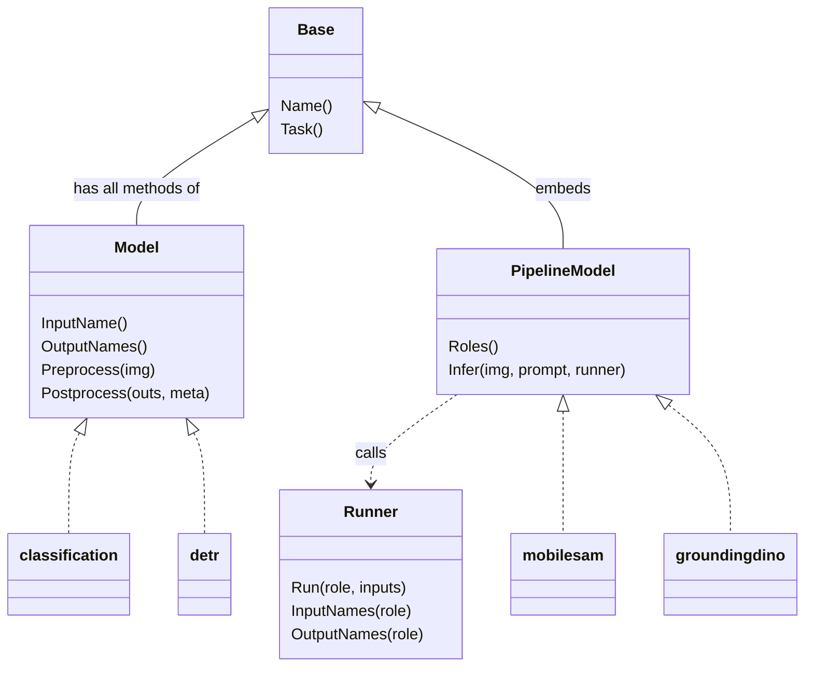
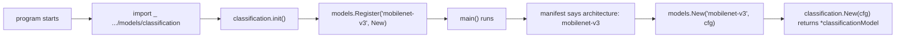

# 3. Interfaces

!!! abstract "What you'll learn"
    - What a Go interface is, and why a type never says "implements".
    - The model interfaces at the heart of VisionServe: `Base`, `Model`, `PipelineModel`, `Runner`.
    - The registry pattern: `models.Register` + `init()` + a blank import.
    - How lifecycle picks the right path with a type switch and optional interfaces.
    - How small interfaces let the HTTP tests run without ONNX Runtime.

## An interface is a list of methods

An interface type lists method signatures. **Any** type that has those methods satisfies
the interface automatically. Nothing is declared: there is no `implements`, no base class
to inherit from. If you know Python's `typing.Protocol`, it is the same idea, except the
compiler checks it.

This is the interface every plain model satisfies:

```go title="internal/models/model.go (lines 40-65)"
// Model is the interface every model must implement.
//
// Design note: Infer (calling the ONNX session) is NOT part of this interface —
// that is handled by engine + lifecycle. A model only focuses on pre/postprocess
// (the part that differs between architectures). This is a clean seam for
// community contributions.
type Model interface {
	// Name identifies the model (matches the directory / manifest name).
	Name() string

	// Task is the type of CV task.
	Task() Task

	// InputName / OutputNames give the I/O tensor names the engine must bind.
	// Returning nil/"" means "let the engine auto-detect from the ONNX file".
	InputName() string
	OutputNames() []string

	// Preprocess: original image -> input tensor (resized/normalized/letterboxed).
	// Also returns metadata so postprocess can map results back to ORIGINAL image coordinates.
	Preprocess(img image.Image) (engine.Tensor, PreprocessMeta, error)

	// Postprocess: raw output tensors -> normalized Result.
	// outs follow the order of OutputNames() (or the model's export order if left empty).
	Postprocess(outs []engine.Tensor, meta PreprocessMeta) (Result, error)
}
```

[model.go#L40-L65 on GitHub](https://github.com/mtbui2010/vision_serve/blob/main/internal/models/model.go#L40-L65)

The classification package has a private struct with exactly these six methods
([classification.go#L46-L59](https://github.com/mtbui2010/vision_serve/blob/main/internal/models/classification/classification.go#L46-L59)).
That is all it takes for `*classificationModel` to be a `models.Model`.

Because nothing is declared, nothing would complain if a method were misspelled: the type
would simply stop being a `models.Model`. Every model package therefore adds one line that
asks the compiler to check it (more on this trick in "Try it" below):

```go title="internal/models/classification/classification.go (lines 21-23)"
// Compile-time checks of the interfaces lifecycle type-asserts at load: a signature drift
// fails the build instead of silently changing how the model is run.
var _ models.Model = (*classificationModel)(nil)
```

[classification.go#L21-L23 on GitHub](https://github.com/mtbui2010/vision_serve/blob/main/internal/models/classification/classification.go#L21-L23)

=== "Go"

    ```go
    type Model interface {
        Name() string
        Preprocess(img image.Image) (engine.Tensor, PreprocessMeta, error)
        // ...
    }

    type classificationModel struct{ cfg models.Config }

    func (m *classificationModel) Name() string { return m.cfg.Name }
    // ... the other methods; no "implements" anywhere
    ```

=== "Python"

    ```python
    class Model(Protocol):
        def name(self) -> str: ...
        def preprocess(self, img) -> tuple[Tensor, Meta]: ...

    class ClassificationModel:          # no base class needed with Protocol
        def name(self) -> str:
            return self.cfg.name
    ```

### The family of model interfaces

`Model` is one of a few small interfaces. They build on each other by **embedding**
(an interface can list another interface, which adds all its methods):

```go title="internal/models/model.go (lines 124-127, 283-289, trimmed)"
type Base interface {
	Name() string
	Task() Task
}

// ...
type PipelineModel interface {
	Base
	// Roles lists the session keys this model needs; each must exist in Config.Files.
	Roles() []string
	// Infer runs the full pipeline and returns the unified Result.
	Infer(img image.Image, prompt Prompt, r Runner) (Result, error)
}
```

[model.go#L124-L127](https://github.com/mtbui2010/vision_serve/blob/main/internal/models/model.go#L124-L127),
[#L283-L289](https://github.com/mtbui2010/vision_serve/blob/main/internal/models/model.go#L283-L289)



A plain `Model` never runs ONNX itself: lifecycle runs the session between `Preprocess`
and `Postprocess`. A `PipelineModel` (MobileSAM's encoder + decoder, GroundingDINO's text
prompt) drives its own stages, but only through a `Runner`, an interface that lifecycle
implements. The model can run sessions by role; it cannot create or free them. That is
how CLAUDE.md's rule "lifecycle owns every session" is enforced in code: the model simply
has no method that could do anything else.

## The registry: `Register`, `init()` and a blank import

How does the server find the Go code for `architecture: mobilenet-v3` in a manifest?
Through a map from names to **factory functions**:

```go title="internal/models/model.go (lines 291-321, trimmed)"
// Factory builds a model (Model or PipelineModel) from Config (parsed manifest).
type Factory func(cfg Config) (Base, error)

var (
	mu       sync.RWMutex
	registry = map[string]Factory{}
)

// Register registers a factory for a model type. Call it in the model package's init().
// Panics on a duplicate name — this is a programming error at startup, not a runtime error.
func Register(name string, f Factory) {
	mu.Lock()
	defer mu.Unlock()
	if _, dup := registry[name]; dup {
		panic(fmt.Sprintf("models: factory %q already registered", name))
	}
	registry[name] = f
}

// ...
func New(name string, cfg Config) (Base, error) {
	mu.RLock()
	f, ok := registry[name]
	mu.RUnlock()
	if !ok {
		return nil, fmt.Errorf("models: no factory registered for %q (registered: %v)", name, Registered())
	}
	return f(cfg)
}
```

[model.go#L291-L321 on GitHub](https://github.com/mtbui2010/vision_serve/blob/main/internal/models/model.go#L291-L321)

`Factory` is a *function type*: functions are values in Go, like in Python. Each model
package registers its factory in a function called `init`:

```go title="internal/models/classification/classification.go (lines 25-28)"
func init() {
	models.Register("efficientnet", New)
	models.Register("mobilenet-v3", New)
}
```

[classification.go#L25-L28 on GitHub](https://github.com/mtbui2010/vision_serve/blob/main/internal/models/classification/classification.go#L25-L28)

`init` is special: Go runs it automatically when the package is loaded, before `main()`.
But a package is only loaded if something imports it. Nothing calls the classification
package by name, so `cmd/visionserve/main.go` imports it with `_` (the blank import from
chapter 1). This is the whole plug-in mechanism:



In Python you would get the same effect with a decorator that fills a dict at import time,
plus an `import` in some `__init__.py`. The difference is that Go has no dynamic import: a
model package that is not imported somewhere is simply not in the binary.

!!! note "Why `Register` may panic"
    CLAUDE.md says "no panics in normal code paths". `Register` only runs inside `init()`,
    before the server starts. Two packages registering the same name is a programmer mistake
    that must stop the build from shipping, not a request-time error. Everything that can go
    wrong while serving returns an `error` instead (chapter 4).

## Picking the path: type switches and optional interfaces

`models.New` returns a `Base`. Lifecycle then asks which richer interface the value has,
with a **type switch**:

```go title="internal/lifecycle/load.go (lines 165-167, 212, 242-244, trimmed)"
	var sess *Session
	switch mdl := base.(type) {
	case models.PipelineModel:
		// ... open one session per role, newPipelineSession(...)
	case models.Model:
		// ... open one session, newSimpleSession(...)
	default:
		return nil, fmt.Errorf("lifecycle: model %q implements neither Model nor PipelineModel", name)
	}
```

[load.go#L165-L244 on GitHub](https://github.com/mtbui2010/vision_serve/blob/main/internal/lifecycle/load.go#L165-L244)

Inside each `case`, `mdl` has the concrete interface type, so `mdl.Roles()` compiles in the
first branch and `mdl.Preprocess(...)` in the second.

To ask about *one* interface, use a **type assertion** with comma-ok. This is how optional
features work: a pipeline that wants its `Infer` serialised also implements
`models.Exclusive`, and lifecycle checks for it:

```go title="internal/lifecycle/session.go (lines 77-90)"
func newPipelineSession(name string, task api.Task, p models.PipelineModel, engs map[string]engine.Runnable, idle time.Duration, now time.Time) *Session {
	ex, ok := p.(models.Exclusive)
	return &Session{
		name:        name,
		task:        task,
		device:      pipelineDevice(engs),
		pipeline:    p,
		engines:     engs,
		exclusive:   ok && ex.Exclusive(),
		inferLock:   make(chan struct{}, 1),
		idleTimeout: idle,
		lastUsed:    now,
	}
}
```

[session.go#L77-L90 on GitHub](https://github.com/mtbui2010/vision_serve/blob/main/internal/lifecycle/session.go#L77-L90)

In Python you would write `isinstance(p, Exclusive) and p.exclusive()` or
`getattr(p, "exclusive", None)`. `models.PoolSizer` works the same way
([load.go#L175-L180](https://github.com/mtbui2010/vision_serve/blob/main/internal/lifecycle/load.go#L175-L180)).
You can even assert to an interface written on the spot:
`r.(interface{ Size() int })` in
[session.go#L240-L245](https://github.com/mtbui2010/vision_serve/blob/main/internal/lifecycle/session.go#L240-L245).

## Two implementations behind one interface

`engine.Runnable` is what lifecycle stores for each ONNX graph. Both a single session and
a pool of identical sessions satisfy it, so lifecycle does not care which one it holds:

```go title="internal/engine/pool.go (lines 8-22)"
// Runnable is satisfied by both *Session and *SessionPool, so lifecycle can hold
// either behind the same interface without knowing which is which.
//
// ctx bounds the WAIT for the session, not the inference: a call whose ctx is done before it gets
// the session (the worker thread of a single session, a free member of a pool) returns an error
// wrapping ctx.Err() and runs nothing. Once ONNX Runtime has the job it runs to the end (a Run
// cannot be interrupted) and the call returns its result.
type Runnable interface {
	Run(ctx context.Context, inputs []Tensor) ([]Tensor, error)
	RunNamed(ctx context.Context, inputs map[string]Tensor) ([]Tensor, error)
	InputNames() []string
	OutputNames() []string
	ActiveEP() Provider
	Close() error
}
```

[pool.go#L8-L22 on GitHub](https://github.com/mtbui2010/vision_serve/blob/main/internal/engine/pool.go#L8-L22)

The first argument, `ctx context.Context`, is Go's standard way to say "this call belongs to a
request, and the request may be cancelled"; chapter 5 shows it in use.

And the `models.Runner` a pipeline receives is a tiny adapter over a map of those. It also
carries the request's `ctx`, so a model's `Infer` does not need a `ctx` parameter of its own:

```go title="internal/lifecycle/session.go (lines 247-261)"
// runner is the lifecycle-backed implementation of models.Runner: it exposes the
// loaded sessions to a PipelineModel by role, without giving away ownership. ctx is the request's:
// each call waits for its session only while the request is still wanted.
type runner struct {
	ctx     context.Context
	engines map[string]engine.Runnable
}

func (r runner) Run(role string, inputs map[string]engine.Tensor) ([]engine.Tensor, error) {
	s, ok := r.engines[role]
	if !ok {
		return nil, fmt.Errorf("lifecycle: no ONNX session for role %q", role)
	}
	return s.RunNamed(r.ctx, inputs)
}
```

[session.go#L247-L261 on GitHub](https://github.com/mtbui2010/vision_serve/blob/main/internal/lifecycle/session.go#L247-L261)

## Small interfaces make testing easy

The HTTP server does not depend on `*lifecycle.Manager` directly. It declares the few
methods it needs as an interface, in its own package:

```go title="internal/server/server.go (lines 27-43)"
// modelRuntime is what the HTTP layer needs from lifecycle.Manager. It is an interface so the
// handler tests can drive a fake (admission order, cancellation, status mapping) without ONNX.
//
// Every call that can wait takes the request's context: when the client leaves, the runtime stops
// waiting (for the model to load, a session, a model's lock) and returns an error wrapping
// ctx.Err(), which the handlers answer as errClientGone (499).
type modelRuntime interface {
	Admit(ctx context.Context, name string) (release func(), err error)
	Load(ctx context.Context, name string) error
	Unload(name string) error
	IsLoaded(name string) bool
	PredictPrompt(ctx context.Context, name string, img image.Image, prompt models.Prompt) (api.Result, error)
	InferTensor(ctx context.Context, name string, in engine.Tensor) (api.Result, error)
	Explain(ctx context.Context, name string, img image.Image, req lifecycle.ExplainRequest) (lifecycle.ExplainResult, error)
	Preprocess(ctx context.Context, name string, img image.Image, prompt models.Prompt) (lifecycle.PreprocessResult, error)
	Close()
}
```

[server.go#L27-L43 on GitHub](https://github.com/mtbui2010/vision_serve/blob/main/internal/server/server.go#L27-L43)

`*lifecycle.Manager` has all these methods, so production code passes the real manager
([server.go#L54-L56](https://github.com/mtbui2010/vision_serve/blob/main/internal/server/server.go#L54-L56)).
The tests pass a `fakeRuntime` that records calls and returns canned answers:

```go title="internal/server/fake_test.go (lines 23-43, 105-117, trimmed)"
// fakeRuntime stands in for lifecycle.Manager: it records the order of calls and what each
// inference call received, and returns canned answers. mu guards events and every field an
// inference call records (prompt, img, explain, tensor).
type fakeRuntime struct {
	mu     sync.Mutex
	events []string

	admitErr  error
	// ...
	runErr    error         // returned by every inference call
	result    api.Result
	// ...
}

// ...
func (f *fakeRuntime) PredictPrompt(ctx context.Context, name string, img image.Image, p models.Prompt) (api.Result, error) {
	f.event("predict:" + name)
	// ...
	if err := f.wait(ctx); err != nil {
		return api.Result{}, err
	}
	if f.runErr != nil {
		return api.Result{}, f.runErr
	}
	return f.result, nil
}
```

[fake_test.go#L23-L117 on GitHub](https://github.com/mtbui2010/vision_serve/blob/main/internal/server/fake_test.go#L23-L117)

`wait` lets a test hold a call "waiting for the model" and then cancel the request's
context, to check that the handler answers 499 and releases its admission slot.

The same idea, even smaller: `server.Predict` takes a one-method `Predictor`
([predict.go#L13-L16](https://github.com/mtbui2010/vision_serve/blob/main/internal/server/predict.go#L13-L16)),
which is why both the HTTP handler and the `visionserve run` command can share it.

!!! tip "Go proverb: accept interfaces, return structs"
    `newServer` *accepts* the `modelRuntime` interface; `NewManager` *returns* a concrete
    `*Manager`. Define an interface where it is **used**, with only the methods that user
    needs. You rarely need to design interfaces up front.

## Try it

1. Read the interfaces from the terminal:
   ```bash
   go doc ./internal/models PipelineModel
   go doc ./internal/models Runner
   ```
2. Watch the compiler prove that a type satisfies an interface. `classification.go`
   already contains the check:
   ```go
   var _ models.Model = (*classificationModel)(nil)
   ```
   It declares a variable named `_` (thrown away) of type `models.Model` and assigns it a
   nil `*classificationModel`; the assignment only compiles if the type has every method.
   `go build ./internal/models/classification/` succeeds. Now rename the method
   `Postprocess` to `PostProcess` in `classification.go` and build again:
   ```console
   $ go build ./internal/models/classification/
   # visionserve/internal/models/classification
   internal/models/classification/classification.go:23:22: cannot use (*classificationModel)(nil) (value of type *classificationModel) as models.Model value in variable declaration: *classificationModel does not implement models.Model (missing method Postprocess)
   		have PostProcess([]engine.Tensor, preprocess.Meta) (api.Result, error)
   		want Postprocess([]engine.Tensor, preprocess.Meta) (api.Result, error)
   ```
   Without that line the typo would compile, and you would only find out when a request
   loads the model: `lifecycle: model "mobilenet-v3" implements neither Model nor
   PipelineModel`. That is why every model package now has one (`models.Model` or
   `models.PipelineModel`). Undo the rename.
3. Run the HTTP tests that use the fake runtime:
   ```bash
   go test ./internal/server -run 'TestHandlersMapErrorsToStatus|TestAdmitBeforeDecode' -v
   ```
4. Run the lifecycle tests for the optional `Exclusive` interface:
   ```bash
   go test ./internal/lifecycle -run Exclusive -v
   ```

## Recap

- An interface is a set of methods; any type with those methods satisfies it, with no declaration.
- `Base` → `Model` (lifecycle runs ONNX) or `PipelineModel` (the model chains sessions through a `Runner`).
- Models register a factory in `init()`; a blank import in `cmd/visionserve/main.go` makes the
  package part of the binary.
- Lifecycle uses a type switch for the main path and comma-ok assertions for optional
  interfaces like `Exclusive` and `PoolSizer`.
- Small interfaces declared where they are used (`modelRuntime`, `Predictor`) let tests swap
  in fakes without ONNX Runtime.
- `var _ I = (*T)(nil)` asks the compiler to check that `*T` satisfies `I`.
