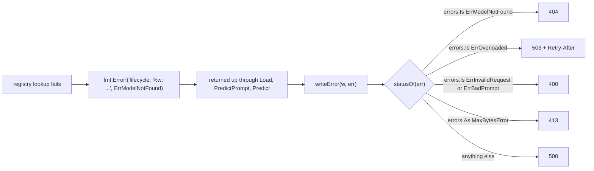

# 4. Errors

!!! abstract "What you'll learn"
    - Errors in Go are ordinary values that functions return, not exceptions.
    - How to add context to an error with `fmt.Errorf("...: %w", err)` without losing the cause.
    - Sentinel errors, `errors.Is` and `errors.As`, and how VisionServe turns them into HTTP
      status codes in exactly one place.
    - Custom error types with `Is` and `Unwrap`.
    - `defer` for cleanup, and why the project (almost) never panics.

## Errors are values

`error` is a built-in interface with one method:

```go
type error interface {
	Error() string
}
```

A function that can fail returns an `error` as its **last** result. `nil` means success.
The caller checks it right away. You saw this in every snippet so far:

=== "Go"

    ```go
    in, meta, err := s.model.Preprocess(img)
    if err != nil {
    	return api.Result{}, err
    }
    outs, err := s.engine.Run([]engine.Tensor{in})
    if err != nil {
    	return api.Result{}, err
    }
    ```

=== "Python"

    ```python
    # errors are raised and propagate by themselves
    inp, meta = self.model.preprocess(img)
    outs = self.engine.run([inp])
    ```

([session.go#L191-L201](https://github.com/mtbui2010/vision_serve/blob/main/internal/lifecycle/session.go#L191-L201))

Yes, Go is more verbose here. The benefit: every place that can fail is visible in the
code, and you decide at each step what to do. There is also a hard reason in a server: in
Go, a crash (a *panic*, see below) that escapes a goroutine ends the **whole process**, every
other request included. A returned error only ends the request that caused it.

## Adding context: `fmt.Errorf` with `%w`

A bare `"file not found"` is useless in a log. Each layer adds what it knows, with
`fmt.Errorf`. The `%w` verb **wraps** the original error: the message gets longer, and the
original stays reachable for code that wants to inspect it.

```go title="internal/lifecycle/load.go (lines 349-357)"
	if !ok {
		return nil, nil, fmt.Errorf("lifecycle: %w: %q is not in the registry", ErrModelNotFound, name)
	}
	man := entry.Manifest

	if !man.WeightsExist() {
		return nil, nil, fmt.Errorf("lifecycle: %w: no weights for %q at %s — download them per the README in the model directory",
			ErrModelNotFound, name, man.ModelFilePath())
	}
```

[load.go#L349-L357 on GitHub](https://github.com/mtbui2010/vision_serve/blob/main/internal/lifecycle/load.go#L349-L357)

A client asking for a model that does not exist then receives:

```json
{"error":"lifecycle: model not found: \"nope\" is not in the registry"}
```

with HTTP status 404. How the server knows "404" from that error is the next section.

!!! tip "`%w` versus `%v`"
    Both print the same text. Only `%w` keeps the chain, so that `errors.Is` can find the
    wrapped error later. Use `%w` whenever a caller might need to know *what* went wrong.
    `%v` is a deliberate choice to hide the cause: `ParsePrompt` writes
    `fmt.Errorf("invalid box %q: %v", part, err)`
    ([prompt.go#L26](https://github.com/mtbui2010/vision_serve/blob/main/internal/models/prompt.go#L26)),
    because callers only need the message, not the `strconv` error inside.

## Sentinel errors and `errors.Is`

A **sentinel** is an error value created once, at package level, that callers compare
against. Lifecycle defines three, and they are the contract with the HTTP layer:

```go title="internal/lifecycle/errors.go (lines 1-15)"
package lifecycle

import "errors"

// Typed errors: the contract between the runtime and the HTTP layer. The runtime wraps them
// (fmt.Errorf("...: %w", ErrModelNotFound)); the server maps them with errors.Is to a status code,
// so a missing model is a 404, a bad prompt a 400 and a full queue a 503 — not all 500.
var (
	// ErrModelNotFound: the name is not in the registry, or its weights are missing.
	ErrModelNotFound = errors.New("model not found")
	// ErrInvalidRequest: the request itself is wrong (prompt, template, option values).
	ErrInvalidRequest = errors.New("invalid request")
	// ErrOverloaded: admission control refused the request (too many waiting for this model).
	ErrOverloaded = errors.New("model overloaded")
)
```

[errors.go#L1-L15 on GitHub](https://github.com/mtbui2010/vision_serve/blob/main/internal/lifecycle/errors.go#L1-L15)

`errors.Is(err, ErrModelNotFound)` walks down the chain of `%w` wraps and reports whether
any link *is* that sentinel. The server does all of its status mapping in one function:

```go title="internal/server/errors.go (lines 48-75)"
// statusOf maps an error to its HTTP status. It is the ONLY place a failure's status is chosen:
//
//	oversized body / upload            413
//	lifecycle.ErrModelNotFound         404
//	lifecycle.ErrOverloaded            503 (+ Retry-After)
//	lifecycle.ErrInvalidRequest, parse 400
//	client disconnected                499
//	anything else                      500
//
// Size comes first: a form that failed to parse BECAUSE it was too big is a 413, not a 400.
func statusOf(err error) int {
	var maxBytes *http.MaxBytesError
	var tooLarge tooLargeError
	switch {
	case errors.As(err, &maxBytes), errors.As(err, &tooLarge):
		return http.StatusRequestEntityTooLarge
	case errors.Is(err, lifecycle.ErrModelNotFound):
		return http.StatusNotFound
	case errors.Is(err, lifecycle.ErrOverloaded):
		return http.StatusServiceUnavailable
	case errors.Is(err, lifecycle.ErrInvalidRequest), errors.Is(err, models.ErrBadPrompt):
		return http.StatusBadRequest
	case errors.Is(err, errClientGone):
		return statusClientClosedRequest
	default:
		return http.StatusInternalServerError
	}
}
```

[server/errors.go#L48-L75 on GitHub](https://github.com/mtbui2010/vision_serve/blob/main/internal/server/errors.go#L48-L75)



In Python you would define exception classes (`class ModelNotFound(Exception)`) and
catch them in a middleware. Here the "class" is a value, and `errors.Is` replaces
`except ModelNotFound`.

### `errors.As`: getting at a typed error

`errors.Is` compares with one value. `errors.As` instead looks for an error of a given
**type** in the chain and, if found, stores it in the variable you pass. Above,
`errors.As(err, &maxBytes)` finds the `*http.MaxBytesError` that `net/http` returns when an
upload exceeds the body limit, however many layers wrapped it. It is like
`except MaxBytesError as e:`.

## Custom error types

Any type with an `Error() string` method is an error. Two optional methods make it play
well with the chain:

- `Unwrap() error` returns the wrapped cause (what `%w` does for you).
- `Is(target error) bool` lets the type say "count me as that sentinel".

Models use this to mark "the caller got the prompt wrong" without changing the message:

```go title="internal/models/prompt.go (lines 84-96)"
// ErrBadPrompt matches (errors.Is) every error a model returns for a prompt the caller got wrong
// — a missing text prompt, a box/point where text is needed, an unknown template — so the HTTP
// layer answers 400 instead of 500. Models mark such errors with BadPrompt.
var ErrBadPrompt = errors.New("invalid prompt")

// BadPrompt marks err as the caller's mistake (errors.Is(err, ErrBadPrompt)) without changing
// its message.
func BadPrompt(err error) error { return badPrompt{err} }

type badPrompt struct{ error }

func (b badPrompt) Unwrap() error      { return b.error }
func (badPrompt) Is(target error) bool { return target == ErrBadPrompt }
```

[prompt.go#L84-L96 on GitHub](https://github.com/mtbui2010/vision_serve/blob/main/internal/models/prompt.go#L84-L96)

`badPrompt` **embeds** the `error` interface (chapter 2), so it gets the wrapped error's
`Error()` method for free: the message stays exactly what the model wrote. GroundingDINO
uses it when the text prompt is missing:

```go title="internal/models/groundingdino/groundingdino.go (lines 137-141)"
// Infer runs the full open-vocab detection pipeline for the text prompt.
func (m *groundingDINO) Infer(img image.Image, prompt models.Prompt, r models.Runner) (models.Result, error) {
	if strings.TrimSpace(prompt.Text) == "" {
		return models.Result{}, models.BadPrompt(fmt.Errorf("grounding-dino requires a text prompt, e.g. --prompt \"cat. remote.\""))
	}
```

[groundingdino.go#L137-L141 on GitHub](https://github.com/mtbui2010/vision_serve/blob/main/internal/models/groundingdino/groundingdino.go#L137-L141)

The server's `requestError` does the same for malformed HTTP requests and answers
`true` for `lifecycle.ErrInvalidRequest`
([server/errors.go#L23-L40](https://github.com/mtbui2010/vision_serve/blob/main/internal/server/errors.go#L23-L40)).

!!! note "When you write a model"
    Return plain `fmt.Errorf` errors for real failures (a tensor with the wrong shape is a
    500: the server or the export is broken). Wrap with `models.BadPrompt(...)` only when the
    *request* is wrong, so the client gets a 400 and knows it must fix its input.

## `defer`: cleanup that always runs

`defer f()` schedules `f()` to run when the surrounding function returns, whichever
`return` it takes, and also during a panic. It replaces Python's `try/finally` and `with`.
Several defers run in reverse order (last in, first out).

The engine must free every ONNX Runtime tensor it creates, on success and on every error
path. Defer makes that hard to get wrong:

```go title="internal/engine/ort.go (lines 509-534, trimmed)"
func (s *Session) runOnThread(inputs []Tensor) ([]Tensor, error) {
	inVals := make([]ort.Value, 0, len(inputs))
	for i, t := range inputs {
		// ... create the ORT tensor for input i
		if err != nil {
			destroyValues(inVals)
			return nil, fmt.Errorf("engine: failed to create input tensor #%d (%q): %w", i, s.inputNames[i], err)
		}
		inVals = append(inVals, tensor)
	}
	defer destroyValues(inVals)

	// nil outputs -> ORT allocates; we read them back after Run.
	outVals := make([]ort.Value, len(s.outputNames))
	if err := s.sess.Run(inVals, outVals); err != nil {
		return nil, fmt.Errorf("engine: Run failed: %w", err)
	}
	defer destroyValues(outVals)
	// ... copy the outputs into Go slices and return them
```

[ort.go#L509-L548 on GitHub](https://github.com/mtbui2010/vision_serve/blob/main/internal/engine/ort.go#L509-L548)

=== "Go"

    ```go
    m.mu.Lock()
    defer m.mu.Unlock()
    // ... any number of returns below; the lock is always released
    ```

=== "Python"

    ```python
    with self.mu:
        ...  # released when the block exits
    ```

The two most common defers in this repository are `defer mu.Unlock()` right after
`mu.Lock()` and `defer release()` right after taking a resource
([manager.go#L104-L108](https://github.com/mtbui2010/vision_serve/blob/main/internal/lifecycle/manager.go#L104-L108)).

## Panics: only for "impossible", recovered at the edges

`panic` is Go's crash: it unwinds the stack and, unless something calls `recover()`, ends
the program. CLAUDE.md says **no panics in normal code paths**, and the code follows it:
bad input, missing files, ONNX failures are all `error`s.

Panics can still come from bugs (an index out of range) or from third-party code. The
project puts `recover()` at the two places where a panic would otherwise take the whole
server down, and turns it into an error:

```go title="internal/lifecycle/load.go (lines 74-84, trimmed)"
// lead runs the load for the request that started it and publishes the result: the session goes
// live, unless an Unload or Close arrived meanwhile — then it is closed and the load fails.
// A panic while building (a model factory, a binding) becomes an error: it used to leave the
// name in m.loading forever, so every later request for that model hung.
func (m *Manager) lead(name string, call *loadCall) (err error) {
	var sess *Session
	defer func() {
		if r := recover(); r != nil {
			log.Printf("lifecycle: loading %q panicked: %v\n%s", name, r, debug.Stack())
			sess, err = nil, fmt.Errorf("lifecycle: loading %q panicked: %v", name, r)
		}
		// ...
```

[load.go#L74-L107 on GitHub](https://github.com/mtbui2010/vision_serve/blob/main/internal/lifecycle/load.go#L74-L107)

`recover()` only works inside a deferred function. Because `lead` has a *named* result
`(err error)`, the deferred function can overwrite what the function returns. The other
safety net is on each ONNX session's worker thread
([ort.go#L487-L500](https://github.com/mtbui2010/vision_serve/blob/main/internal/engine/ort.go#L487-L500)),
which chapter 5 explains.

## Try it

1. Run the tests that pin the error contract:
   ```bash
   go test ./internal/server -run TestStatusOf -v
   go test ./internal/lifecycle -run TestTypedErrors -v
   go test ./internal/models -run TestBadPrompt -v
   ```
2. See `%w` matter. In `internal/lifecycle/load.go` line 350, change `lifecycle: %w:` to
   `lifecycle: %v:` and rerun `TestTypedErrors`:
   ```console
   $ go test ./internal/lifecycle -run TestTypedErrors
   --- FAIL: TestTypedErrors (0.00s)
       errors_test.go:89: load: not in the registry: err = lifecycle: model not found: "nope" is not in the registry, want it to wrap model not found
       ...
   ```
   The message is identical, but the chain is gone, so the server would answer 500 instead
   of 404. Undo the change (`git checkout internal/lifecycle/load.go`).
3. With a server running (`./bin/visionserve serve`), ask for a model that does not exist:
   ```console
   $ curl -s -w ' HTTP %{http_code}\n' -F model=nope -F image=@test/testdata/sample.jpg localhost:11435/api/predict
   {"error":"lifecycle: model not found: \"nope\" is not in the registry"} HTTP 404
   ```

## Recap

- An `error` is a value returned last; check `if err != nil` immediately.
- Wrap with `fmt.Errorf("context: %w", err)` to add context and keep the cause.
- Sentinels (`ErrModelNotFound`, ...) plus `errors.Is` replace exception classes plus `except`.
  `errors.As` extracts a typed error from the chain.
- `statusOf` is the single place that maps errors to HTTP statuses.
- Custom types implement `Is`/`Unwrap` to join the chain (`models.BadPrompt` → 400).
- `defer` is `finally`/`with`; `recover` in a deferred function turns a stray panic into an error.
