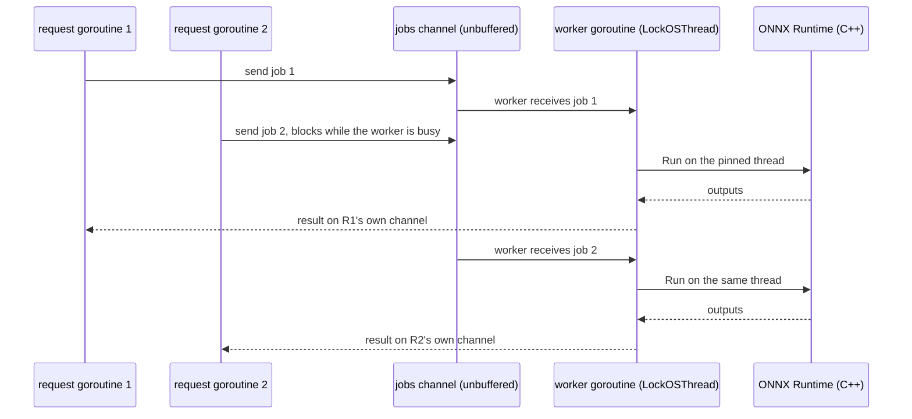

# 5. Concurrency

!!! abstract "What you'll learn"
    - Goroutines, channels and `select`, Go's tools for doing many things at once.
    - `sync.Mutex`, `sync.Once` and `context.Context`.
    - How they are used in the four places that make VisionServe safe under load: the
      engine's per-session worker thread, single-flight model loading, admission control,
      and leases with the idle reaper.
    - What a data race is, and how `go test -race` finds one.

The server answers many requests at the same time. Go's `net/http` runs **every request in
its own goroutine**, so every handler, and everything it calls, may run in parallel with
itself. CLAUDE.md warns: "access to a model session must be thread-safe ... This is an easy
place to get wrong." This chapter shows how the code gets it right.

## Goroutines

`go f(x)` starts `f(x)` running concurrently and returns immediately. A goroutine is very
cheap (a few KB of stack), so the server can have thousands. Go's runtime spreads them over
all CPU cores, moving them between OS threads as it likes.

=== "Go"

    ```go
    go m.reaper()            // runs in the background until the program ends
    ```

=== "Python"

    ```python
    threading.Thread(target=m.reaper, daemon=True).start()
    # but the GIL lets only one thread run Python code at a time
    ```

The lifecycle manager starts its idle reaper this way
([manager.go#L61-L74](https://github.com/mtbui2010/vision_serve/blob/main/internal/lifecycle/manager.go#L61-L74)).

## Channels and `select`

A **channel** is a typed pipe between goroutines: `ch <- v` sends, `v := <-ch` receives.
On an *unbuffered* channel (`make(chan T)`) the sender waits until a receiver takes the
value: it is a hand-off. A *buffered* channel (`make(chan T, n)`) holds up to `n` values.
`close(ch)` says "no more values"; a `for v := range ch` loop then ends, and every receive
on a closed channel returns at once. Closing is therefore a cheap way to **broadcast** "done"
to any number of waiters.

MobileSAM's automatic mask generator uses a channel to hand indices to a fixed number of
workers, a classic worker pool:

```go title="internal/models/mobilesam/automask.go (lines 224-245)"
// parallelFor runs fn(0..n-1) on at most `workers` goroutines.
func parallelFor(n, workers int, fn func(i int)) {
	if workers > n {
		workers = n
	}
	var wg sync.WaitGroup
	next := make(chan int)
	for w := 0; w < workers; w++ {
		wg.Add(1)
		go func() {
			defer wg.Done()
			for i := range next {
				fn(i)
			}
		}()
	}
	for i := 0; i < n; i++ {
		next <- i
	}
	close(next)
	wg.Wait()
}
```

[automask.go#L224-L245 on GitHub](https://github.com/mtbui2010/vision_serve/blob/main/internal/models/mobilesam/automask.go#L224-L245)

`sync.WaitGroup` counts running goroutines; `wg.Wait()` blocks until all called `Done`. In
Python this is `ThreadPoolExecutor(max_workers).map(fn, range(n))`.

`select` waits on several channel operations and runs the first one that is ready. The
idle reaper wakes up every 30 seconds, or stops when the manager closes `m.stop`:

```go title="internal/lifecycle/reaper.go (lines 8-23)"
// reaper periodically releases models idle longer than idleTimeout (idleTimeout<=0 = never).
func (m *Manager) reaper() {
	t := time.NewTicker(reaperInterval)
	defer t.Stop()
	for {
		select {
		case <-m.stop:
			return
		case <-t.C:
			// Closed outside m.mu: destroying a GPU session takes time and m.mu gates every request.
			for _, s := range m.expireIdle(time.Now()) {
				_ = s.close()
			}
		}
	}
}
```

[reaper.go#L8-L23 on GitHub](https://github.com/mtbui2010/vision_serve/blob/main/internal/lifecycle/reaper.go#L8-L23)

## Mutexes and `sync.Once`

When several goroutines read and write the same map or counter, they must take turns. A
`sync.Mutex` is a lock: `Lock()` waits until no one else holds it. The manager guards all
its bookkeeping with one:

```go title="internal/lifecycle/manager.go (lines 29-59, trimmed)"
// Manager holds the live models and coordinates thread-safe load/unload.
type Manager struct {
	reg  *registry.Registry
	tmpl *templates.Store // nil = no template support

	mu   sync.Mutex
	live map[string]*Session
	// loading holds the in-progress load of each model being loaded (see Load).
	loading    map[string]*loadCall
	// ...
	admitted map[string]int
	maxQueue int
	// ...
}
```

[manager.go#L29-L59 on GitHub](https://github.com/mtbui2010/vision_serve/blob/main/internal/lifecycle/manager.go#L29-L59)

The convention is that the fields declared after `mu` are the ones it protects. The rule the
code follows everywhere: **hold the lock briefly, never across slow work**. Closing a GPU
session takes a while, so the reaper above collects the sessions under the lock
(`expireIdle`) and closes them *after* releasing it.

`sync.Once` runs something exactly once, however many goroutines call it at the same time.
ONNX Runtime must be initialised once per process:

```go title="internal/engine/ort.go (lines 41-55)"
// ensureORT initializes the ORT environment exactly once per process.
func ensureORT() error {
	initOnce.Do(func() {
		if path := os.Getenv("ORT_DYLIB_PATH"); path != "" {
			ort.SetSharedLibraryPath(path)
			ortLibPath = path
		}
		// If ORT_DYLIB_PATH is not set, the binding locates the library via the OS
		// default mechanism (LD_LIBRARY_PATH). Report a clear error if init fails.
		if err := ort.InitializeEnvironment(); err != nil {
			initErr = fmt.Errorf("engine: failed to initialize ONNX Runtime (set ORT_DYLIB_PATH to libonnxruntime.so?): %w", err)
		}
	})
	return initErr
}
```

[ort.go#L33-L55 on GitHub](https://github.com/mtbui2010/vision_serve/blob/main/internal/engine/ort.go#L33-L55)

## The engine: one OS thread per ONNX session

This is the most important concurrency design in the project, and the one with the least
obvious reason.

**The problem.** ONNX Runtime's CUDA provider creates GPU resources (a cuBLAS/cuDNN handle,
a memory arena) **per OS thread**, the first time a thread runs the session. Go moves
goroutines between OS threads freely. With only a mutex, each inference could run on a
different thread and leak a new CUDA context every time. The comment on the type records
what happened:

```go title="internal/engine/ort.go (lines 138-165, trimmed)"
// Session is a live ONNX session. Thread-safe AND OS-thread-pinned: every call to the
// underlying ORT session (create, Run, Destroy) is funnelled onto ONE dedicated OS thread
// owned by this Session's worker goroutine (see worker / submit).
//
// Why pinned, not just mutex-serialized: ORT's CUDA execution provider allocates GPU
// resources PER OS THREAD (a cublas + cudnn handle and a memory arena, created lazily on the
// first Run seen on each thread). Go freely migrates a goroutine across OS threads between
// calls — and cgo calls in particular spawn fresh threads — so a plain mutex would let each
// inference land on a different thread, leaking a new CUDA context every time until
// `cublasCreate` fails with "CUBLAS failure 3: the resource allocation failed" after a few
// requests. Pinning to one thread means exactly one CUDA per-thread context per session for
// its whole lifetime. (see CLAUDE.md: session access must be thread-safe + VRAM-safe.)
type Session struct {
	sess        *ort.DynamicAdvancedSession
	inputNames  []string
	outputNames []string
	activeEP    Provider // EP that was actually loaded (first one whose libs were available)

	jobs chan func() // work funnelled onto the dedicated OS thread; closed by Close
	// ...
	jobsMu    sync.RWMutex
	closed    bool
	closeOnce sync.Once
	closeErr  chan error // worker sends the Destroy() result here after jobs drains
}
```

[ort.go#L138-L165 on GitHub](https://github.com/mtbui2010/vision_serve/blob/main/internal/engine/ort.go#L138-L165)

**The solution.** Each `Session` starts one goroutine, the *worker*, and pins it to its OS
thread with `runtime.LockOSThread()`. The worker creates the ORT session, then runs every
job sent on the `jobs` channel, then destroys the session, all on that one thread:

```go title="internal/engine/ort.go (lines 232-259)"
// worker owns the session's single OS thread for its entire lifetime: it creates the ORT
// session, runs every job serially, and destroys the session — all on the same locked thread.
// This is what keeps ORT's CUDA EP to one per-thread context per session (see Session doc).
func (s *Session) worker(modelPath string, providers []Provider, so SessionOptions, ready chan<- error) {
	runtime.LockOSThread()
	defer runtime.UnlockOSThread()

	sess, ep, err := func() (sess *ort.DynamicAdvancedSession, ep Provider, err error) {
		defer func() {
			if p := recover(); p != nil {
				sess, err = nil, recoverJob(p)
			}
		}()
		return createORTSession(modelPath, s.inputNames, s.outputNames, providers, so)
	}()
	if err != nil {
		ready <- err
		return
	}
	s.sess = sess
	s.activeEP = ep
	ready <- nil // happens-before NewSession's return: s.sess/s.activeEP are safely published

	for fn := range s.jobs {
		fn()
	}
	s.closeErr <- s.sess.Destroy() // jobs closed by Close: destroy on the same locked thread
}
```

[ort.go#L232-L259 on GitHub](https://github.com/mtbui2010/vision_serve/blob/main/internal/engine/ort.go#L232-L259)

`chan<- error` is a *send-only* channel: the worker may only send on `ready`. `NewSession`
waits on `<-ready` so it returns only once the session exists
([ort.go#L224-L229](https://github.com/mtbui2010/vision_serve/blob/main/internal/engine/ort.go#L224-L229)).

A request goroutine never touches ORT. `Run` wraps the work in a closure and **submits** it:

```go title="internal/engine/ort.go (lines 476-505)"
func (s *Session) submit(work func() ([]Tensor, error)) ([]Tensor, error) {
	type result struct {
		outs []Tensor
		err  error
	}
	ch := make(chan result, 1)
	s.jobsMu.RLock()
	if s.closed {
		s.jobsMu.RUnlock()
		return nil, ErrClosed
	}
	s.jobs <- func() {
		var r result
		// A panic in the job must not unwind the worker (it would kill the process, and with it
		// every other session). The session stays usable: the panic is in Go code around the ORT
		// call — cgo cannot unwind a Go panic through C, ORT reports its own failures as error
		// statuses — and the job's deferred tensor Destroy calls run during the unwind.
		defer func() {
			if p := recover(); p != nil {
				r = result{nil, recoverJob(p)}
			}
			ch <- r
		}()
		r.outs, r.err = work()
	}
	s.jobsMu.RUnlock()
	// Work accepted before Close still runs: the worker drains jobs before destroying the session.
	r := <-ch
	return r.outs, r.err
}
```

[ort.go#L473-L505 on GitHub](https://github.com/mtbui2010/vision_serve/blob/main/internal/engine/ort.go#L473-L505)



Three things to notice:

- **Serialisation for free.** One worker runs jobs one at a time, so the session is never
  used by two goroutines at once. No mutex is needed around `s.sess`.
- **Each caller has its own reply channel** (`ch`, buffered with size 1 so the worker never
  waits for the caller to read).
- **Closing is safe.** `Close` takes the write lock, sets `closed`, and closes `jobs`
  ([ort.go#L556-L570](https://github.com/mtbui2010/vision_serve/blob/main/internal/engine/ort.go#L556-L570)).
  A late `submit` sees `closed` under the read lock and returns `ErrClosed` instead of
  panicking with "send on closed channel".

When one session is not enough (MobileSAM's decoder is called ~256 times per image in
automask mode), lifecycle wraps N sessions in a `SessionPool`. The pool is a buffered
channel of free sessions, used as a semaphore: `take` receives one, and the caller sends it
back when done ([pool.go#L53-L85](https://github.com/mtbui2010/vision_serve/blob/main/internal/engine/pool.go#L53-L85)).

## Loading a model once (single-flight)

Eight requests for a model that is not loaded yet arrive at the same moment. Loading means
hashing hundreds of MB of weights and creating GPU sessions; doing it eight times would use
eight times the VRAM. `Manager.Load` lets the first request build and makes the rest wait
for it:

```go title="internal/lifecycle/load.go (lines 20-72, trimmed)"
type loadCall struct {
	done chan struct{}
	// cancelled is set by Unload (or Close) while the load runs: its session must not go live.
	cancelled bool
	// err is the load's result, readable once done is closed.
	err error
	// ...
}

func (m *Manager) Load(name string) error {
	for {
		m.mu.Lock()
		// ...
		if _, ok := m.live[name]; ok {
			m.mu.Unlock()
			return nil
		}
		call, busy := m.loading[name]
		if !busy {
			call = &loadCall{done: make(chan struct{})}
			// ...
			m.loading[name] = call
			m.mu.Unlock()
			return m.lead(name, call)
		}
		// ...
		call.waiters++
		m.mu.Unlock()
		<-call.done
		// ...
	}
}
```

[load.go#L20-L72 on GitHub](https://github.com/mtbui2010/vision_serve/blob/main/internal/lifecycle/load.go#L20-L72)

`chan struct{}` carries no data; it exists only to be closed. When the leader finishes,
`lead` closes `call.done` and every waiter blocked on `<-call.done` wakes up at once, loops,
and finds the model in `m.live`. The test `TestConcurrentLoadsBuildOnce` starts 8 goroutines
and checks the factory ran exactly once
([load_test.go#L38-L72](https://github.com/mtbui2010/vision_serve/blob/main/internal/lifecycle/load_test.go#L38-L72)).

## Admission control, leases and the reaper

Three smaller mechanisms keep memory bounded and sessions alive while in use.

**Admission.** Before the server decodes an upload, it reserves a slot for the model.
When the model already has its maximum number of requests running or waiting, the request
fails immediately with `ErrOverloaded` (HTTP 503) instead of piling up decoded images in
memory:

```go title="internal/lifecycle/admission.go (lines 86-106)"
func (m *Manager) Admit(ctx context.Context, name string) (release func(), err error) {
	if err := ctx.Err(); err != nil {
		return func() {}, fmt.Errorf("lifecycle: %q not admitted, the request is gone: %w", name, err)
	}
	m.mu.Lock()
	limit := m.admitLimitLocked(name)
	n := m.admitted[name]
	if limit > 0 && n >= limit {
		m.mu.Unlock()
		return func() {}, fmt.Errorf("lifecycle: %w: %q already has %d requests running or waiting (limit %d per model; "+
			"set VISIONSERVE_MAX_QUEUE to change it)", ErrOverloaded, name, n, limit)
	}
	if m.admitted == nil {
		m.admitted = map[string]int{}
	}
	m.admitted[name] = n + 1
	m.mu.Unlock()

	var once sync.Once
	return func() { once.Do(func() { m.unadmit(name) }) }, nil
}
```

[admission.go#L86-L106 on GitHub](https://github.com/mtbui2010/vision_serve/blob/main/internal/lifecycle/admission.go#L86-L106)

It returns a `release` **closure**: a function that remembers `name` and `once`. Wrapping
it in `sync.Once` makes calling `release()` twice harmless.

**Leases.** `acquire` increments a reference count on the live session; `release`
decrements it. Unload and the reaper only *retire* a session that is in use; the last
`release` closes it. So a request can never run on a session that was closed under it.

??? example "The lease code: acquire and release"

    ```go title="internal/lifecycle/lease.go (lines 32-53)"
    func (m *Manager) acquire(name string) (*Session, func(), error) {
    	m.mu.Lock()
    	s := m.live[name]
    	if s == nil {
    		m.mu.Unlock()
    		return nil, nil, fmt.Errorf("lifecycle: model %q was just unloaded", name)
    	}
    	s.refs++
    	m.mu.Unlock()
    	s.touch(time.Now())
    	return s, func() { m.release(s) }, nil
    }

    func (m *Manager) release(s *Session) {
    	m.mu.Lock()
    	s.refs--
    	closeNow := s.retired && s.refs == 0
    	m.mu.Unlock()
    	if closeNow {
    		_ = s.close()
    	}
    }
    ```

    [lease.go#L27-L53 on GitHub](https://github.com/mtbui2010/vision_serve/blob/main/internal/lifecycle/lease.go#L27-L53)

`PredictPrompt` uses it as `s, release, err := m.acquire(name)` followed by `defer release()`
([manager.go#L100-L113](https://github.com/mtbui2010/vision_serve/blob/main/internal/lifecycle/manager.go#L100-L113)).

**Reaper.** Shown above: every 30 s it retires models idle longer than their
`idle_unload_seconds`, skipping any with `refs > 0`.

## `context.Context`: "is anyone still waiting?"

A `context.Context` travels with a request and says when it is over: the client
disconnected, a deadline passed, or the server is shutting down. `ctx.Err()` is non-nil
once that happens, and `<-ctx.Done()` is a channel closed at that moment. `net/http` gives
every request one, `r.Context()`.

VisionServe checks it at the last cheap moment, right before inference. Once an ONNX run
has started it cannot be interrupted, so the check prevents wasted GPU work for clients
that already left:

```go title="internal/server/predict.go (lines 23-29)"
func Predict(ctx context.Context, p Predictor, model string, img image.Image, prompt models.Prompt) (api.Result, error) {
	fullW, fullH := img.Bounds().Dx(), img.Bounds().Dy()
	img, rect, hasROI := cropROI(img, &prompt)
	if ctx.Err() != nil {
		return api.Result{}, errClientGone
	}
	res, err := p.PredictPrompt(model, img, prompt)
```

[predict.go#L18-L42 on GitHub](https://github.com/mtbui2010/vision_serve/blob/main/internal/server/predict.go#L18-L42)

The server's admit helper does the same check around admission
([handlers.go#L92-L109](https://github.com/mtbui2010/vision_serve/blob/main/internal/server/handlers.go#L92-L109)).
On shutdown, `serve` waits for SIGINT/SIGTERM on a channel and gives in-flight requests
10 seconds with `context.WithTimeout`.

??? example "The shutdown code in serve"

    ```go title="internal/cli/serve.go (lines 94-112)"
    	// graceful shutdown on SIGINT/SIGTERM. ListenAndServe returns as soon as Shutdown STARTS, so
    	// wait for it to finish draining requests and releasing models before returning (main exits).
    	stopped := make(chan struct{})
    	go func() {
    		defer close(stopped)
    		sig := make(chan os.Signal, 1)
    		signal.Notify(sig, syscall.SIGINT, syscall.SIGTERM)
    		<-sig
    		log.Println("shutting down server...")
    		ctx, cancel := context.WithTimeout(context.Background(), 10*time.Second)
    		defer cancel()
    		_ = srv.Shutdown(ctx)
    	}()

    	if err := srv.ListenAndServe(); err != nil && !errors.Is(err, http.ErrServerClosed) {
    		return err
    	}
    	<-stopped
    	return nil
    ```

    [serve.go#L94-L112 on GitHub](https://github.com/mtbui2010/vision_serve/blob/main/internal/cli/serve.go#L94-L112)

## Data races and the race detector

A **data race** happens when two goroutines access the same memory at the same time and at
least one writes, without a lock or channel ordering them. The result is undefined: a map
can be corrupted, a counter can lose updates, and the bug may show once in a million
requests. Python's GIL hides many of these; Go does not.

Go ships a race detector. Add `-race` to `go test` (or `go build`) and it reports every
race that actually happens during the run, with both stack traces. It makes programs
slower (several times), so it is for tests, not production.

!!! tip "Run `-race` on anything you change in `lifecycle`, `engine`, `server` or a model with goroutines"
    ```bash
    go test -race ./internal/lifecycle/ ./internal/server/ ./internal/engine/
    ```

## Try it

1. Watch single-flight loading work, under the race detector:
   ```bash
   go test -race ./internal/lifecycle -run TestConcurrentLoadsBuildOnce -v
   ```
2. Create a race on purpose. In `internal/lifecycle/admission.go`, comment out the two lock
   lines at the start of `unadmit`:
   ```go
   func (m *Manager) unadmit(name string) {
   	// m.mu.Lock()
   	// defer m.mu.Unlock()
   ```
   Then run the contention test (64 goroutines admitting and releasing):
   ```console
   $ go test -race -run TestAdmitBoundHoldsUnderContention ./internal/lifecycle/
   ==================
   WARNING: DATA RACE
   Read at 0x00c000116000 by goroutine 12:
     runtime.mapaccess1_faststr()
     visionserve/internal/lifecycle.(*Manager).Admit()
         .../internal/lifecycle/admission.go:92 +0x1fc
   ...
   Previous write at 0x00c000116000 by goroutine 9:
     runtime.mapassign_faststr()
     visionserve/internal/lifecycle.(*Manager).unadmit()
         .../internal/lifecycle/admission.go:112 +0xb5
   ...
   ```
   `Admit` reads `m.admitted` under the lock while `unadmit` writes it without one. Without
   `-race` the test may well pass. Restore the file: `git checkout internal/lifecycle/admission.go`.
3. Read the engine's own tests for the worker: a panic inside a job must become an error and
   leave the session usable.
   ```bash
   go test ./internal/engine -run Panic -v
   ```
   `TestJobPanicBecomesErrorAndWorkerSurvives` runs everywhere. The two tests that need a
   real ONNX session are skipped (`--- SKIP`) unless `ORT_DYLIB_PATH` is set.

## Recap

- `go f()` starts a goroutine; `net/http` already runs each request in its own.
- Channels hand values between goroutines; closing one broadcasts "done"; `select` waits on
  several. `sync.WaitGroup` waits for a group; `sync.Once` runs something exactly once.
- Guard shared maps and counters with a `sync.Mutex`; hold it briefly, never across slow work.
- Each `engine.Session` owns one goroutine locked to one OS thread, because ORT's CUDA
  provider keeps per-thread GPU state; requests submit closures to it over a channel.
- `Load` is single-flight (a `done` channel), `Admit` bounds queued requests, leases stop
  sessions from closing under a request, and the reaper unloads idle models.
- `context.Context` tells the server when nobody is waiting any more.
- `go test -race` finds data races; use it whenever you touch concurrent code.
