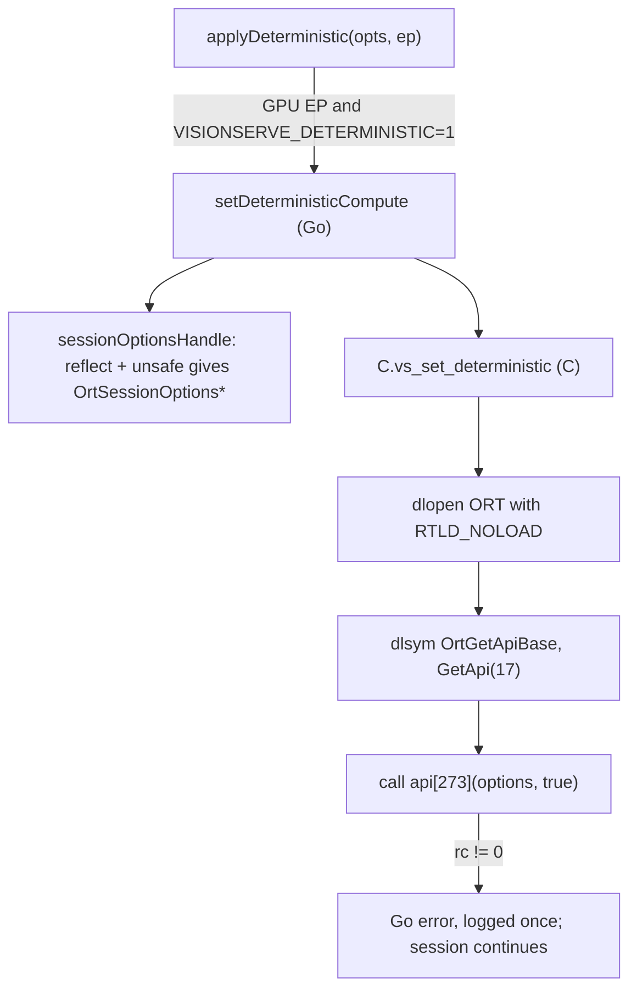

# 7. cgo and build tags

!!! abstract "What you'll learn"
    - What cgo is, and why VisionServe cannot avoid it entirely (ONNX Runtime is a C library).
    - A careful, line-by-line reading of the project's one cgo file,
      `internal/engine/deterministic_cgo.go`.
    - Build constraints (`//go:build ...`) and file-name suffixes for OS-specific code.
    - `CGO_ENABLED` and cross-compiling the server for an arm64 board such as a Jetson.

## What cgo is

**cgo** lets Go code call C. You write C declarations in a comment directly above
`import "C"`, and Go code then calls them as `C.something`. The Go tool compiles that C
with the system C compiler (`gcc`) and links it into the binary.

In Python terms, cgo plays the role of `ctypes`/`cffi` or a C extension module. The
`onnxruntime` Python wheel is itself C++ with a Python wrapper; on the Go side the same
job is done by the [yalue/onnxruntime_go](https://github.com/yalue/onnxruntime_go) binding,
which is written with cgo.

The binding does not link against `libonnxruntime.so` at build time. It opens the library
at **run time** with `dlopen`, using the path you give in `ORT_DYLIB_PATH`. That is why:

- **building** needs only Go and `gcc` (the binding ships the ONNX Runtime C header);
- **running** a model needs the shared library and `ORT_DYLIB_PATH`;
- most tests run without ONNX Runtime at all (they skip the parts that need a real session).

!!! warning "CLAUDE.md rule 4: avoid cgo unless strictly necessary"
    cgo makes builds slower, cross-compiling harder (below), and C code can crash the process
    in ways Go cannot recover from. The project's own code therefore contains exactly **one**
    cgo file, and it starts with a `// CGO:` comment explaining why it is needed. Image
    processing is pure Go (`disintegration/imaging`, the `image` package), not OpenCV.

## The project's one cgo file

ONNX Runtime has a switch, `SetDeterministicCompute`, that makes GPU kernels give
bit-identical results run after run. The Go binding does not expose it. ONNX Runtime's C API
is a **table of function pointers** (`struct OrtApi`), and this switch is entry number 273
in that table. So the project fetches the table itself and calls entry 273. That needs C.

Here is the file, top to bottom.

### 1. The build constraint and the justification

```go title="internal/engine/deterministic_cgo.go (lines 1-9)"
//go:build !windows

package engine

// CGO: this is the one place VisionServe's own code calls C. It is needed because the ORT Go
// binding does not wrap OrtApi::SetDeterministicCompute and ORT exposes no other way to set it (no
// session-config key, no environment variable) — see deterministic.go. The binding is cgo already,
// so this adds no build requirement; it only adds dlfcn calls (as the binding's own setup_env.go
// does) and one call through the OrtApi function table.
```

[deterministic_cgo.go#L1-L9 on GitHub](https://github.com/mtbui2010/vision_serve/blob/main/internal/engine/deterministic_cgo.go#L1-L9)

`//go:build !windows` means "compile this file on every OS except Windows". It must be the
first line, followed by a blank line. (Build constraints are explained below.)

### 2. The C preamble

Everything in the comment right before `import "C"` is C code:

```go title="internal/engine/deterministic_cgo.go (lines 11-51, trimmed)"
/*
#cgo LDFLAGS: -ldl
#include <dlfcn.h>
#include <stdbool.h>
#include <stdint.h>
// ...

typedef struct {
	const void *(*GetApi)(uint32_t version);
	const char *(*GetVersionString)(void);
} vsOrtApiBase;

typedef void *(*vsSetBoolFn)(void *options, bool value);
// ...

static int vs_set_deterministic(const char *lib, void *options, bool value, uint32_t api_version,
                                int idx_set, int idx_msg, int idx_release, char *msg, size_t msg_len) {
	void *h = dlopen(lib, RTLD_LAZY | RTLD_NOLOAD);
	if (!h) return 1;
	const vsOrtApiBase *(*get_base)(void) = (const vsOrtApiBase *(*)(void))dlsym(h, "OrtGetApiBase");
	dlclose(h); // drops only the reference RTLD_NOLOAD took; the binding's handle keeps it loaded
	if (!get_base) return 2;
	const vsOrtApiBase *base = get_base();
	if (!base) return 2;
	void *const *api = (void *const *)base->GetApi(api_version);
	if (!api) return 3;
	void *status = ((vsSetBoolFn)api[idx_set])(options, value);
	// ... on an error status: copy its message into msg, release it, return 4
	return 0;
}
*/
import "C"
```

[deterministic_cgo.go#L11-L51 on GitHub](https://github.com/mtbui2010/vision_serve/blob/main/internal/engine/deterministic_cgo.go#L11-L51)

Read it as a recipe:

1. `#cgo LDFLAGS: -ldl` tells the linker to add `libdl` (for `dlopen`/`dlsym`).
2. `dlopen(lib, RTLD_NOLOAD)` finds the ONNX Runtime library **that the binding already
   loaded**. `RTLD_NOLOAD` guarantees it never loads a second copy.
3. `dlsym(h, "OrtGetApiBase")` looks up ORT's one exported entry point.
4. `GetApi(17)` returns the function table for C API version 17 (ORT 1.17, where the
   switch was added).
5. `api[idx_set]` is entry 273; the code casts it to the right function type and calls it.

Why a C helper instead of calling these from Go? Go cannot call a C *function pointer*
directly, only named C functions. So the pointer juggling lives in one small static C
function, and Go calls that.

The index 273 is not a guess. The test `TestOrtAPIIndices` parses the `onnxruntime_c_api.h`
header that ships with the binding and recounts the table entries
([deterministic_test.go#L68](https://github.com/mtbui2010/vision_serve/blob/main/internal/engine/deterministic_test.go#L68)),
so a binding upgrade that moved them would fail the test, not corrupt memory.

### 3. The Go side

```go title="internal/engine/deterministic_cgo.go (lines 53-84, trimmed)"
import (
	"fmt"
	"unsafe"

	ort "github.com/yalue/onnxruntime_go"
)

// setDeterministicCompute calls OrtApi::SetDeterministicCompute(options, true).
func setDeterministicCompute(o *ort.SessionOptions) error {
	h, err := sessionOptionsHandle(o)
	if err != nil {
		return err
	}
	lib := C.CString(ortLibPath)
	defer C.free(unsafe.Pointer(lib))
	var msg [256]C.char
	rc := C.vs_set_deterministic(lib, h, C.bool(true), C.uint32_t(ortAPIVersionDeterministic),
		C.int(ortAPISetDeterministic), C.int(ortAPIGetErrorMessage), C.int(ortAPIReleaseStatus),
		&msg[0], C.size_t(len(msg)))
	switch rc {
	case 0:
		return nil
	case 1:
		return fmt.Errorf("ONNX Runtime library %q is not loaded under that name", ortLibPath)
	// ... cases 2 and 3
	default:
		return fmt.Errorf("SetDeterministicCompute: %s", C.GoString(&msg[0]))
	}
}
```

[deterministic_cgo.go#L53-L84 on GitHub](https://github.com/mtbui2010/vision_serve/blob/main/internal/engine/deterministic_cgo.go#L53-L84)

The rules of the border between Go and C, as this function follows them:

| Line | What it does | Why |
|---|---|---|
| `C.CString(ortLibPath)` | copies a Go string into C memory (`malloc`), NUL-terminated | C strings and Go strings have different layouts |
| `defer C.free(unsafe.Pointer(lib))` | frees it when the function returns | Go's garbage collector does not manage C memory |
| `C.bool(true)`, `C.int(...)` | convert Go values to C types | cgo never converts implicitly |
| `var msg [256]C.char` ... `&msg[0]` | a buffer on the Go side that C writes into | C may write into Go memory during the call, but must not keep the pointer |
| `C.GoString(&msg[0])` | copies a C string back into a Go string | the buffer is only valid inside this function |
| return codes → `fmt.Errorf` | C reports with ints; Go code gets a normal `error` | chapter 4 |

The function never fails the session. Its caller only logs a failure and continues with
nondeterministic kernels
([deterministic.go#L86-L105](https://github.com/mtbui2010/vision_serve/blob/main/internal/engine/deterministic.go#L86-L105)).

### 4. `unsafe`: reaching an unexported pointer

The C function needs the raw `OrtSessionOptions*` that lives inside the binding's
`SessionOptions` struct, in an unexported field. Go's `reflect` and `unsafe` packages can
read it anyway, and this code checks the struct's shape before trusting it:

```go title="internal/engine/deterministic.go (lines 66-84)"
// sessionOptionsHandle returns the OrtSessionOptions* behind the binding's SessionOptions, whose
// only field is that unexported pointer. The layout is checked, not assumed: a binding that
// changes it gets an error here (and a nondeterministic session), never a bad pointer passed to C.
func sessionOptionsHandle(o *ort.SessionOptions) (unsafe.Pointer, error) {
	if o == nil {
		return nil, errors.New("nil SessionOptions")
	}
	v := reflect.ValueOf(o).Elem()
	t := v.Type()
	if t.NumField() != 1 || t.Field(0).Type.Kind() != reflect.Pointer ||
		!strings.Contains(t.Field(0).Type.Elem().Name(), "OrtSessionOptions") {
		return nil, fmt.Errorf("unexpected layout of %s (the binding changed; update sessionOptionsHandle)", t)
	}
	p := *(*unsafe.Pointer)(unsafe.Pointer(v.Field(0).UnsafeAddr()))
	if p == nil {
		return nil, errors.New("SessionOptions already destroyed")
	}
	return p, nil
}
```

[deterministic.go#L66-L84 on GitHub](https://github.com/mtbui2010/vision_serve/blob/main/internal/engine/deterministic.go#L66-L84)

`unsafe.Pointer` is a pointer with no type, which the compiler lets you reinterpret as any
other pointer. Line 98 says: "take the address of field 0, treat it as the address of a
pointer, and read that pointer". It is the Go equivalent of a C cast. You should almost
never need `unsafe` in model code; here it is fenced by checks and a clear error.



The OS thread matters here too: cgo calls run on whatever thread the goroutine is on, which
is exactly why each `engine.Session` pins its worker with `runtime.LockOSThread()`
(chapter 5).

??? note "Another cgo side effect: signals (cmd/visionserve/main.go)"
    ONNX Runtime and CUDA install signal handlers without the `SA_ONSTACK` flag. Go's
    scheduler sends a signal (`SIGURG`) to preempt long-running goroutines; arriving during a C
    call it aborted the process under load. `main()` therefore re-executes the binary once with
    `GODEBUG=asyncpreemptoff=1`, which turns that preemption signal off
    ([main.go#L42-L65](https://github.com/mtbui2010/vision_serve/blob/main/cmd/visionserve/main.go#L42-L65)).
    You do not need to do anything about it; it explains the odd re-exec you may see in a
    debugger.

## Build constraints: one function, several files

Sometimes the same function needs different code per operating system. Go picks files at
build time with **build constraints**, so there is no `if sys.platform == ...` at run time.
`catalog` must lock a model directory during `visionserve pull`. On Unix it uses `flock`; on
Windows a lock file with a heartbeat:

=== "lock_unix.go"

    ```go title="internal/catalog/lock_unix.go (lines 1-21, trimmed)"
    //go:build unix

    package catalog

    // ...
    // lockDir takes an exclusive lock on dir for the duration of a pull, waiting for (and saying so)
    // another pull that holds it. flock is released by the kernel when the process dies, so a
    // crashed pull never leaves a stale lock behind.
    func lockDir(dir string, out io.Writer, what string) (func(), error) {
    ```

=== "lock_other.go"

    ```go title="internal/catalog/lock_other.go (lines 1-23, trimmed)"
    //go:build !unix

    package catalog

    // ...
    // Without flock the lock is an O_EXCL lock file. The holder refreshes its mtime every
    // lockHeartbeat; a lock file older than lockStaleAfter belongs to a pull that died and is taken
    // over.
    // ...
    func lockDir(dir string, out io.Writer, what string) (func(), error) {
    ```

[lock_unix.go](https://github.com/mtbui2010/vision_serve/blob/main/internal/catalog/lock_unix.go#L1-L21),
[lock_other.go](https://github.com/mtbui2010/vision_serve/blob/main/internal/catalog/lock_other.go#L1-L23)

Both files define `lockDir` with the same signature; exactly one is compiled. The rest of the
package calls `lockDir` without knowing which.

| You write | Meaning |
|---|---|
| `//go:build linux` | only on Linux |
| `//go:build unix` | Linux, macOS, the BSDs, ... (Go ≥ 1.19) |
| `//go:build !windows` | everything except Windows |
| `//go:build race` | only when built with `-race` (chapter 6) |
| file name `x_linux.go`, `x_arm64.go`, `x_test.go` | the suffix itself is a constraint |
| `import "C"` in the file | the file also needs cgo to be enabled |

Expressions combine with `&&`, `||`, `!` and parentheses, e.g. `//go:build linux || darwin`
for Linux or macOS
([verify_fileid_unix.go#L1](https://github.com/mtbui2010/vision_serve/blob/main/internal/registry/verify_fileid_unix.go#L1)).

The engine combines the two styles: `stderr_linux.go` / `stderr_other.go`, and
`deterministic_cgo.go` (`!windows`) / `deterministic_other.go` (`windows`), which on Windows
returns an "unsupported" error instead
([deterministic_other.go](https://github.com/mtbui2010/vision_serve/blob/main/internal/engine/deterministic_other.go)).

## `CGO_ENABLED` and cross-compiling for arm64

`go env CGO_ENABLED` prints `1` when cgo is on. Go turns it **off** automatically when it
finds no C compiler, and **also when you cross-compile** (build for another OS or CPU). For a
pure-Go program cross-compiling is one line:

```bash
GOOS=linux GOARCH=arm64 go build ./cmd/visionserve     # works only for pure-Go programs
```

VisionServe is not pure Go (the binding uses cgo), so the same command fails:

```console
$ GOOS=linux GOARCH=arm64 go build -o /dev/null ./cmd/visionserve
github.com/yalue/onnxruntime_go: build constraints exclude all Go files in /home/you/go/pkg/mod/github.com/yalue/onnxruntime_go@v1.13.0
```

All of the binding's Go files contain `import "C"`; with cgo off, none of them is compiled.
The fix is to turn cgo on and name a C compiler **for the target CPU**. This is what CI does
for the Jetson target:

```yaml title=".github/workflows/ci.yml (lines 65-73)"
      - name: Cài cross toolchain aarch64
        run: sudo apt-get update && sudo apt-get install -y gcc-aarch64-linux-gnu
      - name: Build arm64 (Jetson target)
        env:
          GOOS: linux
          GOARCH: arm64
          CGO_ENABLED: '1'
          CC: aarch64-linux-gnu-gcc
        run: go build ./...
```

[ci.yml#L65-L73 on GitHub](https://github.com/mtbui2010/vision_serve/blob/main/.github/workflows/ci.yml#L65-L73)

The edge Docker image does the same in its build stage
([deploy/Dockerfile.edge#L41-L61](https://github.com/mtbui2010/vision_serve/blob/main/deploy/Dockerfile.edge#L41-L61)):
`CGO_ENABLED=1 GOOS=linux GOARCH=arm64 CC=aarch64-linux-gnu-gcc go build ...`, then copies
the binary into an arm64 image that also contains `libonnxruntime.so`. The stage installs
`libc6-dev-arm64-cross` (the arm64 C library headers) next to the compiler: with
`--no-install-recommends` it is not pulled in, and cgo then fails on missing `<bits/...>`
headers.

!!! note "`make build-linux-arm64`"
    The Makefile target runs the same command: `CGO_ENABLED=1` with
    `CC=aarch64-linux-gnu-gcc` (override with `ARM64_CC=...`), and it stops with a clear
    message when that compiler is not installed
    ([Makefile#L146-L151](https://github.com/mtbui2010/vision_serve/blob/main/Makefile#L146-L151)).
    `make docker-arm` builds the whole arm64 image instead.

## Try it

1. See how cgo is configured on your machine:
   ```bash
   go env CGO_ENABLED CC
   ```
2. Ask Go which files it would compile, for your OS and for Windows:
   ```console
   $ go list -f '{{.CgoFiles}}' ./internal/engine
   [deterministic_cgo.go]
   $ go list -f '{{.GoFiles}}' ./internal/catalog
   [catalog.go download.go local.go lock_unix.go manifest.go pull.go stale.go]
   $ GOOS=windows go list -f '{{.GoFiles}}' ./internal/catalog
   [catalog.go download.go local.go lock_other.go manifest.go pull.go stale.go]
   ```
3. Build with cgo off and read the error:
   ```bash
   CGO_ENABLED=0 go build -o /dev/null ./cmd/visionserve
   ```
4. Run the test that guards the C function-table indices:
   ```bash
   go test ./internal/engine -run TestOrtAPIIndices -v
   ```
5. See the race-detector build tag pick a different test file:
   ```console
   $ go list -f '{{.XTestGoFiles}}' ./internal/vision/preprocess | tr ' ' '\n' | grep race
   race_off_test.go
   $ go list -race -f '{{.XTestGoFiles}}' ./internal/vision/preprocess | tr ' ' '\n' | grep race
   race_on_test.go
   ```

## Recap

- cgo lets Go call C through a comment preamble and `import "C"`; it needs a C compiler and is
  avoided except where it must be (CLAUDE.md rule 4).
- The ORT binding loads `libonnxruntime.so` at run time, so you build with `gcc` alone and run
  with `ORT_DYLIB_PATH`.
- `deterministic_cgo.go` fetches ORT's function table with `dlopen`/`dlsym` and calls entry 273;
  it copies strings across the border, frees C memory with `defer C.free`, and turns return
  codes into Go errors.
- `//go:build` lines and file-name suffixes choose files per OS, CPU, or build mode.
- Cross-compiling needs `CGO_ENABLED=1` and a target C compiler (`CC=aarch64-linux-gnu-gcc`).
