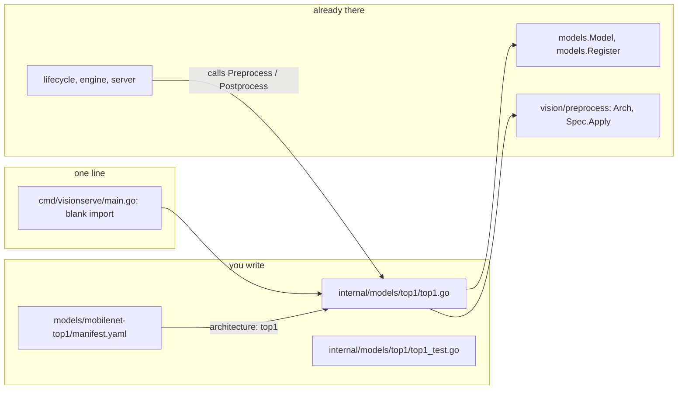

# 8. Walkthrough: add a model

!!! abstract "What you'll do"
    Add a new plain model to VisionServe from scratch, using everything from chapters 1–7:
    a package, a struct that satisfies `models.Model`, registration in `init()`, a
    table-driven test, a manifest with a license, and finally a real prediction through the
    CLI and the HTTP API. Every command and output below was run on this repository.

## What we build

`top1`: an ImageNet classifier that answers with **only its best class**, and with
**nothing at all** when the model is not confident enough. It reuses the MobileNetV3-Small
ONNX weights (Apache-2.0) that `mobilenet-v3` already uses, so you need no new download
and no export.

It is a **plain** `Model` (chapter 3): one ONNX graph, no prompt. Lifecycle runs the
session; our package only writes `Preprocess` and `Postprocess`. These are the files
involved:



No file in `server`, `lifecycle` or `engine` changes. That is the rule from CLAUDE.md:
**adding a model = adding a package**.

## Step 0: build, and get the weights

```bash
make build
./bin/visionserve pull mobilenet-v3 --models ./models
```

```console
pulling mobilenet-v3 (classification, Apache-2.0) from huggingface.co/onnxmodelzoo/mobilenet_v3_small_Opset17
  downloading model.onnx <- mobilenet_v3_small_Opset17.onnx
  ...
success: mobilenet-v3 is ready in models/mobilenet-v3
```

`*.onnx` is in `.gitignore`, so the weights will not be committed by accident.

## Step 1: look at the real tensor shapes

CLAUDE.md: **do not guess a model's output format.** Check the input and output of the
ONNX file before writing any decode code. `engine.Inspect` reads the ONNX header in pure Go,
so a throwaway program is enough (`cmd/play/main.go`, delete it afterwards):

```go title="cmd/play/main.go (throwaway)"
package main

import (
	"fmt"
	"os"

	"visionserve/internal/engine"
)

func main() {
	ins, outs, err := engine.Inspect(os.Args[1])
	if err != nil {
		fmt.Fprintln(os.Stderr, err)
		os.Exit(1)
	}
	for _, io := range ins {
		fmt.Printf("input  %-8s %v\n", io.Name, io.Shape)
	}
	for _, io := range outs {
		fmt.Printf("output %-8s %v\n", io.Name, io.Shape)
	}
}
```

```console
$ go run ./cmd/play models/mobilenet-v3/model.onnx
input  x        [1 3 224 224]
output 400      [1 1000]
```

One input `x` of shape `[1, 3, 224, 224]` (NCHW), one output named `400` of shape
`[1, 1000]`: raw logits for the 1000 ImageNet classes. (In Python:
`onnxruntime.InferenceSession(path).get_outputs()` tells you the same.) Remove the
throwaway program: `rm -r cmd/play`.

## Step 2: write the package

Create `internal/models/top1/top1.go`:

```go title="internal/models/top1/top1.go"
// Package top1 is a tiny plain Model: an ImageNet classifier that reports only its best
// class, and nothing at all when the model is not confident enough.
//
// Output (verified on mobilenet_v3_small_Opset17.onnx): one tensor of logits, shape [1, 1000].
package top1

import (
	"fmt"
	"image"
	"math"

	"visionserve/internal/engine"
	"visionserve/internal/models"
	"visionserve/internal/vision/preprocess"
)

// init runs once, when the package is imported: it adds our factory to the registry.
func init() {
	models.Register("top1", New)
}

// arch lists the resize modes this model accepts; the first one is the default.
var arch = preprocess.Arch{Name: "top1", Modes: []preprocess.Mode{preprocess.Squash}}

type top1Model struct {
	cfg models.Config
}

// New is the factory: lifecycle calls it with the parsed manifest.
func New(cfg models.Config) (models.Base, error) {
	if _, err := arch.Resolve(cfg.PreprocessSpec()); err != nil {
		return nil, fmt.Errorf("top1: %w", err)
	}
	return &top1Model{cfg: cfg}, nil
}

func (m *top1Model) Name() string          { return m.cfg.Name }
func (m *top1Model) Task() models.Task     { return models.TaskClassification }
func (m *top1Model) InputName() string     { return "" } // "" = read the name from the ONNX file
func (m *top1Model) OutputNames() []string { return nil }

func (m *top1Model) Preprocess(img image.Image) (engine.Tensor, models.PreprocessMeta, error) {
	spec, err := arch.Resolve(m.cfg.PreprocessSpec())
	if err != nil {
		return engine.Tensor{}, models.PreprocessMeta{}, err
	}
	return spec.Apply(img) // resize + normalise + NCHW, the one shared implementation
}

func (m *top1Model) Postprocess(outs []engine.Tensor, _ models.PreprocessMeta) (models.Result, error) {
	if len(outs) == 0 {
		return models.Result{}, fmt.Errorf("top1: the model returned no output")
	}
	out := outs[0]
	// Logits for ONE image: shape [1, C] or [C], so the last dim holds every value.
	if len(out.Data) == 0 || out.Dim(-1) != int64(len(out.Data)) {
		return models.Result{}, fmt.Errorf("top1: want logits shaped [1, C], got %v", out.Shape)
	}
	logits := out.Data

	// Softmax probability of the best class only: exp(0) / sum(exp(l - max)).
	best, maxLogit := 0, logits[0]
	for i, v := range logits {
		if v > maxLogit {
			best, maxLogit = i, v
		}
	}
	var sum float64
	for _, v := range logits {
		sum += math.Exp(float64(v - maxLogit))
	}
	conf := 1 / sum

	res := models.Result{Task: models.TaskClassification}
	if conf < m.cfg.ConfThresh {
		return res, nil // not confident: an empty answer, not an error
	}
	label := fmt.Sprintf("class_%d", best)
	if best < len(m.cfg.Labels) {
		label = m.cfg.Labels[best]
	}
	res.Classifications = []models.Classification{{Class: label, Conf: conf}}
	return res, nil
}
```

How each part maps to the earlier chapters:

- **`package top1`, the imports** (chapter 1). The directory name and the package name match.
- **`init()` + `models.Register("top1", New)`** (chapter 3). `"top1"` is the *architecture*
  name a manifest will refer to. It must be unique, or the program panics at start-up.
- **`top1Model` is unexported** (chapter 1). Nobody outside the package needs the type; they
  get it through the `models.Base` that `New` returns.
- **Six methods with pointer receivers** make `*top1Model` satisfy `models.Model` (chapters 2–3).
  There is no `implements`.
- **`New` returns an error** for an invalid manifest (chapter 4) instead of failing later, on
  the first request.
- **Preprocessing is declared, not hand-written.** `preprocess.Arch` says which resize modes
  the model can map back (only `Squash` here); `Spec.Apply` does the resize, the
  normalisation and the NCHW layout, and returns the `Meta`. The same code serves every model
  and is tested against the Python reference (chapter 6). Compare with the classification
  model, which does exactly this
  ([classification/preprocess.go#L11-L27](https://github.com/mtbui2010/vision_serve/blob/main/internal/models/classification/preprocess.go#L11-L27)).
- **Postprocess checks the shape it verified in step 1**, then reads `out.Data` as a flat
  slice (chapter 1). The result goes into the shared `models.Result` (an alias of
  `api.Result`, chapter 2); there is no per-model schema.
- **"Not confident" is an empty result, not an error.** An error would become an HTTP 500
  (chapter 4); a model that has nothing to report is a normal answer.

!!! note "Detection models: map boxes back"
    A detector must also use the `meta` argument: `Detection.BBox` is **always in original
    image coordinates**, `[x, y, w, h]`. `meta.Affine()` gives the mapping from model-input
    pixels back to the original image
    ([spec.go#L335-L339](https://github.com/mtbui2010/vision_serve/blob/main/internal/vision/preprocess/spec.go#L335-L339)).
    A classifier has no coordinates, so `top1` ignores `meta` (`_`).

## Step 3: test pre- and postprocess

CLAUDE.md asks for a test of every model's pre/postprocess. Create
`internal/models/top1/top1_test.go`. It builds the model from a `models.Config` written in
code (lifecycle builds the same struct from the manifest) and feeds `Postprocess` fake
logits, so it needs neither ONNX Runtime nor the weights:

```go title="internal/models/top1/top1_test.go"
package top1

import (
	"fmt"
	"image"
	"testing"

	"visionserve/internal/engine"
	"visionserve/internal/models"
)

// newModel builds the model the way lifecycle does, from a Config (here written in code).
func newModel(t *testing.T) models.Model {
	t.Helper()
	base, err := New(models.Config{
		Name:  "test-top1",
		Width: 224, Height: 224,
		Mean:       []float32{0.485, 0.456, 0.406},
		Std:        []float32{0.229, 0.224, 0.225},
		ConfThresh: 0.5,
		Labels:     []string{"cat", "dog", "bird"},
	})
	if err != nil {
		t.Fatalf("New: %v", err)
	}
	m, ok := base.(models.Model)
	if !ok {
		t.Fatalf("%T does not implement models.Model", base)
	}
	return m
}

func TestPreprocessShapeAndMeta(t *testing.T) {
	m := newModel(t)
	in, meta, err := m.Preprocess(image.NewRGBA(image.Rect(0, 0, 640, 480)))
	if err != nil {
		t.Fatal(err)
	}
	if got := fmt.Sprint(in.Shape); got != "[1 3 224 224]" {
		t.Fatalf("shape = %s, want [1 3 224 224]", got)
	}
	if meta.OrigWidth != 640 || meta.OrigHeight != 480 {
		t.Fatalf("meta must keep the original size, got %dx%d", meta.OrigWidth, meta.OrigHeight)
	}
}

func TestPostprocess(t *testing.T) {
	m := newModel(t)
	for _, tc := range []struct {
		name      string
		logits    []float32
		wantClass string // "" = expect no answer
	}{
		{"confident dog", []float32{0, 5, 0}, "dog"},
		{"confident bird", []float32{-2, 0, 4}, "bird"},
		{"unsure", []float32{1, 1, 1}, ""}, // each class has p = 1/3 < 0.5
	} {
		t.Run(tc.name, func(t *testing.T) {
			out := engine.F32(tc.logits, 1, int64(len(tc.logits)))
			res, err := m.Postprocess([]engine.Tensor{out}, models.PreprocessMeta{})
			if err != nil {
				t.Fatal(err)
			}
			if tc.wantClass == "" {
				if len(res.Classifications) != 0 {
					t.Fatalf("want no answer, got %+v", res.Classifications)
				}
				return
			}
			if len(res.Classifications) != 1 || res.Classifications[0].Class != tc.wantClass {
				t.Fatalf("got %+v, want one %q", res.Classifications, tc.wantClass)
			}
			if c := res.Classifications[0].Conf; c < 0.5 || c > 1 {
				t.Fatalf("conf %v outside [0.5, 1]", c)
			}
		})
	}
}

func TestPostprocessRejectsBadOutputs(t *testing.T) {
	m := newModel(t)
	for name, outs := range map[string][]engine.Tensor{
		"no output":  nil,
		"batch of 2": {engine.F32(make([]float32, 6), 2, 3)},
	} {
		if _, err := m.Postprocess(outs, models.PreprocessMeta{}); err == nil {
			t.Errorf("%s: want an error", name)
		}
	}
}
```

```console
$ go test ./internal/models/top1/ -v
=== RUN   TestPreprocessShapeAndMeta
--- PASS: TestPreprocessShapeAndMeta (0.00s)
=== RUN   TestPostprocess
=== RUN   TestPostprocess/confident_dog
=== RUN   TestPostprocess/confident_bird
=== RUN   TestPostprocess/unsure
--- PASS: TestPostprocess (0.00s)
    --- PASS: TestPostprocess/confident_dog (0.00s)
    --- PASS: TestPostprocess/confident_bird (0.00s)
    --- PASS: TestPostprocess/unsure (0.00s)
=== RUN   TestPostprocessRejectsBadOutputs
--- PASS: TestPostprocessRejectsBadOutputs (0.00s)
PASS
ok  	visionserve/internal/models/top1	0.008s
```

Also run `go vet ./internal/models/top1/` and `gofmt -l internal/models/top1/` (no output
means formatted). CI runs both.

## Step 4: one import line

Add the blank import to `cmd/visionserve/main.go`, in alphabetical order:

```diff
 	_ "visionserve/internal/models/textalign"
+	_ "visionserve/internal/models/top1"
 )
```

Without it the package is not part of the binary, `init()` never runs, and loading the model
fails with
`error: models: no factory registered for "top1" (registered: [background clip ...])`.

## Step 5: the manifest

A model directory holds a `manifest.yaml`, the weights and side files. Create
`models/mobilenet-top1/`, copy the weights and labels (a model directory must be
self-contained), and write the manifest:

```bash
mkdir -p models/mobilenet-top1
cp models/mobilenet-v3/model.onnx models/mobilenet-v3/imagenet1k.txt models/mobilenet-top1/
```

```yaml title="models/mobilenet-top1/manifest.yaml"
name: mobilenet-top1
task: classification
license: Apache-2.0          # REQUIRED: the registry refuses anything but Apache-2.0 / MIT / BSD
architecture: top1           # must equal the name passed to models.Register
model_file: model.onnx
labels: imagenet1k.txt
# Provenance: where the weights come from, and their sha256 (binds the license to these bytes).
source_url: https://huggingface.co/onnxmodelzoo/mobilenet_v3_small_Opset17/resolve/main/mobilenet_v3_small_Opset17.onnx
sha256: 9152343d120cf7b03b6b775a5fccd53813cc21891e376060a8edd2dfc0c35193

input:
  width: 224
  height: 224
  normalize:
    mean: [0.485, 0.456, 0.406]
    std:  [0.229, 0.224, 0.225]

postprocess:
  conf_threshold: 0.3        # below this, answer with no class at all

runtime:
  prefer: [cuda, cpu]
  idle_unload_seconds: 300
```

The struct tags of chapter 2 turn this file into a `registry.Manifest`, and lifecycle copies
the fields into the `models.Config` that `New` receives: `conf_threshold` becomes
`cfg.ConfThresh`, the lines of `imagenet1k.txt` become `cfg.Labels`, `input:` becomes the
preprocessing spec
([load.go#L385-L409](https://github.com/mtbui2010/vision_serve/blob/main/internal/lifecycle/load.go#L385-L409)).

!!! danger "The license field is not decoration"
    Change `license:` to `AGPL-3.0` and the registry refuses the whole manifest:
    ```console
    registry warning: registry: invalid manifest models/mobilenet-top1/manifest.yaml: license "AGPL-3.0" is not allowed — only permissive licenses accepted (Apache-2.0/MIT/BSD); AGPL is strictly forbidden
    error: model "mobilenet-top1" not found in registry (./models)
    ```
    Declare the license of the **weights** you actually use, after reading it at the source.
    "It is on HuggingFace" says nothing about the license (CLAUDE.md rule 1).

## Step 6: build and run

```console
$ make build
go build  -ldflags '-s -w -X visionserve/internal/cli.Version=...' -o bin/visionserve ./cmd/visionserve
$ ./bin/visionserve list --models ./models | grep -E "NAME|mobilenet"
NAME                                TASK                LICENSE     INPUT      WEIGHTS
mobilenet-top1                      classification      Apache-2.0  224x224    ready
mobilenet-v3                        classification      Apache-2.0  224x224    ready
$ ./bin/visionserve run --models ./models mobilenet-top1 test/testdata/sample.jpg
predict: model=mobilenet-top1 task=classification device=cpu  client=111.6ms server=10.9ms  (0 detections, 0 masks, 0 grasps)
{
  "task": "classification",
  "model": "mobilenet-top1",
  "device": "cpu",
  "classifications": [
    {
      "class": "minibus",
      "conf": 0.6697488164586224
    }
  ],
  "duration_ms": 10.931
}
```

`run` needs `ORT_DYLIB_PATH` (see the [overview](index.md#install-go)). The `device` is
`cpu` with the CPU build of ONNX Runtime and `gpu:0` with a CUDA build. As a cross-check,
`mobilenet-v3` on the same image ranks `minibus` first with confidence 0.6697 too; our model
just drops the other four.

## Step 7: call the HTTP API

Start the server in one terminal:

```bash
./bin/visionserve serve --models ./models
```

and send the image from another, as a multipart form:

```console
$ curl -s -F model=mobilenet-top1 -F image=@test/testdata/sample.jpg localhost:11435/api/predict
{"task":"classification","model":"mobilenet-top1","device":"cpu","classifications":[{"class":"minibus","conf":0.6697488164586224}],"duration_ms":12.888}
```

or as JSON from Python:

```python
import base64, json, urllib.request

img = base64.b64encode(open("test/testdata/sample.jpg", "rb").read()).decode()
req = urllib.request.Request(
    "http://localhost:11435/api/predict",
    data=json.dumps({"model": "mobilenet-top1", "image_base64": img}).encode(),
    headers={"Content-Type": "application/json"},
)
print(json.load(urllib.request.urlopen(req))["classifications"])
# [{'class': 'minibus', 'conf': 0.6697488164586224}]
```

The first request loads the model (single-flight, chapter 5); it is unloaded again after
`idle_unload_seconds` without requests. Stop the server with Ctrl-C: it drains in-flight
requests and releases the ONNX sessions.

## Troubleshooting

| Symptom | Cause |
|---|---|
| `models: no factory registered for "top1"` | the blank import in `cmd/visionserve/main.go` is missing, or you did not rebuild |
| `model "mobilenet-top1" not found in registry` | the manifest failed validation: read the `registry warning:` line above it |
| `implements neither Model nor PipelineModel` | a method name or signature is off; add `var _ models.Model = (*top1Model)(nil)` to get a compile error instead (chapter 3) |
| `failed to initialize ONNX Runtime (set ORT_DYLIB_PATH ...)` | `ORT_DYLIB_PATH` is not set or points to the wrong file |
| WEIGHTS shows `missing` | `model_file` does not exist in the model directory |

## Where to go next

- **A prompted or multi-session model** (an encoder + decoder, a text prompt) implements
  `models.PipelineModel` instead: `Roles()` names the ONNX files of the manifest's `files:`
  map, and `Infer` chains them through the `Runner`. MobileSAM
  (`internal/models/mobilesam`) and GroundingDINO (`internal/models/groundingdino`) are the
  reference implementations.
- **Making it pullable** (`visionserve pull <name>`) means adding a catalog entry with the
  Hub repository and pinned sha256 digests; `docs/contributing-models.md` in the repository
  walks through it, including the license ledger.
- **Clean up** if this was only an exercise: `rm -r internal/models/top1 models/mobilenet-top1`
  and remove the import line. `top1` is a teaching example, not a contribution: a confidence
  cut-off for classifiers would belong in the existing `classification` package as an option,
  not in a second package that loads the same weights.

## Recap

- A plain model is a package with a struct that has six methods, registered in `init()`.
- Check the real tensor shapes first; declare preprocessing with `preprocess.Arch` + `Spec.Apply`.
- Return `models.Result`; detectors map boxes back to original coordinates with `meta`.
- Test pre/postprocess with fake tensors; no ONNX Runtime needed.
- One blank import line, one manifest with a permissive `license`, and the model is served
  by the CLI and the HTTP API without touching `server`, `lifecycle` or `engine`.
