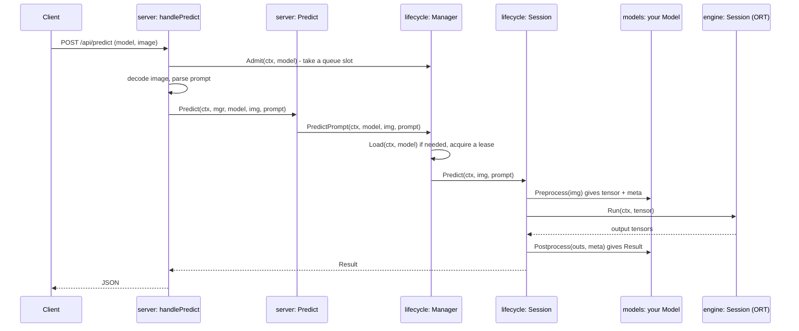

# Go for this project

This section teaches you enough Go to read, change and extend VisionServe. It assumes you
know Python well (PyTorch, numpy) and have never written Go. Every idea is shown on real
code from this repository, with a link to the exact lines on GitHub.

!!! abstract "What you'll learn on this page"
    - Why VisionServe is written in Go and not Python.
    - How to install Go and the handful of `go` commands you will use every day.
    - How the repository is laid out, and why `internal/` is special.
    - A map that follows one HTTP request from the network down to ONNX Runtime, so you
      know which file to open for which question.

## Why Go?

VisionServe wants to be "Ollama for computer vision": one program you copy to a laptop, a
server or a Jetson, start, and send images to. Rule 3 of the project's
[CLAUDE.md](https://github.com/mtbui2010/visionserve/blob/main/CLAUDE.md) says it plainly:
**do not pull Python into the runtime.** Go gives the project what it needs for that:

| Need | What Go gives | What it would take in Python |
|---|---|---|
| One file to ship | `go build` produces one executable. The only outside piece is the ONNX Runtime shared library, loaded at start-up. | An interpreter, a virtualenv, `torch`/`onnxruntime` wheels per platform. |
| Fast start | `visionserve version` returns in about 25 ms on the development machine. | `import numpy, onnxruntime` alone takes about 0.3 s on the same machine. |
| Real parallelism | Goroutines run on all CPU cores. One process serves many requests at once. | The GIL serialises Python code; you scale with worker processes. |
| Small edge images | A static-ish binary plus `libonnxruntime.so`. | Hundreds of MB of Python packages. |

The heavy maths (the neural network) still runs in ONNX Runtime, written in C++. Go does
everything around it: HTTP, decoding images, pre- and postprocessing, managing GPU
sessions. Those are exactly the parts where Python would be slow or heavy.

## Install Go

The module file says which Go version the code needs:

```go title="go.mod"
module visionserve

go 1.22
```

[go.mod#L1-L3 on GitHub](https://github.com/mtbui2010/visionserve/blob/main/go.mod#L1-L3)

1. Download Go 1.22 or newer from <https://go.dev/dl/> and unpack it, for example into
   `/usr/local/go` (or your home directory if you have no root access).
2. Put its `bin` directory on your `PATH`, e.g. in `~/.bashrc`:
   `export PATH=$PATH:/usr/local/go/bin`.
3. Check: `go version` should print `go1.22` or later.

You also need a **C compiler** (`gcc`). That surprises most people: Go itself does not need
one, but the ONNX Runtime binding this project uses is written partly in C (this is called
*cgo*, see [chapter 7](07-cgo.md)). Without `gcc` on the `PATH`, Go turns cgo off and the
build fails with `build constraints exclude all Go files in .../onnxruntime_go`.

To *run* models (not to build or to run most tests) you need the ONNX Runtime shared
library and the `ORT_DYLIB_PATH` variable pointing at it, e.g. the one inside a
`pip install onnxruntime`:
`export ORT_DYLIB_PATH=$(python -c "import onnxruntime, os; print(os.path.dirname(onnxruntime.__file__))")/capi/libonnxruntime.so.<version>`.

## The commands you will use

=== "Go"

    ```bash
    go build -o bin/visionserve ./cmd/visionserve   # compile (or: make build)
    go run ./cmd/visionserve list --models ./models # compile to a temp dir and run
    go test ./...                                   # run every test in the module
    go test ./internal/vision/nms/ -run TestContainment -v   # one test, verbose
    go vet ./...                                    # static checks (CI runs this)
    gofmt -l cmd internal pkg                       # list files that are not formatted
    go doc ./internal/models Model                  # read documentation in the terminal
    go mod tidy                                     # sync go.mod/go.sum with the imports
    ```

=== "Python equivalent"

    ```bash
    python -m build / pip install -e .              # (no single-file output)
    python -m visionserve list                      # run
    pytest                                          # run every test
    pytest tests/test_nms.py::test_containment -v   # one test
    ruff check / mypy                               # static checks
    black --check .                                 # formatting
    python -c "help(visionserve.models.Model)"      # docs
    pip-compile                                     # lock dependencies
    ```

`./...` means "this directory and every package below it". A path that starts with `./`
is a directory; a path without it (`visionserve/internal/models`) is an *import path*.
Both work with most commands.

!!! tip "There is exactly one formatting style"
    `gofmt` decides indentation (tabs), spacing and alignment, and CI refuses unformatted
    files (`.github/workflows/ci.yml`). Configure your editor to run `gofmt` (or `goimports`)
    on save and never think about style again. VS Code with the official Go extension does
    this out of the box.

## How the repository is laid out

```text
visionserve/
├── cmd/visionserve/      the main package: builds the `visionserve` binary
├── internal/             all the server code; importable only from inside this module
│   ├── cli/              subcommands: serve, run, list, pull, ...
│   ├── server/           HTTP handlers (POST /api/predict, ...)
│   ├── lifecycle/        loads/unloads models, owns every ONNX session
│   ├── engine/           thin wrapper around ONNX Runtime (the only cgo)
│   ├── registry/         reads and validates manifest.yaml files (license gate)
│   ├── catalog/          the built-in list of pullable models, downloads
│   ├── models/           the Model interfaces + one sub-package per architecture
│   ├── vision/           shared preprocess, geometry, masks, NMS
│   └── ...
├── pkg/api/              the public JSON schema (Result, Detection, ...)
└── models/               manifests (weights are downloaded, not committed)
```

This follows the usual Go layout: `cmd/<name>/` for programs, `internal/` for private code,
`pkg/` for code other people may import.

!!! note "Why `internal/` is special"
    The Go compiler enforces a rule: a package whose path contains `internal/` can only be
    imported by code inside the directory that holds that `internal/`. Here that is the whole
    `visionserve` module. So another Go program can `import "visionserve/pkg/api"` to get the
    `Result` type, but it **cannot** import `visionserve/internal/engine`. The project can
    therefore change anything under `internal/` without breaking anyone. Python has only the
    leading-underscore *convention* for this; Go makes it a compile error.

## How to read the code: from a request to ONNX Runtime

When a client sends `POST /api/predict` with an image, the call goes through these
functions. Open them in this order the first time you read the code:



| Step | Function | File |
|---|---|---|
| 1. Route | `routes()` maps `POST /api/predict` to `handlePredict` | [server/server.go#L75-L92](https://github.com/mtbui2010/visionserve/blob/main/internal/server/server.go#L75-L92) |
| 2. Parse | `handlePredict` / `predict`: admit, decode the image, build the prompt | [server/handlers.go#L136-L168](https://github.com/mtbui2010/visionserve/blob/main/internal/server/handlers.go#L136-L168) |
| 3. Wrap | `Predict`: region-of-interest crop, client-gone check, size filter | [server/predict.go#L24-L43](https://github.com/mtbui2010/visionserve/blob/main/internal/server/predict.go#L24-L43) |
| 4. Load | `Manager.PredictPrompt`: load once, lease the session | [lifecycle/manager.go#L106-L116](https://github.com/mtbui2010/visionserve/blob/main/internal/lifecycle/manager.go#L106-L116) |
| 5. Run | `Session.predictSimple`: pre → infer → post | [lifecycle/session.go#L213-L223](https://github.com/mtbui2010/visionserve/blob/main/internal/lifecycle/session.go#L213-L223) |
| 6. Model | `Preprocess` / `Postprocess` of one architecture, e.g. classification | [models/classification/classification.go#L53-L59](https://github.com/mtbui2010/visionserve/blob/main/internal/models/classification/classification.go#L53-L59) |
| 7. ORT | `engine.Session.Run` hands the job to the session's own OS thread | [engine/ort.go#L472-L643](https://github.com/mtbui2010/visionserve/blob/main/internal/engine/ort.go#L472-L643) |

The core of step 5 is only a few lines. It is worth reading now, even before you know Go:

```go title="internal/lifecycle/session.go (lines 212-223)"
// predictSimple is the classic single-session pre→infer→post path.
func (s *Session) predictSimple(ctx context.Context, img image.Image) (api.Result, error) {
	in, meta, err := s.model.Preprocess(img)
	if err != nil {
		return api.Result{}, err
	}
	outs, err := s.engine.Run(ctx, []engine.Tensor{in})
	if err != nil {
		return api.Result{}, err
	}
	return s.model.Postprocess(outs, meta)
}
```

[session.go#L212-L223 on GitHub](https://github.com/mtbui2010/visionserve/blob/main/internal/lifecycle/session.go#L212-L223)

In Python you would write `inp, meta = model.preprocess(img); outs = sess.run(inp); return
model.postprocess(outs, meta)` and let exceptions fly. Go returns the error next to the
value and checks it after each call. Chapter 4 explains why.

## Try it

Run these from the repository root.

1. Build the binary and look at the registry:
   ```bash
   make build
   ./bin/visionserve list --models ./models
   ```
   Models whose weights you have not downloaded show `missing` in the `WEIGHTS` column.
2. Read documentation without opening a browser:
   ```bash
   go doc ./internal/engine Session
   go doc -short ./internal/lifecycle
   ```
3. Run one package's tests, then everything:
   ```bash
   go test ./internal/vision/nms/ -v
   go test ./...
   ```
4. See which outside libraries end up in the binary:
   ```bash
   go list -deps ./cmd/visionserve | grep '\.' | grep -v -e '^visionserve' -e '^vendor/'
   ```
   You should find only a few: `disintegration/imaging`, `yalue/onnxruntime_go`,
   `gopkg.in/yaml.v3` and parts of `golang.org/x`. Everything else is Go's standard
   library (`net/http`, `image`, `encoding/json`, ...), which ships with Go.

## The chapters

| Chapter | Topic | Project code used |
|---|---|---|
| [1. Packages, modules, building](01-basics.md) | packages, imports, variables, slices, maps, loops | `cmd/visionserve`, `vision/nms`, `models/classification` |
| [2. Types, structs, methods](02-types.md) | structs, tags, methods, embedding, aliases | `pkg/api`, `registry/manifest.go`, `vision/preprocess` |
| [3. Interfaces](03-interfaces.md) | interfaces, the model registry, fakes | `models.Model`, `models.Register`, `server.modelRuntime` |
| [4. Errors](04-errors.md) | `error`, wrapping, `errors.Is/As`, `defer` | `lifecycle/errors.go`, `server/errors.go` |
| [5. Concurrency](05-concurrency.md) | goroutines, channels, mutexes, context | `engine/ort.go`, `lifecycle/load.go`, `admission.go` |
| [6. Testing](06-testing.md) | `go test`, tables, golden files, benchmarks, `-race` | `vision/nms`, `vision/preprocess`, `lifecycle` |
| [7. cgo and build tags](07-cgo.md) | calling C, OS-specific files, cross-compiling | `engine/deterministic_cgo.go`, `catalog/lock_*.go` |
| [8. Walkthrough: add a model](08-add-a-model.md) | everything together | a new `internal/models/top1` package |

## Recap

- Go gives VisionServe one fast-starting binary with real parallelism and no Python at runtime.
- You need Go ≥ 1.22, `gcc` (for cgo) to build, and `ORT_DYLIB_PATH` to run models.
- `cmd/` holds the program, `internal/` the private code (enforced by the compiler), `pkg/api`
  the public schema.
- A request flows `server` → `lifecycle` → your `Model` → `engine` → ONNX Runtime.
