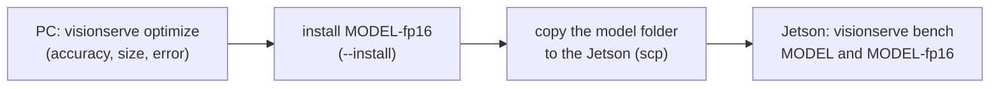

# Make a model fast and small for Jetson Orin / Thor

Three commands, used in this order:

| Command | Runs on | Answers |
|---|---|---|
| `visionserve bench MODEL` | the device (Jetson, PC) | How fast is it **here**? Load time, latency, throughput, memory, and which execution provider really ran. |
| `visionserve sensitivity MODEL` | a PC | Which layers lose accuracy when reduced to INT8 (or FP16)? |
| `visionserve optimize MODEL --target ...` | a PC | Which reduced variant (FP16, INT8, mixed) stays accurate, and how much smaller is it? |

The rule behind the split: **accuracy can be measured anywhere, speed only on the device.** The
same ONNX file computes (nearly) the same numbers on a PC and on a Jetson, so a variant that keeps
its accuracy on your PC keeps it on the Jetson. Its speed does not carry over: a PC GPU, an Orin
and a Thor differ by an order of magnitude, and even the ranking of FP16 vs INT8 depends on the
execution provider. So `optimize` labels its latency column "this host", and the last step of the
workflow is always `bench` on the device.



All three print a verdict first (`PASS`, `WARN` or `FAIL` and one sentence), then a short table,
then details and next steps. `--json` prints one JSON object instead, and `--report FILE.html`
writes a page you can open in a browser or attach to an issue. Exit status: `0` PASS/WARN, `1`
FAIL, `2` a usage or setup error.

## 1. bench: how fast is it on this machine?

```bash
visionserve bench rf-detr --images ./photos --requests 40 --ep cuda --report bench.html
```

It loads the model in-process (like `visionserve run`; no server needed), sends a few warm-up
requests, then times `--requests` requests with `--concurrency` in flight. With `--server URL` it
measures a running server instead: the whole HTTP request, multipart upload included. Without
`--images` it uses a synthetic 640x480 image; real photos are better, because a detector does more
work on a busy scene.

Real output on the development PC (`--images` 16 photos, `--requests 40 --ep cuda`; RTX A6000, CUDA EP, ONNX Runtime 1.26, 5 October 2026), trimmed after the findings:

```text
PASS: p50 16.9 ms, 55.9 req/s on gpu:0

  device (EP used)         gpu:0
  cold load                5.37 s
  first request            927 ms
  latency p50 / p95 / p99  16.9 / 22.7 / 23.6 ms
  server-side p50 / p95    16.9 / 22.7 ms
  throughput               55.9 req/s at concurrency 1
  errors                   0 / 40
  process memory (RSS)     863 MB / 871 MB peak
  GPU memory               794 MB

Findings
  INFO  Numbers are for THIS machine, power mode and load; a shared or busy GPU inflates and jitters them.
...
```

The same three models on the same machine (`--images` = 16 COCO photos; GPU = one RTX A6000 shared
with other jobs, so treat small differences as noise):

| Model | CPU in-process p50 | GPU in-process p50 | GPU via server, concurrency 2: p50 end to end / server-side | Cold load (server) | Server GPU memory |
|---|---|---|---|---|---|
| rf-detr (560 px) | 176 ms | 16.9 ms | 55.7 / 21.2 ms | 2.3 s | 794 MB |
| mobile-sam (box prompt) | 324 ms | 54.0 ms | 109 / 87.1 ms | 5.3 s | 2.4 GB |
| grounding-dino (4-word prompt) | 3171 ms | 124 ms | 270 / 245 ms | 8.7 s | 6.4 GB |


What the lines mean:

- **device** is what the model really ran on, from the result's `device` field: `cpu`, `gpu:0`
  (CUDA) or `gpu:0+trt` (TensorRT). If you asked for a GPU (`--ep cuda`, or a GPU is present and
  the manifest prefers CUDA) and it says `cpu`, the verdict is **WARN**: ONNX Runtime could not
  load its CUDA provider and fell back silently. The usual cause is a CPU-only `libonnxruntime.so`
  or missing cuDNN; `VISIONSERVE_TRACE=1` says which.
- **cold load** is creating the ONNX Runtime session(s); **first request** includes kernel
  selection and memory allocation. Both are paid once per process, but on an edge device that
  restarts often they matter.
- **latency** is per request; **throughput** is requests per second at the given concurrency.
  On a GPU, concurrency 2 to 4 usually raises throughput at some cost in latency.
- **memory**: the process's resident memory, and its GPU memory from `nvidia-smi`. On a Jetson the
  GPU shares system RAM and `nvidia-smi` reports no memory (Orin: a stub; Thor: "Not Supported"),
  so bench samples `tegrastats` instead and reports the system RAM in use, CPU and GPU together.

`--ep tensorrt` runs the TensorRT EP. On GroundingDINO it measured p50 77.6 ms instead of 124 ms on CUDA here (in-process, same photos),
but TensorRT measured **6.8 mAP lower** on GroundingDINO (BUGS_TO_FIX.md #3), and its first
request built the engine for 84 s. bench prints that caveat whenever TensorRT ran. Faster is not
the same as as-accurate.

On a Jetson, set the power mode first and say which one you measured in (`sudo nvpmodel -q`;
`sudo jetson_clocks` for stable clocks).

## 2. sensitivity: which layers break at INT8?

```bash
visionserve sensitivity rf-detr-nano --images ./photos --formats int8,fp16 --save sens.json --report sens.html
```

Each MatMul / Gemm / Conv is reduced **alone** and the model's outputs are compared with FP32 on
your photos (the method is described in [Reduced precision](precision.md#sensitivity)). A layer
whose error alone exceeds `--threshold` (0.05) is called sensitive. Real output for the COCO
RF-DETR nano export, 8 photos, CPU, 4 minutes (trimmed):

```text
WARN: 9 of 114 layers are sensitive to INT8; the worst is …/encoder/encoder/encoder/layer.0/mlp/fc1/MatMul (MatMul, error 0.0841) — keep it in FP32

  layers measured    115                 MatMul / Gemm / Conv, each reduced alone
  sensitive to INT8  9 of 114            error alone > 0.05; mean 0.0166; 1 layer(s) cannot take INT8 and stay float
  sensitive to FP16  0 of 115            error alone > 0.05; mean 9.05e-05
```

FP16 costs nothing measurable on any layer of this model; INT8 hurts nine of them, most of them
the MLP layers of the backbone. Those are the layers to keep in FP32, which is what `optimize`'s
`mixed` candidate does. `--save` writes the scores so that `optimize --sensitivity sens.json` does
not measure them again. `--formats int8,fp8,fp4` also *simulates* the formats Thor adds (nothing is
built: ONNX Runtime cannot run them).

## 3. optimize: the best variant for a target

```bash
visionserve optimize rf-detr-nano --target jetson-orin --images ./photos \
    --labels ./val/instances.json --sensitivity sens.json --gpu --install --report optimize.html
```

For each candidate of the target's preset, optimize builds the ONNX file, then measures:

- **file size**;
- **output error** against FP32 on `--images` (0 = the same detections);
- **mAP** with `--labels` (a COCO annotations json, 100 or more images like the deployment's): the
  *served* model, through a temporary VisionServe server, at its normal confidence threshold;
- **latency on this host** (server-side, `--requests` requests), on the CPU, or on the GPU with
  `--gpu`.

It then marks the recommended row. A variant is *inside the budget* when its output error is at
most `--max-output-err` (default 0.05) and, with `--labels`, it loses at most `--max-drop` mAP
points (default 1.0). Among those, FP32 included:

- if this host measured latency on the same kind of execution provider as the target (`--gpu` for
  a Jetson or `cuda`, no `--gpu` for `cpu`): the fastest one; variants within 10 % of the fastest
  are a tie and the smaller file wins. A reduced variant that is slower than FP32 is **not**
  recommended for speed, and the verdict says how much smaller it would be;
- otherwise speed is unknown here: the smallest variant inside the budget, and the verdict says so.

Without `--labels` the verdict is WARN: only agreement with FP32 was measured, not accuracy. When
latency on this host was noisy (p95 more than 1.5 × p50), the verdict is WARN too, because the
speed ranking may be noise. The recommendation always comes from the target's default EP (CUDA on a
Jetson); `--tensorrt` adds TensorRT rows and names the best of them as a separate, flagged
alternative, only when `--labels` measured its accuracy under TensorRT itself.

`--install` installs the recommended variant as `MODEL-FORMAT` (for example `rf-detr-nano-fp16`):
the same manifest, preprocessing and labels, a new ONNX file and SHA-256, and the precision and
the measured numbers written in the manifest's header comments and in `optimize-report.json`.

Real run with `--gpu --tensorrt --requests 60` (rf-detr-nano; 16 COCO photos for calibration, 100
other COCO val2017 images for mAP; RTX A6000 shared with other jobs, CUDA EP, ONNX Runtime 1.26;
5 October 2026; findings and charts trimmed):

```text
WARN: keep FP32 for speed: no reduced variant is as fast on this host's GPU (rf-detr-nano-mixed is 2.0× smaller but 1.3× slower here); use it only if size matters, and bench both on the device

  recommended              keep FP32                                    the installed model
  budget                   output error <= 0.05, mAP drop <= 1
  latency measured on      ketiserver (x86_64), gpu:0, gpu:0+trt        this host, not the jetson-orin
  under TensorRT (opt-in)  rf-detr-nano-mixed: 13.9 ms here, mAP -0.38  serve with --tensorrt; ...
  time                     20.0 min

Variants for jetson-orin
  variant           file size               output error mean / max  mAP (Δ vs FP32)  latency p50 / p95 (THIS host)  status
  ✓ fp32            107.8 MB                0 / 0                    42.45            15.2 / 21.1 ms (gpu:0)         recommended ✓
  fp16              54.1 MB (2.0× smaller)  0.00681 / 0.0449         42.39 (-0.06)    18.8 / 33.8 ms (gpu:0)         within budget
  int8              29.2 MB (3.7× smaller)  0.298 / 0.633            36.17 (-6.29)    20.9 / 31.4 ms (gpu:0)         over budget: error 0.298 > 0.05; mAP −6.29 > 1
  mixed             52.9 MB (2.0× smaller)  0.0406 / 0.157           41.79 (-0.66)    19.5 / 34.3 ms (gpu:0)         within budget
  fp32 (TensorRT)   107.8 MB                0 / 0                    42.48 (+0.03)    13.3 / 28.7 ms (gpu:0+trt)     within budget
  fp16 (TensorRT)   54.1 MB (2.0× smaller)  0.00681 / 0.0449         42.38 (-0.08)    14.4 / 19.6 ms (gpu:0+trt)     within budget
  int8 (TensorRT)   29.2 MB (3.7× smaller)  0.298 / 0.633            35.45 (-7.01)    15.2 / 21.5 ms (gpu:0+trt)     over budget: error 0.298 > 0.05; mAP −7.01 > 1
  mixed (TensorRT)  52.9 MB (2.0× smaller)  0.0406 / 0.157           42.07 (-0.38)    13.9 / 24.2 ms (gpu:0+trt)     best under TensorRT (opt-in alternative)
```

What this says, in plain terms:

- **INT8 on every layer is too lossy** for this transformer (−6.3 mAP): the error column predicted
  it (0.30, six times the budget). The **mixed** model (15 sensitive-enough layers INT8, the rest
  FP16) stays inside the budget (−0.66 mAP).
- **Smaller is not faster on ONNX Runtime's CUDA EP here.** FP16 and mixed halve the file but run
  slower than FP32: measured directly, the FP16 graph took 16.1 ms per session run against 4.6 ms for
  FP32 on an otherwise idle GPU, and `bench` gave 22.2 vs 10.2 ms p50 for the whole request. So the
  recommendation is FP32, and the verdict says what you would trade if size matters (re-run with
  `--install --install-format fp16`).
- **Under TensorRT the picture changes**: every row is faster, and the mixed model is 2× smaller at
  −0.38 mAP. It is reported as an *alternative*: TensorRT is opt-in, and the decision to turn it on
  is yours (re-check accuracy under it, as this run did).
- The same model for **`--target cpu`** (no `--gpu`, latency on the CPU EP): INT8 QDQ runs on the
  CPU's integer kernels, so the mixed model (29 INT8 layers, the rest FP32, 96.4 MB) was
  **3.8× faster than FP32** (114 vs 433 ms p50) at −0.49 mAP, and was recommended. INT8 everywhere
  (−5.9 mAP) and weight-only INT4 (−11.4 mAP) were over budget.
- Latency on a shared machine is noisy; when p95 exceeds 1.5 × p50 the verdict is WARN. None of
  these latencies is the Jetson's: bench the chosen file there.

Installing a variant anyway and benching it, as you would on the device:

```bash
visionserve optimize rf-detr-nano --target cuda --images ./photos --labels ./val/instances.json \
    --gpu --install --install-format fp16          # FP32 is recommended; fp16 installed on request
visionserve bench rf-detr-nano      --images ./photos --requests 100 --ep cuda   # PASS: p50 15.0 ms, 64.7 req/s on gpu:0
visionserve bench rf-detr-nano-fp16 --images ./photos --requests 100 --ep cuda   # PASS: p50 27.6 ms, 35.4 req/s on gpu:0
```

The installed `rf-detr-nano-fp16` folder holds the FP16 ONNX file, the same labels and a manifest
whose header records how it was made:

```yaml
# Generated by `visionserve optimize` from rf-detr-nano on 2026-10-05.
# precision: fp16 (FP16 weights and activations, float32 inputs/outputs)
# target preset: cuda
# output error vs FP32: mean 0.00681, max 0.0449 on 16 image(s) of calib
# mAP 42.39 vs FP32 42.45 on 100 labelled image(s)
# Same preprocessing, labels and postprocessing as rf-detr-nano; only the ONNX file differs.
name: rf-detr-nano-fp16
```

### Presets

One table, the same as `PRESETS` in `clients/python/visionserve/convert/edge.py`:

| Target | Candidates (FP32 is always the baseline row) | Mixed ladder | EP there by default | Verified |
|---|---|---|---|---|
| `jetson-orin` | fp16, int8, mixed | int8 / fp16 | cuda → cpu (TensorRT: `--tensorrt`) | workflow run on an RTX A6000 (Ampere, same EP); **not on an Orin** |
| `jetson-thor` | fp16, int8, mixed | int8 / fp16 | cuda → cpu (TensorRT: `--tensorrt`) | **untested on hardware** |
| `cuda` | fp16, mixed | int8 / fp16 | cuda → cpu (TensorRT: `--tensorrt`) | RTX A6000 |
| `cpu` | int8, mixed, int4 | int8 | cpu | rf-detr-nano on a shared 48-core x86-64 host |

Why these candidates:

- **FP16 halves the file and kept the accuracy** here (−0.06 mAP). Orin and Thor have FP16 tensor
  cores, but whether the FP16 graph is *faster* on ONNX Runtime's CUDA EP depends on the model:
  the COCO RF-DETR nano export in FP16 ran **3.5× slower** than FP32 on ONNX Runtime 1.26's CUDA
  EP (RTX A6000: 16.1 vs 4.6 ms per session run, GPU otherwise idle). That is why optimize lets
  FP32 compete on speed instead of assuming FP16 wins.
- **INT8 (QDQ) is a size win under the CUDA EP, not a speed win**: ONNX Runtime's CUDA EP
  dequantizes QDQ INT8. It pays off in speed on the CPU and under TensorRT, which runs it on the
  INT8 tensor cores. `--tensorrt` adds TensorRT rows; because TensorRT measured 6.8 mAP lower on
  GroundingDINO, a TensorRT row is only recommended when `--labels` measured its accuracy under
  TensorRT itself.
- **mixed** keeps the sensitive layers in FP32 (or FP16) and the rest in INT8, searched against
  `--max-output-err`. It is the useful INT8 variant for transformers.
- The CPU preset leaves FP16 out (the CPU EP has few FP16 kernels) and adds weight-only INT4.

## Jetson Orin (JetPack 6)

Orin is Ampere (sm_87) with FP16 and INT8 tensor cores and no FP8. JetPack 6.1 / 6.2 ship CUDA
12.6, cuDNN 9.3 and TensorRT 10.3 (JetPack 6.0: CUDA 12.2, TensorRT 8.6). Microsoft publishes no
aarch64 GPU build of ONNX Runtime; Jetson AI Lab publishes `onnxruntime-gpu` for `jp6/cu126`,
including a C/C++ tarball with `libonnxruntime.so` and its CUDA and TensorRT providers. Point
`ORT_DYLIB_PATH` at that library and check with `visionserve bench MODEL --ep cuda` that the
device line says `gpu:0`.

The Docker image for JetPack 6 is `deploy/Dockerfile.edge`. Its `ORT_SOURCE=jetson` path defaults
to `nvcr.io/nvidia/l4t-ml:r36.3.0`, a tag that does not exist on NGC (l4t-ml stops at r36.2.0,
l4t-base at r36.2.0): pass `--build-arg L4T_ML_IMAGE=...` with an image that exists, or install
ONNX Runtime from the Jetson AI Lab tarball.

## Jetson Thor (JetPack 7): untested

Nothing in this guide was run on a Thor. What is known (checked on 5 October 2026):

- Thor is Blackwell, compute capability 11.0 (`sm_110` from CUDA 13 on), with FP16, INT8, FP8 and
  FP4 tensor cores. JetPack 7.0 / 7.1 ship CUDA 13.0 and TensorRT 10.13; 7.2 ships CUDA 13.2 and
  TensorRT 10.16. JetPack 7 is SBSA-aligned: standard arm64 CUDA 13 packages and NGC images, no
  l4t-* images.
- ONNX Runtime: Jetson AI Lab publishes `onnxruntime-gpu` 1.24.0 for `sbsa/cu130` with the CUDA and
  TensorRT providers and `sm_110` kernels. ONNX Runtime 1.24 is the first release with CUDA 13.
- **FP8 / FP4 are not reachable through VisionServe**: ONNX Runtime's TensorRT EP has no FP8 or FP4
  switch, and ONNX Runtime 1.26 cannot build or run an FP8 QDQ model on CPU. Deploying FP8/FP4 means
  native TensorRT with NVIDIA's Model Optimizer. `sensitivity --formats fp8,fp4` simulates what
  they would cost in accuracy.
- `deploy/Dockerfile.thor` builds a server image from `nvcr.io/nvidia/cuda:13.0.0-cudnn-runtime-ubuntu24.04`
  (arm64) and the libraries of that wheel. It builds with `docker buildx --platform linux/arm64`
  and every library the CUDA provider needs is in the image, but it has not run on a Thor.

**Thor checklist**, on the device:

1. `docker build` (or `buildx`) `deploy/Dockerfile.thor`, run it with `--runtime nvidia`, and
   `visionserve version`: the ONNX Runtime library loads.
2. `visionserve bench MODEL --ep cuda`: the device line says `gpu:0`, not `cpu` (a WARN otherwise).
3. Outputs match the PC: run `visionserve run MODEL photo.jpg` on both and compare the detections.
   Better, measure mAP of the deployed variant on the Thor with the same labelled set (for example
   `visionserve check MODEL --images DIR --labels FILE` against the Thor's server): Blackwell
   kernels are not Ampere's, so the PC's accuracy numbers are a strong hint, not a proof.
4. `bench` with `--ep tensorrt` (in an image with TensorRT 10.13+): the INT8 QDQ variant builds an
   engine and its accuracy holds.
5. Memory: `tegrastats` (bench uses it); on JetPack 7.0, `tegrastats` prints no GPU load
   percentage, only clocks, so bench reports the load as unknown.

## Limits

- Single-session image models only (one ONNX file with one static input): RF-DETR, classification,
  depth, the generic converter formats. SAM, GroundingDINO and the pipelines are refused with a
  clear message.
- Output error and mAP are measured on this machine's CPU / GPU kernels. A different GPU (Blackwell)
  or TensorRT computes slightly different numbers; check accuracy on the device for anything you
  ship.
- `--gpu` measures latency on the CUDA EP. The per-layer sensitivity itself runs on the CPU in this
  converter version.
- Calibration on fewer than 8 photos is unreliable; use 16 to 32 photos like the deployment's.
