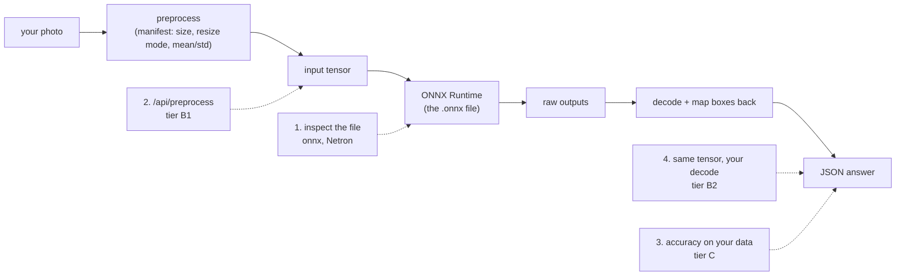
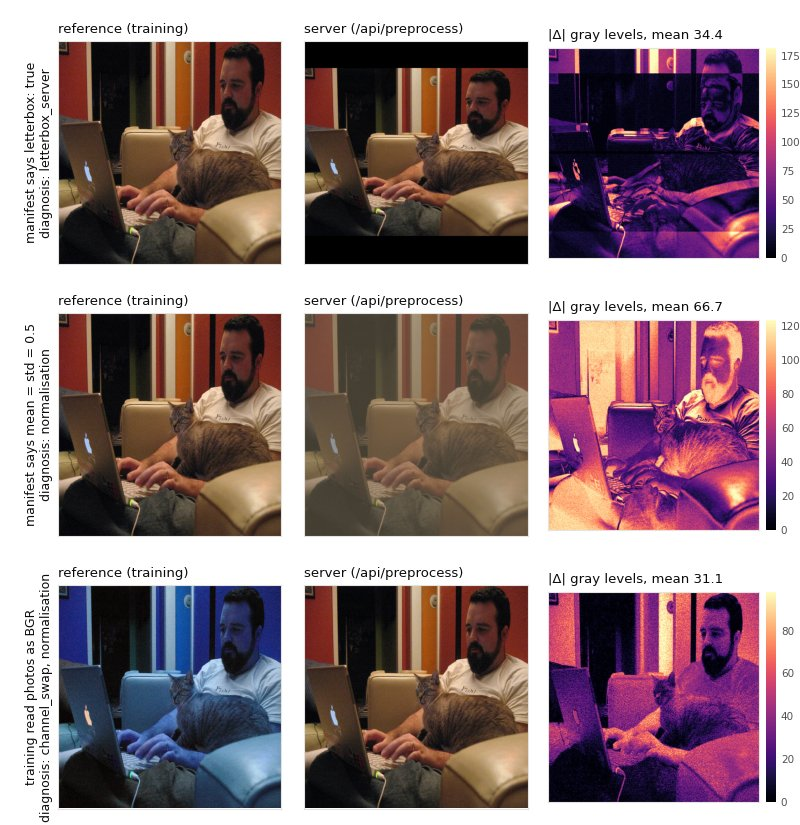

# Inspect and verify a model

A served model can be worse than the same model in your training notebook and never say so. It
loads, it answers, the boxes look plausible. The cause is almost always one of three things: the
model file is not what the manifest says, the photo is prepared differently, or the raw outputs
are decoded differently. This page shows how to look at each of them, with commands and outputs
from real runs on this repository's models.

## Quick way: visionserve check

One command runs the checks of this page on a model you already serve and tells you, in plain
words, whether it behaves like your training pipeline:

```console
$ visionserve serve --models ./models          # in another terminal: check needs a running server
$ visionserve check rf-detr --images ./photos [--labels val.json] [--checkpoint best.pth] [--report check.html]
```

It runs in the converter image, like `visionserve convert` (Docker), and talks to the server at
`--server` (default `http://localhost:11435`). With no server it stops with exit code 2 and the
`visionserve serve` command to start one. What it checks:

| Check | Runs when | Compares |
|---|---|---|
| Preprocessing (B1) | always | `/api/preprocess` with a reference preprocessing of your `--images`: your `--reference SCRIPT.py`, else the `--checkpoint`'s own pipeline, else the architecture's known recipe (RF-DETR: squash + ImageNet mean/std, what the `rfdetr` package does), else what the manifest declares (then it checks only the server's code, and says so) |
| Outputs (B2) | `--checkpoint` or `--reference` | `/api/predict` with the original model on the same photos |
| Accuracy (C) | `--labels` | mAP (COCO json) or top-1 (folder per class, or a CSV `image,label`); served vs the original model, or the served number alone |

The first line is the verdict, then one row per check with the likely cause and the fix of each
FAIL or WARN, next steps, and the detailed tier table of section 3. A real run (CPU, 5 COCO
photos) on a copy of the `rf-detr` manifest with `letterbox: true`, the mistake of
[section 3](#tier-b1-catching-a-preprocessing-mistake); the scratch registry's path is shortened
to `…/reg`:

```console
$ visionserve check rf-detr-lb --images ./photos --models ./reg --server http://127.0.0.1:11720 --report check.html
FAIL: rf-detr-lb does not see photos the way it was trained: the server letterboxes (shrinks the photo and adds bars) while training stretches the whole photo to 560x560.

Summary: rf-detr-lb (detection, rf-detr) on http://127.0.0.1:11720, 5 photo(s) from …/photos
  check                        status  what we found
  Preprocessing (B1)           FAIL    The model sees a different picture than in training: average
                                       difference 59.0 gray levels (out of 255) over 5 photos, where
                                       more than 8 costs accuracy. Reference: the rfdetr package's
                                       preprocessing.
                                       Likely cause: the server letterboxes (shrinks the photo and
                                         adds bars) while training stretches the whole photo to
                                         560x560.
                                       Fix: in …/reg/rf-detr-lb/manifest.yaml set
                                         `input.letterbox: false` (unless the model really was trained
                                         letterboxed).
  Outputs vs original (B2)     SKIP    Not compared: no reference model was given. Pass --checkpoint
                                       PATH (the checkpoint the ONNX was exported from) or
                                       --reference SCRIPT.py to compare the served outputs with the
                                       original model.
  Accuracy on your labels (C)  SKIP    Not measured: pass --labels (a COCO json for detection; a
                                       folder per class or a CSV `image,label` for classification).

Next steps
  1. In …/reg/rf-detr-lb/manifest.yaml set `input.letterbox: false` (unless the model really was trained letterboxed).
  2. Restart `visionserve serve` (it reads a manifest once), then re-run this check.
  ...
```

The correct `rf-detr` manifest on the same photos gives `PASS: rf-detr behaves like its training
pipeline on 5 photos (preprocessing within 0.4 gray levels)`, and with `--labels` on 200 COCO
val2017 photos it adds the served mAP, 47.6. With `--checkpoint`, B2 and C compare against the
original model. This check is how the `rf-detr-nano` manifest was found wrong: on the official
`rf-detr-nano.pth` and 200 COCO val2017 photos (CPU), the manifest as shipped until 5 October 2026
letterboxed and failed: B1 46.6 gray levels, B2 31 of 36 boxes matched, C mAP 40.92 served against
44.09 for `rfdetr` itself. With `letterbox: false`, what it ships now, it passes all three: 0.4 gray
levels, 38 of 38 boxes, mAP 43.80 against 44.09.

`--report check.html` writes the same verdict as one self-contained page (no network access when
opened): the summary, what the model sees next to the reference with a heatmap of the difference,
the boxes of both models on the photos where they disagree most, and the details. `--json` prints
one object, `{"verdict", "reason", "summary", "details"}`, for scripts. The exit code is 0 for
PASS or WARN, 1 for FAIL, 2 for a usage or setup error.



The numbered steps below follow that picture. Section 3 is the converter, which runs all the
checks for you; section 5 is a short checklist.

!!! note "Where these outputs come from"
    Every output on this page was produced on the development machine on 5 October 2026: a
    VisionServe server on CPU (ONNX Runtime 1.26) serving copies of the shipped manifests, and
    the Python package from `clients/python`. Long outputs are trimmed; nothing else is edited.

## Quick way: `visionserve inspect`

One command does the checks of sections 1 and 2 for you, offline, without loading the model
into ONNX Runtime. The first line is the answer: `PASS`, `WARN` or `FAIL`, with the reason.

```console
$ visionserve inspect efficientnet-b0
PASS: efficientnet-b0 is ready to serve: its preprocessing makes a [1,3,224,224] tensor and model.onnx accepts it

  Model           efficientnet-b0
  Task            classification
  Architecture    efficientnet
  Licence         Apache-2.0 (allowed)
  Files           1 ONNX file, 20.2 MiB in all (with labels and side files)
  Parameters      5.27 M
  Input           photo → squash 224×224, ImageNet mean/std → tensor [1,3,224,224]
  Fits the graph  yes (model.onnx input "x" is [1,3,224,224])
  Outputs         648 [1,1000]
  Runs on         cuda → cpu (first one available on this machine)
...
```

Below the summary it lists the files (with their `sha256` pin status), each ONNX file's inputs,
outputs, opset and parameter count, the preprocessing the model's code applies, and the
execution providers, sessions and threads a load would use.

- `--image photo.jpg` runs the model's real preprocessing on your photo (what `/api/preprocess`
  returns, without a server) and writes `<name>-input.png`: the tensor turned back into a
  picture, so you see exactly what the model sees.
- It also takes a folder or a bare `.onnx` file. A file without a manifest gets the
  `visionserve import` command that makes it servable:
  `visionserve import model.onnx --name my-model --task classification --license MIT`. Import
  reads the input size and layout from the file, checks the outputs against the decoder of the
  task, prints every value it had to assume (resize, mean/std), and installs the model.
- `--json` prints one JSON object (`verdict`, `reason`, `summary`, `details`); `--report r.html`
  writes a self-contained HTML page. Exit status: 0 for PASS or WARN, 1 for FAIL, 2 for a usage
  error.

The sections below show what it reads and how to check the same by hand.

## 1. Inspect the model file

An ONNX file declares the name, element type and shape of each input and output. A dimension is
either a fixed number (`560`) or a name (`num_points`, `sequence_length`), which means "any size".
That header is all you need to know what the model expects. It does not tell you how the
pixels must be prepared; only the training code knows that.

### See it yourself

Open the `.onnx` file in [Netron](https://netron.app) (it runs in the browser and does not
upload the file) to see the inputs, outputs and the whole graph. Or print the header with the
`onnx` Python package:

```python title="onnx_io.py"
import sys

import onnx

DTYPE = {1: "float32", 6: "int32", 7: "int64", 9: "bool", 10: "float16"}

for path in sys.argv[1:]:
    m = onnx.load(path, load_external_data=False)
    weights = {t.name for t in m.graph.initializer}  # old exports also list weights as inputs
    print(path)
    for kind, values in (("in ", m.graph.input), ("out", m.graph.output)):
        for v in values:
            if v.name in weights:
                continue
            t = v.type.tensor_type
            dims = [d.dim_value if d.HasField("dim_value") else (d.dim_param or "?")
                    for d in t.shape.dim]
            print(f"  {kind} {v.name:<22} {DTYPE.get(t.elem_type, t.elem_type):<8} {dims}")
```

```console
$ python onnx_io.py models/rf-detr/rf-detr-base-real.onnx models/mobile-sam/mobile_sam_encoder.onnx \
      models/mobile-sam/mobile_sam_decoder_single.onnx
models/rf-detr/rf-detr-base-real.onnx
  in  input                  float32  [1, 3, 560, 560]
  out pred_boxes             float32  [1, 300, 4]
  out pred_logits            float32  [1, 300, 91]
models/mobile-sam/mobile_sam_encoder.onnx
  in  input_image            float32  ['image_height', 'image_width', 3]
  out image_embeddings       float32  ['Addimage_embeddings_dim_0', 256, 64, 64]
models/mobile-sam/mobile_sam_decoder_single.onnx
  in  image_embeddings       float32  [1, 256, 64, 64]
  in  point_coords           float32  [1, 'num_points', 2]
  in  point_labels           float32  [1, 'num_points']
  in  mask_input             float32  [1, 1, 256, 256]
  in  has_mask_input         float32  [1]
  in  orig_im_size           float32  [2]
  out masks                  float32  ['Resizemasks_dim_0', 'Resizemasks_dim_1', 'Resizemasks_dim_2', 'Resizemasks_dim_3']
  ...
```

The same script on four shipped models, summarised:

| Model (file) | Inputs | Outputs | What it tells you |
|---|---|---|---|
| `rf-detr` (`rf-detr-base-real.onnx`) | `input` float32 `[1, 3, 560, 560]` | `pred_boxes` `[1, 300, 4]`, `pred_logits` `[1, 300, 91]` | Fixed 560 × 560, channels first. 300 object queries, 91 class slots (COCO ids, so the label file has 91 lines). |
| `rf-detr-nano` (`rf-detr-base.onnx`) | `input` float32 `[1, 3, 384, 384]` | same names, `[1, 300, 4]`, `[1, 300, 91]` | A different fixed size from the same family: the manifest must say 384. |
| `mobile-sam` encoder | `input_image` float32 `[image_height, image_width, 3]` | `image_embeddings` `[?, 256, 64, 64]` | Dynamic height and width, channels **last**, raw 0–255 pixels: the graph normalises and pads itself. |
| `mobile-sam` decoder | `image_embeddings`, `point_coords [1, num_points, 2]`, `point_labels`, `mask_input`, `has_mask_input`, `orig_im_size` | `masks`, `iou_predictions`, `low_res_masks` | Takes the prompt (points/box corners) and the original image size. |
| `grounding-dino` (`model-fixedmask.onnx`) | `pixel_values` float32 `[1, 3, 800, 800]`, `pixel_mask` int64 `[1, 800, 800]`, `input_ids` / `attention_mask` / `token_type_ids` int64 `[1, sequence_length]` | `logits` (all dims named), `pred_boxes` `[?, ?, 4]` | A fixed image size plus text tokens of any length. |

### What VisionServe reads

The server reads the same header in pure Go, without loading the weights (milliseconds, even
for the 695 MB GroundingDINO file):

```go title="internal/engine/onnxheader.go"
// readONNXHeader returns the graph inputs (constant initializer inputs excluded) and outputs of
// the ONNX model at path, reading only the protobuf framing — never the weights.
func readONNXHeader(path string) (inputs, outputs []IOInfo, err error) {
	f, err := os.Open(path)
	// ...
	return parseONNXHeader(f, st.Size(), headerBufSize)
}
```

[View on GitHub](https://github.com/mtbui2010/vision_serve/blob/main/internal/engine/onnxheader.go#L94-L107)

It uses the names to bind inputs and outputs when a manifest does not list them, and the shapes
for a check at load time (below). The converter reads the header with the same `onnx` code as
the script above, in
[`onnx_io`](https://github.com/mtbui2010/vision_serve/blob/main/clients/python/visionserve/convert/common.py#L429-L440),
and refuses an export whose shapes the target architecture cannot decode (`check_contract`).

### Size mismatch: the manifest and the file disagree

The manifest says how big the input tensor is (`input.width` / `input.height`, or the
`preprocess:` block). For a graph with a **fixed** input, that number must equal the file's.
For a **dynamic** input (MobileSAM's encoder) any size runs, but the model still only works at
the sizes it was trained on, so the manifest must match the training size.

What happens when they disagree? We copied the `rf-detr` manifest, changed only `width: 560` and
`height: 560` to `640`, and served it as `rf-detr-640` (CPU):

```console
$ curl -s -w '\nHTTP %{http_code}\n' -H 'Content-Type: application/json' -d '{"model":"rf-detr-640"}' http://127.0.0.1:11690/api/load
{"error":"lifecycle: \"rf-detr-640\": manifest preprocess width×height 640×640 does not match rf-detr-base-real.onnx input \"input\" [1,3,560,560] (the preprocessing produces [1,3,640,640]) — make the manifest's input size and layout match the export, or re-export the model"}

HTTP 500

$ curl -s -F model=rf-detr-640 -F image=@photo.jpg http://127.0.0.1:11690/api/preprocess \
      | python3 -c "import json,sys; d=json.load(sys.stdin); print(d['inputs'][0]['shape'], d['meta'])"
[1, 3, 640, 640] {'orig_width': 640, 'orig_height': 480, 'scale_x': 1, 'scale_y': 1.3333333333333333, 'pad_x': 0, 'pad_y': 0}
```

The model **does not load**, and the error names the manifest setting, the file, the input and
both shapes. `/api/predict` answers the same error, because it loads the model first. It is a
500, not a 400: the server is misconfigured, the request is fine. `/api/preprocess` still
answers, on purpose: it shows the `[1, 3, 640, 640]` tensor the manifest produces, next to the
`560` the file wants. (Before this check the load succeeded, and the first prediction failed
inside ONNX Runtime with `index: 2 Got: 640 Expected: 560`, which names no manifest field.)

The check runs the model's own preprocessing on three small images (landscape, portrait, square)
and compares the tensor with the input shape in the file header:

```go title="internal/lifecycle/inputshape.go"
	produced, ok := probeShape(pre)
	if !ok {
		fit.Skipped = "the probes could not be preprocessed"
		return fit
	}
	fit.Produced = produced
	if !shapeFits(produced, graph.Shape) {
		spec, _ := man.PreprocessSpec()
		fit.Err = &InputShapeError{
			Model: man.Name, File: file, Input: graph.Name,
			Graph: graph.Shape, Produced: produced,
			Width: spec.Width, Height: spec.Height, Layout: string(spec.Layout),
		}
	}
	return fit
}
```

[View on GitHub](https://github.com/mtbui2010/vision_serve/blob/main/internal/lifecycle/inputshape.go#L221-L236)

`visionserve inspect` runs this same function and prints what it compared (`Fits the graph`).

It compares only what is fixed on both sides. A dimension the file declares dynamic (a name
instead of a number) is not judged, and neither is one that changes with the photo
(`keep_aspect`, `long_side` without padding, `none`): `probeShape` marks those `-1`. It also
catches a wrong layout (an NHWC manifest for an NCHW graph) and a wrong channel count. It judges
a plain model's main input, and a pipeline's `explain` role when that graph has one input. For
the other inputs of a pipeline (prompts, token ids, a second session) it cannot tell which
tensor goes where, so it does not guess. Check those by hand: the `shape` that `/api/preprocess`
returns (next section) must fit the input shape in the file. The converter writes the manifest
and the file from the same export, so a converted model cannot disagree; a hand-written manifest
can.

## 2. Inspect the preprocessing

`POST /api/preprocess` takes exactly the request `/api/predict` takes and returns the tensor the
model **would** receive, without running it. It is the most useful debugging tool in the API.
(Below, the 5 MB `data` string is cut short and the JSON indented.)

```console
$ curl -s -F model=rf-detr -F image=@photo.jpg http://127.0.0.1:11670/api/preprocess
{
  "model": "rf-detr",
  "inputs": [
    {
      "role": "model",
      "name": "input",
      "shape": [1, 3, 560, 560],
      "dtype": "float32",
      "data": "kuClv7W5mL8i9Y+/txGovwF0..."
    }
  ],
  "meta": {
    "orig_width": 640,
    "orig_height": 480,
    "scale_x": 0.875,
    "scale_y": 1.1666666666666667,
    "pad_x": 0,
    "pad_y": 0
  }
}
```

- `inputs` has one entry per tensor of the first ONNX session: its ONNX `name`, `shape`,
  `dtype` (`float32`, or `int64` for token ids) and `data`, the raw little-endian bytes in
  base64. A pipeline such as GroundingDINO returns several (`pixel_values`, `input_ids`, ...).
- `meta` says how the photo was fitted: `input_x = orig_x × scale_x + pad_x`. Here the 640 × 480
  photo was stretched to 560 × 560 (`scale_x` 0.875 ≠ `scale_y` 1.167, no padding). With
  `letterbox: true` you would see one scale (0.875 for both axes) and `pad_y: 70`.

The fields are declared in
[`internal/server/preprocess.go`](https://github.com/mtbui2010/vision_serve/blob/main/internal/server/preprocess.go#L13-L39).
There is no `visionserve preprocess` command; from Python use `Client.preprocess` (and
`Client.tokenize` for the token ids of a text model). It returns numpy arrays, bit-exact. Turn
the tensor back into a picture and compare it with what your training code builds:

```python
import numpy as np
from PIL import Image
from visionserve import Client
from inspect_reference import preprocess as my_transform  # your training transform

pre = Client("http://127.0.0.1:11670").preprocess("rf-detr", "photo.jpg")
x = pre.inputs["input"]                                    # float32 [1, 3, 560, 560]
print(x.shape, x.dtype, pre.meta)

mean = np.array([0.485, 0.456, 0.406])                     # from the manifest
std = np.array([0.229, 0.224, 0.225])
img = (x[0].transpose(1, 2, 0) * std + mean) * 255         # undo the normalisation
Image.fromarray(img.clip(0, 255).astype(np.uint8)).save("what-the-model-sees.png")

mine = my_transform(Image.open("photo.jpg"))               # [3, 560, 560]
diff = np.abs(x[0] - mine) * std[:, None, None] * 255      # in gray levels (0-255)
print(f"mean |Δ| {diff.mean():.2f} gray levels, max {diff.max():.1f}")
```

```console
(1, 3, 560, 560) float32 {'orig_width': 640, 'orig_height': 480, 'scale_x': 0.875, 'scale_y': 1.1666666666666667, 'pad_x': 0, 'pad_y': 0}
mean |Δ| 0.30 gray levels, max 3.0
```

`my_transform` here is
[`website/tools/inspect_reference.py`](https://github.com/mtbui2010/vision_serve/blob/main/website/tools/inspect_reference.py),
a ten-line RF-DETR training transform (squash to 560, /255, ImageNet mean/std). The difference is
measured in **gray levels**, the 0–255 pixel units, so the number means the same thing whatever
the normalisation. How to read it:

| mean \|Δ\| | Meaning |
|---|---|
| below 1 | The same preprocessing. The rest is resize-filter rounding (Go and PIL interpolate slightly differently). |
| 1 to 8 | Something small differs: a resampling filter, JPEG decoder, antialiasing. Worth a look. |
| above 8 | A different preprocessing step. Expect lost accuracy. |

(These are the converter's default thresholds, `b1_mean_warn` = 2 and `b1_mean_fail` = 8.) The
resize modes themselves are explained, with pictures, in
[From pixels to tensors](../concepts/preprocessing.md).

## 3. Let the converter check it: tiers A, B1, B2, C

The converter (`visionserve convert`, a Docker image, or `pip install "visionserve[convert]"`,
which installs `visionserve-convert`) does not stop at writing an ONNX file. After installing it
runs the checks of this page against a real server and refuses the model if one fails
([Clients and the converter](../architecture/clients.md#verification-tiers) describes the
plumbing):

| Tier | Compares | Passes when (defaults) |
|---|---|---|
| **A** | The ONNX graph vs the framework model, same input tensor (two synthetic images; for RF-DETR also the first `--images` photo) | outputs agree to `--tolerance` (1e-3, relative). For a DETR detector: every query scoring ≥ 0.05 agrees, and at least half of all queries agree at their own row |
| **B1** | `/api/preprocess` vs the reference preprocessing, same photos | mean \|Δ\| ≤ 2 gray levels (WARN up to 8, FAIL above) |
| **B2** | `/api/predict` vs the original framework pipeline, same photos (`--images`) | detection: ≥ 95 % of boxes matched (same class, IoU ≥ 0.5), mean \|Δconf\| ≤ 0.03, mean box error ≤ 1 % of the image diagonal; classification: the same top-1 on every photo |
| **C** | Accuracy (mAP or top-1) of the reference and of the served model on **your** labelled data (`--eval`) | the served model loses ≤ 0.5 point (WARN up to 1, FAIL above, `--max-map-drop`) |
| **P** | Only with `--precision`: the FP16 / INT8 model vs the FP32 ONNX on the calibration images ([Reduced precision](precision.md)) | output distance ≤ 0.05 (WARN up to 0.25, FAIL above). A reduced model without `--eval` also gets a WARN: its accuracy was not measured |

The B1 reference is, strongest first: your own transform (`--reference-script FILE.py`, or
`preprocess=` in the Python API), the framework's official pipeline (rfdetr's `predict`, a
HuggingFace image processor), or the manifest's preprocessing re-implemented in numpy. Only the
first two check that the manifest matches **training**; the third only checks the Go code. The
thresholds are in
[`convert/report.py`](https://github.com/mtbui2010/vision_serve/blob/main/clients/python/visionserve/convert/report.py#L24-L54)
and can be changed with `--threshold key=value`.

### A real run

A HuggingFace ViT classifier (`google/vit-base-patch16-224`, from the local HuggingFace cache),
converted on CPU with the nine COCO photos used on this site in `photos/` (tier B uses up to 8,
spread over the folder):

```console
$ visionserve-convert hf ~/.cache/huggingface/hub/models--google--vit-base-patch16-224/snapshots/3f49326e... \
      --name vit --license Apache-2.0 --images photos/ --device cpu
...
VisionServe convert report: vit (classification, efficientnet)
overall: WARN
  tier  check                                       status  result
  A     ONNX vs framework parity (synthetic input)  PASS    max|Δ|/scale 6.61e-07 over 1 run(s), tolerance 0.001
  B1    preprocessing vs HF AutoImageProcessor      PASS    mean|Δ| 0.22 gray levels (tensor 0.00169), max 2.0 levels, p99 1.0; 8 image(s)
  B2    outputs vs HF processor + softmax           WARN    top-1 agreement 87.5% (8 images), |Δprob| max 0.0334 mean 0.00441
full report: .../models/vit/convert-report.json
```

Tier A and B1 pass: the graph is the model, and the server prepares photos as the HuggingFace
processor does (0.22 gray levels). B2 warns because one photo of eight changed its top class. On
that photo the model hesitates between two classes: the reference says *desktop computer* 0.204,
*hand-held computer* 0.196; the server says *hand-held computer* 0.210, *desktop computer* 0.198.
A difference of 0.01 in probability, from the 0.22-gray-level resize difference, swaps them. This
is a WARN, not a FAIL, on purpose: it is worth knowing, but it is not a bug. Tier C (`--eval`)
would say whether it costs accuracy over a whole labelled set.

### Tier A on a DETR: a set of queries, not a list

Tier A on the official COCO RF-DETR Nano checkpoint (`rf-detr-nano.pth`, rfdetr 1.7.1, CPU;
`--dry-run --no-server`, so tier A only; it uses the first photo of `--images`, COCO `177015.jpg`):

```console
$ visionserve-convert rfdetr ~/.roboflow/models/rf-detr-nano.pth --name coco-nano \
      --images photos/ --device cpu --dry-run --no-server
...
  parity rfdetr[seed 0]: max|Δ|/scale 9.89e-04; 1 of 300 queries score >= 0.05; 200/300 match at their own row; 100 low-score queries differ (top-K near-ties, best score 0.020), not judged one by one
  parity rfdetr[seed 1]: max|Δ|/scale 2.83e-05; 0 of 300 queries score >= 0.05; 300/300 match at their own row
  parity rfdetr[177015.jpg]: max|Δ|/scale 5.23e-05; 107 of 300 queries score >= 0.05; 300/300 match at their own row
...
overall: PASS
```

On the first noise image 100 of the 300 queries differ between PyTorch and ONNX Runtime, and it
is not a bug. RF-DETR's decoder takes the 300 best of the encoder's proposals; on noise many of
them score alike, so a difference in the sixth decimal changes which ones make the cut, and the
queries attend to each other, so the swap shifts the rest a little. All 100 score below 0.02,
far under any threshold. Tier A therefore requires every query that scores 0.05 or more to match,
and at least half of all queries to match at their own row. An export bug fails both: swapped box
coordinates or shifted logits move every query. On the photo, 107 queries score above 0.05 and
all 300 match. (Before 2026-10-05 tier A allowed at most 2 % of rows to differ, so it refused
this checkpoint, and Small, which has 32 such queries on the second noise image.) The official
Base and Medium checkpoints and a fine-tuned Small pass the same way.

A near-tie can also land on a query that scores above 0.05. The official Medium checkpoint on
`test/testdata/sample.jpg` scores proposals 501 and 224 at −3.635506 and −3.635507. PyTorch puts
them in decoder slots 190 and 191, and ONNX Runtime puts them the other way round. Each slot adds
its own learned query to its proposal, so after the swap the two slots hold two different queries.
Both score about 0.06, and neither matches any row of the other run (the closest one is off by
1.15e-2). Tier A therefore reads which proposals the ONNX graph kept, through a copy of the graph
that also returns the input and indices of its `TopK`. It accepts the difference only if the
encoder's proposal scores match to the tolerance and each moved slot holds a proposal that ties
with PyTorch's choice within the measured score difference. It then runs PyTorch again with ONNX's
proposal order and compares every query under the usual rules. On that photo the rerun matches
all 300 queries to 1.9e-4. An export bug next to a tie still fails the rerun, and a selection
that is not a near-tie fails the check before the rerun.

### Tier B1 catching a preprocessing mistake

To see what B1 does with a real mistake, we served three deliberately wrong versions of
`rf-detr` and ran tier B1 against the correct training transform above, on the nine COCO photos
used on this site:

- `rf-detr-letterbox`: the manifest says `letterbox: true`, but RF-DETR was trained squashed.
- `rf-detr-mean05`: the manifest says `mean: [0.5, 0.5, 0.5]`, `std: [0.5, 0.5, 0.5]` instead of
  the ImageNet values.
- the correct `rf-detr`, but the *training* code read photos with OpenCV, which gives BGR.

<figure markdown="span">
  { loading=lazy }
  <figcaption>Tier B1 on three deliberate mistakes. Left: the training tensor; middle: the server's tensor from /api/preprocess; both drawn with the training normalisation, i.e. as the model reads them. Right: the difference in gray levels for this photo (the report below averages nine photos).<br/><code>rf-detr</code> · Photo: COCO val2017 #177015 (<a href="http://farm1.staticflickr.com/131/355302776_1d1215b7c1_z.jpg">Flickr</a>, CC BY 2.0)</figcaption>
</figure>

The report rows, and the diagnosis B1 prints for each mistake:

```console
  tier  check                                           status  result
  B1    B1 rf-detr: correct manifest [rf-detr]          PASS    mean|Δ| 0.24 gray levels (tensor 0.00413), max 4.0 levels, p99 1.0; 9 image(s)
  B1    B1 rf-detr-letterbox: manifest says letterbox~  FAIL    mean|Δ| 50.32 gray levels (tensor 0.873), max 255.0 levels, p99 255.0; 9 image(s)
  B1    B1 rf-detr-mean05: manifest says mean = std =~  FAIL    mean|Δ| 76.47 gray levels (tensor 0.6), max 211.1 levels, p99 206.7; 9 image(s)
  B1    B1 rf-detr: training read photos as BGR [rf-d~  FAIL    mean|Δ| 26.44 gray levels (tensor 0.457), max 255.0 levels, p99 217.0; 9 image(s)
notes:
  [B1] [9/9 images] geometry: the server LETTERBOXES (keeps aspect, pads x=0 y=70) but the reference SQUASHES the whole frame — set `letterbox: false` in the manifest unless the model was trained letterboxed (e.g. 000000034873.jpg)
  [B1] [9/9 images] normalisation: the reference looks like ImageNet mean/std (per-channel fit ref = a*server + b: a=[2.18, 2.22, 2.22], b=[0.0665, 0.196, 0.417], r^2>=1.000); the manifest declares mean [0.5, 0.5, 0.5], std [0.5, 0.5, 0.5] (e.g. 000000034873.jpg)
  [B1] [9/9 images] channel order: reference channels [0, 1, 2] match server channels [2, 1, 0] — RGB/BGR swap (e.g. 000000034873.jpg)
  [B1] [9/9 images] normalisation: the reference looks like mean ~ [0.565, 0.456, 0.328], std ~ [0.234, 0.225, 0.222] (...); the manifest declares mean [0.485, 0.456, 0.406], std [0.229, 0.224, 0.225] (e.g. 000000034873.jpg)
```

Each mistake is found, and named. A difference alone would only say "something is wrong"; the
diagnosis looks for the fingerprint each common mistake leaves in the two tensors:

```python title="clients/python/visionserve/convert/diagnose.py"
  letterbox vs squash   constant padding rows/columns on one side only (or the server's meta pad)
  centre crop           the reference correlates with a central crop of the server image
  mean/std mismatch     a per-channel affine relation ref = a*srv + b with a high r^2
  /255 missing          the same relation with a ~= 255 (or 1/255)
  RGB/BGR swap          reference channel 0 correlates best with server channel 2
  resampling filter     high r^2, a ~= 1, b ~= 0, small residual
```

[View on GitHub](https://github.com/mtbui2010/vision_serve/blob/main/clients/python/visionserve/convert/diagnose.py#L7-L12)

For the mean/std case it even recovers the right values: a per-channel fit `ref = a × server + b`
turns back into the mean and std the reference used, here recognised as ImageNet. In the BGR
case the second note is a side effect of the swap (swapped channels have different means) and
disappears once the channel order is fixed.

The VisionServe server always feeds RGB, so a BGR mismatch is fixed on the training side or by
re-exporting; the other two are one-line manifest fixes.

!!! tip "Run the tiers on a model you already serve"
    The converter runs the tiers as part of a conversion; `visionserve check`
    ([above](#quick-way-visionserve-check)) runs them on any installed model. The functions behind them
    (`tier_b1`, `tier_b2`, `tier_c` in `visionserve.convert.verify` / `.evaluate`) also work on
    any installed model; the `inspect` step of
    [`website/tools/figures.py`](https://github.com/mtbui2010/vision_serve/blob/main/website/tools/figures.py),
    which produced the figure and numbers above, is a worked example.

## 4. Inspect the postprocessing

Postprocessing turns raw outputs into the answer: pick the class of each query, apply the
threshold, convert the box format, and map the box back to the photo's pixels. The rule for the
last step, and a picture of it, is in
[From pixels to tensors, step 3](../concepts/preprocessing.md#step-3-map-the-answer-back-to-your-photo):
every `bbox` VisionServe returns is `[x, y, w, h]` in **original** pixels.

### Decode the same tensor yourself

To check only the decode, remove every other difference: take the exact tensor from
`/api/preprocess`, run the ONNX file yourself, decode the outputs the way the original framework
does, and compare with `/api/predict`. For RF-DETR the decode is: sigmoid per query, best class,
threshold, **no NMS** (each query is one object already), boxes are `cx, cy, w, h` in 0–1 of the
input:

```python
import numpy as np
import onnxruntime as ort
from visionserve import Client

c = Client("http://127.0.0.1:11670")
pre = c.preprocess("rf-detr", "photo.jpg")      # the exact tensor the server feeds the model
x, meta = pre.inputs["input"], pre.meta

sess = ort.InferenceSession("models/rf-detr/rf-detr-base-real.onnx", providers=["CPUExecutionProvider"])
boxes, logits = sess.run(["pred_boxes", "pred_logits"], {"input": x})

# RF-DETR decode: sigmoid per query, best class, NO NMS; boxes are cx,cy,w,h in 0..1 of the input
p = 1 / (1 + np.exp(-logits[0]))
cls, score = p.argmax(-1), p.max(-1)
H, W = x.shape[2], x.shape[3]
labels = open("models/rf-detr/coco91.txt").read().splitlines()
print("my decode:")
for q in np.argsort(-score):
    if score[q] < 0.5:  # the manifest's conf_threshold
        break
    cx, cy, w, h = boxes[0, q] * [W, H, W, H]
    x0 = (cx - w / 2 - meta["pad_x"]) / meta["scale_x"]  # input pixels -> original pixels
    y0 = (cy - h / 2 - meta["pad_y"]) / meta["scale_y"]
    bbox = [x0, y0, w / meta["scale_x"], h / meta["scale_y"]]
    print(f"  {labels[cls[q]]:<8} {score[q]:.3f}", [round(float(v), 1) for v in bbox])

print("server:")
for d in c.predict("rf-detr", "photo.jpg").detections:
    print(f"  {d.cls:<8} {d.conf:.3f}", [round(v, 1) for v in d.bbox])
```

```console
my decode:
  laptop   0.910 [7.0, 172.4, 285.4, 241.1]
  cat      0.866 [309.8, 182.0, 304.2, 178.9]
  person   0.600 [168.9, 4.1, 469.7, 386.9]
  couch    0.547 [387.8, 316.2, 251.9, 159.6]
  person   0.510 [4.4, 3.4, 634.1, 469.2]
server:
  laptop   0.910 [7.0, 172.4, 285.4, 241.1]
  cat      0.866 [309.8, 182.0, 304.2, 178.9]
  person   0.600 [168.9, 4.1, 469.7, 386.9]
  couch    0.547 [387.8, 316.2, 251.9, 159.6]
  person   0.510 [4.4, 3.4, 634.1, 469.2]
```

Identical to 0.1 pixel. If yours differ, the usual suspects are the label file (91 COCO ids with
`N/A` gaps, not 80 names), the box format (`cxcywh` vs `xyxy` in the manifest's `postprocess`),
a forgotten `pad` in the mapping, and NMS applied to a DETR model.

### B2 and C: outputs and accuracy over many photos

Tier B2 does the same comparison over many photos and summarises it: boxes are matched by class
and IoU ≥ 0.5, then it reports the matched fraction, the confidence difference and the box error
in pixels. Tier C computes mAP for both sides against ground truth. Here are the correct
`rf-detr` and the letterboxed copy from section 3, against the same ONNX file run on the correct
preprocessing and decoded in Python (B2: the nine site photos; C: COCO val2017):

```console
  tier  check                                           status  result
  B2    B2 rf-detr [rf-detr]                            PASS    47/47 matched (100.0%), |Δconf| mean 0.00422 max 0.0667, box err mean 0.0706 px max 3.62 px (ref 47 / served 48 dets)
  C     C rf-detr [rf-detr]                             PASS    mAP 47.28 ref / 47.62 served (Δ +0.34), mAP50 58.59 / 59.13 (Δ +0.54); 200 images, 80 classes
  B2    B2 rf-detr-letterbox [rf-detr-letterbox]        WARN    43/45 matched (95.6%), |Δconf| mean 0.0591 max 0.311, box err mean 1.65 px max 48 px (ref 47 / served 45 dets)
  C     C rf-detr-letterbox [rf-detr-letterbox]         FAIL    mAP 47.28 ref / 45.61 served (Δ -1.67), mAP50 58.59 / 57.00 (Δ -1.59); 200 images, 80 classes
notes:
  [B2] 0 reference-only and 1 served-only detections scored within 0.05 of conf_threshold 0.5: threshold-boundary flips, not counted
  [C] both sides at conf_threshold 0.5 (what users get), so absolute mAP is below a paper number computed at ~0.001; the delta is the check (FAIL if the drop exceeds --max-map-drop 1 points)
  ...
```

How to read it:

- **The correct model** matches the reference box for box: 47 of 47 boxes, confidences within
  0.004 on average, boxes within 0.07 px on average. The one extra served box scored just above
  the 0.5 threshold, where a 0.01 change decides; B2 reports such boundary flips but does not
  count them. Over 200 COCO photos it scores the same mAP as the reference (+0.34, noise).
- **The letterbox mistake** looks almost fine in B2: 96 % of boxes still match, because the
  model still sees the whole photo, only smaller. But confidences move by up to 0.31, one box
  moves by 48 px, and over 200 photos it loses 1.67 mAP. That is why the tiers come in layers:
  B1 named this mistake without any labels, B2 showed the outputs drift, C put a price on it.
- **Use enough images for tier C.** With 50 photos instead of 200, the *correct* model measured
  -1.45 mAP against its own reference, which is pure sampling noise at a 0.5 threshold. The
  converter's default is 200 (`--eval-max`).

### Tests that pin the decode

Every model's pre- and postprocessing is pinned by golden tests in
[`internal/models/golden`](https://github.com/mtbui2010/vision_serve/tree/main/internal/models/golden):
fixed synthetic images and synthetic ONNX outputs with the **real** tensor shapes of the shipped
exports, and the exact `Result` they must produce. A change that moves any number fails them:

```console
$ go test ./internal/models/golden -count=1 -v | grep -e '^---' -e '^ok'
--- PASS: TestGoldenRLEAndMorph (0.05s)
--- PASS: TestGoldenCLIPImage (0.41s)
--- PASS: TestGoldenExplain (0.51s)
--- PASS: TestGoldenClassification (0.58s)
--- PASS: TestGoldenRTDETR (0.58s)
--- PASS: TestGoldenDepth (0.62s)
--- PASS: TestGoldenPaddleOCR (0.92s)
--- PASS: TestGoldenRFDETR (1.01s)
--- PASS: TestGoldenSCRFD (1.16s)
--- PASS: TestGoldenNanoSAM (1.50s)
--- PASS: TestGoldenEfficientSAM (1.82s)
--- PASS: TestGoldenSAM2 (3.41s)
--- PASS: TestGoldenOWLv2 (3.44s)
--- PASS: TestGoldenMobileSAM (3.71s)
ok  	visionserve/internal/models/golden	3.748s
```

They prove that a refactor changed nothing; they cannot prove the decode was right in the first
place. That is what the comparison against the framework (above, and tier B2) is for.

### Which hardware ran it

The same model can give slightly different numbers on another execution provider, and TensorRT
measurably lower ones (see [Engine](../architecture/engine.md)). Every answer has a `device`
field (`cpu`, `gpu:0`, ...). To see why, start the server with `VISIONSERVE_TRACE=1`. On a
machine whose ONNX Runtime has no CUDA, the manifest's `prefer: [cuda, cpu]` silently falls back:

```console
$ VISIONSERVE_TRACE=1 visionserve serve --addr 127.0.0.1:11672 --models ./models
...
engine: [trace] creating session for rf-detr-base-real.onnx — EP chain: cuda → cpu
engine: [trace] EP cuda unavailable in this ONNX Runtime build (CUDA execution provider is not enabled in this build.) — skipping
```

### What the model looked at

`POST /api/explain` returns a heatmap for one detection: where the model looked to produce it.
It is a sanity check, not a metric: a "cat" box whose heatmap sits on the cat is reassuring; one
whose heatmap sits on the sofa means the model learned the context, or the boxes are mapped to
the wrong place. A model needs an `explain:` block in its manifest:

```console
$ curl -s -F model=rf-detr -F image=@photo.jpg -F detection_idx=0 http://127.0.0.1:11672/api/explain
{"error":"invalid request: model \"rf-detr\" does not support explain (no explain block in manifest)"}

$ curl -s -D - -o explain.png -F model=rfdetr-small -F image=@photo.jpg -F detection_idx=0 \
      http://127.0.0.1:11672/api/explain | grep -i '^x-explain'
X-Explain-Detection: {"bbox":[316.2246322631836,182.2833752632141,298.51951599121094,182.30124950408936],"class":"cat","conf":0.9180101281356938}
X-Explain-Query: 1
```

The [model gallery](../gallery.md) shows such heatmaps for two detections of this photo.

## 5. Checklist: my served model is worse than in training

Check in this order; each step rules out one layer.

1. **Is it the same file?** Compare the manifest's `model_file` (and `sha256`) with the file you
   exported. A converted model passed tier A: the ONNX graph equals the framework model.
2. **Does the size match?** The `shape` from `/api/preprocess` must equal the ONNX input shape
   ([section 1](#size-mismatch-the-manifest-and-the-file-disagree)).
3. **Is the photo prepared the same way?** Compare `/api/preprocess` with your training transform
   ([section 2](#2-inspect-the-preprocessing)). More than a couple of gray levels means a
   different step; let tier B1 name it
   ([section 3](#tier-b1-catching-a-preprocessing-mistake)): letterbox vs squash, centre crop,
   mean/std, a missing /255, RGB vs BGR.
4. **Text models: are the tokens the same?** `Client.tokenize(model, text)` vs your tokenizer
   (padding and length matter).
5. **Is the decode the same?** Decode the server's own tensor yourself and compare with
   `/api/predict` ([section 4](#decode-the-same-tensor-yourself)): label file, box format,
   threshold, no NMS on DETR models.
6. **Are you measuring the same thing?** Boxes come back as `[x, y, w, h]` in original pixels.
   The manifest's `conf_threshold` (0.5 for RF-DETR) drops low-confidence boxes that a mAP
   evaluation at 0.001 would count, so served mAP is lower than a paper number by design.
7. **Which hardware ran it?** The `device` field and `VISIONSERVE_TRACE=1`. TensorRT is opt-in
   because it measured lower accuracy.
8. **Measure it on your data.** Tier C (`--eval`) gives the reference and the served mAP or top-1
   on your labelled set, side by side.
