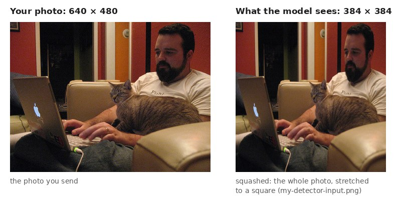

# See what a model takes and returns

## When you need this

You want to know what a model expects before you use it: what size of picture, prepared how,
and what comes out. Or a model does not load and you want to know why. Or someone gave you an
`.onnx` file and you want to know what it is. `inspect` answers in a second, without loading the
model and without a server.

## The command

```console
$ visionserve inspect my-detector
```

It also takes a folder or a bare `.onnx` file: `visionserve inspect model.onnx`.

## Reading the result

```console
$ visionserve inspect my-detector
PASS: my-detector is ready to serve: its preprocessing makes a [1,3,384,384] tensor and model.onnx accepts it

  Model           my-detector
  Task            detection
  Architecture    rf-detr
  Licence         Apache-2.0 (allowed)
  Files           1 ONNX file, 102.8 MiB in all (with labels and side files)
  Parameters      26.86 M
  Input           photo → squash 384×384, ImageNet mean/std → tensor [1,3,384,384]
  Fits the graph  yes (model.onnx input "input" is [1,3,384,384])
  Outputs         dets [1,300,4], labels [1,300,91]
  Runs on         cuda → cpu (first one available on this machine)
...
```

The first line is the answer: `PASS`, the model can be served. The summary below it, line by line:

| Line | What it tells you |
|---|---|
| **Task** | What the model does: `detection` returns boxes with a class name each. [What the models do](../concepts/tasks.md) explains every task. |
| **Licence** | Only Apache-2.0, MIT and BSD are allowed. Anything else is a `FAIL`. |
| **Parameters** | The size of the model. 26.86 million numbers is a small detector. |
| **Input** | How your photo is prepared. Here: *squashed* to 384 × 384 (stretched, the aspect ratio is not kept), then its colours scaled with the ImageNet mean and std (the usual scaling for models pre-trained on ImageNet). The result is a *tensor* (an array of numbers) of shape `[1,3,384,384]`: 1 photo, 3 colours, 384 rows, 384 columns. |
| **Fits the graph** | The tensor the preparation makes has the shape the model file accepts. `NO` here means the model would fail to load. |
| **Outputs** | What the model file returns: 300 candidate boxes (`dets`) and 91 class scores for each (`labels`). VisionServe turns them into the JSON answer. |
| **Runs on** | The hardware it will try, in order: the GPU (`cuda`), else the CPU. |

Below the summary come the details: each file with its SHA-256 check, each ONNX input and
output, the preparation step by step, and the runtime settings.

### See the picture the model gets

```console
$ visionserve inspect my-detector --image photo.jpg
...
Input tensor for photo.jpg
  Photo    photo.jpg, 640×480
  Tensor   model/input [1,3,384,384] float32
  Values   min -2.101, max 2.553, mean per channel [-0.4812, -0.868, -0.9199]
  Mapping  tensor_x = photo_x × 0.6 + 0, tensor_y = photo_y × 0.8 + 0 (how boxes map back)
  Picture  my-detector-input.png (normalisation undone)
```

`--image` runs the model's real preparation on your photo and saves it as a picture,
`my-detector-input.png`. This is exactly what the model sees:

<figure markdown="span">
  { loading=lazy }
  <figcaption>The photo you send, and what <code>my-detector</code> gets from it: squashed to 384 × 384. If your training code kept the aspect ratio and added bars instead, this picture would show it at once.<br/>Photo: COCO val2017 #177015 (<a href="http://farm1.staticflickr.com/131/355302776_1d1215b7c1_z.jpg">Flickr</a>, CC BY 2.0)</figcaption>
</figure>

Compare it with a picture from your training code. Same framing, same stretching, same colours:
good. Bars, a crop, or blue skin (red and blue swapped): the preparation differs from training,
and the model will be less accurate. [Check it behaves like training](check-training.md) measures
the difference for you.

### A file without a manifest

```console
$ visionserve inspect exported.onnx
WARN: exported.onnx has no manifest: VisionServe cannot serve it until it is imported (command below)

  File        exported.onnx
  Size        102.8 MiB
  Parameters  26.86 M
  Inputs      input [1,3,384,384] float32
  Outputs     dets [1,300,4] float32; labels [1,300,91] float32
  Looks like  detection
...
Next steps
  visionserve import exported.onnx --name exported --task detection --license LICENSE-ID
...
```

It guesses the task from the outputs and prints the [`import`](use-your-model.md#already-have-an-onnx-file-import-it)
command that makes the file servable.

## If it says WARN or FAIL

| Message | What to do |
|---|---|
| `FAIL: the manifest prepares a [1,3,640,640] tensor (input 640×640, layout NCHW) but model.onnx input "input" takes [1,3,384,384]` | The manifest's input size is not the size the model was exported with. Set `input.width` / `input.height` (or `preprocess.width` / `height`) in `manifest.yaml` to the size in the message, here 384. |
| `FAIL: weights file model.onnx is missing` | The model file was not downloaded or copied. `visionserve pull NAME` again, or copy the file next to `manifest.yaml`. |
| `FAIL: model.onnx does not match its pinned sha256` | The file changed or the download is broken. Download it again. If you replaced it on purpose, update `sha256:` in the manifest. |
| `FAIL: license "..." is not allowed` | VisionServe only serves Apache-2.0, MIT and BSD models. Use another model. |
| `FAIL: ... keeps ... of weights in model.onnx.data, which is missing` | Large models keep their weights in a second file. Copy it next to the `.onnx` file. |
| `WARN: labels.txt has 80 lines but the model outputs 91 class scores` | Class names are matched by position, so every name after the first gap is wrong. Use the label file the model was trained with (COCO models often need 91 lines, with `N/A` gaps). |
| `WARN: manifest key ... is not a VisionServe setting and is ignored (a typo?)` | Fix the spelling in `manifest.yaml`; [Manifest format](../reference/manifest.md) lists every key. |
| `WARN: ... has no manifest` | Import the file (the command is printed under "Next steps"). |

The exit status is `0` for PASS or WARN, `1` for FAIL, `2` for a usage error, so scripts can use
it. `--json` prints one JSON object instead, and `--report card.html` writes a page to share.

## Want the details?

- How to read an ONNX file's inputs and outputs yourself (Netron, the `onnx` package), and what
  happens when the manifest and the file disagree:
  [Inspect and verify a model, section 1](inspect.md#1-inspect-the-model-file).
- The same tensor from a running server, `/api/preprocess`, and how to compare it with your own
  training transform in Python: [section 2](inspect.md#2-inspect-the-preprocessing).
- Decoding the raw outputs yourself: [section 4](inspect.md#4-inspect-the-postprocessing).
- Resize modes (squash, letterbox, crop) with pictures:
  [From pixels to tensors](../concepts/preprocessing.md).

<small>Run on 5 October 2026 with the `visionserve` binary (no GPU needed: `inspect` loads nothing).</small>
