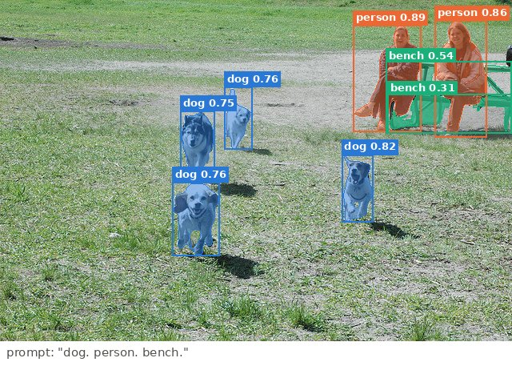

---
hide:
  - navigation
---

# VisionServe

**One small program that runs computer-vision models on your own machine and answers over HTTP.**

You send it a photo, and it sends back what is in the photo: boxes around objects, outlines of
objects, depth, faces, text, and more. It is free, open source (Apache-2.0), needs no account
and sends nothing anywhere. If you know [Ollama](https://ollama.com) for language models, this is
the same idea for images.

<figure markdown="span">
  { loading=lazy }
  <figcaption>Grounded-SAM: the words "dog. person. bench." in, boxes and outlines out<br/><code>grounded-sam</code> · prompt='dog. person. bench.' · 225 ms on gpu:0 · Photo: COCO val2017 #372819 (<a href="http://farm3.staticflickr.com/2046/2516944023_d00345997d_z.jpg">Flickr</a>, CC BY 2.0)</figcaption>
</figure>

## In one minute

```bash
visionserve pull rf-detr                    # download a model (once)
visionserve serve                           # start the server on http://127.0.0.1:11435
curl -F model=rf-detr -F image=@photo.jpg http://127.0.0.1:11435/api/predict
```

The answer is plain JSON. Every model uses the same answer format:

```json
{
  "task": "detection",
  "model": "rf-detr",
  "detections": [
    { "class": "cat", "conf": 0.94, "bbox": [210, 54, 288, 301] }
  ]
}
```

`bbox` is `[x, y, width, height]` in pixels **of the photo you sent**, no matter how the model
resized it internally.

## What it can do

| You want to… | Ask for | Kind of answer |
|---|---|---|
| Find common objects (people, cups, cars…) | `rf-detr` | boxes + class names |
| Find *anything you can name* ("red mug", "screwdriver") | `grounding-dino` | boxes for the words you typed |
| Cut out one object you point at | `mobile-sam`, `sam2`, `efficient-sam` | a pixel mask |
| Cut out everything you can name | `grounded-sam` | boxes + masks from a text prompt |
| Know how far away things are | `depth-anything-v2`, `midas` | a depth map |
| Find faces | `scrfd` | face boxes + landmarks |
| Read text | `paddle-ocr` | text boxes + the text |
| Say what the whole picture shows | `efficientnet-b0`, `mobilenet-v3` | top-5 labels |
| Compare images and words | `clip`, `siglip-*` | embedding vectors |
| Plan where a robot gripper can grasp | `grasp-rfdetr`, `grasp-gd` | grasp rectangles |

See the [model gallery](gallery.md) for real outputs on real photos.

## Why it is built this way

- **One Go binary, no Python at runtime.** It starts in milliseconds and runs on a laptop, a
  server or a small edge board (Jetson). Python is only used *offline*, to convert models.
- **All the math runs in [ONNX Runtime](https://onnxruntime.ai).** VisionServe never implements
  its own neural-network kernels; it prepares images, calls ONNX Runtime, and turns raw numbers
  into answers. On an NVIDIA GPU it uses CUDA by default and falls back to the CPU.
- **Permissive licences only.** Every model must declare its licence, and the model registry
  refuses anything that is not Apache-2.0, MIT or BSD — so the whole project stays usable in
  commercial and closed-source products. AGPL models (e.g. Ultralytics YOLO) are not allowed.
- **One answer format for every task**, so a client written once works with every model.

## Where to go next

<div class="grid cards" markdown>

- :material-rocket-launch: **[Getting started](getting-started.md)** — install, download a model,
  make your first request (curl, Python, Docker).
- :material-language-python: **[Clients](clients/index.md)** — the Python and JavaScript SDKs in
  detail: every `predict` option, what it changes, which models read it, with real outputs.
- :material-school: **[Concepts](concepts/index.md)** — what detection, segmentation, depth… mean,
  and how a photo becomes numbers a model can read.
- :material-cogs: **[How it works](architecture/index.md)** — the parts of the program and how one
  request flows through them, with links into the code.
- :material-language-go: **[Go for this project](go/index.md)** — a short Go tutorial that uses this
  repository's own code as the examples.
- :material-api: **[Reference](reference/api.md)** — HTTP API, configuration, manifest format.

</div>
